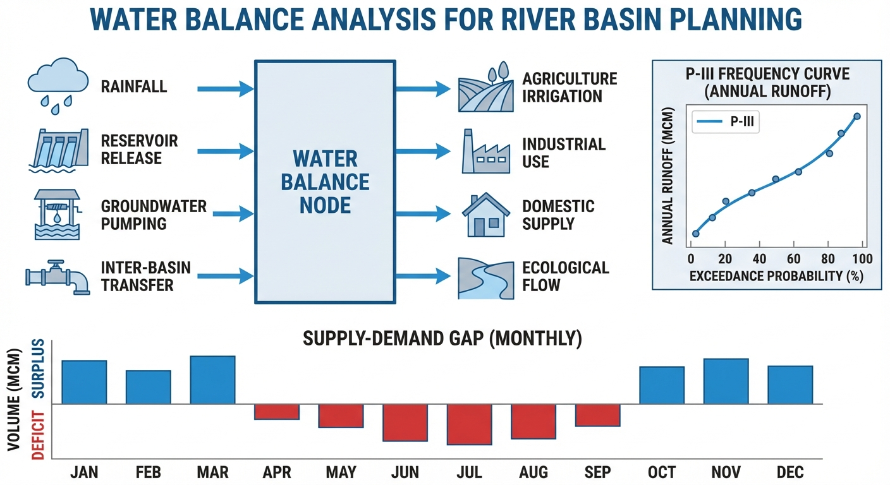

# 第 2 章 供需平衡分析

## 学习目标

- 掌握 P-III 型频率曲线的原理及矩法参数估计的完整推导过程
- 学会利用频率分析进行不同保证率下的设计来水量计算
- 理解定额法需水预测的系统框架与各部门预测模型
- 能够开展供需平衡分析并识别缺水风险
- 认识频率分析中的不确定性来源及其工程处理方法

## 2.1 从气候变化到供需平衡

第 1 章分析了全球变暖对流域径流的影响——在华北半湿润地区，RCP8.5 情景下径流可能衰减近 18%。这一结论的直接推论是：水资源规划不能依赖单一的历史均值，而必须引入概率统计工具，定量刻画来水的随机性，进而推算不同保证率下的可用水量。气温升高引起的 Clausius-Clapeyron 效应使大气持水能力增加约 7%/°C，导致降水极端化加剧、径流序列的非平稳特征日趋显著，传统"以均值定方案"的规划思路面临根本性挑战。

供需平衡分析是联系自然水文过程与社会经济系统的纽带。"供给侧"受气候和下垫面条件控制，具有显著的年际变异性——丰水年与枯水年的径流量可相差数倍；"需求侧"受人口增长、城镇化进程、产业升级和节水技术驱动，呈现复杂的时序演化特征。在特定设计保证率下评估供水能力、前瞻性预测用水需求，是制定区域水资源配置方案和论证重大工程规模的先决条件。

本章将从两个维度展开：首先利用 P-III 型频率分析确定不同保证率下的"供水底牌"；然后通过定额法构建需求预测模型，最终在供需平衡框架中识别系统的缺水风险和转折节点。

## 2.2 水文频率分析与 P-III 型分布

### 2.2.1 P-III 型分布的数学形式

水文频率分析是水资源规划的基石。年径流量作为连续型随机变量，其分布通常呈正偏态（右偏），中国水利行业普遍采用 P-III 型分布（皮尔逊 III 型分布）拟合年径流序列。P-III 分布的概率密度函数为：

$$
f(x) = \frac{\beta^\alpha}{\Gamma(\alpha)} (x - x_0)^{\alpha - 1} e^{-\beta(x - x_0)}, \quad x \geq x_0
$$

其中 $\Gamma(\alpha) = \int_0^\infty t^{\alpha-1} e^{-t} dt$ 为伽马函数。三个参数的物理意义：$\alpha$ 为形状参数，控制分布的偏斜程度；$\beta$ 为尺度参数，控制分布的展布范围；$x_0$ 为位置参数，表示随机变量的理论下限。

设计保证率 $P$ 的物理含义是"来水量不低于设计值的年份占总年数的比例"。$P = 75\%$ 为一般工业和城市供水的设计标准，$P = 90\%$ 用于重要城市或枯水期保障。

### 2.2.2 矩法参数估计的严格推导

矩法的核心思想是令理论分布的各阶矩等于样本统计量（均值 $\bar{Q}$、变差系数 $C_v$、偏态系数 $C_s$），由此反解分布参数。

设 $y = x - x_0$，则 $y$ 的定义域为 $[0, +\infty)$，服从参数为 $\alpha, \beta$ 的标准伽马分布。利用伽马函数的递推性质 $\Gamma(\alpha+1) = \alpha\Gamma(\alpha)$，逐步计算各阶矩。

**一阶原点矩**（期望）：根据期望定义进行广义积分，引入变量代换 $t = \beta y$：

$$
E(y) = \int_0^\infty y \frac{\beta^\alpha}{\Gamma(\alpha)} y^{\alpha-1} e^{-\beta y} dy = \frac{\beta^\alpha}{\Gamma(\alpha)} \cdot \frac{1}{\beta^{\alpha+1}} \int_0^\infty t^\alpha e^{-t} dt = \frac{\alpha\Gamma(\alpha)}{\beta\Gamma(\alpha)} = \frac{\alpha}{\beta}
$$

**二阶中心矩**（方差）：同样利用 $t = \beta y$ 代换，先求 $E(y^2) = \frac{\alpha(\alpha+1)}{\beta^2}$，再由 $D(y) = E(y^2) - [E(y)]^2$ 得

$$
D(y) = \frac{\alpha(\alpha+1)}{\beta^2} - \frac{\alpha^2}{\beta^2} = \frac{\alpha}{\beta^2}
$$

**三阶中心矩**：展开 $\mu_3 = E(y^3) - 3E(y^2)E(y) + 2[E(y)]^3$，其中 $E(y^3) = \frac{\alpha(\alpha+1)(\alpha+2)}{\beta^3}$。将前述结果代入并化简分子：

$$
\alpha(\alpha^2+3\alpha+2) - 3(\alpha^3+\alpha^2) + 2\alpha^3 = 2\alpha
$$

因此 $\mu_3(y) = \frac{2\alpha}{\beta^3}$。

**反解参数**：由于 $x = y + x_0$ 是线性平移，不改变方差和偏态。标准差 $\sigma = \sqrt{\alpha}/\beta$，偏态系数 $C_s = \mu_3/\sigma^3$：

$$
C_s = \frac{2\alpha/\beta^3}{(\sqrt{\alpha}/\beta)^3} = \frac{2\alpha}{\alpha\sqrt{\alpha}} = \frac{2}{\sqrt{\alpha}}
$$

反解得到三个参数的显式表达：

$$
\alpha = \frac{4}{C_s^2}, \quad \beta = \frac{\sqrt{\alpha}}{\sigma} = \frac{2}{\sigma C_s}, \quad x_0 = \bar{Q} - \frac{\alpha}{\beta} = \bar{Q} - \frac{2\sigma}{C_s}
$$

其中 $\sigma = \bar{Q} \cdot C_v$。这组公式在抽象的分布参数与直观的水文统计量之间建立了一一映射，是水文频率计算的理论基石。将 $\alpha, \beta, x_0$ 代入累积分布函数的反函数，即可计算任意保证率 $P$ 对应的设计来水量 $x_P$。

### 2.2.3 参数选择的物理依据

在实际操作中，实测序列长度有限（通常 30--60 年），三阶矩对极值高度敏感，直接计算的 $C_s$ 极不稳定。工程实践中通常设定 $C_s/C_v$ 的经验比值来间接确定 $C_s$。

**$C_v$ 的区域规律**：南方湿润区 $C_v$ 通常为 0.2--0.4，华北半干旱区则升至 0.5--0.8，反映了降水集中度和流域调蓄能力的差异。

**$C_s/C_v$ 的物理约束**：由位置参数公式 $x_0 = \bar{Q}(1 - 2C_v/C_s)$ 可知，为满足径流非负（$x_0 \geq 0$），必须有 $C_s \geq 2C_v$。华北地区通常取 $C_s/C_v = 2.0$，地形陡峭的小流域可取 2.5--3.0。

### 2.2.4 频率分析的不确定性

水文频率计算给出的设计值并非自然界的绝对真理，而是基于有限信息的统计推断。不确定性主要来自三个层面：

**(1) 有限样本的抽样误差**。统计理论表明，样本均值的标准误为 $\sigma_{\bar{Q}} = \sigma/\sqrt{n}$，变差系数的近似标准误为 $\sigma_{C_v} \approx C_v \sqrt{(1+C_v^2)/(2n)}$。对于 $n=50$、$C_v=0.35$ 的序列，$\sigma_{C_v}/C_v \approx 10\%$，这意味着 P=90% 设计值的估计误差可能达到 15%--20%。短序列（如仅 20 年资料）若恰好全部落在丰水或枯水周期内，标定的频率曲线将大幅偏离真实分布。

**(2) 分布模型的结构误差**。虽然 P-III 分布是行业标准，但某些位于气候过渡带的流域，受台风与内陆对流双重影响，降水和径流可能呈双峰分布，单峰的 P-III 曲线无法准确拟合。

**(3) 时变非平稳性**。经典频率分析建立在序列独立同分布（IID）假设上。然而气候变化引发的降水分布漂移，以及水库建设、土地利用变化等人类活动，直接破坏了径流的平稳性。对非平稳序列，需先进行"天然化还原"（扣除人类活动影响），或采用时变参数的广义极值（GEV）模型进行动态修正。

在重大工程论证中，通常借助非参数 Bootstrap 重抽样法，在 90% 或 95% 置信水平下反求设计来水量的置信区间，为工程规模预留安全冗余。

## 2.3 需水预测：定额法

### 2.3.1 定额法的基本框架

定额法将区域总需水量分解为四大部门的加和：

$$
W_{\text{total}} = W_{\text{dom}} + W_{\text{ind}} + W_{\text{agr}} + W_{\text{eco}}
$$

每个部门的需水量均可表示为"活动规模 $\times$ 用水定额"的乘积形式：

$$
W_i = \sum_{j=1}^{M_i} N_{ij} \times q_{ij} \times T_{ij}
$$

其中 $N_{ij}$ 为活动规模（人口、产值、灌溉面积等），$q_{ij}$ 为用水定额，$T_{ij}$ 为时间转换系数。

### 2.3.2 各部门预测模型

**生活需水**：区分城镇与农村两个子系统，其数学模型为：

$$
W_{\text{dom}} = P_{\text{total}} \cdot [U \cdot q_{\text{urban}} + (1-U) \cdot q_{\text{rural}}] \times \frac{365}{10^8} \times (1 + \lambda_{\text{loss}})
$$

其中 $P_{\text{total}}$ 为区域总人口，$U$ 为城镇化率，$q_{\text{urban}}$ 和 $q_{\text{rural}}$ 分别为城镇和农村人均日用水定额（L/cap·d），$\lambda_{\text{loss}}$ 为管网漏损率。随着经济发展和节水器具普及，人均定额呈 S 型曲线先升后稳。

**工业需水**：以工业增加值为驱动因子，区分高耗水行业（钢铁、化工）和低耗水行业（电子信息）：

$$
W_{\text{ind}} = \sum_{k=1}^{K} GDP_{k} \times q_{k} \times (1 - R_{\text{recycle},k})
$$

其中 $q_k$ 为第 $k$ 行业万元增加值用水量，$R_{\text{recycle},k}$ 为工业水重复利用率。产业结构升级使高耗水行业占比下降，加上循环用水技术的推广，可使工业取水量在产值增长的同时实现"用水脱钩"。

**农业需水**：本质上是农田水量平衡方程的应用：

$$
W_{\text{agr}} = \sum_{c=1}^{C} \frac{A_c \cdot (ET_c - P_{\text{eff},c})}{eta} \times 10
$$

其中 $A_c$ 为第 $c$ 种作物灌溉面积，$ET_c$ 为作物蒸腾蒸发量（可用 FAO Penman-Monteith 公式计算参考蒸散量 $ET_0$ 再乘以作物系数 $K_c$ 得到），$P_{\text{eff}}$ 为有效降水，$\eta$ 为灌溉水利用系数（涵盖渠系输水和田间灌水效率）。在多数华北流域，农业占总需水的 50%--65%，灌溉定额的下降是降低区域总需水的最有力杠杆。

**生态需水**：通常采用 Tennant 法取年均径流的 10%--30% 作为河道生态基流（详见第 5 章），加上湖泊蒸发补水和城市绿化用水：$W_{\text{eco}} = Q_{\text{mean}} \times R_{\text{eco}} \times \Delta t + W_{\text{lake}} + W_{\text{green}}$。

### 2.3.3 定额的动态演进

各项用水定额并非静态常数，而是随技术进步和政策引导呈指数衰减：

$$
q(t) = (q_0 - q_{\min}) e^{-k(t-t_0)} + q_{\min}
$$

其中 $q_0$ 为基准年定额，$q_{\min}$ 为理论极限值（受工艺和生理需求约束），$k$ 为反映技术渗透速率的衰减系数。科学设定定额的衰减曲线，需要综合研判产业政策、水价改革和节水技术推广等因素。

## 2.4 供需平衡的数学框架

供需平衡分析的数学基础是物质守恒。区域年度水量平衡控制方程为：

$$
W_{\text{surface}} + W_{\text{ground}} + W_{\text{transfer}} + W_{\text{reclaimed}} \geq W_{\text{total}} + L_{\text{sys}}
$$

左侧为有效可供水能力：$W_{\text{surface}}$ 为受设计保证率（如 P=75%）控制的地表水可供量，$W_{\text{ground}}$ 为受水文地质安全红线约束的地下水允许开采量（必须避免超采导致的地面沉降），$W_{\text{transfer}}$ 为跨流域调水补给量，$W_{\text{reclaimed}}$ 为污水再生回用量。右侧为需水总量加输配水系统损失 $L_{\text{sys}}$（包括渠系蒸发渗漏和管网漏损）。缺水率定义为：

$$
\text{缺水率} = \frac{\max(0, W_{\text{total}} - \sum W_{\text{supply}})}{W_{\text{total}}} \times 100\%
$$

当缺水率低于 5% 时，系统处于安全状态；超过 10% 则需启动应急节水或开源措施；接近 20% 时，系统面临严重的结构性缺水风险。这一缺水率阈值体系源自中国《全国水资源综合规划技术细则》的推荐标准，为各级水行政主管部门提供了统一的判别依据。

## 2.5 模拟案例：华北流域供需平衡分析

### 案例背景

基于 50 年实测径流资料进行频率分析，采用矩法估计 P-III 分布参数；同时利用定额法预测 2025--2040 年四大部门（生活、工业、农业、生态）的需水量，结合再生水利用和跨流域调水工程评估供需平衡状况。

**仿真脚本**：`assets/ch02/ch02_water_balance.py`

### 模拟结果

| 指标 | 数值 |
|------|------|
| 径流均值 | 8.45 亿m3 |
| 变差系数 Cv | 0.271 |
| P=75% 设计来水 | 6.82 亿m3 |
| P=90% 设计来水 | 5.68 亿m3 |
| 2025 年总需水 | 11.18 亿m3 |
| 2040 年总需水 | 9.61 亿m3 |
| 2025 年缺水率 | 22.9% |
| 2040 年缺水率 | 0.0% |

### 结果分析

频率分析结果表明，该流域年径流的 P=75% 设计来水量为 6.82 亿 m3，仅为多年均值的 80.7%。P=90% 设计来水量进一步降至 5.68 亿 m3，仅为均值的 67.2%。这一巨大差距反映了径流年际变异性对供水保障的深刻影响：变差系数 $C_v = 0.271$ 意味着丰水年径流可达均值的 1.5 倍，而枯水年可能不足均值的 60%。这一特征决定了水资源规划绝不能以"多年均值"为基准进行配置，否则将在频繁出现的枯水年遭遇严重的供水不足。

需水预测显示，2025 年总需水量为 11.18 亿 m3，其中农业灌溉占 61.2%，是第一大用水户。工业和生活用水分别占约 26% 和 15%。这一需水结构表明，该区域仍处于以农业为主的传统用水格局中。随着灌溉定额从 380 m3/亩降至 300 m3/亩、万元工业增加值用水量从 35 m3 降至 19 m3，到 2040 年总需水量降至 9.61 亿 m3，降幅达 14.0%。这种"经济增长与用水脱钩"的现象表明节水技术的推广对缓解水资源压力具有决定性作用。

供需平衡分析显示，2025 年在 P=75% 保证率下（加上再生水 0.3 亿 m3 和调水 1.5 亿 m3），供水能力为 8.62 亿 m3，缺水 2.56 亿 m3，缺水率达 22.9%。这一缺口若不通过外部补充，只能依靠超采地下水来填补，长期将引发地面沉降和含水层衰竭等不可逆后果。

随着再生水利用和调水规模的逐步扩大，加上需水总量的稳步下降，到 2035 年供需基本平衡，2040 年出现盈余。这一转折点的实现依赖于三个条件同时满足：节水定额持续下降、再生水利用达到 1.0 亿 m3、调水工程达到 3.0 亿 m3。从经济成本角度分析，挖掘本地节水潜力的边际成本（约 2--5 元/m3）远低于远距离调水（约 8--15 元/m3），因此节水应当优先于调水。但当本地节水潜力逼近物理极限时，调水就成为突破资源瓶颈的必然选择。

### 工程启示

- P-III 型频率分析是确定设计来水量的标准方法，设计保证率的选取直接影响工程规模和投资
- 华北地区当前的缺水率超过 20%，短期内必须依赖非常规水源和调水工程补充
- 农业节水是降低区域总需水的关键杠杆，灌溉定额每降低 10%，总需水可减少约 6%
- 供需平衡的动态评估应至少每 5 年更新一次，以反映经济结构和技术条件的变化

## 附录：仿真脚本解读

**脚本路径**：`assets/ch02/ch02_water_balance.py`

该脚本分为四个核心模块。第一模块利用 SciPy 的 `stats.gamma` 生成服从 P-III 分布的 50 年径流序列，参数由均值 $\bar{Q}=8.5$ 亿 m3、$C_v=0.35$、$C_s/C_v=2.0$ 经矩法公式转换得到。第二模块执行频率分析：将径流降序排列后计算经验频率 $P_m = m/(n+1)$，同时用矩法重新拟合理论 P-III 曲线，并通过 `stats.gamma.ppf(1-P)` 反算各保证率下的设计来水量。第三模块实现定额法需水预测：对 2025--2040 年的人口、产值、灌溉面积等活动规模进行线性插值，乘以各部门的衰减定额得到分年需水量。第四模块进行供需平衡计算：将 P=75% 设计来水量加上逐年递增的再生水和调水量，与需水量对比，输出缺水量和缺水率。

绘图采用 $2 \times 2$ 布局：(a) 径流时间序列柱状图标注均值线；(b) P-III 理论频率曲线与经验频率点的拟合对比，标注各设计保证率；(c) 四部门需水堆叠柱状图叠加供水能力折线；(d) 供需差的正负柱状图，红色标注缺水率。

---

## 本章小结

本章从水文频率分析和需水预测两个维度构建了供需平衡分析的完整理论框架。通过严格推导 P-III 型分布的矩法参数估计公式，阐明了如何从有限的实测序列提取设计来水量；通过定额法的系统化分解，展示了各部门需水量的预测逻辑与定额衰减机制。华北流域的仿真案例表明，当前缺水率超过 20%，但通过"节流+开源"双向施策，2035 年前后可实现供需平衡。然而，年度尺度的宏观平衡并不能消除年内丰枯分配不均带来的供水缺口——如何利用水库调蓄在时间维度上重新分配径流，正是下一章将探讨的核心问题。

---

## 思考与练习

1. 某流域实测 50 年年径流均值 $\bar{Q} = 15.0$ 亿 m3，$C_v = 0.35$，$C_s = 0.85$。请利用矩法公式计算 P-III 分布参数 $\alpha$、$\beta$、$x_0$。
2. 为何工程实践中不直接使用样本计算的偏态系数 $C_s$，而要设定 $C_s/C_v$ 的经验比值？请从数学和物理两个角度阐述原因。
3. 假设某区域工业增加值用水定额服从 $q(t) = (35 - 12)e^{-0.08t} + 12$（m3/万元），请问 10 年后和 20 年后的定额分别是多少？$q_{\min} = 12$ m3/万元的物理含义是什么？
4. 如果第 1 章的 RCP8.5 情景使径流减少 18%，请重新计算本案例中 P=75% 的设计来水量（在 $C_v$ 和 $C_s/C_v$ 不变的假设下），并评估 2040 年的供需平衡是否仍能实现。

---

**拓展视野**：供需平衡分析是水资源规划的传统核心方法，其本质是在"给定水源—确定需求"框架下求解静态分配问题。然而，随着气候变化加剧和极端事件频发，供水系统需要从静态"平衡"走向动态"控制"——不仅要回答"够不够"的规划问题，还要回答"怎么调"的运行问题。这正是水系统控制论所关注的核心议题：将供需平衡从规划层的年尺度分析，延伸到运行层的实时动态调控。

## 参考文献

[1] 中华人民共和国水利部. 水利水电工程水文计算规范 (SL 278-2002). 中国水利水电出版社, 2002.

[2] Chow V T, Maidment D R, Mays L W. Applied Hydrology. McGraw-Hill, 1988.

[3] Loucks D P, van Beek E. Water Resource Systems Planning and Management: An Introduction to Methods, Models, and Applications. Springer, 2017.
