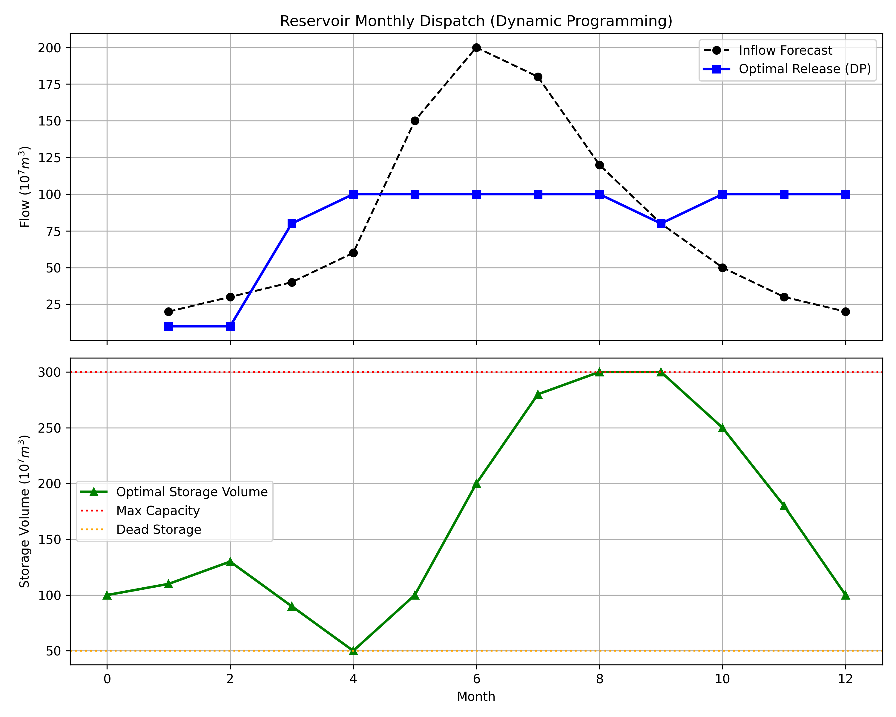

# 第 3 章 梯级水库群的中长期优化调度

## 学习目标

- 理解水库调度的基本目标与约束条件，掌握水库水量平衡方程
- 掌握动态规划（DP）在水库优化调度中的应用原理，能够推导 Bellman 递推方程
- 了解状态空间离散化策略及其对求解精度的影响
- 分析发电效益函数的非线性特征及其对最优调度策略的塑造作用
- 认识从确定性 DP 到随机 DP 的扩展，以及 NSGA-II 多目标优化的基本思路

## 3.1 从供需平衡到水库调度

第 2 章的供需平衡分析在年度尺度上揭示了区域水资源的总量缺口与盈余趋势。然而，年度尺度的宏观平衡掩盖了一个更为棘手的问题：年内丰枯分配不均。华北地区 70%--80% 的降水集中在 6--9 月的汛期，而农业灌溉需水高峰往往出现在春季和初夏。这种时序错位使得即使年度总量充足，仍可能在枯水季节出现严重的供水缺口。

水库是解决这一矛盾的核心工程手段。通过在丰水期蓄水、枯水期放水，水库将天然径流的时间分配重新塑造为与需求过程更为匹配的供水序列。然而，"什么时候蓄、什么时候放、蓄放多少"并非简单的直觉判断，而是一个具有时间耦合性的多阶段决策优化问题。Bellman 动态规划为这类问题提供了保证全局最优的严格数学求解框架。

## 3.2 水库调度的基本概念

水库调度是水资源管理的核心技术环节。一座水库通常同时承担防洪、供水、发电、灌溉和生态保障等多项任务，这些目标之间往往存在内在冲突。例如，防洪要求汛前尽量放空库容以迎接洪水，而发电要求保持高水位以获取大水头；供水要求枯水期有充足蓄水，而生态保障要求全年维持不低于基流的下泄量。

从决策结构上看，水库调度是一个典型的多阶段序贯决策问题：每个月（或每旬、每日）的蓄泄决策不仅影响当期的效益，还通过改变蓄水量（即系统状态）影响所有后续时段的可行决策空间和潜在效益。这种时间耦合性使得"局部最优"往往偏离"全局最优"——单独优化某一个月的效益可能导致后续月份陷入被动。动态规划的核心价值正在于通过全局搜索打破这种时间耦合，保证找到真正的全局最优解。

## 3.3 水库调度的数学建模

### 3.3.1 水量平衡方程

水库的基本水量平衡方程为：

$$
V_{t+1} = V_t + I_t - R_t - L_t
$$

其中 $V_t$ 为时段初蓄水量，$I_t$ 为入库流量，$R_t$ 为下泄流量（决策变量），$L_t$ 为蒸发渗漏损失。该方程是质量守恒定律在水库系统中的直接表达，构成了所有调度模型的基础约束。

### 3.3.2 约束条件

调度决策必须满足以下硬约束：

- **库容约束**：$V_{\min} \leq V_t \leq V_{\max}$，其中 $V_{\min}$ 为死库容（保障取水口淹没和泥沙淤积空间），$V_{\max}$ 为总库容
- **汛限水位约束**：汛期 $V_t \leq V_{\text{flood}}$，预留防洪库容
- **最小下泄约束**：$R_t \geq R_{\min}$，保障下游生态基流和用水需求
- **最大过流约束**：$R_t \leq R_{\max}$，受泄洪设施和下游安全河道流量限制

### 3.3.3 目标函数与非线性特征

对于发电水库，时段经济效益与水头和下泄流量的乘积成正比：

$$
B_t = \eta \cdot H_t \cdot R_t
$$

其中 $\eta$ 为效率系数（综合了发电机组效率和单位换算），$H_t$ 为平均发电水头。水头取决于蓄水量：$H_t \approx (V_t + V_{t+1})/2$（线性化近似），因此效益函数实质上是关于蓄水量和下泄量的双线性（bilinear）函数。这种非线性耦合使得调度问题无法用线性规划直接求解，必须采用能处理非线性目标的优化方法。

从物理角度分析，该目标函数意味着：同样 1 m3 的水，在水库蓄满时（高水头）下泄的发电效益远高于在低水位时下泄。这一特征直接决定了最优策略的核心逻辑——在来水充沛期先蓄水提高水头，再在高水头下持续发电。

## 3.4 动态规划的严格推导

### 3.4.1 Bellman 最优性原理

Bellman（1957）提出的最优性原理指出：一个多阶段决策过程的最优策略具有如下性质——无论初始状态和初始决策如何，此后的决策对于前一决策所导致的状态而言，必须构成最优策略。

将这一原理应用于水库调度问题。定义状态为水库蓄水量 $V_t$，决策为下泄量 $R_t$（等价于确定 $V_{t+1}$），阶段为月份 $t = 1, 2, \ldots, T$。设 $f_t^*(V_t)$ 为从第 $t$ 时段到规划期末的最优累积效益，则 Bellman 递推方程为：

$$
f_t^*(V_t) = \max_{V_{t+1}} \left[ B_t(V_t, V_{t+1}) + f_{t+1}^*(V_{t+1}) \right]
$$

其中 $V_{t+1}$ 必须满足约束条件，$B_t(V_t, V_{t+1})$ 是由水量平衡方程确定的时段效益。边界条件 $f_{T+1}^*(V_{T+1}) = 0$（或设定年末回到目标蓄水量 $V_{\text{target}}$）。

### 3.4.2 状态空间离散化

由于连续状态空间上的递推无法精确实现，需要将蓄水量离散化为有限个网格节点 $V^{(1)}, V^{(2)}, \ldots, V^{(N_s)}$。离散步长 $\Delta V = (V_{\max} - V_{\min})/(N_s - 1)$ 直接影响求解精度和计算量：

- 步长过大（$N_s$ 小），最优路径被迫在粗网格上跳转，可能错过真正的最优解
- 步长过小（$N_s$ 大），计算量为 $O(T \cdot N_s^2)$，单水库尚可承受，但多水库系统面临指数级增长的"维数灾难"

对于单水库问题，$N_s = 20$--50 通常能在精度和效率之间取得良好平衡。当扩展至 $n$ 座水库的联合调度时，状态空间维度变为 $N_s^n$，这正是 DP 方法在大规模水库群中受限的根本原因。

### 3.4.3 前推法求解流程

算法按时间顺序前推：

1. **初始化**：设定初始状态 $V_0 = V_{\text{init}}$，仅该节点的值函数为 0，其余为 $-\infty$
2. **前推递推**：对每个时段 $t = 1, \ldots, T$，遍历所有可行的状态转移 $(V^{(i)}, V^{(j)})$，计算效益并更新值函数
3. **回溯**：从年末目标状态 $V_T = V_{\text{target}}$ 出发，沿指针数组回溯得到最优蓄泄序列

该算法的计算复杂度为 $O(T \cdot N_s^2)$，对单水库问题可在毫秒级完成。以本章案例为例，$T = 12$、$N_s = 26$，总计算次数约为 $12 \times 26^2 = 8112$ 次状态转移评估，在现代计算机上耗时可忽略不计。即使将离散步长细化到 1 个单位（$N_s = 251$），总计算量也仅为 $12 \times 251^2 \approx 76$ 万次，仍可在秒级完成。

### 3.4.4 DP 的优势与局限

动态规划相比其他优化方法的核心优势在于：(1) 能保证找到全局最优解，不受初始值选择影响；(2) 对目标函数的形式没有限制（不要求凸性或可微性）；(3) 求解过程自然生成整张状态空间的最优值函数表，可用于构建"调度图"指导实际运行。

然而，DP 的根本局限是"维数灾难"。当系统包含 $n$ 座水库时，状态空间变为 $n$ 维，网格点数从 $N_s$ 变为 $N_s^n$。以 $N_s = 26$、$n = 3$ 为例，每个时段需要遍历 $26^3 \approx 17,576$ 个状态点的所有可行转移，计算量增长三个数量级。对于黄河干流 7 座大型梯级水库或长江三峡-葛洲坝联合调度等实际问题，精确 DP 在计算上已完全不可行。

应对维数灾难的策略包括：(1) 增量动态规划（IDP）——每次仅优化一座水库的调度策略、固定其他水库，循环迭代至收敛；(2) 随机动态规划近似（SDDP）——利用分段线性函数逼近值函数；(3) 强化学习——用神经网络拟合策略函数，在与环境的交互中自适应学习最优调度规则。

## 3.5 模拟案例：单水库年度优化调度

### 案例背景

某水库总库容 300（$\times 10^7$ m3），死库容 50，初始蓄水 100。全年 12 个月的入库流量预测已知（枯水期 20--40，汛期 150--200），需在满足最小下泄（10）和最大过流（100）约束下，通过动态规划求解最大化全年发电效益的蓄泄方案。状态空间离散为 26 个节点（步长 10）。

**仿真脚本**：`assets/ch03/ch03_dp_reservoir.py`

### 模拟结果

| 指标 | 数值 |
|------|------|
| 算法 | 动态规划 (Bellman 方程) |
| 全年总经济效益 | 1805.50 |
| 状态离散数 | 26 |
| 入库总量 | 980（$\times 10^7$ m3） |
| 最大蓄水量 | 300（达到满库） |
| 年末蓄水量 | 100（回到初始状态） |

### 结果分析

动态规划求解的最优调度策略展现出明显的"蓄丰补枯"特征。在 1--3 月枯水期，水库维持最低下泄量（10），将有限来水尽量蓄存以提高水头。在 4--6 月来水增加阶段，水库逐步加大下泄至最大过流（100），同时蓄水量从 90 升至 200。在 7--8 月汛期高峰，入库流量达到 180--200，水库蓄满至 300 后持续以最大能力下泄。9--12 月退水期，水库在高水头下持续大流量下泄，将蓄水量从 300 消落至年末目标 100。

这一策略的核心逻辑可以从目标函数的非线性特征得到解释：发电效益 $B = \eta \cdot H \cdot R$ 与水头和流量的乘积成正比。在枯水期低水头下泄，单位水量的发电效益低；而在蓄满后高水头下泄，相同水量的效益可提高 2--3 倍。因此，最优策略本质上是一种"时间套利"——将低边际效益时段的水量延迟到高边际效益时段释放。

从约束满足角度看，枯水期的最低下泄约束（10 单位，代表生态基流需求）是硬约束，在任何优化方案中不可突破。这保证了下游河道在最枯条件下仍有基本的水流维持生态功能。汛期的最大过流约束（100 单位）则反映了发电机组的额定容量限制——即使来水极为丰沛，超出机组处理能力的水量只能通过溢洪道无效弃放。

### 从确定性到随机 DP 的扩展

本案例采用确定性 DP，假设来水完全已知。实际运行中来水存在不确定性，需要扩展为随机动态规划（SDP）。SDP 将入流 $I_t$ 视为随机变量，值函数变为期望意义下的最优：

$$
f_t^*(V_t) = \max_{V_{t+1}} E_{I_t} \left[ B_t(V_t, V_{t+1}, I_t) + f_{t+1}^*(V_{t+1}) \right]
$$

期望运算通过对来水概率分布进行离散化积分来实现。设来水 $I_t$ 服从概率分布 $p(I_t | \mathbf{z}_t)$（其中 $\mathbf{z}_t$ 为水文预报信息），将其离散为 $M$ 个代表值 $\{I_t^{(1)}, \ldots, I_t^{(M)}\}$，对应概率 $\{p_1, \ldots, p_M\}$，则期望值函数的递推变为：

$$
f_t^*(V_t) = \max_{V_{t+1}} \sum_{k=1}^{M} p_k \left[ B_t(V_t, V_{t+1}, I_t^{(k)}) + f_{t+1}^*(V_{t+1}^{(k)}) \right]
$$

SDP 的计算量比确定性 DP 增大约 $M$ 倍（$M$ 通常取 5--10），但能给出风险意义下更为鲁棒的调度规则。SDP 得到的最优策略不再是确定的蓄泄序列，而是一张"调度图"——给定当前蓄水量和来水等级，即可查表得到最优下泄决策。这种策略形式天然适合实际运行中的在线决策。

当从单水库扩展到梯级水库群时，NSGA-II 等多目标进化算法可用于求解发电效益与供水保障之间的帕累托前沿，为决策者提供效益-安全的权衡选择空间。帕累托前沿上的每个点代表一种不可改进的折中方案——在不降低一个目标的前提下无法提高另一个目标。决策者可根据当前的政策优先级在前沿上选择合适的运行方案。

### 工程启示

- 动态规划能够保证全局最优，适用于中长期调度规划，但状态离散精度直接影响解的质量
- 最优调度的"蓄丰补枯"策略体现了水头效益与时间耦合的非线性特征
- 枯水期的最低下泄约束（生态基流）是硬约束，在任何优化方案中不可突破
- 从确定性 DP 到随机 DP 的扩展是实际应用中必须考虑的，来水预报误差会显著影响调度效益
- 调度图是 DP 解的工程转化形式，将最优值函数映射为"蓄水量-来水等级-下泄量"的查表规则，便于水库运行人员在实际调度中执行

## 附录：仿真脚本解读

**脚本路径**：`assets/ch03/ch03_dp_reservoir.py`

该脚本实现了经典的前推动态规划算法。首先定义 12 个月的入库流量预测序列和水库物理参数（总库容 300、死库容 50、初始蓄水 100）。状态空间被等距离散为 26 个节点（步长 10），构建 $(T+1) \times N_s$ 的值函数矩阵 `dp_val` 和指针矩阵 `dp_ptr`。

核心计算函数 `calc_reward(v_curr, v_next, in_flow)` 先由水量平衡方程反算下泄量 $R = V_t + I_t - V_{t+1}$，然后检验约束（$R \geq 10$ 且 $R \leq 100$），不满足约束返回负无穷。满足约束时，按 $B = 0.01 \times (V_t + V_{t+1})/2 \times R$ 计算效益。前推过程对所有时段依次遍历每对可行的状态转移，更新值函数取最大值并记录前驱指针。回溯阶段从年末目标状态出发，沿指针逆推得到最优蓄水路径和下泄序列。

绘图分上下两个子图：上图叠加入流预测曲线和最优下泄曲线，下图展示最优蓄水量轨迹，并用水平虚线标注总库容和死库容。

---

## 本章小结

本章围绕水库调度这一核心水资源管理问题，从水量平衡方程出发，建立了发电效益最大化的优化模型，并系统推导了 Bellman 动态规划的递推方程。仿真案例表明，DP 求解的最优策略呈现"枯水期惜水蓄水、丰水期高水头大流量发电"的特征，其本质是利用目标函数的非线性在时间维度上进行"效益套利"。从单水库的确定性 DP 可以扩展到随机 DP（处理来水不确定性）和多目标优化（处理发电-供水-生态的多元冲突）。然而，水库调度只是在时间维度上重新分配水量，并不增加水资源总量。当多个竞争性用水户共享有限水资源时，如何通过市场机制实现高效配置？这正是下一章将探讨的水权交易与博弈分配问题。

---

## 思考与练习

1. 写出 Bellman 递推方程的后推形式（从末时段向前递推），并说明前推法和后推法在工程应用中的优劣。
2. 如果将状态离散步长从 10 减小到 5（$N_s$ 从 26 增至 51），计算量增加多少倍？精度提高是否与计算量成正比？
3. 某水库同时承担发电和供水两项任务，如何修改目标函数使其成为多目标优化问题？写出数学表达式。
4. 如果来水预报存在 $\pm 20\%$ 的误差范围，请定性分析确定性 DP 方案在实际运行中可能面临的风险。
5. 讨论为什么动态规划在梯级水库群调度中面临"维数灾难"，并列举至少两种应对策略。

---

**拓展视野**：本章的动态规划方法解决了"给定来水序列，如何安排水库蓄放"的离线优化问题。然而在实际运行中，来水预报存在不确定性，最优方案需要随新信息不断修正。模型预测控制（MPC）正是解决这一问题的现代方法——在每个决策时刻，基于最新预报求解有限时域优化，仅执行第一步决策，然后在下一时刻用更新的预报重新规划。这种"滚动优化+反馈纠偏"的框架天然具备对预测误差的鲁棒性，已成为梯级水库群实时调度的工业标准。MPC 在水库调度中的系统应用详见 Lei (2025a) 的相关论述。

## 参考文献

[1] Bellman R. Dynamic Programming. Princeton University Press, 1957.

[2] Labadie J W. Optimal operation of multireservoir systems: State-of-the-art review. Journal of Water Resources Planning and Management, 2004, 130(2): 93-111.

[3] Deb K, Pratap A, Agarwal S, et al. A fast and elitist multiobjective genetic algorithm: NSGA-II. IEEE Transactions on Evolutionary Computation, 2002, 6(2): 182-197.
