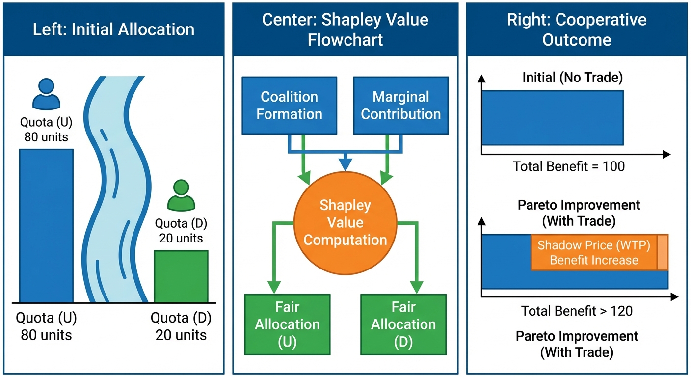
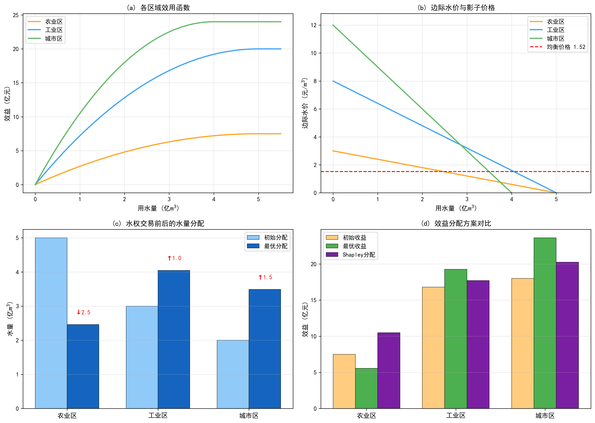

# 第 4 章 水权交易与博弈分配

## 学习目标

- 理解初始水权分配的基本原则与方法
- 掌握拉格朗日乘子法求解最优水量分配的数学原理，推导 KKT 条件
- 学会利用 Shapley 值进行公平的合作博弈分配，理解其组合数学含义
- 分析水权交易对社会总福利的提升效果及其福利经济学基础

## 4.1 从水库调度到水权分配

第 3 章讨论了如何在时间维度上优化水量分配——通过水库调蓄将丰水期的"富余"转移到枯水期。然而，即使时间分配实现最优，另一个更深层的问题仍然存在：空间维度上的多用户竞争。当农业区、工业区和城市区共享同一水源时，谁该多用、谁该少用？是按"先到先得"的历史惯例，还是按经济效率最大化的原则重新分配？

水权分配是水资源管理中最具争议性但也最具效率提升空间的领域。福利经济学第一定理表明，在完全竞争市场中，竞争均衡是帕累托最优的。将这一理论应用于水资源领域，意味着通过建立水权交易市场，在不增加水资源总量的前提下，仅靠"重新分配"就能显著提升社会总效益。

## 4.2 初始水权分配的原则与问题

### 4.2.1 两种基本原则

初始水权分配通常遵循两种原则。"现状优先"原则尊重历史用水格局，将各用户的实际取水量确认为初始水权，这种方式政治阻力最小但经济效率最低——因为历史形成的用水格局往往是计划经济时代的产物，与当前的经济结构严重脱节。"效率优先"原则按边际效用均等化的经济学准则重新分配，可以实现社会总效益最大化，但可能引发巨大的利益再分配冲突。

### 4.2.2 科斯定理与水权市场

实际操作中，大多数国家和地区采用折衷方案：以"现状优先"确定初始水权，然后通过水权交易市场允许用户之间自愿交换，逐步向效率最优的配置收敛。这正是科斯定理（Coase Theorem）在水资源领域的应用——只要交易成本足够低，初始产权的分配方式不影响最终的资源配置效率。

科斯定理成立的前提条件包括：产权界定清晰、交易成本足够低、信息充分对称。在水资源领域，这三个条件的满足程度决定了水权市场的运行效率。产权界定方面，中国自 2014 年起在宁夏、甘肃等 7 省开展水权试点，逐步建立了取水权确权登记制度。交易成本方面，中国水权交易所于 2016 年在北京成立，为水权交易提供了规范化的平台。信息对称方面，水量监测系统的覆盖率直接影响交易双方对水权价值的判断——监测盲区越多，信息不对称越严重，市场效率越低。

### 4.2.3 水权的时空属性

水权不同于一般商品的产权，具有显著的时空属性。时间维度上，枯水期的单位水权价值远高于丰水期，因为水资源的稀缺程度随季节变化。空间维度上，上游用户的取水行为直接影响下游可用水量，形成外部性效应。这些特殊属性使得水权交易市场的设计比一般商品市场更为复杂，需要结合水文监测和水量调度的技术支撑。

## 4.3 最优分配的数学原理

### 4.3.1 优化模型的建立

设区域内有 $n$ 个用水户，第 $i$ 个用水户的效用函数为 $V_i(w_i)$（假设为严格凹函数，反映边际效用递减规律），可分配总水量为 $W$，则社会总效益最大化问题为：

$$
\max \sum_{i=1}^{n} V_i(w_i) \quad \text{s.t.} \quad \sum_{i=1}^{n} w_i = W, \quad w_i \geq 0
$$

### 4.3.2 KKT 条件的推导

构造拉格朗日函数：

$$
\mathcal{L}(w_1, \ldots, w_n, \lambda) = \sum_{i=1}^{n} V_i(w_i) - \lambda \left(\sum_{i=1}^{n} w_i - W\right)
$$

对各 $w_i$ 求偏导并令其为零：

$$
\frac{\partial \mathcal{L}}{\partial w_i} = \frac{dV_i}{dw_i} - \lambda = 0 \implies \frac{dV_i}{dw_i} = \lambda, \quad \forall i
$$

这一条件具有深刻的经济学含义：最优分配要求所有用水户的**边际效用相等**，且等于拉格朗日乘子 $\lambda$。乘子 $\lambda$ 正是水资源的**影子价格**（shadow price），即水资源约束每放松一单位（总量增加 1 m3）时社会总效益的边际增量。

当效用函数取二次凹函数 $V_i(w) = a_i w - b_i w^2$ 时，边际效用为 $V_i'(w) = a_i - 2b_i w$，由 KKT 条件：

$$
a_i - 2b_i w_i^* = \lambda \implies w_i^* = \frac{a_i - \lambda}{2b_i}
$$

代入总量约束 $\sum w_i^* = W$，可解出均衡影子价格 $\lambda$：

$$
\lambda = \frac{\sum_i a_i/(2b_i) - W}{\sum_i 1/(2b_i)}
$$

影子价格的数值反映了水资源的稀缺程度：水量越少、$\lambda$ 越高，意味着每一单位水的"机会成本"越大。从数学上看，$\lambda$ 对 $W$ 的偏导数为：

$$
\frac{\partial \lambda}{\partial W} = -\frac{1}{\sum_i 1/(2b_i)} < 0
$$

这说明 $\lambda$ 是 $W$ 的严格递减函数——总水量越少，影子价格越高，这与经济学中"稀缺资源价格更高"的基本原理完全一致。

在华北缺水地区，影子价格可达 1--3 元/m3，远高于现行农业水价（0.1--0.3 元/m3），这一差距正是水权交易具有巨大效率改善空间的根本原因。从政策角度看，现行水价低于影子价格意味着水资源被系统性低估，用户缺乏节约激励。将水价逐步调整至接近影子价格的水平，是实现水资源高效利用的制度基础。

### 4.3.3 福利经济学分析

初始分配下的社会总效益为 $W_0 = \sum V_i(w_i^{(0)})$，最优分配下为 $W^* = \sum V_i(w_i^*)$。效率改善量 $\Delta W = W^* - W_0$ 就是水权交易能够释放的"制度红利"。

对于边际效用差异越大的初始分配，$\Delta W$ 越大。直觉上，当农业区的边际水价已接近零（水量过剩）而工业区的边际水价高达数元（水量紧缺）时，将水量从前者转移至后者能产生最大的效率增益。用数学语言表述，效率改善量可以展开为各用户效用变化之和：

$$
\Delta W = \sum_{i=1}^{n} \left[ V_i(w_i^*) - V_i(w_i^{(0)}) \right] \approx \sum_{i=1}^{n} V_i'(\bar{w}_i) \cdot (w_i^* - w_i^{(0)})
$$

由于最优分配使所有边际效用相等（$V_i' = \lambda$），而初始分配下各用户的边际效用参差不齐，两者之差越大，$\Delta W$ 越显著。这一分析为水权改革的优先区域选择提供了定量依据——应优先在边际效用差异最大的用户之间推动交易。

## 4.4 合作博弈与 Shapley 值

### 4.3.1 合作博弈的基本框架

当多个区域需要共享水资源时，合作博弈理论提供了一种兼顾效率与公平的收益分配方案。在合作博弈框架中，定义参与者集合 $N = \{1, 2, \ldots, n\}$，特征函数 $v: 2^N \to \mathbb{R}$ 将每个联盟（子集）$S \subseteq N$ 映射到该联盟独立行动时能获得的最大总效益。

### 4.3.2 Shapley 值的公理化推导

Shapley（1953）证明了在效率性（分配之和等于大联盟总效益）、对称性（同等贡献者获得同等分配）、虚拟参与者性（零边际贡献者获得零分配）和可加性四条公理下，存在唯一的分配方案：

$$
\phi_i = \sum_{S \subseteq N \setminus \{i\}} \frac{|S|!(n-|S|-1)!}{n!} \left[ v(S \cup \{i\}) - v(S) \right]
$$

**组合数学含义**：权重系数 $\frac{|S|!(n-|S|-1)!}{n!}$ 等于参与者 $i$ 在 $n!$ 种加入排列中，恰好在联盟 $S$ 的全部成员之后加入的概率。因此，Shapley 值可以解释为：在所有可能的加入顺序中，每个参与者的平均边际贡献。

对于 3 个参与者（$n=3$），需要计算 $2^3 - 1 = 7$ 个非空联盟的特征函数值和 $3! = 6$ 种排列。以参与者 A 为例，6 种排列及其边际贡献为：

| 排列 | A 加入时的联盟 $S$ | 边际贡献 $v(S \cup \{A\}) - v(S)$ |
|------|-------------------|----------------------------------|
| A-B-C | $\emptyset$ | $v(\{A\}) - v(\emptyset)$ |
| A-C-B | $\emptyset$ | $v(\{A\}) - v(\emptyset)$ |
| B-A-C | $\{B\}$ | $v(\{A,B\}) - v(\{B\})$ |
| C-A-B | $\{C\}$ | $v(\{A,C\}) - v(\{C\})$ |
| B-C-A | $\{B,C\}$ | $v(\{A,B,C\}) - v(\{B,C\})$ |
| C-B-A | $\{B,C\}$ | $v(\{A,B,C\}) - v(\{B,C\})$ |

Shapley 值 $\phi_A$ 即为这 6 个边际贡献的算术平均值。当参与者数量增加时，联盟数以 $2^n$ 指数增长，$n = 20$ 时需要计算超过 100 万个联盟的特征值，精确计算变得不可行，需要采用蒙特卡洛抽样近似方法——随机生成大量排列，统计平均边际贡献作为 Shapley 值的近似。

### 4.3.3 Shapley 值的核心理性约束

Shapley 分配满足**个体理性**约束：$\phi_i \geq v(\{i\})$，即每个参与者通过合作获得的收益不低于其单独行动的收益。这保证了所有参与者都有动机加入大联盟进行合作，是合作博弈解的稳定性基础。

此外，Shapley 值还满足**群体理性**（集体效率性）约束：$\sum_{i=1}^{n} \phi_i = v(N)$，即分配总额恰好等于大联盟的总效益，既不多分也不少分。个体理性和群体理性的同时满足，使得 Shapley 值成为合作博弈中为数不多的既高效又稳定的分配方案。

## 4.5 模拟案例：三区域水权交易博弈

### 案例背景

设某流域有三个用水区域（农业区 A、工业区 B、城市区 C），可分配总水量 10 亿 m3。各区域的效用函数为二次凹函数 $V_i(w) = a_i w - b_i w^2$，参数不同反映了不同部门的用水效率差异：农业区 $(a=3.0, b=0.3)$，工业区 $(a=8.0, b=0.8)$，城市区 $(a=12.0, b=1.5)$。初始分配按现状用水比例为 A:B:C = 5:3:2（亿 m3）。

**仿真脚本**：`assets/ch04/ch04_water_rights.py`

### 模拟结果

| 指标 | 数值 |
|------|------|
| 可分配总水量 | 10.0 亿m3 |
| 初始分配总效益 | 42.30 亿元 |
| 最优分配总效益 | 48.45 亿元 |
| 效益提升率 | 14.5% |
| 影子价格（均衡水价） | 1.52 元/m3 |
| 农业区交易量 | -2.54 亿m3（卖出） |
| 工业区交易量 | +1.05 亿m3（买入） |
| 城市区交易量 | +1.49 亿m3（买入） |

Shapley 值分配结果：农业区 10.49 亿元，工业区 17.71 亿元，城市区 20.25 亿元，合计 48.45 亿元。

### 结果分析

模拟结果清晰展示了水权交易的经济逻辑。初始分配下，农业区占有总水量的 50%（5 亿 m3），但其边际水价已降至 0（效用函数饱和），意味着最后一单位水量对农业的贡献几乎为零。与之形成对比的是，工业区和城市区的边际水价分别为 3.20 和 6.00 元/m3，反映了这两个部门对水资源的强烈需求。

最优分配将水量从边际效用低的农业区转移至边际效用高的工业区和城市区，使所有用户的边际效用趋于一致（均衡价格 1.52 元/m3）。从数学角度看，这正是 KKT 条件 $V_i'(w_i^*) = \lambda$ 的直接体现。

农业区水量从 5.0 降至 2.46 亿 m3，其直接效益从 7.50 降至 5.57 亿元。但通过出售 2.54 亿 m3 水权获得交易收入 $2.54 \times 1.52 = 3.87$ 亿元，总收益达到 9.44 亿元，高于初始的 7.50 亿元。Shapley 值分配进一步将合作增益在三方之间公平分摊，农业区最终获得 10.49 亿元。这保证了农业区在合作中的收益高于单独行动的收益（个体理性约束），是合作得以维持的制度保障。

社会总效益从 42.30 提升至 48.45 亿元，增幅达 14.5%。这意味着仅通过"重新分配"——不增加一滴水——就能将社会福利提高近七分之一。

从交易机制角度看，水权交易的实施需要三个技术前提：影子价格的准确计算（作为交易基准价）、水量计量系统的精确可靠（作为交易履约的物理基础）、以及补偿机制的合理设计（确保卖方获利）。在本案例中，农业区以 1.52 元/m3 的均衡价格出售 2.54 亿 m3 水权，获得 3.87 亿元交易收入。尽管其直接效益从 7.50 降至 5.57 亿元（减少 1.93 亿元），但交易收入（3.87 亿元）远超这一损失，净增收 1.94 亿元。这一结果说明，在影子价格高于农业边际水价的条件下，水权出售对农业区而言是理性选择。

### 工程启示

- 水权交易可在不增加水源的情况下将社会总效益提升 10%--15%，是缓解水资源矛盾的市场化手段
- 影子价格（均衡水价）是制定水权交易基准价格的理论依据，其数值反映了水资源的稀缺程度
- 农业区虽然需要转让水量，但通过交易补偿机制可获得更高的总收益，关键在于补偿价格的合理设定
- Shapley 值分配满足理论公平性，但实际操作中还需考虑历史权益、生态约束和社会公平等非经济因素
- 水权交易市场的有效运行依赖于完善的水量监测体系和产权登记制度，技术基础设施的不足是制约交易活跃度的主要瓶颈

## 附录：仿真脚本解读

**脚本路径**：`assets/ch04/ch04_water_rights.py`

该脚本分为四个计算模块。第一模块定义三个区域的二次凹效用函数 $V_i(w) = a_i w - b_i w^2$ 及其导数（边际效用函数），并计算初始分配下各区域的效益和边际水价。第二模块用 SciPy 的 `fsolve` 求解影子价格方程——由 KKT 条件 $w_i^* = (a_i - \lambda)/(2b_i)$ 和总量约束联立得到关于 $\lambda$ 的一元方程。第三模块实现 Shapley 值计算：先通过 `itertools.combinations` 枚举所有 $2^3 - 1 = 7$ 个非空联盟，对每个联盟利用 SciPy 的 `minimize`（SLSQP 方法）求解内部最优分配的联盟特征值 $v(S)$；再按 Shapley 公式对每个参与者求其在所有子集中的加权边际贡献。第四模块计算水权交易量（最优分配减去初始分配）和交易金额。

绘图采用 $2 \times 2$ 布局：(a) 三个区域的效用函数曲线；(b) 边际水价曲线叠加均衡价格水平线；(c) 初始分配与最优分配的对比柱状图，箭头标注交易量；(d) 初始收益、最优收益和 Shapley 分配的三组对比。

---

## 本章小结

本章从水资源配置的效率优化角度出发，建立了多用户水权分配的数学模型。通过拉格朗日乘子法推导了最优分配的 KKT 条件，揭示了"边际效用均等化"这一核心经济学原理在水资源配置中的应用。利用合作博弈的 Shapley 值实现了效率与公平的兼顾。仿真案例表明，水权交易在不增加水源的条件下可将社会总效益提升 14.5%，为市场化水资源管理提供了坚实的理论支撑。然而，效率最大化的分配方案可能与生态保护目标发生冲突——当水量从农业区大量转出时，下游河道的生态基流是否仍能保障？在本章的案例中，农业区水量从 5.0 降至 2.46 亿立方米，减幅超过一半，由此引发的生态风险不可忽视。这正是下一章将要探讨的生态需水保障问题。

---

## 思考与练习

1. 推导二次效用函数 $V(w) = aw - bw^2$ 下影子价格 $\lambda$ 的解析表达式，并讨论 $\lambda$ 与总水量 $W$ 的关系（$W$ 越小，$\lambda$ 如何变化？）。
2. 如果在最优分配模型中增加一个约束"农业区用水不低于 3.0 亿 m3"（粮食安全底线），请定性分析影子价格和社会总效益将如何变化。
3. 对于 4 个参与者的合作博弈，需要计算多少个联盟的特征值？Shapley 值的精确计算为什么在大规模问题中不可行？
4. 讨论 Shapley 值分配与"按初始水权比例分享增益"这两种方案的优劣。

---

**拓展视野**：水权交易中的博弈均衡与多智能体系统（MAS）的分布式决策在数学上具有深刻联系。在水系统控制论的框架中，每个用水主体可视为一个自主Agent，各Agent基于自身利益进行局部优化，同时通过价格信号（水权交易价格）实现全局资源的帕累托最优分配。这种"分散决策、价格协调"的机制与能源领域的分布式优化（如ADMM算法）异曲同工。

## 参考文献

[1] Young H P. Equity: In Theory and Practice. Princeton University Press, 1994.

[2] Wang L, Fang L, Hipel K W. Water resources allocation: A cooperative game theoretic approach. Journal of Environmental Informatics, 2003, 2(2): 11-22.

[3] Griffin R C. Water Resource Economics: The Analysis of Scarcity, Policies, and Projects. MIT Press, 2006.
