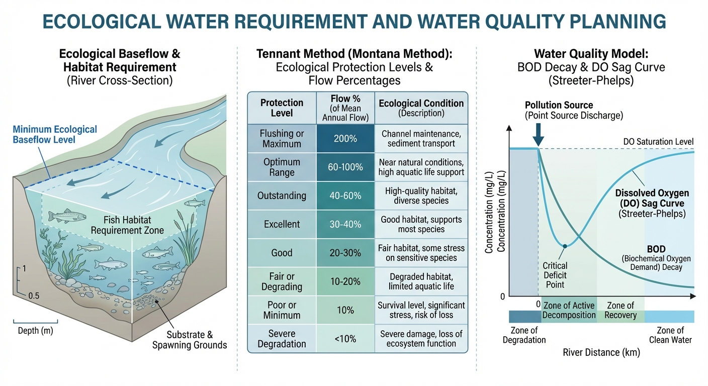
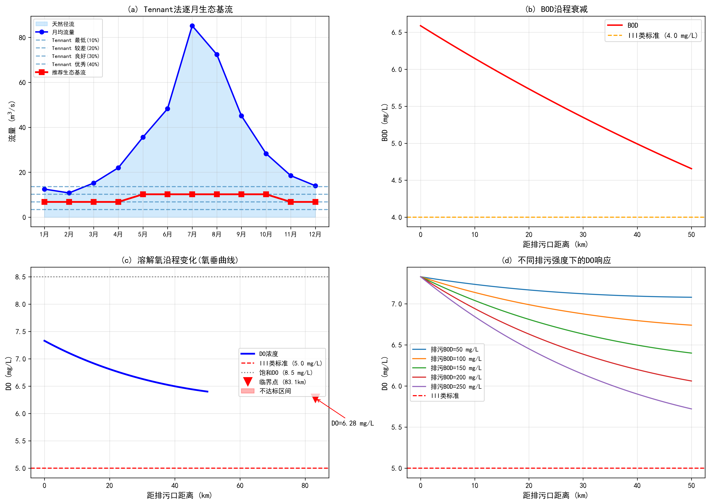

# 第 5 章 生态需水保障与水质规划

## 学习目标

- 掌握 Tennant 法计算逐月最小生态基流的原理与分级标准
- 理解 Streeter-Phelps 方程描述 BOD-DO 沿程变化的物理机制
- 能够从一阶常微分方程组推导 Streeter-Phelps 解析解
- 掌握临界点位置公式的推导方法
- 学会计算河段纳污能力并确定限排总量

## 5.1 从水权交易到生态约束

第 4 章证明了水权交易可将社会总效益提升 14.5%。然而，效率最大化的分配方案存在一个隐含风险：当水量大量从农业区转向工业和城市时，农业区河道的生态基流可能受到挤压。生态基流并非普通的"用水需求"——它不产生直接的经济收益，却是维持河流生态系统健康的刚性底线。一旦生态基流被突破，水生生物种群崩溃、河道水质恶化和湿地萎缩将造成不可逆转的生态损失。

因此，生态需水保障是水资源规划中具有"一票否决"性质的硬约束。本章从两个相互关联的维度展开：水量维度——确定维持生态系统最低需求的基流标准；水质维度——评估河段的环境容量和纳污能力。

## 5.2 生态需水与 Tennant 法

### 5.2.1 方法原理

Tennant（1976）基于美国 11 个州数百条河流的实测数据，提出了以多年平均流量百分比确定生态基流的方法。该方法的物理假设是：河流生态系统的健康状况与径流占多年平均值的百分比之间存在稳定的经验关系。Tennant 将生态状况分为若干等级：

| 等级 | 占年均流量比例 | 生态状况描述 |
|------|-------------|------------|
| 最低生存 | 10% | 仅维持鱼类最低生存需求 |
| 较差 | 20% | 水生栖息地品质显著下降 |
| 良好 | 30% | 维持较好的水生生态功能 |
| 优秀 | 40% | 接近天然状态的生态完整性 |

### 5.2.2 分季节方案

中国的实践通常采用分季节的 Tennant 推荐方案：枯水期（11 月至次年 4 月）取年均流量的 20%，丰水期（5--10 月）取 30%。这一差异化设定反映了一个水文学事实：丰水期水生生物处于繁殖和生长的活跃阶段，对水量和水质的需求更高；而枯水期生物活动减缓，较低的基流即可维持基本的生态功能。

数学上，Tennant 法的计算可表达为：

$$
Q_{\text{eco},m} = \alpha_m \cdot \bar{Q}_{\text{annual}}, \quad \alpha_m = \begin{cases} 0.20 & m \in \{11, 12, 1, 2, 3, 4\} \\ 0.30 & m \in \{5, 6, 7, 8, 9, 10\} \end{cases}
$$

其中 $\bar{Q}_{\text{annual}} = \frac{1}{12}\sum_{m=1}^{12} Q_m$ 为多年月均流量的算术平均值，$Q_m$ 为第 $m$ 月的多年平均流量。需要强调的是，Tennant 法中的"年均流量"是月均流量的平均（而非年总量除以 12），两者在数值上相等但概念出发点不同。

Tennant 法的优点是数据需求少、计算简便，适用于资料匮乏的中小河流。其主要局限是未考虑河流的具体地貌特征和关键物种的栖息地需求。此外，该方法隐含一个重要假设：所有河流的生态流量与平均流量的比例关系具有普适性。这一假设在中国南北方差异显著的水文条件下可能并不成立——北方干旱河流的生态系统已适应低流量环境，实际需水比例可能低于 20%；而南方丰水河流的水生生态系统对流量变化更为敏感，可能需要更高的保留比例。

**替代方法与校核**：对于生态敏感河段，应结合更精细的方法进行校核。湿周法（Wetted Perimeter Method）基于河道横断面的水力几何关系，通过寻找湿周（水面以下的河床周长）随流量变化的拐点来确定最小生态流量——拐点对应的流量使得进一步减少流量将导致可用栖息面积的急剧缩减。PHABSIM（Physical Habitat Simulation）模型则更为精细，它耦合水力学模型与目标物种的栖息地适宜度曲线，计算不同流量下的可用栖息地面积（WUA），以 WUA 的拐点流量作为推荐基流。这些方法数据需求量大、计算复杂，但能给出与具体河流生态特征匹配的基流方案。

在中国的水资源管理实践中，《河湖生态环境需水计算规范》（SL/Z 712-2014）推荐综合运用多种方法进行交叉验证，取其合理区间作为最终推荐值。在实际规划中，生态基流的确定还需考虑与第 3 章水库调度的耦合——水库的最小下泄约束 $R_{\min}$ 应不低于下游河段的生态基流要求，这构成了跨章节的约束传递关系。

## 5.3 Streeter-Phelps BOD-DO 模型

### 5.3.1 控制方程

1925 年 Streeter 和 Phelps 提出的 BOD-DO 耦合模型至今仍是水质规划的经典工具。模型基于两个基本假设：有机污染物的生化降解遵循一阶衰减动力学，大气复氧速率与溶解氧亏损值成正比。控制方程组为：

$$
\frac{dL}{dt} = -K_1 L, \quad \frac{dD}{dt} = K_1 L - K_2 D
$$

其中 $L$ 为 BOD（生化需氧量）浓度，$D = DO_{\text{sat}} - DO$ 为溶解氧亏损值，$K_1$ 为耗氧系数（$\text{d}^{-1}$），$K_2$ 为复氧系数（$\text{d}^{-1}$）。

### 5.3.2 解析解的推导

**第一个方程**是标准的一阶线性常微分方程，其解为：

$$
L(t) = L_0 \, e^{-K_1 t}
$$

**第二个方程**是一阶非齐次线性方程。将 $L(t)$ 代入得：

$$
\frac{dD}{dt} + K_2 D = K_1 L_0 \, e^{-K_1 t}
$$

这是标准的 $y' + py = q(t)$ 型方程，积分因子为 $\mu(t) = e^{K_2 t}$。两端乘以积分因子：

$$
\frac{d}{dt}\left[D \cdot e^{K_2 t}\right] = K_1 L_0 \, e^{(K_2 - K_1)t}
$$

两端积分并利用初始条件 $D(0) = D_0$：

$$
D(t) \cdot e^{K_2 t} - D_0 = \frac{K_1 L_0}{K_2 - K_1} \left[e^{(K_2-K_1)t} - 1\right]
$$

整理得到 Streeter-Phelps 解析解：

$$
D(t) = \frac{K_1 L_0}{K_2 - K_1}\left(e^{-K_1 t} - e^{-K_2 t}\right) + D_0 \, e^{-K_2 t}
$$

溶解氧浓度为 $DO(t) = DO_{\text{sat}} - D(t)$。

### 5.3.3 临界点位置的推导

DO 沿程变化呈现特征性的"氧垂曲线"：排污口下游耗氧大于复氧，DO 持续下降；达到临界点后复氧占主导，DO 回升。临界点处 $dD/dt = 0$，即 $K_1 L - K_2 D = 0$。

将 $L(t_c)$ 和 $D(t_c)$ 代入，令 $dD/dt_c = 0$：

$$
K_1 L_0 e^{-K_1 t_c} = K_2 \left[\frac{K_1 L_0}{K_2-K_1}(e^{-K_1 t_c} - e^{-K_2 t_c}) + D_0 e^{-K_2 t_c}\right]
$$

经过代数化简，得到临界时间：

$$
t_c = \frac{1}{K_2 - K_1} \ln\left[\frac{K_2}{K_1}\left(1 - \frac{D_0(K_2-K_1)}{K_1 L_0}\right)\right]
$$

临界点距排污口的距离为 $x_c = v \cdot t_c$（其中 $v$ 为河流平均流速）。临界时间和最低 DO 值是水质规划的两个关键参数：前者决定了最敏感河段的位置，后者决定了是否满足水质标准。

### 5.3.4 参数的物理意义与选取

耗氧系数 $K_1$ 反映有机物的可生化降解速率，受污水性质和水温控制。城市生活污水 $K_1$ 通常为 0.2--0.4 $\text{d}^{-1}$（20°C），工业废水因有机物结构差异可能偏高或偏低。$K_1$ 对水温高度敏感，经验修正为 $K_1(T) = K_1(20°\text{C}) \cdot 1.047^{(T-20)}$。

复氧系数 $K_2$ 取决于河流的水力条件——流速越大、水深越浅，水面紊动越强，大气氧的传质速率越高。经典的 O'Connor-Dobbins 公式给出 $K_2 = 3.93 v^{0.5}/H^{1.5}$，其中 $v$ 为流速（m/s），$H$ 为水深（m）。

$K_2/K_1$ 的比值决定了氧垂曲线的形态：比值越大，河流自净能力越强，临界点越近、最低 DO 越高；比值越小，自净过程越缓慢，水质恢复所需的河段越长。

当 $K_1 = K_2$ 时，Streeter-Phelps 解析解退化为特殊形式。此时积分因子法中右端的指数项变为常数，需要单独求解。令 $K_1 = K_2 = K$，则：

$$
D(t) = K L_0 \, t \, e^{-Kt} + D_0 \, e^{-Kt}
$$

这一特殊解表明，当耗氧速率与复氧速率恰好相等时，氧垂曲线的下降段更为平坦，临界点向下游推移。在实际水质评价中，$K_1 \approx K_2$ 的情况并不罕见——中等流速、中等水深的平原河流常处于这一区间。

### 5.3.5 纳污能力的反算

纳污能力是指在满足水质标准（如 III 类 $DO \geq 5$ mg/L）的前提下，河段能够接纳的最大污染物排放量。其计算逻辑是"反向工程"——从水质标准出发，反推允许的最大排污强度。

设水质标准要求最低 $DO \geq DO_{\text{std}}$，则纳污能力约束为 $DO_{\text{sat}} - D(t_c) \geq DO_{\text{std}}$，即 $D(t_c) \leq DO_{\text{sat}} - DO_{\text{std}}$。将临界点亏损值的表达式代入这一约束，可以隐式地反解允许的最大初始 BOD 浓度 $L_0^{\max}$。由于方程的非线性，通常采用二分法或数值迭代求解。纳污能力（t/d）为：

$$
W_{\text{cap}} = Q_{\text{waste}} \times L_0^{\max} \times 86400 / 10^6
$$

当前排污负荷与纳污能力之差即为需要削减的排污量。如果当前负荷已超过纳污能力，则必须实施排污许可证制度下的总量削减。

纳污能力的计算结果直接关联两个管理决策：排污许可证的发放总量和污水处理厂的设计规模。在中国的水资源管理实践中，《水功能区管理办法》要求按水功能区划分的限制纳污总量核定各断面的纳污能力，并以此作为审批新建排污口的定量依据。当河段纳污能力已被充分占用时，新增排污源必须通过排污权交易从现有排污户购买排放指标，这与第 4 章讨论的水权交易市场在制度设计上异曲同工。

### 5.3.6 模型的局限与扩展

Streeter-Phelps 模型在理论推导上优雅简洁，但其基本假设在复杂河流条件下可能不成立。首先，模型假设河流为一维稳态均匀流，忽略了横向和纵向混合过程——在宽浅河流或回水区域，污染物的横向扩散可能显著影响浓度分布。其次，模型仅考虑 BOD 耗氧和大气复氧两种过程，未纳入底泥耗氧、光合作用产氧和硝化耗氧等因素。对于富营养化严重的河流，藻类的光合作用可使白天 DO 显著高于模型预测值，而夜间呼吸作用则使 DO 进一步降低。

针对这些局限，QUAL2E 和 WASP 等综合水质模型通过引入多种水质组分（氨氮、硝态氮、磷等）和多种反应过程（硝化、反硝化、光合-呼吸）进行了扩展。这些模型虽然更加全面，但参数需求量和率定难度也大幅增加。在教学和初步规划阶段，Streeter-Phelps 模型仍然是理解水质变化物理机制的最佳起点。

## 5.4 模拟案例：河流生态基流与纳污能力分析

### 案例背景

以北方半湿润河流为对象，多年月平均流量范围 10.8--85.2 m3/s。上游河段的排污口排放 BOD 浓度 150 mg/L、流量 0.8 m3/s。通过 Tennant 法确定逐月生态基流，并用 Streeter-Phelps 模型分析排污口下游 50 km 河段的 DO 变化，以 III 类水质标准（DO $\geq$ 5 mg/L）为目标计算纳污能力。

**仿真脚本**：`assets/ch05/ch05_eco_water.py`

### 模拟结果

| 指标 | 数值 |
|------|------|
| 多年平均流量 | 34.0 m3/s |
| 推荐枯水期生态基流 | 6.8 m3/s |
| 推荐丰水期生态基流 | 10.2 m3/s |
| 混合后 BOD | 6.59 mg/L |
| 临界点距离 | 83.1 km |
| 临界点最低 DO | 6.28 mg/L |
| 纳污能力 | 20.80 t/d |
| 当前排污负荷 | 10.37 t/d |
| 需削减比例 | 0% |

### 结果分析

Tennant 法计算结果显示，该河流枯水期生态基流为 6.8 m3/s（年均流量的 20%），丰水期为 10.2 m3/s（30%）。在枯水最严重的 2 月，生态基流占天然流量的 63%，意味着可供开发利用的水量仅为天然径流的三分之一。这一结果凸显了枯水期生态用水与生产用水之间的尖锐矛盾——第 4 章的水权交易分配方案必须将生态基流作为不可交易的保留量从总水量中预先扣除。

Streeter-Phelps 模型计算表明，排污口下游 DO 经历了先降后升的氧垂过程，最低点出现在距排污口 83.1 km 处，DO 降至 6.28 mg/L。该值高于 III 类水质标准（5.0 mg/L），说明在当前排污强度下河段水质可达标。纳污能力分析进一步表明，河段 BOD 最大允许排放浓度约 301 mg/L，对应纳污能力 20.80 t/d，当前排污负荷（10.37 t/d）仅占纳污能力的 49.9%，尚有较大的环境容量余量。

不同排污强度的对比分析显示，当排污 BOD 浓度超过 200 mg/L 时，最低 DO 接近 5.0 mg/L 的标准限值；超过 250 mg/L 时将出现不达标区间。考虑到枯水期流量仅为年均值的三分之一，纳污能力将大幅缩减（稀释比下降），因此排污总量控制应以枯水期最不利条件为基准进行核算。

### 工程启示

- Tennant 法虽然简便，但在枯水期可能高估生态需水（占天然流量的 60% 以上），对水量严重不足的河流建议结合栖息地模拟法校核
- 氧垂曲线的临界点位置受 $K_2/K_1$ 比值控制，水温升高（$K_1$ 增大）将使临界点前移且 DO 降低
- 纳污能力核算应以枯水期最小月均流量为设计流量，而非年均值
- 面源污染（农业非点源）的 BOD 贡献在丰水期可能超过点源，需纳入总量控制框架
- 生态基流与水质保障存在协同效应：维持较高的枯水期基流有助于稀释污染物浓度，降低 BOD 峰值，从而间接提高河段的环境容量

## 附录：仿真脚本解读

**脚本路径**：`assets/ch05/ch05_eco_water.py`

该脚本分为三个计算模块。第一模块实现 Tennant 法：给定 12 个月的多年平均流量序列，计算年均值，按枯水期 20%、丰水期 30% 的标准确定逐月生态基流，并输出各月生态基流占天然流量的比例。第二模块实现 Streeter-Phelps 解析解：先按流量加权公式计算排污口混合后的初始 BOD 和 DO 亏损值，将距离转换为行进时间 $t = x/(v \times 86400)$，代入解析解公式计算沿程 BOD 衰减和 DO 变化。临界点通过解析公式 $t_c = \ln[K_2/K_1 \cdot (1 - D_0(K_2-K_1)/(K_1 L_0))]/(K_2-K_1)$ 直接计算。第三模块用二分法求解纳污能力：在排污 BOD 浓度为 0--500 mg/L 的搜索区间内，反复调用 DO 计算函数，找到使最低 DO 恰好等于 5.0 mg/L 的临界排污浓度。

绘图采用 $2 \times 2$ 布局：(a) 天然流量与 Tennant 各级基流的对比；(b) BOD 沿程衰减曲线；(c) 氧垂曲线标注临界点和水质标准；(d) 不同排污强度下的 DO 响应族曲线。

---

## 本章小结

本章从水量和水质两个维度构建了生态需水保障的分析框架。Tennant 法提供了简便的生态基流估算工具，但在枯水期其保留比例可能占天然流量的大部分，凸显了生态保护与经济用水之间的尖锐矛盾。Streeter-Phelps 模型通过严格的一阶常微分方程推导，揭示了氧垂曲线的数学结构和临界点的控制参数。纳污能力的反算为排污总量控制提供了定量依据。前五章从气候变化（第 1 章）→供需平衡（第 2 章）→水库调度（第 3 章）→水权交易（第 4 章）→生态保障（第 5 章）逐步构建了水资源规划的完整知识链条。下一章将引入数字孪生和韧性评估的现代方法，将上述理论框架融入智能化的决策支持系统。

---

## 思考与练习

1. 推导 Streeter-Phelps 方程当 $K_1 = K_2$ 时的特殊解析解（提示：此时积分因子法产生不同的积分结果）。
2. 某河段 $K_1 = 0.4 \text{ d}^{-1}$，$K_2 = 0.8 \text{ d}^{-1}$，流速 0.3 m/s。排污口混合后 $L_0 = 10$ mg/L，$D_0 = 1.5$ mg/L。请计算临界点距离和最低 DO。
3. 如果水温从 20°C 升至 25°C，$K_1$ 和 $K_2$ 分别如何变化？对临界点位置和最低 DO 有何影响？
4. 讨论为什么纳污能力核算应以枯水期流量为基准，而不是年均流量。

---

**拓展视野**：生态基流约束本质上是水网运行的"硬边界"——无论经济调度如何优化，生态流量底线不可逾越。这一概念与水系统控制论中的"运行设计域（ODD）"框架高度契合：ODD 定义了自主控制系统可安全运行的边界条件集合，生态流量正是其中最重要的环境约束之一。当实际流量逼近生态底线时，控制系统必须自动触发保护机制，优先保障生态安全。这种"约束驱动的控制"思想贯穿于水网自主运行的所有层级。

## 参考文献

[1] Tennant D L. Instream flow regimens for fish, wildlife, recreation and related environmental resources. Fisheries, 1976, 1(4): 6-10.

[2] Chapra S C. Surface Water-Quality Modeling. McGraw-Hill, 1997.

[3] Thomann R V, Mueller J A. Principles of Surface Water Quality Modeling and Control. Harper & Row, 1987.
