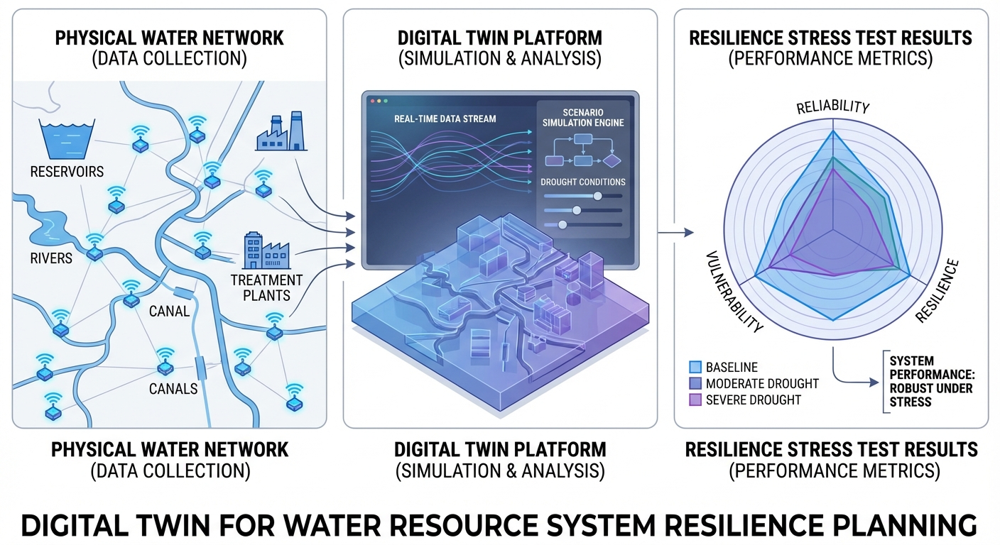
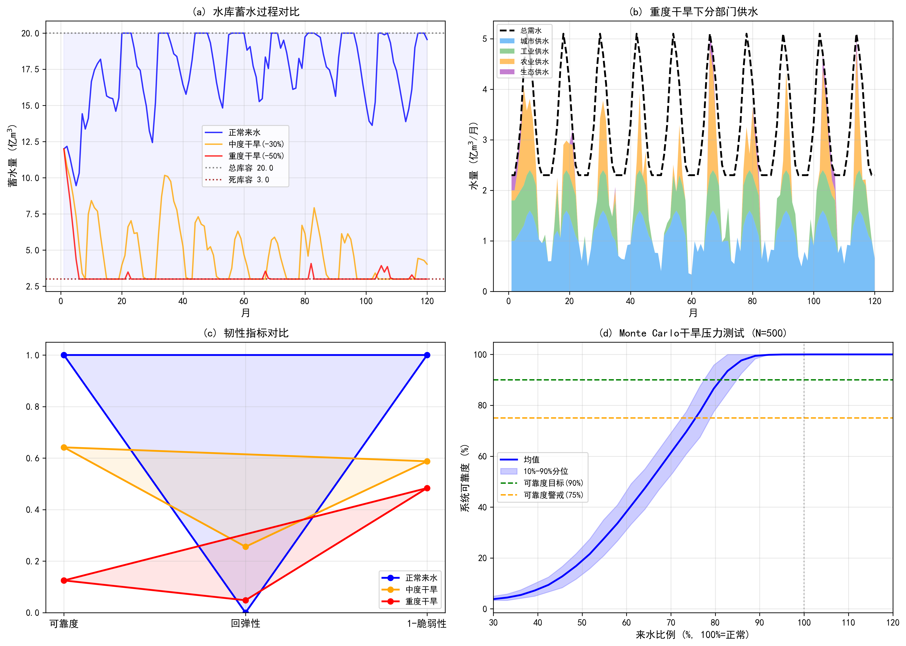

# 第 6 章 数字孪生流域与智能规划

## 学习目标

- 理解数字孪生在流域水资源管理中的应用框架
- 掌握系统韧性的三个核心指标（可靠度、回弹性、脆弱性）的定义与概率论基础
- 学会利用 Monte Carlo 模拟进行极端干旱情景的压力测试
- 分析不同干旱强度下水资源系统供水保障能力的非线性响应特征

## 6.1 从生态保障到系统韧性

前五章从不同维度构建了水资源规划的理论体系：气候变化的径流影响（第 1 章）、供需平衡的频率分析（第 2 章）、水库的时间维度调蓄（第 3 章）、水权的空间维度配置（第 4 章）、生态基流和水质的硬约束（第 5 章）。然而，这些分析大多基于确定性或单一情景，尚未回答一个核心问题：当多重不利因素叠加——极端干旱、设备故障、需求突增——同时发生时，系统能否"撑住"？

韧性（Resilience）概念正是为回答这一问题而生。它不再问"系统会不会出问题"，而是追问三个更为本质的问题：多久会出一次事（可靠度）？出事后多快能恢复（回弹性）？出事时损失有多大（脆弱性）？

数字孪生流域是将上述分析框架与实时数据融合的现代工程范式。通过构建物理流域的虚拟映射，决策者可以在虚拟空间中快速测试各种极端情景，实现"先试后行"的风险管理。

## 6.2 WEAP 框架与数字孪生流域

水评估与规划系统（WEAP）是 Stockholm Environment Institute 开发的流域水资源综合模拟工具，采用"情景驱动"的分析框架：在给定气候、人口和政策情景下，模拟水资源从供给到需求的全链条过程。其核心是一个基于节点-链路拓扑的水量平衡网络，每个节点代表水库、取水口或需水户，链路代表河段或调水渠道。

数字孪生流域将 WEAP 类模型与实时监测数据、气象预报和遥感信息耦合，构建物理流域的虚拟映射。其基本方程仍是水量平衡：

$$
V_{t+1} = V_t + \sum Q_{\text{in},t} - \sum Q_{\text{out},t} - E_t - L_t
$$

各项分别为入流、出流（含供水和弃水）、蒸发和渗漏。在数字孪生框架下，模型参数可通过数据同化（如集合卡尔曼滤波）持续校正，情景分析可在虚拟空间中快速迭代。与传统离线模型相比，数字孪生的核心优势在于"活的模型"——它随实时数据持续更新，使得风险评估从静态的规划文件转变为动态的运行决策工具。

数据同化是数字孪生区别于传统模型的技术核心。集合卡尔曼滤波（EnKF）是目前水文领域最常用的同化方法，其基本思想是：维护一组由不同参数或初始条件生成的模型集合（ensemble），将实测数据与集合预报的统计特征进行融合，按贝叶斯原理更新状态估计。更新公式为：

$$
\mathbf{x}_i^a = \mathbf{x}_i^f + \mathbf{K}(\mathbf{y}_o - \mathbf{H}\mathbf{x}_i^f + \boldsymbol{\epsilon}_i)
$$

其中 $\mathbf{x}_i^f$ 和 $\mathbf{x}_i^a$ 分别为第 $i$ 个集合成员的预报态和分析态，$\mathbf{K}$ 为卡尔曼增益矩阵，$\mathbf{y}_o$ 为观测值，$\mathbf{H}$ 为观测算子。通过持续同化水位、流量等实测数据，数字孪生模型能够自动修正参数偏差和初始条件误差，实现"越用越准"的自适应能力。

## 6.3 系统韧性评估的概率论基础

### 6.3.1 Hashimoto 三指标体系

Hashimoto 等（1982）提出了评价水资源系统性能的三个互补指标。设系统在时段 $t$ 的状态为 $X_t$，满意状态集为 $S$（供需平衡），失败状态集为 $F$（供不应求），则：

**可靠度（Reliability）**：系统处于满意状态的长期概率：

$$
\text{Rel} = P\{X_t \in S\} = \lim_{T \to \infty} \frac{1}{T} \sum_{t=1}^{T} \mathbb{1}(X_t \in S)
$$

可靠度直接回答"系统能正常工作多大比例的时间"。在水资源规划中，通常要求 $\text{Rel} \geq 0.90$（即不超过 10% 的月份出现缺水）。

**回弹性（Resiliency）**：系统从失败状态恢复到满意状态的条件转移概率：

$$
\text{Res} = P\{X_{t+1} \in S \mid X_t \in F\}
$$

回弹性刻画了系统的"自愈能力"。$\text{Res} = 0.5$ 意味着系统一旦进入缺水状态，平均 2 个月能恢复一次；$\text{Res} = 0.1$ 则意味着恢复周期约 10 个月，系统可能长期深陷缺水困境。

**脆弱性（Vulnerability）**：失败时段内缺水严重程度的条件期望：

$$
\text{Vul} = E\left[\frac{D_t - S_t}{D_t} \bigg| X_t \in F\right]
$$

其中 $D_t$ 为需水量，$S_t$ 为实际供水量。脆弱性回答"出事时损失有多大"——10% 的缺口可以通过应急节水措施应对，而 50% 的缺口则意味着大范围的用水中断。

三个指标从不同维度刻画系统的抗旱能力：可靠度反映"多久会出事"，回弹性反映"出事后多快恢复"，脆弱性反映"出事时损失多大"。理想的韧性系统应同时具备高可靠度、高回弹性和低脆弱性。

### 6.3.2 指标间的权衡关系

三个指标之间存在固有的权衡。例如，增加水库库容可以提高可靠度（更多蓄水缓冲），但不一定改善回弹性——大水库在极端干旱中蓄水消耗殆尽后，需要更长时间来重新蓄满。同样，优先保障城市供水（高优先级）会提高城市用户的可靠度，但可能将脆弱性转嫁给低优先级的农业用户。这种权衡使得韧性评估不能依赖单一指标，而必须综合考量三个维度。

在工程实践中，可以构造综合韧性指数来整合三个指标。一种常用的加权方案为：

$$
\text{RI} = w_1 \cdot \text{Rel} + w_2 \cdot \text{Res} - w_3 \cdot \text{Vul}
$$

其中权重 $w_1, w_2, w_3$ 反映决策者对三个维度的相对重视程度。例如，以保障供水安全为首要目标的城市水系统，可设 $w_1 = 0.5, w_2 = 0.3, w_3 = 0.2$；以快速恢复为优先的应急供水系统，则可提高 $w_2$ 的权重。综合韧性指数的值域为 $[-w_3, w_1 + w_2]$，数值越高表示系统韧性越好。需要注意的是，任何加权方案都内含价值判断，不同的权重设定可能导致不同的规划方案排序。

## 6.4 Monte Carlo 压力测试的统计原理

### 6.4.1 方法框架

Monte Carlo 模拟通过大量随机抽样来估计系统性能的概率分布。对于水资源系统，其基本流程为：

1. 确定来水的概率模型（如对数正态分布），设定干旱因子 $\delta$（$\delta < 1$ 表示来水减少）
2. 从概率模型中随机抽取 $N$ 组入流序列 $\{I_t^{(j)}\}_{j=1}^{N}$
3. 对每组序列运行水资源系统模型，计算韧性指标
4. 统计分析 $N$ 次模拟结果的均值、分位数和置信区间

当 $N$ 足够大时（通常 $N \geq 500$），由大数定律和中心极限定理，样本均值收敛于总体期望：

$$
\bar{x}_N = \frac{1}{N}\sum_{j=1}^{N} x_j \xrightarrow{P} E[x], \quad \text{标准误} = \frac{\sigma}{\sqrt{N}}
$$

$N = 500$ 时，标准误约为标准差的 4.5%，提供了足够的估计精度。进一步地，可靠度估计的 95% 置信区间宽度约为 $\pm 1.96 \sigma / \sqrt{N}$。对于可靠度接近 0.5 的情形（方差最大），$N = 500$ 对应的 95% 置信区间半宽约为 $\pm 4.4\%$，这一精度对工程决策已经足够。

### 6.4.2 韧性阈值的识别

通过在一系列干旱因子 $\delta \in [0.3, 1.2]$ 上重复 Monte Carlo 模拟，可以绘制"可靠度-来水比例"曲线。该曲线通常呈现 S 型的非线性特征：

- 当 $\delta > 0.8$（来水接近正常），可靠度维持在 90% 以上——系统具有足够的缓冲能力
- 当 $0.5 < \delta < 0.8$，可靠度急剧下降——系统进入"脆弱区间"，性能对来水变化高度敏感
- 当 $\delta < 0.5$，可靠度趋近于零——系统几乎完全失效

这种非线性响应的物理根源在于水库调蓄能力的耗尽：在中度干旱下，水库尚能通过消耗蓄水来弥补来水不足；但当干旱持续或加剧，水库蓄水耗尽后系统失去缓冲，可靠度出现"断崖式"下跌。"韧性阈值"——可靠度开始急剧下降的临界来水比例——是制定干旱应急预案触发条件的关键参考值。

## 6.5 模拟案例：极端干旱情景压力测试

### 案例背景

构建简化的流域水资源系统：上游入流汇入水库（总库容 20 亿 m3），下游依次满足城市（优先级 1）、工业（优先级 2）、农业（优先级 3）和生态基流（优先级 4）需求。模拟 10 年（120 个月）的运行过程，分别在正常来水、中度干旱（来水减 30%）和重度干旱（来水减 50%）三种情景下评估系统韧性。同时通过 500 次 Monte Carlo 模拟绘制可靠度-来水比例曲线。

**仿真脚本**：`assets/ch06/ch06_digital_resilience.py`

### 模拟结果

| 指标 | 正常来水 | 中度干旱(-30%) | 重度干旱(-50%) |
|------|---------|---------------|---------------|
| 可靠度 | 1.000 | 0.642 | 0.125 |
| 回弹性 | 0.000 | 0.256 | 0.048 |
| 脆弱性(%) | 0.0 | 41.2 | 51.6 |

| 压力测试指标 | 数值 |
|-------------|------|
| Monte Carlo 模拟次数 | 500 |
| 可靠度降至 90% 的来水比例 | 80% |
| 来水 50% 时的平均可靠度 | 16.8% |
| 来水 30% 时的平均可靠度 | 3.8% |

### 结果分析

韧性指标在三种情景下呈现急剧分化。正常来水条件下系统可靠度为 1.000，说明水库库容和来水量足以覆盖全部需求。但当来水减少 30% 时，可靠度骤降至 0.642，意味着有超过三分之一的月份出现缺水——这种从 100% 到 64% 的陡降揭示了系统不存在"渐进恶化"的缓冲区间。

回弹性从正常状态的"无定义"（无失败时段）降至中度干旱的 0.256，即系统一旦进入缺水状态，平均每 4 个月才能恢复一次。这意味着缺水不是偶发的孤立事件，而是持续性的系统失能。脆弱性高达 41.2%，表明缺水月份的平均供需缺口超过需水量的四成——这远超应急节水措施（通常可削减 10%--15% 需求）的应对能力。

重度干旱（来水减半）情景更为严峻：可靠度降至 0.125（仅八分之一的月份供需平衡），回弹性降至 0.048（恢复周期约 20 个月），脆弱性升至 51.6%。水库蓄水过程显示，重度干旱下水库在运行第 2 年即消落至死库容附近，此后长期维持在最低水平，完全失去了调蓄能力。

Monte Carlo 压力测试揭示了系统的"韧性阈值"：当来水比例降至正常水平的 80% 时，系统可靠度开始低于 90% 的规划目标；降至 60% 时，可靠度跌破 50%；降至 40% 以下时，系统几乎完全失效。10%--90% 分位数的带宽在来水 50%--80% 区间最大，反映了该区间内系统性能对来水序列的随机特征最为敏感。这一信息对干旱应急预案的触发条件设定具有直接参考价值——当实时监测的来水量降至多年均值的 80% 以下时，应启动预警；降至 60% 以下时，应启动应急响应。

### 工程启示

- 系统韧性对来水减少存在非线性响应，来水减少 30% 即可导致可靠度从 100% 骤降至 64%，不存在"渐进恶化"的缓冲区间
- Monte Carlo 压力测试可量化不同干旱强度下的供水风险概率，为应急储备规模和触发机制提供定量依据
- 水库调蓄能力在极端干旱下迅速耗尽，仅靠增加库容难以应对来水减半以上的情景，必须配合需求侧管理
- 回弹性是比可靠度更敏感的预警指标，当回弹性低于 0.3 时应启动应急响应
- 数字孪生的实时更新能力使得韧性评估从静态的规划报告转变为动态的运行监控工具，可以根据最新的水文气象预报持续修正风险判断

## 附录：仿真脚本解读

**脚本路径**：`assets/ch06/ch06_digital_resilience.py`

该脚本分为两大模块。第一模块是流域水资源系统模型 `simulate_system()`：基于节点-链路拓扑，每月按优先级顺序（城市 > 工业 > 农业 > 生态）分配可用水量，优先级高的用户先获满足，剩余分配给低优先级用户。水库蓄水遵循水量平衡方程，超过总库容部分溢洪、低于死库容则强制锁定。入流序列由 `generate_inflow()` 函数生成：以 12 个月的季节模式为基底，乘以对数正态随机波动和干旱因子 $\delta$。

第二模块是韧性评估与压力测试。`calc_resilience_metrics()` 函数计算 Hashimoto 三指标：可靠度为满足 95% 需求的月份占比，回弹性为失败→成功转移的条件概率，脆弱性为失败月份平均缺水率。Monte Carlo 模块在 30 个干旱因子（0.3--1.2）上各运行 500 次随机模拟，输出可靠度的均值和 10%--90% 分位数包络线。

绘图采用 $2 \times 2$ 布局：(a) 三种情景下水库蓄水过程对比；(b) 重度干旱下分部门供水堆叠图与总需水对比；(c) 三指标雷达图的情景对比；(d) Monte Carlo 可靠度-来水比例曲线及置信带。

---

## 本章小结

本章作为全书的收官章，将前五章建立的理论方法融入数字孪生流域的现代工程范式。通过引入 Hashimoto 三指标体系，从可靠度、回弹性和脆弱性三个互补维度刻画了系统的抗旱韧性。Monte Carlo 压力测试揭示了系统韧性对来水减少的非线性响应——不存在"渐进恶化"的过渡区，一旦越过韧性阈值，可靠度将出现断崖式下跌。这一发现对干旱应急预案的设计具有重要指导意义。

回顾全书六章的知识脉络：从全球变暖驱动的径流变化，到概率框架下的供需平衡，到水库的时间优化和水权的空间配置，再到生态保护的刚性约束和数字孪生的韧性评估——一条从自然过程理解到工程决策支持的完整链条已经建立。展望未来，人工智能和物联网技术的深度融入将使水资源规划从"基于历史经验的静态方案"转向"基于实时数据的动态自适应管理"，数字孪生流域正是这一转型的核心载体。

---

## 思考与练习

1. 推导回弹性指标的另一种等价定义：失败事件的平均持续时长 $\bar{d}_F = 1/\text{Res}$。请解释当 $\text{Res} = 0.048$ 时系统的物理行为。
2. 如果将系统的供水优先级从"城市 > 工业 > 农业 > 生态"改为"生态 > 城市 > 工业 > 农业"，请定性分析各部门的可靠度和脆弱性将如何变化。
3. Monte Carlo 模拟中，将模拟次数从 500 增加到 2000，可靠度估计的标准误降低多少倍？是否有必要进行这种增加？
4. 讨论"韧性阈值"概念在水库容量设计中的应用：如何根据压力测试曲线确定水库的最小设计库容？
5. 结合第 1 章的 RCP8.5 情景（径流减少 18%），请估算该情景下系统的可靠度（利用 Monte Carlo 曲线插值），并讨论需要采取哪些措施来维持 90% 的可靠度目标。

---

**拓展视野**：数字孪生流域是实现水网自主运行的核心基础设施。在水系统控制论的架构中，数字孪生不仅是"虚拟镜像"，更是控制系统的"大脑"——它实时融合传感数据与物理模型，为分层分布式控制（HDC）提供状态估计和预测支撑。本章介绍的 WEAP 平台侧重于规划层面的"离线孪生"，而未来的发展方向是构建支持实时决策的"在线孪生"，实现从"数字化认知"到"自主化行动"的跨越。智慧水网的总体架构设计可参阅 Lei (2025b) 的系统论述。

## 参考文献

[1] Hashimoto T, Stedinger J R, Loucks D P. Reliability, resiliency, and vulnerability criteria for water resource system performance evaluation. Water Resources Research, 1982, 18(1): 14-20.

[2] Sieber J, Purkey D. WEAP: Water Evaluation and Planning System User Guide. Stockholm Environment Institute, 2015.

[3] Moy W S, Cohon J L, ReVelle C S. A programming model for analysis of the reliability, resilience, and vulnerability of a water supply reservoir. Water Resources Research, 1986, 22(4): 489-498.
