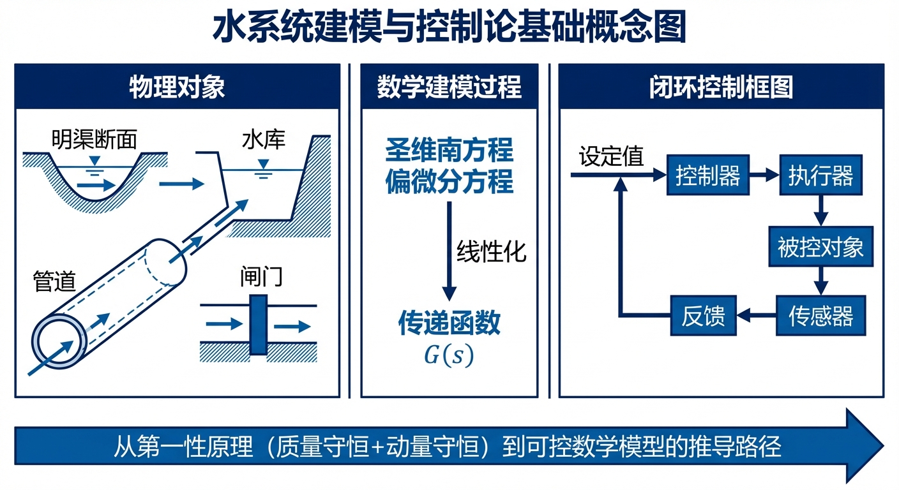
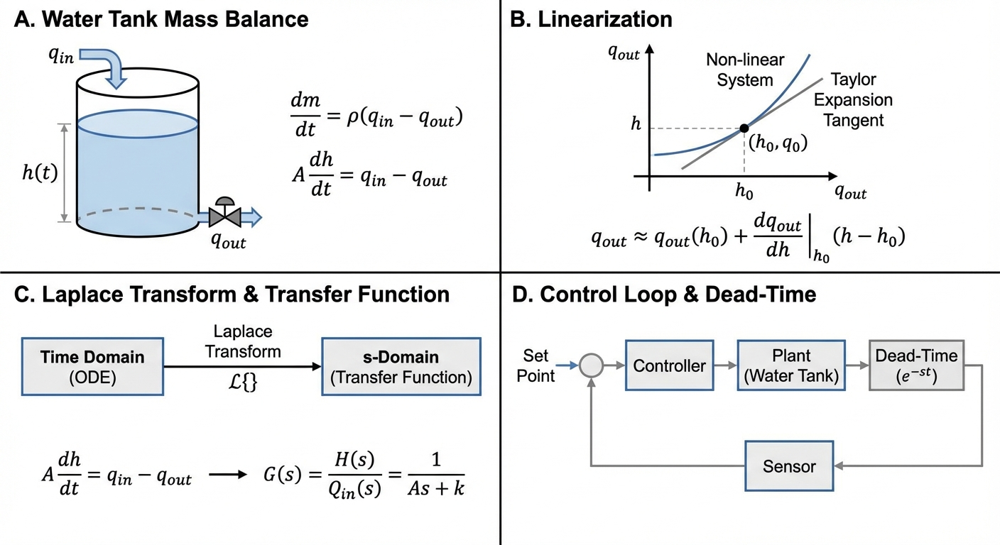
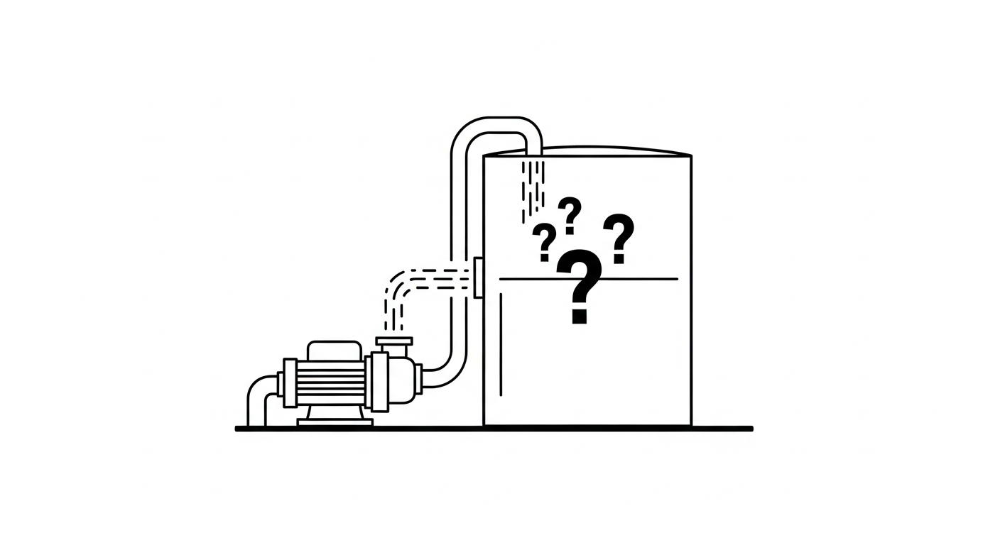

# 第 1 章 水系统建模与控制论基础



## 学习目标

本章从基础水力学原理出发，建立水务系统的第一性原理数学模型，为后续控制器设计奠定基础。读者需要掌握：

1. 连续性方程（质量守恒）在储水和输水设备中的表现形式。
2. 非线性系统在工作点附近的泰勒展开与线性化方法。
3. 拉普拉斯变换与传递函数的推导。
4. 系统时延（Dead Time）与执行器动态对闭环控制的影响。
5. 本章内容在水系统控制论（CHS）理论体系中的定位。


## CHS 理论定位

本章对应水系统控制论（CHS）六元架构 $\Sigma = (P, A, S, D, C, O)$ 中的**被控对象（P, Plant）** 建模环节。在 CHS 理论体系中，建模是所有控制设计的起点——只有建立了准确的水力学模型，才能设计有效的控制器 $C$。

CHS 提出了统一传递函数族的概念：Family $\alpha$（积分型，适用于渠池、水库）和 Family $\beta$（自调节型，适用于河道洪水演进）。本章从最基础的单容水箱出发，推导出一阶惯性传递函数，它是 Family $\alpha$ 在忽略传输延迟后的最简形式。后续章节将逐步引入更复杂的模型层级（IDZ、ID、I、SS），构成 CHS 五级模型层次体系 [1]。

## 理论基础

### 水务系统为什么需要控制理论

水务系统属于动态、强不确定且受严格约束的物理基础设施。河流行洪受天气影响持续波动，城市用水需求在小时尺度上显著变化。泵站、闸门、阀门和水处理单元在广阔空间范围与多时间尺度上耦合运行。因此，水网运行问题不仅是水力学问题，同时是典型的**动态反馈控制问题** [2]。

控制理论提供了系统化的方法论，用于处理水务工程中的关键任务：在降雨不确定性、用水量突变等强扰动条件下，对有限物理执行器（如调频水泵、电动闸门）进行可验证、可约束的调度，以保障大型水网的安全性与运行效率。与化工、电力等成熟工业领域相比，水务系统的控制理论应用起步较晚，但其需求同样迫切甚至更为突出——水务系统的空间跨度可达数百公里，时间尺度从秒级（水锤）到年级（水库调度）跨越六个数量级 [2]。

在实际运行中，控制方式分为两类：

- **开环控制（Open-Loop）**：基于历史经验和固定时间表调度（例如定时启停泵）。这种方式无法应对未预见的突发扰动。
- **闭环反馈控制（Closed-Loop Feedback）**：利用实时传感器测量值（如液位、压力）连续修正控制动作。在水务系统中，由于扰动频繁且后果严重（溢流、管网爆管），闭环反馈是工程实践中的必要配置 [3]。

### 开环与闭环的数学描述

设被控对象的传递函数为 $G_p(s)$，控制器的传递函数为 $G_c(s)$，目标值为 $R(s)$，扰动为 $D(s)$。

**开环系统**的输出为：

$$ Y(s) = G_p(s) \cdot G_c(s) \cdot R(s) + G_p(s) \cdot D(s) $$

扰动直接叠加到输出上，系统无法自行纠正。

**闭环系统**的输出为：

$$ Y(s) = \frac{G_c(s) G_p(s)}{1 + G_c(s) G_p(s)} R(s) + \frac{G_p(s)}{1 + G_c(s) G_p(s)} D(s) $$

反馈回路使得扰动的影响被因子 $1 + G_c(s) G_p(s)$ 衰减。当开环增益 $|G_c G_p| \gg 1$ 时，扰动几乎被完全抑制。

## 数学推导：动态系统建模与线性化

### 单容水箱的非线性质量守恒

**物理概化图：**


考虑一个横截面积为 $A$（单位 $\text{m}^2$）的开口水箱，进水流量为 $q_{in}$（单位 $\text{m}^3/\text{s}$），出水流量为 $q_{out}$。系统状态变量为水位 $h$（单位 $\text{m}$）。

根据质量守恒（假设水为不可压缩流体）：

$$ A \frac{dh(t)}{dt} = q_{in}(t) - q_{out}(t) \tag{1.1} $$

量纲验证：左端 $[\text{m}^2] \cdot [\text{m}/\text{s}] = [\text{m}^3/\text{s}]$，右端 $[\text{m}^3/\text{s}]$，量纲一致。

若出水依靠底部孔口的重力自流，根据托里拆利定律：

$$ q_{out}(t) = k \sqrt{h(t)} \tag{1.2} $$

其中 $k = C_d a \sqrt{2g}$，$C_d$ 为流量系数（无量纲，典型值 $0.6 \sim 0.65$），$a$ 为孔口面积（$\text{m}^2$），$g$ 为重力加速度（$9.81 \text{ m/s}^2$）。

将式 (1.2) 代入式 (1.1)，得到非线性常微分方程：

$$ A \frac{dh(t)}{dt} = q_{in}(t) - k \sqrt{h(t)} \tag{1.3} $$

该方程的非线性来源于 $\sqrt{h}$ 项。这意味着系统在低水位时对进水变化非常敏感（$d(\sqrt{h})/dh = 1/(2\sqrt{h})$，$h \to 0$ 时趋于无穷大），而在高水位时响应趋于平缓。

### 工作点线性化

工业控制中，经典 PID 和频域分析工具要求线性系统模型。因此，通常在某一稳态工作点 $(h_0, q_{in,0})$ 附近进行线性化。

**稳态条件**：导数为零，即 $q_{in,0} = k \sqrt{h_0}$。

定义偏差变量：$\delta h = h - h_0$，$\delta q_{in} = q_{in} - q_{in,0}$。

对非线性项 $f(h) = k\sqrt{h}$ 在 $h_0$ 处进行一阶泰勒展开：

$$ k\sqrt{h} \approx k\sqrt{h_0} + \frac{k}{2\sqrt{h_0}} \delta h = q_{in,0} + \frac{k}{2\sqrt{h_0}} \delta h $$

代入式 (1.3) 并消去稳态项 $q_{in,0}$：

$$ A \frac{d(\delta h)}{dt} = \delta q_{in} - \frac{k}{2\sqrt{h_0}} \delta h $$

整理为标准一阶惯性系统形式：

$$ \frac{d(\delta h)}{dt} = -\frac{1}{\tau} \delta h + \frac{1}{A} \delta q_{in} \tag{1.4} $$

其中：
- **时间常数** $\tau = \frac{2A\sqrt{h_0}}{k}$，单位 $\text{s}$，表征系统响应速度。$\tau$ 越大，系统越"迟钝"。
- **系统增益** $K_u = \frac{1}{A}$，单位 $\text{m}^{-2}$，表征单位流量变化引起的水位变化速率。

### 传递函数推导

对式 (1.4) 两端取拉普拉斯变换（假设初始偏差为零）：

$$ s \cdot \delta H(s) = -\frac{1}{\tau} \delta H(s) + \frac{1}{A} \delta Q_{in}(s) $$

整理得传递函数：

$$ G(s) = \frac{\delta H(s)}{\delta Q_{in}(s)} = \frac{K_u}{\tau s + 1} = \frac{1/A}{(2A\sqrt{h_0}/k) \cdot s + 1} \tag{1.5} $$

这是一个标准的**一阶惯性环节**。其阶跃响应为：

$$ \delta h(t) = K_u \cdot \Delta q \cdot (1 - e^{-t/\tau}) \tag{1.6} $$

在 $t = \tau$ 时，输出达到终值的 $63.2\%$。在 $t = 4\tau$ 时达到 $98.2\%$，可近似视为到达稳态。

**物理意义**：式 (1.5) 表明，单容水箱在工作点附近的动态行为可以完全由两个参数——增益 $K_u$ 和时间常数 $\tau$——来刻画。这两个参数可以通过阶跃响应实验从现场数据中辨识（详见第 3 章）。

### 状态空间表示

式 (1.4) 也可以写为状态空间形式。以 $x = \delta h$ 为状态变量，$u = \delta q_{in}$ 为输入：

$$ \dot{x} = -\frac{1}{\tau} x + \frac{1}{A} u, \quad y = x \tag{1.7} $$

其中 $A_{sys} = -1/\tau$，$B_{sys} = 1/A$，$C_{sys} = 1$，$D_{sys} = 0$。该表示形式是后续章节中 LQR（第 6 章）和 MPC（第 7 章）设计的基础。

### 双容水箱串联系统

实际水务工程中，单容水箱模型的适用范围有限。更常见的工况是多个储水设施串联运行——上游水箱的出水直接作为下游水箱的进水。这种串联结构是理解多渠池协调控制的基础。

考虑两个截面积分别为 $A_1$、$A_2$ 的水箱，上游水箱底部出水经重力自流流入下游水箱。设两个水箱的水位分别为 $h_1$、$h_2$，外部进水流量为 $q_{in}$。根据质量守恒和托里拆利定律，建立耦合微分方程组：

$$A_1 \frac{dh_1}{dt} = q_{in} - k_1 \sqrt{h_1} \tag{1.8a}$$

$$A_2 \frac{dh_2}{dt} = k_1 \sqrt{h_1} - k_2 \sqrt{h_2} \tag{1.8b}$$

取状态向量 $\mathbf{x} = [h_1, h_2]^T$，在稳态工作点附近线性化后，该系统可表示为二阶状态空间模型。对应的传递函数（从 $\delta q_{in}$ 到 $\delta h_2$）为两个一阶惯性环节的串联：

$$G(s) = \frac{\delta H_2(s)}{\delta Q_{in}(s)} = \frac{K}{(\tau_1 s + 1)(\tau_2 s + 1)} \tag{1.9}$$

其中 $\tau_1$、$\tau_2$ 分别为上、下游水箱的时间常数，$K$ 为总增益。当 $\tau_1 \neq \tau_2$ 时，式 (1.9) 的部分分式展开可以写为两个一阶响应的叠加，系统总响应时间由较大的时间常数主导。

该二阶系统的阶跃响应具有显著的 **S 型曲线**特征：初始阶段响应速率从零逐渐增大（存在拐点），随后趋于饱和。这与单容水箱阶跃响应的单调指数上升曲线（"上凸"型，无拐点）形成鲜明对比。物理原因在于：外部流量扰动必须先经过上游水箱的"缓冲"才能传递至下游水箱，上游水箱起到了天然的低通滤波作用。从频域角度看，两个惯性环节串联使得高频增益以 $-40 \text{ dB/dec}$ 的速率衰减（单容水箱为 $-20 \text{ dB/dec}$），系统对快速扰动的抑制能力更强，但响应速度也相应降低。

值得注意的是，当 $\tau_1 = \tau_2 = \tau$ 时，式 (1.9) 退化为重极点形式 $G(s) = K/(\tau s + 1)^2$，其阶跃响应为 $y(t) = K[1 - (1 + t/\tau)e^{-t/\tau}]$，拐点出现在 $t = \tau$ 处。这一特征在工程实践中常被用作辨识方法的判据——若实测阶跃响应呈现明显的 S 型曲线，则应考虑采用二阶或更高阶模型来拟合。

双容水箱串联模型是本书后续内容的重要工程基础。串级控制策略（第 4 章）正是利用中间变量 $h_1$ 的快速反馈来提升对下游水位 $h_2$ 的控制品质；多渠池协调控制（第 6 章）则将串联结构推广至 $n$ 个渠池，构成大规模耦合系统的分布式控制问题。从建模方法论看，双容水箱也是理解 CHS 五级模型层次的入口：两个水箱的串联本质上是对分布参数系统（Saint-Venant 方程描述的渠道水流）的最粗粒度集总参数近似。

## 执行器动态与时延

在控制理论入门中，控制器输出 $u(t)$ 常被默认为立即作用于被控对象。但在真实工业系统中，控制器与被控对象之间至少隔着三层非理想环节：

1. **执行器本体动态**：电动阀的阀杆行程需要数秒至数十秒完成全行程；变频泵的电机从零加速到额定转速受转动惯量和变频器爬坡率的约束，典型加速时间为 5--30 s。
2. **机械/液压传动迟滞**：液压闸门从接收指令到完全到位可能需要数十秒至数分钟，且存在回差（Backlash）导致的死区非线性。
3. **信号传输延迟**：长距离渠道中水面波的传播时间可达数百秒（波速约 $\sqrt{gA/B}$，其中 $B$ 为水面宽度），SCADA 系统的通信周期通常为 1--10 s。

对水系统而言，典型执行器可被等效为一阶惯性加纯滞后（FOPDT）模型：

$$ G_a(s) = \frac{K_a}{T_a s + 1} e^{-Ls} \tag{1.10} $$

其中 $K_a$ 为执行器增益（通常归一化为 1），$T_a$ 为执行器时间常数（反映阀门或泵从当前状态过渡到新稳态的速率），$L$ 为纯滞后时间（信号或水流从执行器到达测量断面所需的传输时间）。在建立闭环控制模型时，被控对象的总传递函数为执行器模型与水力过程模型的乘积：$G_{total}(s) = G_a(s) \cdot G(s)$，两者的时间常数和滞后效应叠加，使得实际系统的动态特性比纯水力模型更加复杂。

**纯滞后对稳定性的影响**：$e^{-Ls}$ 在频域中引入 $-L\omega$ 弧度的相位滞后，直接削减系统的相角裕度（Phase Margin）。当 $L$ 足够大时（如长距离输水渠道），即使幅值裕度充足，系统也可能因相位裕度不足而进入等幅或发散振荡。这是水利工程中涌浪和水锤现象的控制论解释。

在 CHS 理论中，纯滞后 $\tau_d$ 是统一传递函数族 Family $\alpha$ 的核心参数之一 [1]：

$$ G(s) = \frac{(1 + \tau_m s) \, e^{-\tau_d s}}{A_s \cdot s} \tag{TF-\alpha} $$

本章的一阶惯性模型（式 1.5）是该族在 $\tau_d = 0$、$\tau_m = 0$ 条件下的最简退化形式。

### 水力系统的典型时间尺度

不同类型的水务设施在时间常数 $T$ 和纯滞后 $L$ 上跨越数个数量级。下表给出了典型参数范围，供控制器整定时参考：

| 设施类型 | 时间常数 $T$ | 纯滞后 $L$ | $L/T$ 比 | 典型传递函数族 |
|:---------|:------------|:-----------|:---------|:-------------|
| 城市水箱 | 10 -- 100 s | 1 -- 10 s | 0.01 -- 0.1 | Family $\alpha$ 简化形式 |
| 灌溉渠池 | 500 -- 5000 s | 100 -- 1000 s | 0.1 -- 1.0 | Family $\alpha$（IDZ） |
| 长距离管道 | 1000 -- 10000 s | 300 -- 3000 s | 0.3 -- 1.5 | Family $\alpha$ |
| 河道洪水演进 | 小时级 | 小时级 | $\sim 1$ | Family $\beta$ |

$L/T$ 比是衡量控制难度的关键指标。当 $L/T < 0.1$ 时（如城市水箱），系统以惯性为主，标准 PID 即可获得良好的控制性能。当 $0.1 < L/T < 1.0$ 时（如灌溉渠池），纯滞后的影响显著，PID 整定需要采用 Smith 预估器或内模控制等补偿策略（第 3 章）。当 $L/T \geq 1.0$ 时（如长距离管道和河道），系统进入"大延迟"区间，传统 PID 难以有效控制，通常需要模型预测控制（MPC，第 7 章）或前馈-反馈组合策略。

该表也直观解释了 CHS 统一传递函数族的工程价值：Family $\alpha$ 覆盖了从水箱到管道的广泛惯性-延迟系统，而 Family $\beta$ 则专门描述河道洪水演进中的自调节衰减特性。控制工程师可根据设施类型和 $L/T$ 比，快速选择合适的模型层级和控制策略。

从工程实践角度，$L/T$ 比还决定了系统辨识的优先级。对于 $L/T < 0.1$ 的水箱类系统，精确辨识时间常数 $T$ 比估计纯滞后 $L$ 更为关键；而对于 $L/T > 0.5$ 的长距离输水系统，纯滞后 $L$ 的准确估计往往成为控制器设计成败的决定性因素。第 3 章将详细介绍面向不同 $L/T$ 比区间的系统辨识方法。

## 案例分析：单容水箱开环阶跃响应仿真

### 案例背景

本案例将理论推导转化为可计算的数值模型。对象为城市供水系统中的高位水塔，面临早晚高峰期的用水波动。分析任务：在恒定功率注水条件下，判定水塔是否会发生溢流，并评估水位演化过程的非线性特征。

### 问题描述

- **水箱参数**：截面积 $A = 2.0 \text{ m}^2$，出水孔面积 $a = 0.05 \text{ m}^2$，流量系数 $C_d = 0.6$。
- **输入**：恒定注水流量 $q_{in} = 0.1 \text{ m}^3/\text{s}$，初始水位 $h(0) = 0$。
- **核心问题**：在恒定进水条件下，水位是否会无限上升并最终溢流？

### 解题思路

1. 建立非线性微分方程（式 1.3），使用 `scipy.integrate.odeint` 进行数值积分。
2. 在代码中植入物理安全护栏 `h = max(h, 0.0)`，防止数值误差导致的负水深。
3. 计算稳态水位理论值 $h_{ss} = (q_{in}/k)^2$ 作为验证基准。

### 代码与仿真结果

> **学习提示**：以下代码使用 `scipy.integrate.odeint` 对非线性水箱方程进行数值积分。

```python
import numpy as np
from scipy.integrate import odeint

A = 2.0; C_d = 0.6; a = 0.05; g = 9.81
k = C_d * a * np.sqrt(2 * g)

def tank_dynamics(h, t, Q_in):
    h = max(h, 0.0)
    Q_out = k * np.sqrt(h)
    return (Q_in - Q_out) / A

t = np.linspace(0, 200, 500)
h_sim = odeint(tank_dynamics, 0.0, t, args=(0.1,))
h_ss = (0.1 / k)**2  # 理论稳态水位
```

Source: `assets/ch01/ch01_tank_sim.py`

**仿真结果关键数据：**

| 时间 (s) | 水位 (m) | 出水流量 ($\text{m}^3/\text{s}$) |
|---------:|---------:|----------------------------:|
|      0.0 |    0.000 |                       0.000 |
|     20.0 |    0.378 |                       0.081 |
|     40.0 |    0.492 |                       0.093 |
|    100.0 |    0.561 |                       0.099 |
|    200.0 |    0.566 |                       0.100 |

**仿真曲线：**


### 结果分析

1. **非线性自平衡**：水位并非线性上升，而是呈现典型的一阶惯性响应曲线（"上凸"型）。在约 $t = 100 \text{ s}$ 时水位稳定在 $0.566 \text{ m}$，此时出水流量收敛至进水流量（$0.1 \text{ m}^3/\text{s}$）。系统依靠非线性物理规律（出水流量随水深增大）达到了动态自平衡。
2. **稳态验证**：理论稳态水位 $h_{ss} = (q_{in}/k)^2 = (0.1/0.133)^2 \approx 0.566 \text{ m}$，与仿真结果吻合。
3. **线性化有效域**：在稳态附近的小偏差范围内，式 (1.5) 的线性模型能够准确描述系统动态。但当水位偏离工作点较大时（如从 $0$ 到 $h_{ss}$ 的全程），需使用非线性模型。

### 稳态灵敏度分析

从稳态条件 $q_{in} = k\sqrt{h_{ss}}$ 可得 $h_{ss} = q_{in}^2 / k^2$。对 $q_{in}$ 求偏导，得到稳态水位对进水流量的灵敏度：

$$\frac{\partial h_{ss}}{\partial q_{in}} = \frac{2 q_{in}}{k^2} \tag{1.11}$$

该灵敏度是 $q_{in}$ 的线性递增函数。在低流量工况（$q_{in}$ 较小）下，灵敏度较低，即进水流量的小幅波动仅引起水位的微小变化；而在高流量工况下，同样幅度的流量扰动将导致显著更大的水位波动。

这一结论具有直接的工程含义：**高水位运行工况对扰动更加敏感**。当水箱接近满蓄状态时，控制器需要更快的响应速度和更小的允许偏差带，否则容易发生溢流。这也解释了为什么工业实践中通常将水位目标值设定在满蓄水位的 70%--85%，而非尽可能高——适当降低目标水位可以在保证供水能力的同时，为流量扰动预留足够的缓冲裕度。

以本章案例参数为例，$k = 0.133 \text{ m}^{5/2}/\text{s}$。当 $q_{in} = 0.05 \text{ m}^3/\text{s}$ 时，灵敏度 $\partial h_{ss}/\partial q_{in} = 5.65 \text{ s/m}^2$；当 $q_{in} = 0.15 \text{ m}^3/\text{s}$ 时，灵敏度升至 $16.95 \text{ s/m}^2$，增加了约 3 倍。这意味着在高流量工况下，控制器增益的整定需要更加保守，以避免因过度响应而引发水位振荡。灵敏度分析为增益调度（Gain Scheduling）策略提供了理论依据——在不同工作点自动调整控制器参数，使闭环系统在全工况范围内保持一致的控制品质（第 4 章）。

### 工业部署建议

1. **传感器滤波**：在将液位信号接入控制器前，应引入低通滤波或卡尔曼滤波（第 5 章），以抑制水面波纹和超声波液位计的高频噪声。
2. **安全护栏**：数值仿真代码中的 `h = max(h, 0.0)` 物理截断是工业级代码的必备保护。当模型接入强化学习或优化器进行自动调优时，不应移除此约束。
3. **模型选择**：对于控制器设计，在工作点附近使用线性化模型（式 1.5）即可满足 PID 整定需求。对于大范围工况切换或启停过渡过程，应使用非线性模型（式 1.3）。

## 本章小结

1. 水务系统是典型的动态反馈控制系统，闭环反馈是保障安全运行的必要配置。
2. 单容水箱的非线性微分方程（式 1.3）可在工作点附近线性化为标准一阶惯性模型（式 1.5），仅由时间常数 $\tau$ 和增益 $K_u$ 两个参数刻画。
3. 传递函数 $G(s) = K_u/(\tau s + 1)$ 是 CHS 统一传递函数族 Family $\alpha$ 的最简退化形式。
4. 执行器动态和纯滞后是水系统控制中的关键挑战，纯滞后直接削减相位裕度，影响闭环稳定性。
5. 非线性自平衡是重力自流水系统的固有特性——出水流量随水深增大，使系统在恒定进水下自动趋于稳态。

## 思考题

1. 若将水箱底部的重力自流出水改为恒速泵抽水（即 $q_{out} = \text{const}$），系统还具有自调节特性吗？此时系统的传递函数是什么形式？（提示：考虑纯积分环节 $G(s) = K/s$。）
2. 在工作点 $h_0 = 2.0 \text{ m}$ 处对本章水箱系统进行线性化。计算时间常数 $\tau$ 和增益 $K_u$ 的数值，并与 $h_0 = 0.5 \text{ m}$ 处的结果进行比较。这说明了什么？
3. 某长距离引水渠道的传输延迟 $L = 600 \text{ s}$，被控对象时间常数 $T = 500 \text{ s}$。使用比值 $L/T$ 判断：该系统属于"小延迟"还是"大延迟"系统？对 PID 控制器的整定有何影响？
4. 推导双容水箱串联系统（上游水箱出水作为下游水箱进水）的传递函数。说明为何该系统的阶跃响应呈现 S 型曲线。

## 参考文献

[1] 雷晓辉, 龙岩, 许慧敏, 等. 水系统控制论：提出背景、技术框架与研究范式 [J]. 南水北调与水利科技(中英文), 2025, 23(04): 761-769+904. DOI: 10.13476/j.cnki.nsbdqk.2025.0077.

[2] 雷晓辉, 许慧敏, 何中政, 等. 水资源系统分析学科展望：从静态平衡到动态控制 [J]. 南水北调与水利科技(中英文), 2025, 23(04): 770-777. DOI: 10.13476/j.cnki.nsbdqk.2025.0078.

[3] Åström, K.J., & Murray, R.M. (2021). *Feedback Systems: An Introduction for Scientists and Engineers* [M]. 2nd ed. Princeton University Press. ISBN: 978-0-691-21347-9.

[4] Litrico, X., & Fromion, V. (2009). *Modeling and Control of Hydrosystems* [M]. London: Springer. ISBN: 978-1-84882-623-6. DOI: 10.1007/978-1-84882-624-3.

[5] Malaterre, P.O., Rogers, D.C., & Schuurmans, J. (1998). Classification of canal control algorithms [J]. *J. Irrig. Drain. Eng.*, ASCE, 124(1): 3-10. DOI: 10.1061/(ASCE)0733-9437(1998)124:1(3).

[6] Åström, K.J., & Hägglund, T. (2006). *Advanced PID Control* [M]. ISA. ISBN: 978-1-55617-942-6.

[7] ASCE Task Committee (2014). *Canal Automation for Irrigation Systems* (MOP 131) [M]. Reston, VA: ASCE. ISBN: 978-0-7844-1368-5.

[8] 雷晓辉, 苏承国, 龙岩, 等. 基于无人驾驶理念的下一代自主运行智慧水网架构与关键技术 [J]. 南水北调与水利科技(中英文), 2025, 23(04): 778-786. DOI: 10.13476/j.cnki.nsbdqk.2025.0079.
