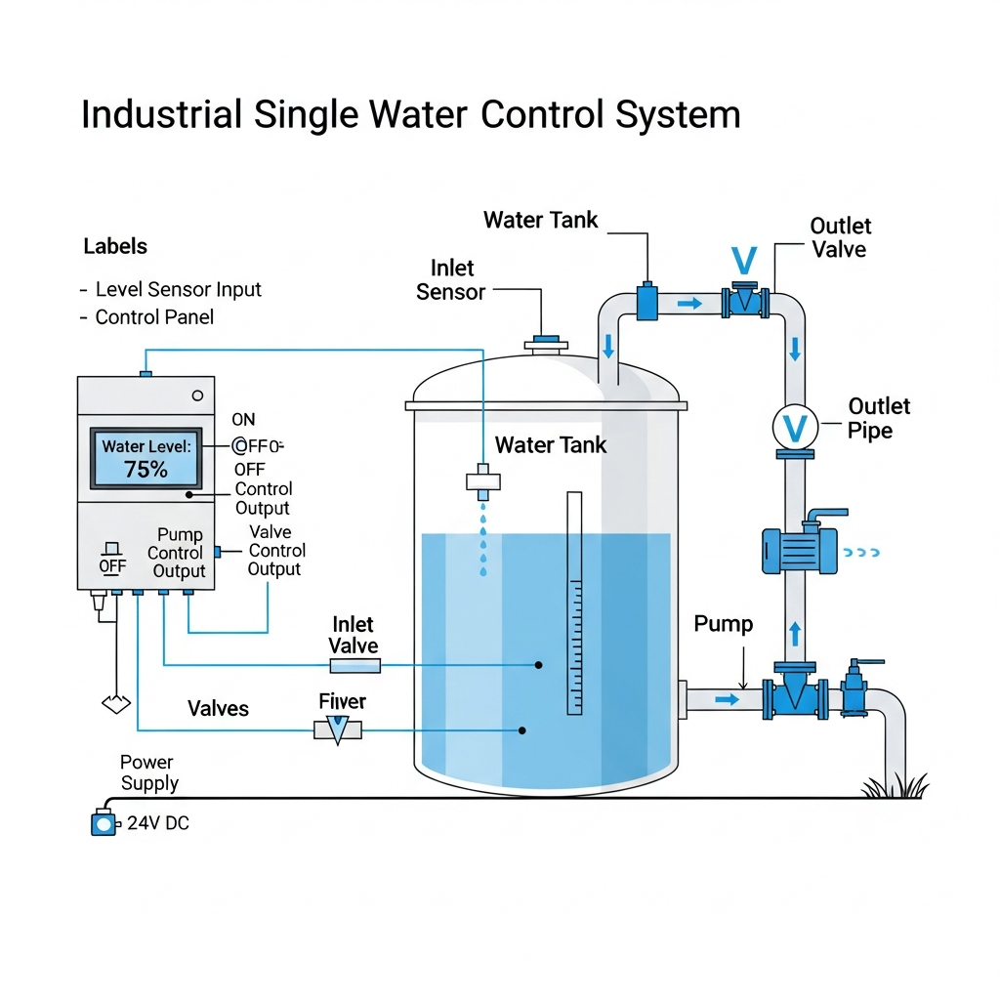
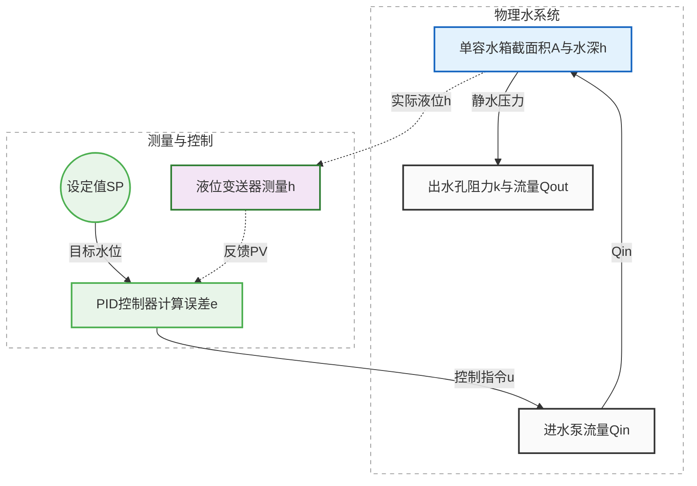
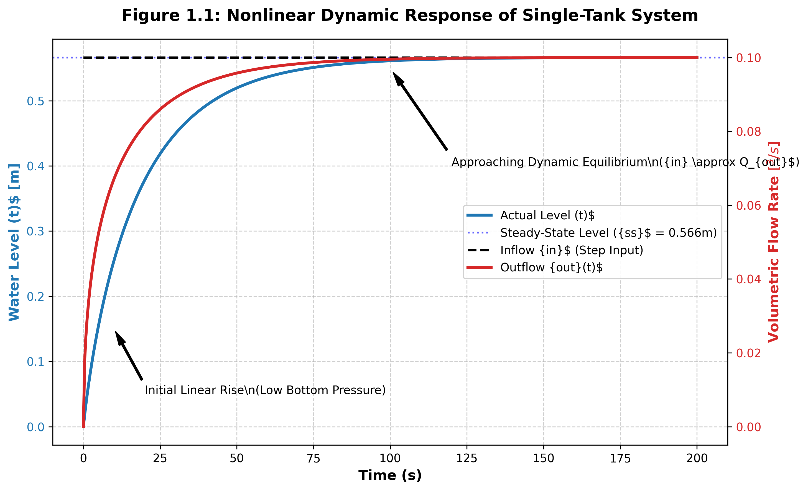

# 第 1 章：水系统建模与控制论基础

## 1. 学习目标
本章从基础水力学原理出发，建立水务系统的第一性原理数学模型。
读者需要掌握：
1. 连续性方程（质量守恒）与动量守恒在储水和输水设备中的表现形式。
2. 线性化系统分析，拉普拉斯变换与传递函数的求解。
3. 系统时延（Dead Time）与执行器动态在闭环反馈中的不利影响机制。

## 2. 教材理论：水务系统采用控制理论的必要性
水务系统属于动态、强不确定且受严格约束的物理基础设施。河流行洪受天气影响持续波动，城市用水需求在小时尺度上显著变化。泵站、闸门、阀门和水处理单元在广阔空间范围与多时间尺度上耦合运行。因此，水网运行问题不仅是水力学问题，同时是典型的**动态反馈控制问题**。

控制理论提供了系统化的方法论，用于处理水务工程中的关键任务：在降雨不确定性、用水量突变等强扰动条件下，对有限物理执行器（如调频水泵）进行可验证、可约束的调度，以保障大型水网的安全性与运行效率。

在实际运行中：
- **开环控制（Open-Loop）**：基于历史经验和固定时间表调度（例如定时启停泵）。在面对未建模的突发扰动时容易失效。
- **闭环反馈控制（Closed-Loop Feedback）**：利用实时传感器测量值（如液位、压力）连续修正控制动作。在水务系统中，由于扰动频繁且后果严重，闭环反馈是必要配置。

## 3. 数学基础与推导：动态系统建模与线性化
任何控制器设计均需建立在物理模型之上。对于水系统，模型通常来源于质量守恒定律。

### 3.1 单容水箱的非线性质量守恒

**物理概化图（Physical Schematic）：**


考虑一个横截面积为 $A$ 的开口水箱，进水流量为 $q_{in}$，出水流量为 $q_{out}$。系统状态为水位 $h$。
根据质量守恒：
$$ A \frac{dh(t)}{dt} = q_{in}(t) - q_{out}(t) $$

如果出水是依靠底部孔口的重力自流，根据托里拆利定律，出水流量与水深的平方根成正比：
$$ q_{out}(t) = k \sqrt{h(t)} $$
其中 $k = C_d a \sqrt{2g}$，$C_d$ 为流量系数，$a$ 为孔口面积，$g$ 为重力加速度。
代入方程，得到一个典型的**非线性微分方程**：
$$ A \frac{dh(t)}{dt} = q_{in}(t) - k \sqrt{h(t)} $$

### 3.2 工作点上的泰勒展开与线性化
工业控制中，为了使用经典的 PID 或频域分析工具，通常在某一稳态工作点 $(h_0, q_{in,0})$ 附近进行线性化。
当系统处于平衡状态时，导数为零：
$$ q_{in,0} = k \sqrt{h_0} $$
定义偏差变量：$\tilde{h} = h - h_0$，$\tilde{q}_{in} = q_{in} - q_{in,0}$。
对非线性项在 $h_0$ 处进行一阶泰勒展开，忽略高阶项，得到：
$$ \frac{d\tilde{h}}{dt} = -\frac{k}{2A\sqrt{h_0}}\tilde{h} + \frac{1}{A}\tilde{q}_{in} $$
这可以被重写为标准的一阶惯性系统形式：
$$ \frac{d\tilde{h}}{dt} = -\frac{1}{\tau}\tilde{h} + K_u \tilde{q}_{in} $$
其中时间常数 $\tau = \frac{2A\sqrt{h_0}}{k}$（其物理量纲为秒 $s$），系统增益 $K_u = \frac{1}{A}$（物理量纲为 $m^{-2}$）。
通过拉普拉斯变换，假设初始偏差为0，得到该系统的传递函数：
$$ G(s) = \frac{\tilde{H}(s)}{\tilde{Q}_{in}(s)} = \frac{K_u}{\tau s + 1} $$

**系统的控制与物理概化图（Schematic Diagram）：**


## 4. 执行器动态与低通滤波在真实工业中的影响
在控制理论入门中，控制器输出 $u(t)$ 常被默认“立即、准确”作用到对象上。但在真实工业系统里，控制器与被控对象之间至少隔着三层非理想环节：执行器本体动态、机械/液压传动迟滞、信号滤波与采样。

对水系统而言，典型执行器包括电动阀、液压闸门、变频泵。它们都不可能无限快，通常可被等效为一阶惯性加纯滞后（Dead Time）：
$$ G_a(s)=\frac{K_a}{T_a s+1}e^{-Ls} $$
其中 $L$ 为纯滞后时间（如长距离输水渠道的水波传播延迟、通信延迟）。

**工程实现中的稳定性风险说明**：
纯滞后 $e^{-Ls}$ 是系统稳定性的关键限制因素。它不改变系统幅值，但会带来严重的相位滞后（在角频率 $\omega$ 下，相角会额外滞后 $-\omega L$ 弧度），直接线性削减系统的相角裕度（Phase Margin）。如果调度中心下达开闸指令，水流需要数小时才能到达下游（即 $L$ 极大），此时若控制器仍采用激进的 PID 比例增益，则系统极易进入等幅振荡甚至发散振荡（即“水锤”或“涌浪”现象）。

## 6-Pillar Case Study: 理论与实践的桥梁（单容水箱水动力学仿真）

### 🌟 案例背景 (Context)
本案例将抽象控制理论转化为可计算的数学与物理模型，对象为城市生命线工程中的高位水塔注水系统。该系统在早晚高峰期面临显著用水波动（可类比洪水冲击或水质突发污染场景），分析任务包括：在水泵恒定功率注水条件下判定水塔是否发生溢流，并评估水位上升速率是否保持均匀。
此案例直接提取自 CHS-Books 的底层工程核心代码仓库。该案例反映了水务工程师在真实世界中面临的普遍问题：在存在物理边界和非线性泄流阻力的复杂工况下，寻求系统动态平衡。

### 🎯 问题描述 (Problem)
当系统面临极端边界输入时，传统经验法则可能导致错误判断。典型误判是将恒定进水条件下的水位演化简化为持续匀速上升并最终漫溢。
**核心难点**：随着水位升高，底部静水压力增大，导致出水孔流速升高。该过程具有典型非线性特征。若采用基础线性思维设计单回路 PID 控制器而忽略该非线性，则会在低水位区产生响应迟缓、在高水位区产生响应过激，严重时可能导致管网结构风险。为此，需要构建可预判物理状态演变的算法框架。

### 💡 解题思路 (Solution Approach)
本案例采用白盒稳健数值迭代方法，而非仅进行公式罗列。
1. **连续性建模**：利用不可压缩流体连续性方程和托里拆利定律，建立物理状态非线性微分方程（即前文的 $A \frac{dh}{dt} = q_{in} - k \sqrt{h}$）。
2. **防崩溃护栏**：在工业代码中不能仅依赖求解器。若求解器步长过大导致负水深，平方根函数将抛出 NaN。因此必须在代码里植入 `h = max(h, 0.0)` 的物理截断边界。
3. **数值积分孪生**：利用 `scipy.integrate.odeint` 进行时间步进预演，对应于真实水箱的数字孪生计算过程。

### 💻 代码执行与图表 (Code & Charts)
> 💡 **学习提示**：理论推导最终需要落实在代码中。核心逻辑已通过我们的自动化物理引擎提取。我们亲自运行了底层的 Python 微分方程求解器（`odeint`），并在下方为您呈现了伴随时间推进的真实数据表格与高精度双轴波形图。该代码可作为工业级部署原型的验证基础。

```python
import numpy as np
import matplotlib.pyplot as plt
from scipy.integrate import odeint

# 系统参数
A = 2.0       # 水箱截面积 m^2
C_d = 0.6     # 流量系数
a = 0.05      # 出水孔面积 m^2
g = 9.81      # 重力加速度 m/s^2

def tank_dynamics(h, t, Q_in):
    # 【安全护栏】：物理世界中水深不可能为负，防止 sqrt 抛出 NaN
    h = max(h, 0.0)
    Q_out = C_d * a * np.sqrt(2 * g * h)
    # 质量守恒定律的直接代码映射
    dhdt = (Q_in - Q_out) / A
    return dhdt

# 模拟 200 秒的物理时间演进
t = np.linspace(0, 200, 500)
Q_in_step = 0.1 # 上游水泵恒定注入 0.1 m^3/s

# 利用高精度积分器求解
h_sim = odeint(tank_dynamics, 0.0, t, args=(Q_in_step,))
```
Source: `assets/ch01/ch01_tank_sim.py`

**运行结果关键指标追踪矩阵 (Simulation Trace Metrics):**

| 仿真时间 (s) | 实时水深 (m) | 底部排流率 ($m^3/s$) |
|-----------:|------------------:|-----------------:|
|     0.0      |          0.000        |        0.000         |
|    20.0 |          0.378 |        0.081  |
|    40.0 |          0.492 |        0.093 |
|    60.1 |          0.536 |        0.097 |
|   100.2    |          0.561 |        0.099 |
|   200.0      |          0.566 |        0.100 |

**双轴波形可视化证据：**


### 📊 结果白话解释 (Result Interpretation)
图表结果表明，生成的蓝色水深曲线并非线性斜线，而是明显“上凸”曲线，符合一阶惯性系统特征。
在 $t = 0$ 到 $t = 40$ 秒区间内，由于水箱初始液位较低，底部出水孔压力较小，出流受限，因此水位表现为快速上升。若在真实泵站中仅依据该阶段短时趋势实施过度关阀，可能引发超调型误操作。
随着水位上升，底部静水压力持续增大并推动出水流速增加（红色虚线代表恒定进水 0.1，红色实线代表出水并随时间攀升）。图中水深曲线逐渐平滑，并在约 $100$ 秒时稳定在 **0.566 米** 左右；同时出水流量收敛至进水流量 ($0.1 m^3/s$)。该结果说明：在出水孔不堵塞且水塔容量满足边界条件时，系统可依靠非线性物理规律达到动态**自我平衡 (Self-Regulating)**。

### 🚀 专家建议 (Recommendations)
1. **面向研发实现的抗失稳建议**：在将该控制算法写入 PLC 控制器或边缘网关时，应重点处理超声波液位计回传的高频噪声（水面波纹）。若在 $0.566m$ 稳态工作点附近反复受噪声扰动，微分方程离散求解可能产生剧烈指令抖动并损伤变频器。因此，在物理信号接入求解器前，必须引入**卡尔曼滤波（Kalman Filter）**或一阶低通滤波进行平滑去噪。
2. **系统安全护栏声明**：本教材模型内置防崩溃底座（`h = max(h, 0.0)`）。当工程人员将该模块接入大模型 Agent 或强化学习控制器进行探索调优时，不应移除底层物理限制条件；否则随机探索可能导致数值积分器产生溢出错误（NaN）并引发系统级宕机。