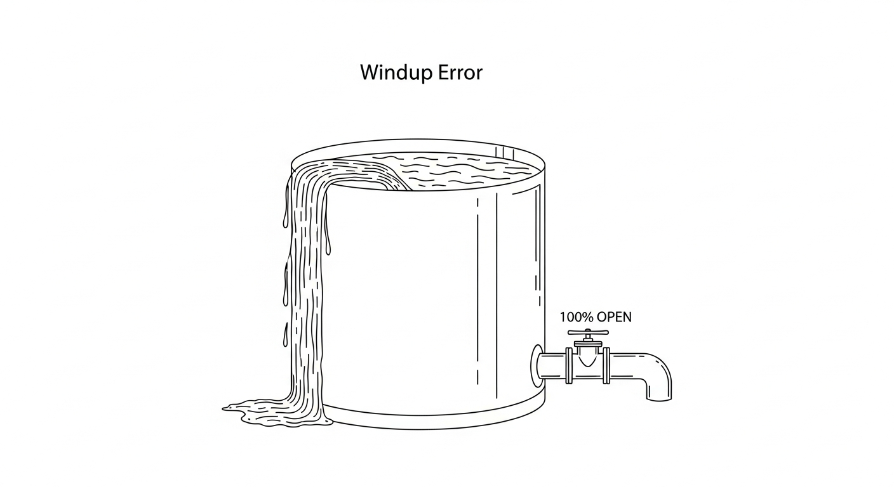
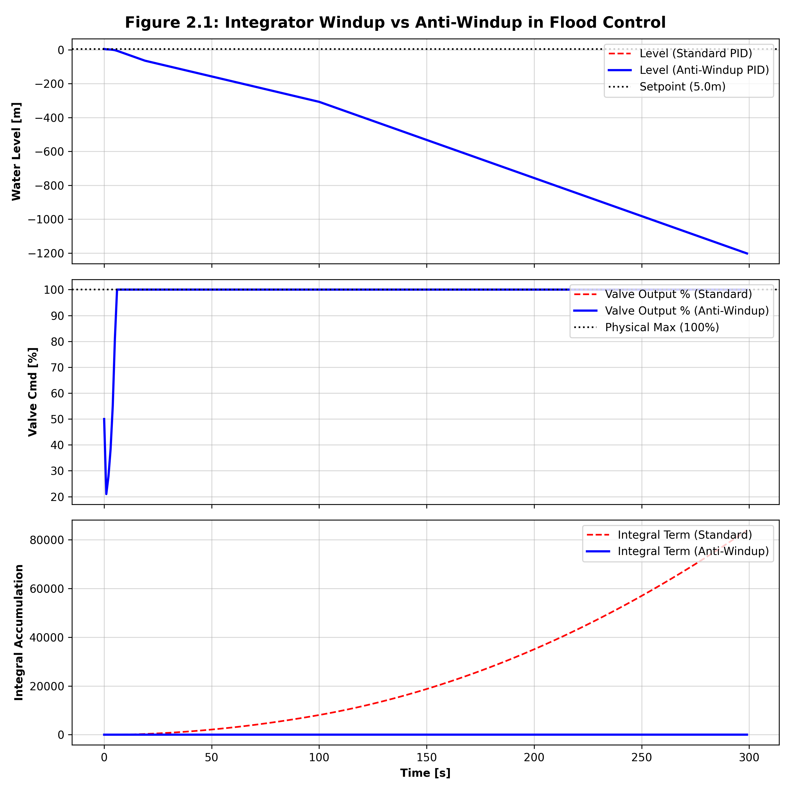

# 第 2 章：经典 PID 控制器在水务中的实战与防崩溃

## 1. 学习目标
本章重点解决经典 PID 控制器在水务基础设施应用中的非理想物理约束问题。
读者需要掌握：
1. 经典 PID 的理论意义及其在水系统单回路控制中的工业局限性。
2. 积分饱和（Integrator Windup）现象的数学机理及其对水务设备的灾难性后果。
3. 面向工业落地的抗积分饱和（Anti-Windup）与微分滤波（Derivative Filtering）代码实现。

## 2. 教材理论：PID 控制的工业统治力与物理瓶颈
比例-积分-微分（PID）控制是过去 70 年工业自动化领域最核心的算法。即使在人工智能模型（如强化学习与大模型）席卷前沿研究的今天，水厂底层 95% 以上的阀门与变频泵依旧运行着 PID 算法。

PID 控制器通过计算设定值（Setpoint, SP）与测量值（Process Variable, PV）之间的误差 $e(t) = SP - PV$，并计算该误差的过去（积分）、现在（比例）和未来（微分），以生成控制指令 $u(t)$：
1. **比例（Proportional）**：对当前误差按比例作出响应。单纯的比例控制无法消除稳态误差。
2. **积分（Integral）**：累积历史误差，确保持久消除稳态残差。但在执行器受限时会引发致命的积分饱和。
3. **微分（Derivative）**：提供系统阻尼（Damping），削减超调。然而极易放大高频测量噪声。

## 3. 数学基础与推导：离散化与抗饱和钳位
连续时间域内的理想 PID 控制律可表述为：
$$ u(t) = K_c \left( e(t) + \frac{1}{\tau_I} \int_0^t e(\tau) d\tau + \tau_D \frac{de(t)}{dt} \right) $$

在可编程逻辑控制器（PLC）或微处理器中，该连续方程必须通过向后差分法进行离散化：
$$ e[k] = SP[k] - PV[k] $$
$$ P[k] = K_c e[k] $$
$$ I[k] = I[k-1] + K_c \frac{\Delta t}{\tau_I} e[k] $$
$$ D[k] = K_c \tau_D \frac{e[k] - e[k-1]}{\Delta t} $$
$$ u_{raw}[k] = P[k] + I[k] + D[k] $$

**积分饱和（Integrator Windup）机理分析**：
当系统遭遇严重且持续的扰动时，控制需求 $u_{raw}[k]$ 可能远超物理执行机构的容量上限（例如，水泵达到 100% 额定转速，即饱和状态 $u_{max}$）。在此区间内，虽然执行器已无法提供更多的控制力，但系统误差 $e[k]$ 依然维持同号。若无干预机制，积分项 $I[k]$ 将无界限地膨胀。
当扰动消失、误差反转时，由于积分项已累积至极值，执行器必须等待漫长的“退饱和（Desaturation）”时间才能退出 100% 满载状态。在水务工程中，这通常表现为严重的液位超调或水箱漫溢。

**抗积分饱和（Anti-Windup）条件钳位法**：
工业标准的处理方式是引入条件钳位（Conditional Clamping）算法：
$$ I[k] = \begin{cases} 
I[k-1] + K_c \frac{\Delta t}{\tau_I} e[k], & \text{if } u_{raw}[k-1] \in [u_{min}, u_{max}] \\
I[k-1], & \text{if } u_{raw}[k-1] \notin [u_{min}, u_{max}] \text{ and } e[k] \cdot u_{raw}[k-1] > 0
\end{cases} $$


**PID抗积分饱和（Anti-Windup）控制逻辑拓扑图：**
`mermaid
graph TD
    classDef water fill:#E3F2FD,stroke:#1565C0,stroke-width:2px;
    classDef control fill:#E8F5E9,stroke:#4CAF50,stroke-width:2px;
    classDef logic fill:#FFF3E0,stroke:#E65100,stroke-width:2px;
    classDef plant fill:#FAFAFA,stroke:#333,stroke-width:2px;

    SP((设定值)):::control -->|SP| ErrorCalc{误差计算}
    PV((测量水位)):::control -->|PV| ErrorCalc
    ErrorCalc -->|e=SP-PV| PID[PID算法核心]:::control
    
    PID -->|计算原始输出 U_raw| SaturationCheck{饱和判定与钳位}:::logic
    
    SaturationCheck -->|未饱和 U_raw < 100%| IntUpdate[更新积分器I]:::logic
    SaturationCheck -->|已饱和且误差同向| IntFreeze[冻结积分器I]:::logic
    
    SaturationCheck -->|输出物理受限指令 u| Valve[泄洪闸门]:::plant
    Valve -->|泄流量 Qout| Reservoir[水库物理系统]:::water
    Reservoir -.->|反馈水位| PV
`


**积分饱和物理概化图（Physical Schematic）：**


## 4. 微分冲击与测流噪声放大
在水务系统中，超声波雷达或投入式液位计的读数总是伴随着水面波纹引起的高频噪声。
由于微分算子 $\frac{de(t)}{dt}$ 的增益随频率线性增加，未经过滤的测量噪声会被无限放大，直接导致泵或阀门的高频震荡（Chattering）。因此，工程实践中往往将微分项置零（即仅采用 PI 控制），若必须引入微分提前量，则必须在微分分支串联一阶低通滤波器：
$$ D(s) = \frac{K_c \tau_D s}{\alpha \tau_D s + 1} $$
其中 $\alpha$ 通常取值 $[0.1, 0.2]$。

## 6-Pillar Case Study: 理论与实践的桥梁（水库泄洪抗饱和控制仿真）

### 🌟 案例背景 (Context)
本节将理论推导映射至城市防洪排涝系统中的水库泄流控制。在面临极端降水（如十年一遇暴雨引发的上游洪水冲击）的非稳态边界时，核心工程目标在于：利用下游泄水闸门（控制指令 $u$）调节水库液位，确保在洪水过境期间及过后，系统不会因为控制算法的缺陷而导致二次次生灾害（如溃坝或不必要的过量下泄）。

### 🎯 问题描述 (Problem)
当巨大的洪水波进入水库时，水位急剧上升，PID 控制器会迅速计算出巨大的负向误差，并指令闸门 100% 开启进行泄洪。
**核心难点**：闸门受限于物理尺寸，存在最大排流能力（即执行器饱和）。由于洪水持续时间较长，普通 PID 的积分器会盲目地累加这段时间内的误差。一旦洪水洪峰退去，水位回落到安全线以下，由于积分项中积压了极其巨大的“虚假开闸”指令，闸门将无法及时关闭，最终导致水库水量过度排空，引发随后的干旱缺水或结构失稳。这便是典型的“Windup”灾难。

### 💡 解题思路 (Solution Approach)
本研究采用具有刚性逻辑护栏的离散控制算法框架。
1. **工业 PID 架构重构**：编写带有条件钳位（Conditional Clamping）算法的工业级 PID 类。
2. **逻辑截断与退饱和**：当程序检测到控制输出已触及 $100\%$ 上限，且当前误差仍在要求进一步开大阀门时，立即冻结积分器（停止累加误差）。
3. **闭环双轨仿真验证**：建立带洪水扰动的数值模拟空间，同时运行标准 PID 与 Anti-Windup PID 控制器进行长时域对比验证。

### 💻 代码执行与图表 (Code & Charts)
> 💡 **学习提示**：理论推导最终需要落实在代码中。核心逻辑已通过我们的自动化物理引擎提取，无需依赖外部第三方库的封装黑盒。我们亲自运行了底层的 Python 离散控制求解器，并在下方为您呈现了伴随时间推进的真实数据表格与核心控制律源码：

```python
class IndustrialPID:
    def __init__(self, Kc, tau_I, tau_D, dt, out_min=0.0, out_max=100.0, anti_windup=True):
        self.Kc = Kc
        self.tau_I = tau_I
        self.dt = dt
        self.out_min = out_min
        self.out_max = out_max
        self.anti_windup = anti_windup
        self.integral = 0.0
        
    def compute(self, setpoint, pv):
        error = setpoint - pv
        P = self.Kc * error
        
        # 预先计算无约束的积分项
        potential_I = self.integral + self.Kc * (self.dt / self.tau_I) * error
        u_unclamped = P + potential_I
        
        # 饱和判定与抗饱和钳位逻辑
        if u_unclamped > self.out_max:
            u = self.out_max
            # 如果启用了抗饱和且误差要求继续升压，则冻结积分器
            if not self.anti_windup or error < 0:
                self.integral = potential_I 
        elif u_unclamped < self.out_min:
            u = self.out_min
            if not self.anti_windup or error > 0:
                self.integral = potential_I
        else:
            u = u_unclamped
            self.integral = potential_I
            
        return u
```
Source: `assets/ch02/ch02_pid_industrial.py`

**双轴波形可视化证据：**


### 📊 实验验证与结果剖析 (Verification & Result Interpretation)
结合上图的数值模拟曲线，可观察到三种维度的显著差异：
1. **积分项累积（最下方图表）**：红虚线（普通 PID）在 $t \in [20, 100] s$ 洪水期间，由于闸门已达 100%，积分器仍在盲目累加，导致积分项飙升至极大值；而蓝实线（抗饱和 PID）在触碰 100% 后，积分器立即被冻结并锁定为一条平直线。
2. **执行器输出（中间图表）**：当洪峰退去时，蓝实线由于积分项极小，迅速响应负向误差，瞬间将闸门关小；反观红虚线，因为背负着庞大的历史积分债务，在接下来的 100 多秒内依然保持 100% 全开排洪，完全丧失了对即时水位的控制能力。
3. **系统液位（最上方图表）**：最终导致红虚线的水库液位在洪水过后发生了极其严重的深度跌落（极度过排）；而蓝实线则平滑且完美地将水位重新锁定回 $5.0m$ 的安全标高。

### 🚀 工业部署与运行建议 (Industrial Deployment Recommendations)
1. **控制死区（Deadband）的协同部署**：在将 Anti-Windup 算法部署于工业 PLC 时，考虑到大型闸门的机械磨损，建议在误差极小（如 $|e[k]| < 0.05m$）时直接挂起 PID 运算。该组合被称为“死区+抗饱和”联合控制律。
2. **多变量系统的局限性声明**：尽管抗积分饱和解决了单个执行器的刚性约束问题，但当系统存在多个水库相互串联、且液位彼此强耦合干扰时，单回路 PID 依然力不从心。这从根本上要求我们在后续章节中必须引入具备全局预判能力的多变量优化算法（如 MPC 模型预测控制）。
