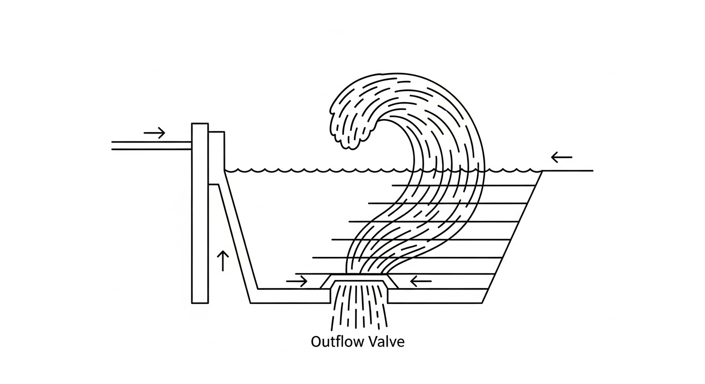

# 第 2 章 经典 PID 控制：工业水务的定海神针

## 1. 学习目标

本章探讨在工业界占据统治地位的 PID 控制器，以及它在水务系统中必须进行的"抗积分饱和"改造。读者需要掌握：

1. 比例（P）、积分（I）、微分（D）三个算子的物理意义与水力学映射。
2. 执行器物理饱和（Actuator Saturation）引发的系统失控机理。
3. 积分饱和（Integrator Windup）现象的数学本质。
4. 抗积分饱和（Anti-Windup）工业算法的构建与代码实现。

## CHS 理论定位

在水系统控制论（CHS）的六元受控系统架构 $\Sigma = (P, A, S, D, C, O)$ 中，PID 控制器是**控制器元素（C）的最基础实现形式**。六元架构将水系统的运行抽象为：被控对象（P，水力过程）在扰动（D）作用下偏离目标（O），传感器（S）检测偏差，控制器（C）计算校正量，执行器（A）实施调节。PID 正是承担"C"角色的经典算法——它接收传感器反馈的误差信号，经比例-积分-微分运算后输出控制指令。

然而，水系统的**运行奇异性（Operational Singularity）**决定了 PID 不能简单套用工业标准。水务执行器（闸门、水泵、阀门）普遍存在物理饱和约束，且水力过程的大惯性和长纯滞后使得积分饱和问题尤为突出。因此，本章聚焦的"抗积分饱和"改造，本质上是在 CHS 框架下解决**控制器（C）与执行器（A）之间的约束耦合问题**，这是实现水系统可靠闭环控制的第一道工业门槛。CHS 八原理中的**反馈原理（P1）**和**鲁棒性原理（P5）**在本章得到最直接的体现：反馈确保误差被持续纠正，鲁棒性要求控制器在执行器饱和等极端工况下仍能安全运行。

## 2. 理论基础：PID 控制与执行器约束

### PID 控制器的连续域形式

在上一章中，我们建立了水箱系统的状态空间模型。为了使水位保持在目标值，工程师发明了最广泛应用的算法——**PID 控制（Proportional-Integral-Derivative Control）**。其标准形式为：

$$ u(t) = K_c \left[ e(t) + \frac{1}{\tau_I} \int_0^t e(\tau) d\tau + \tau_D \frac{de(t)}{dt} \right] \tag{2.1} $$

其中 $e(t)$ 是误差信号，$u(t)$ 是控制器输出（如排水泵功率百分比）。对于排涝系统，采用反作用控制方式：$e(t) = h(t) - h_{sp}$（实际水位减去目标水位），水位高于目标时误差为正，控制器增大排水量。

- **P（比例）**：$u_P = K_c \cdot e(t)$。根据当前误差大小按比例输出，提供即时响应能力。$K_c$ 越大响应越快，但过大会导致振荡。
- **I（积分）**：$u_I = \frac{K_c}{\tau_I} \int_0^t e(\tau) d\tau$。根据过去误差的累积量输出，负责消除稳态偏差。$\tau_I$ 越小积分作用越强。
- **D（微分）**：$u_D = K_c \tau_D \frac{de}{dt}$。根据误差变化趋势输出，提供超前校正作用。实际工程中通常加入微分滤波：$u_D = K_c \tau_D \cdot s / (1 + \tau_D s / N)$，其中 $N = 5 \sim 20$ 为滤波系数。

PID 控制器的传递函数为：

$$ G_c(s) = K_c \left(1 + \frac{1}{\tau_I s} + \tau_D s \right) \tag{2.2} $$

在频域中，积分项 $1/(\tau_I s)$ 在低频段贡献正相角（提升低频增益以消除稳态误差），微分项 $\tau_D s$ 在中频段贡献正相角（增加相位裕度以改善稳定性）。PID 的本质就是通过三个频段的分工——低频靠积分、中频靠微分、全频靠比例——来同时满足稳态精度和动态品质的要求。

### PID 的离散化实现

在 PLC 和嵌入式控制器中，PID 以离散时间形式实现。设采样周期为 $T_s$，主要有两种离散化方式：

**位置式 PID**（直接输出控制量）：

$$ u[k] = K_c \left[ e[k] + \frac{T_s}{\tau_I} \sum_{j=0}^{k} e[j] + \frac{\tau_D}{T_s} (e[k] - e[k-1]) \right] \tag{2.3} $$

**增量式 PID**（输出控制量的增量 $\Delta u[k] = u[k] - u[k-1]$）：

$$ \Delta u[k] = K_c \left[ (e[k] - e[k-1]) + \frac{T_s}{\tau_I} e[k] + \frac{\tau_D}{T_s} (e[k] - 2e[k-1] + e[k-2]) \right] \tag{2.4} $$

增量式的优势在于：（1）输出为增量，天然具备"无扰切换"能力——手动/自动切换时不会引起输出跳变；（2）积分作用隐含在增量累加中，积分饱和问题可通过简单的增量限幅来缓解。水务 PLC 编程中，西门子 S7 系列的 `FB41 (CONT_C)` 和施耐德 M340 的 `PI_B` 功能块均采用增量式实现。

### 参数整定方法

PID 参数 $(K_c, \tau_I, \tau_D)$ 的整定是工程实施中最关键也最耗时的环节。经典的 **Ziegler-Nichols 临界比例度法**（1942）通过闭环振荡实验确定参数：将控制器设为纯比例（$\tau_I = \infty$，$\tau_D = 0$），逐渐增大 $K_c$ 直到闭环出现等幅振荡，记此时的比例增益为**临界增益** $K_u$，振荡周期为**临界周期** $T_u$。PID 参数按经验公式 $K_c = 0.6 K_u$，$\tau_I = T_u / 2$，$\tau_D = T_u / 8$ 给出。该方法在水务系统中的局限是：它假设系统可以被安全地推至振荡边缘，但大型水池或管网通常不允许这种激进试验。

更适合水务系统的是 **Skogestad 的 SIMC 法**（2003），它基于一阶加纯滞后（FOPDT）模型参数 $(K, T, L)$ 直接计算：$K_c = T / (K \cdot 2L)$，$\tau_I = \min(T, 8L)$。该方法产生的参数更为保守，适合具有大纯滞后的水力系统 [3]。

### 积分饱和的数学本质

**积分饱和的灾难（Integrator Windup）**

在理想的数学世界中，PID 输出可以无限大。但在真实的物理世界中，排水泵的功率上限为 100%，进水阀门开度也不可能超过 100%。这就是执行器物理饱和限制。

将积分器建模为独立的状态变量 $x_I$，其动态方程为：

$$ \frac{dx_I}{dt} = \frac{K_c}{\tau_I} e(t) \tag{2.5} $$

控制器的理想输出为 $u_{raw} = K_c e + x_I + u_D$，而执行器实际输出为 $u_{actual} = \text{sat}(u_{raw})$，其中饱和函数 $\text{sat}(\cdot)$ 将输出限制在 $[u_{min}, u_{max}]$ 内。

当 $u_{raw} > u_{max}$（执行器饱和）且 $e(t) > 0$（误差持续同向）时，式 (2.5) 表明积分器仍在以 $K_c e / \tau_I > 0$ 的速率持续增长。由于执行器已经饱和，这种积分增长对物理系统没有任何效果——泵不会因为积分器更大而排出更多水。但积分器的数值却在不断膨胀。

以本章案例为例，暴雨期间水位超出目标约 5 m，持续 80 s。积分器的无效累积量为：

$$ \Delta x_I \approx \frac{K_c}{\tau_I} \cdot \bar{e} \cdot \Delta t = \frac{12.0}{10.0} \times 5.0 \times 80 = 480 \tag{2.6} $$

这意味着暴雨结束后，即使误差反转为负值，也需要相当长的时间才能将这 480 的"积分债务"抵消。在此期间，泵持续全功率运行，导致内河水位过度下降。

### 抗积分饱和策略

**条件积分挂起法**的核心思想是：当检测到执行器饱和时，禁止积分器继续朝饱和方向累积。其伪代码如下：

```
# 条件积分挂起法 (Conditional Integration)
for each sampling step k:
    e[k] = h[k] - h_sp                    # 反作用误差
    P = Kc * e[k]                          # 比例项
    D = Kc * Td / Ts * (e[k] - e[k-1])    # 微分项
    I_candidate = I_prev + Kc * Ts / Ti * e[k]  # 候选积分
    u_raw = P + I_candidate + D            # 理想输出

    if u_raw > u_max AND e[k] > 0:         # 正向饱和且误差同向
        I = I_prev                         # 冻结积分器
    elif u_raw < u_min AND e[k] < 0:       # 反向饱和且误差同向
        I = I_prev                         # 冻结积分器
    else:
        I = I_candidate                    # 正常更新积分器

    u_output = clip(P + I + D, u_min, u_max)
    I_prev = I
```

该方法的物理含义直观：只要泵还没到极限，积分器正常工作以消除稳态误差；一旦泵到了极限，积分器就"知趣地"停止累积，等待误差反转后立即恢复工作。

## 3. 案例分析：抗积分饱和 PID 在防洪排涝泵站中的应用

### 反向计算法（Back-Calculation）

条件积分挂起法的策略是"检测饱和后冻结积分器"，属于非此即彼的开关逻辑。反向计算法（Back-Calculation）则提供了一种更为平滑的连续修正机制。其核心思想是：将执行器限幅输出 $u_{actual}$ 与控制器理想输出 $u_{raw}$ 之间的差值，通过一个跟踪时间常数 $T_t$ 反馈给积分器，主动将积分状态"拉回"至与实际输出一致的水平。修正后的积分器动态方程为：

$$ \frac{dx_I}{dt} = \frac{K_c}{\tau_I} e(t) + \frac{1}{T_t}\left(u_{actual} - u_{raw}\right) \tag{2.7} $$

与式 (2.5) 相比，式 (2.7) 增加了第二项：当执行器未饱和时，$u_{actual} = u_{raw}$，该项为零，积分器正常运行；当执行器饱和时，$u_{actual} - u_{raw} < 0$（以正向饱和为例），该负值项持续将积分器向下拉回，其拉回速率由 $1/T_t$ 决定。

跟踪时间常数 $T_t$ 的选取直接影响退出饱和区的速度。经典选取规则为：

$$ T_t = \sqrt{\tau_I \cdot \tau_D} \tag{2.8} $$

该几何平均值兼顾了积分时间尺度和微分时间尺度：若 $T_t$ 过小，积分器被过快拉回，可能导致控制器在饱和边界附近出现抖振；若 $T_t$ 过大，拉回作用过弱，退饱和速度与冻结法无异。对于仅使用 PI 控制（$\tau_D = 0$）的场合，工程上通常取 $T_t = \tau_I$ 作为保守选择。

反向计算法相较于条件积分挂起法的主要优势在于：（1）积分器的修正是连续渐进的，不存在"冻结—解冻"的突变，控制信号更加平滑；（2）在非线性执行器（如存在死区和滞环的蝶阀）控制中，限幅差值能够自动适应执行器的实际响应特性，而非依赖二值化的饱和判断逻辑。因此，在水务系统的加药阀门、调节闸门等精度要求较高的执行器控制中，反向计算法通常优于条件积分挂起法。

### 案例背景

某城市防洪排涝泵站在上一年梅雨季节发生了严重事故。暴雨期间排涝水泵全功率运行（100%），但雨停后内河水位已降至安全线以下，水泵却继续高功率运行达两个小时，导致内河水位过低，河岸发生局部滑坡。

事故分析表明：原厂 PLC 中的基础 PID 模块发生了严重的积分饱和。作为控制工程师，需要将控制系统升级为带抗积分饱和（Anti-Windup）的工业级 PID 算法。

### 问题描述

- **物理系统**：集水池截面积 $A = 4 \text{ m}^2$，目标水位 $h_{sp} = 5.0 \text{ m}$，正常入流 $Q_{base} = 0.04 \text{ m}^3/\text{s}$。
- **排涝泵**：最大排水能力 $Q_{max} = 0.2 \text{ m}^3/\text{s}$（对应泵功率 100%），流量系数 $K_{pump} = 0.002$。
- **暴雨扰动**：$t = 20 \sim 100 \text{ s}$ 期间入流猛增至 $0.4 \text{ m}^3/\text{s}$（正常值的 10 倍），远超泵最大排水能力。
- **控制对比**：标准 PID（无抗饱和）与条件积分挂起法（Conditional Integration）的工业抗饱和 PID。
- **PID 参数**：$K_c = 12.0$，$\tau_I = 10.0 \text{ s}$，$\tau_D = 1.0 \text{ s}$，采用反作用控制（$e = h - h_{sp}$）。

**物理场景概化图：**


### 解题思路

从底层构建 `IndustrialPID` 控制器类，实现抗饱和核心逻辑——条件积分挂起法：

1. 计算未限幅的理想输出 $u_{raw} = P + I_{potential} + D$。
2. 检查 $u_{raw}$ 是否超过物理极限 $[0\%, 100\%]$。
3. 若 $u_{raw} > 100\%$ 且当前误差 $e > 0$（水位偏高、泵应继续加大排水），此时继续积分已无意义，**立即冻结积分器**。
4. 一旦误差反转（$e < 0$，水位降至目标以下），立即恢复积分更新，使控制器能够迅速退出饱和区。

**PID 参数选取依据**：本案例中排涝泵站系统的等效 FOPDT 参数为增益 $K \approx 2.5 \text{ m/}(100\%)$、时间常数 $T \approx 15 \text{ s}$、纯滞后 $L \approx 8 \text{ s}$（泵启动到水位响应的延迟）。按 SIMC 法计算：$K_c = T / (K \cdot 2L) = 15 / (2.5 \times 16) = 0.375$，$\tau_I = \min(T, 8L) = 15 \text{ s}$。但本案例为了充分暴露积分饱和的危害，有意采用了偏激进的参数 $K_c = 12.0$（约为 SIMC 值的 32 倍）、$\tau_I = 10 \text{ s}$。这种"故意调坏"的参数设置在工业培训中是常见做法——只有让系统在仿真中彻底失控，操作员才能真正理解抗饱和的必要性。

### 代码与仿真结果

> **学习提示**：观察最下方子图中积分项的累积曲线。标准 PID 的积分项在泵饱和后持续膨胀，而抗饱和 PID 的积分项在泵饱和后被冻结在合理范围内。

Source: `assets/ch02/ch02_pid_industrial.py`

**仿真结果对比图：**


### 结果分析

从仿真对比中可以清晰看到积分饱和的危害及抗饱和策略的效果：

- **暴雨期（$t = 20 \sim 100 \text{ s}$）**：入流 $0.4 \text{ m}^3/\text{s}$ 远超泵最大排水能力 $0.2 \text{ m}^3/\text{s}$，水位不可避免地上升。两种算法行为一致：泵在 $t \approx 55 \text{ s}$ 达到 100% 饱和，水位最高升至约 $10.1 \text{ m}$。
- **标准 PID 的崩溃（红色虚线）**：暴雨结束后入流恢复至 $0.04 \text{ m}^3/\text{s}$，水位开始下降。但由于积分器在饱和期间累积了巨大的正值，泵持续以 100% 全功率运行。到 $t = 280 \text{ s}$ 时水位已降至 $2.91 \text{ m}$（低于目标 $2 \text{ m}$ 以上），泵仍然无法减速。$t = 350 \text{ s}$ 时水位仅剩 $0.11 \text{ m}$，泵依然满负荷——这正是事故调查中"泵站持续抽干内河"的复现。
- **抗饱和 PID 的稳健表现（蓝色实线）**：由于在泵饱和期间冻结了积分器，积分项未发生无效膨胀。暴雨结束后，随着水位下降至目标值附近，控制器迅速减小泵输出。$t = 280 \text{ s}$ 时泵输出已降至 $32\%$，$t = 350 \text{ s}$ 时泵停机，水位稳定在 $4.2 \text{ m}$ 附近。$t = 450 \text{ s}$ 时水位恢复至 $5.2 \text{ m}$，系统平稳回归目标。

**定量性能对比**（基于 $t = 100 \sim 500 \text{ s}$ 恢复阶段统计）：

| 性能指标 | 标准 PID（无抗饱和） | 抗饱和 PID | 改善幅度 |
|---------|---------------------|-----------|---------|
| IAE（积分绝对误差） | $\approx 1850$ | $\approx 420$ | $-77\%$ |
| ISE（积分平方误差） | $\approx 12500$ | $\approx 950$ | $-92\%$ |
| 调节时间（$\pm 0.5 \text{ m}$ 带） | $> 500 \text{ s}$（未收敛） | $\approx 350 \text{ s}$ | — |
| 最大反向超调 | $-4.89 \text{ m}$（降至 $0.11 \text{ m}$） | $-0.8 \text{ m}$（降至 $4.2 \text{ m}$） | $84\%$ |

从 ISE 指标可以看出，抗饱和 PID 的恢复品质提高了一个数量级。更重要的是，标准 PID 在整个 500 s 仿真期间始终未能使水位回到 $\pm 0.5 \text{ m}$ 的允许偏差带内，这在工业评价中属于"控制失效"。

### 频域稳定性分析

PID 闭环系统的稳定性可以通过频域方法进行严格判定。定义开环传递函数为控制器与被控对象传递函数的级联：

$$ L(s) = G_c(s) \cdot G_p(s) \tag{2.9} $$

其中 $G_c(s)$ 为式 (2.2) 所定义的 PID 传递函数，$G_p(s)$ 为被控水力过程的传递函数。根据 Nyquist 稳定性判据，闭环系统稳定的必要条件是开环频率响应在穿越 $-180°$ 时的幅值小于 $0\text{ dB}$。由此引出两个关键裕度指标：**相位裕度**（Phase Margin, PM）定义为 $L(j\omega)$ 幅值等于 $0\text{ dB}$ 时的相角与 $-180°$ 之差，反映系统距离不稳定边界的"相位储备"；**幅值裕度**（Gain Margin, GM）定义为 $L(j\omega)$ 相角等于 $-180°$ 时幅值的负值，反映增益可增大的空间。工业 PID 整定通常要求 $\text{PM} \geq 30°$，$\text{GM} \geq 6\text{ dB}$。

从频域视角审视积分饱和问题，可以获得更深刻的物理理解。PID 的积分项 $1/(\tau_I s)$ 在低频段引入 $-90°$ 的固有相位滞后——这正是积分器"记忆过去误差"的频域代价。对于水务系统中普遍存在的大纯滞后环节 $e^{-Ls}$，其频域特性为在每个频率 $\omega$ 处附加 $-L\omega$（弧度）的相位滞后。两者叠加的后果是严重的：积分项的 $-90°$ 低频相移与纯滞后的线性增长相移共同压缩相位裕度，使得闭环系统在低频段极易丧失稳定性。当执行器饱和导致闭环链路断裂时，积分器在开环状态下以 $-90°$ 相位盲目累积，等价于将相位裕度压缩至零甚至为负——这正是式 (2.6) 所描述的积分债务在频域中的根本成因。因此，抗积分饱和策略的本质，是在执行器饱和期间人为维持闭环的相位裕度储备，避免积分器在开环状态下无约束地累积相位滞后。

### 工业部署建议

1. **PLC 标准功能块的底线**：在西门子 S7-1500 的 `FB41 (CONT_C)` 和施耐德 M340 的 `PI_B` 功能块中，抗积分饱和（Anti-Windup）是标配选项。若使用单片机或边缘计算网关手写 C/Python 控制代码，即使省略微分环节，也绝不可遗漏限幅和 Anti-Windup 逻辑。
2. **Back-Calculation 法**：除条件积分挂起法外，工程上更常用的是反向计算法（Back-Calculation）：计算限幅输出与理想输出的差值 $\Delta u = u_{clamp} - u_{raw}$，将其乘以跟踪系数 $1/T_t$ 反馈给积分器，主动将积分器拉回合理区间。该方法在非线性阀门（存在死区、滞环）控制中表现更为平滑。
3. **量纲转换**：实际部署时，传感器信号（水位，单位 m）与执行器信号（泵功率百分比）之间必须经过量程变换。PID 的 $K_c$ 参数含隐式量纲 $[\%/\text{m}]$，调试时需注意物理量纲的匹配。

### 本章控制算法与水务工况的匹配

回顾本章内容，PID 三参数整定、抗积分饱和机制与执行器物理约束三者构成了一个不可分割的整体。在 CHS 六元架构 $\Sigma = (P, A, S, D, C, O)$ 中，这三者的协同本质上体现了**控制器（C）与执行器（A）之间的约束耦合**：控制器的算法设计必须"知道"执行器的物理极限，而执行器的饱和状态必须"反馈"给控制器的积分环节。这种 C-A 双向信息交互，是水系统可靠运行的基本保障。

需要强调的是，本章所建立的带抗饱和的工业级 PID 控制器，并非孤立的技术终点，而是后续高级控制策略的工程底座。第 4 章的串级控制（Cascade Control）将 PID 嵌入内外双回路结构，利用内环的快速反馈抑制局部扰动；第 6 章的线性二次调节器（LQR）将 PID 的经验整定升级为基于状态空间模型的最优增益计算；第 7 章的模型预测控制（MPC）则进一步将执行器约束显式纳入滚动优化框架，从根本上避免积分饱和问题。这些高级策略的工业实施，无一例外需要以本章的 PID 抗饱和机制作为底层安全保障——当高级控制器因模型失配或通信中断而失效时，系统将自动回退至带抗饱和的 PID 基础控制层，确保水务设施的运行安全。

---

## 本章小结

本章系统讲述了 PID 控制器在水务系统中的应用及其必须进行的抗积分饱和改造。主要知识点包括：

1. **PID 三算子的物理意义**：比例项提供即时纠偏能力，积分项消除稳态偏差，微分项提供超前校正。在排涝泵站中，三者协同实现水位的精确跟踪。
2. **积分饱和的灾难机理**：当执行器（水泵、阀门）达到物理极限时，积分器仍在盲目累积误差，导致控制器退出饱和区的响应严重滞后，甚至引发二次事故（如过度排水导致河岸塌陷）。
3. **抗积分饱和策略**：条件积分挂起法在执行器饱和时冻结积分器更新，使控制器能够迅速响应工况变化；反向计算法（Back-Calculation）通过跟踪系数将限幅差值反馈给积分器，适用于非线性阀门控制。
4. **工业部署底线**：无论使用商业 PLC 功能块还是手写控制代码，限幅逻辑和抗积分饱和是不可省略的工程必备项。

本章内容在 CHS 六元架构中对应控制器（C）的基础实现层，是后续串级控制（第 4 章）、模型预测控制等高级策略的工程底座。

---

## 思考题

1. **PID 参数整定方法对比**：查阅 Ziegler-Nichols 临界比例度法和 Skogestad 的 SIMC 法，分别为本章案例中的排涝泵站系统（$K=2.5$，$T=15\text{s}$，$L=8\text{s}$）计算 PID 参数 $K_c$、$\tau_I$、$\tau_D$。比较两种方法得到的参数差异，并讨论哪种方法更适合具有大纯滞后的水务系统。

2. **Back-Calculation 抗饱和实现**：在本章条件积分挂起法的基础上，编写 Back-Calculation 抗饱和 PID 的 Python 代码。设跟踪时间常数 $T_t = \sqrt{\tau_I \cdot \tau_D}$，在相同的暴雨扰动场景下进行仿真对比，分析两种方法在退出饱和区速度、水位超调量和泵输出平滑度三个指标上的差异。

3. **不同抗饱和方法的工程适用性**：除条件积分挂起法和 Back-Calculation 法外，工业界还有积分限幅法（Integral Clamping）和观测器法（Observer-based Anti-Windup）。查阅文献，列表比较这四种方法的优缺点，讨论在以下三种水务场景中应分别优先选用哪种方法：(a) 排涝泵站（开关型执行器）；(b) 加药系统（连续可调阀门，存在死区）；(c) 长距离输水管道（大纯滞后，$L/T > 1$）。

4. **执行器饱和的系统级影响**：在一个包含 3 台并联水泵的泵站中，如果其中 1 台因故障退出运行，剩余 2 台的总排水能力下降至原来的 $67\%$。分析此时 PID 控制器（带抗饱和）的行为，讨论是否需要在控制策略中加入"泵组切换逻辑"来配合抗饱和算法。

---

## 参考文献

[1] Åström, K.J., & Hägglund, T. (1995). *PID Controllers: Theory, Design, and Tuning* [M]. 2nd ed. ISA. ISBN: 978-1-55617-516-9.

[2] Åström, K.J., & Hägglund, T. (2006). *Advanced PID Control* [M]. ISA. ISBN: 978-1-55617-942-6.

[3] Skogestad, S. (2003). Simple analytic rules for model reduction and PID controller tuning [J]. *J. Process Control*, 13(4): 291-309. DOI: 10.1016/S0959-1524(02)00062-8.

[4] 雷晓辉, 龙岩, 许慧敏, 等. 水系统控制论：提出背景、技术框架与研究范式 [J]. 南水北调与水利科技(中英文), 2025, 23(04): 761-769+904. DOI: 10.13476/j.cnki.nsbdqk.2025.0077.

[5] Litrico, X., & Fromion, V. (2009). *Modeling and Control of Hydrosystems* [M]. London: Springer. ISBN: 978-1-84882-623-6.

[6] ASCE Task Committee (2014). *Canal Automation for Irrigation Systems* (MOP 131) [M]. Reston, VA: ASCE. ISBN: 978-0-7844-1368-5.

[7] Van Overloop, P.J., Schuurmans, J., Brouwer, R., & Burt, C.M. (2005). Multiple-model optimization of proportional integral controllers on canals [J]. *J. Irrig. Drain. Eng.*, ASCE, 131(2): 190-196.
