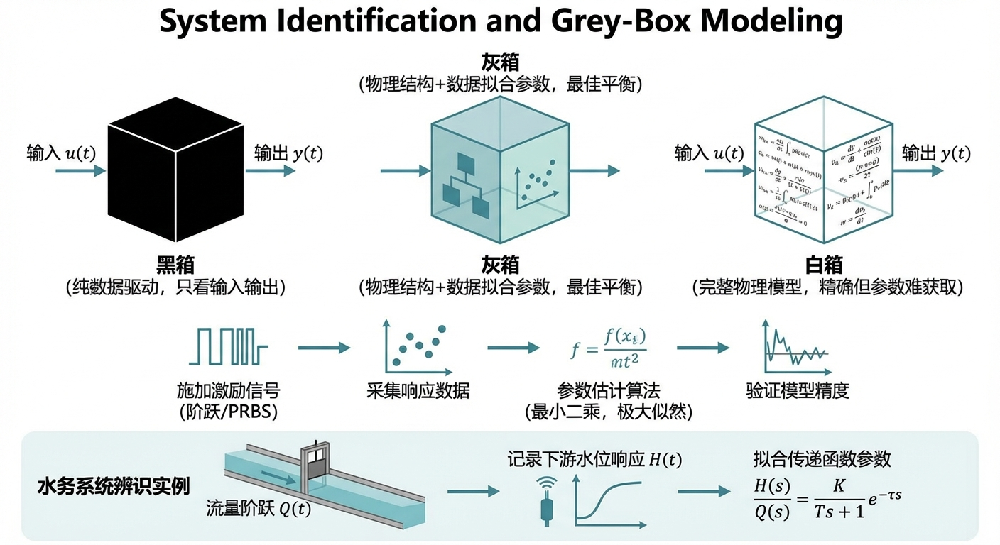

# 第 3 章 系统辨识与灰盒建模

## 1. 学习目标
本章探讨当工业现场缺乏精确的物理图纸或水力学参数时，如何利用数据驱动的方法“反推”出可用于控制的数学模型。
读者需要掌握：
1. 白盒、黑盒与灰盒建模的区别与工业应用场景。
2. 工业界最常用的控制对象降阶模型：一阶惯性加纯滞后系统（FOPDT）。
3. 阶跃响应测试（Step Response Experiment）在控制工程中的核心地位。
4. 系统辨识（System Identification）中最小二乘法与非线性优化（Nelder-Mead）的应用。

## CHS 理论定位

在水系统控制论（CHS）的统一模型层级中，FOPDT 模型属于**第四层级（Level iv：纯积分/一阶惯性模型）**，是 CHS 统一传递函数族（Unified Transfer Function Family）的工程简化形态。CHS 理论证明：无论水系统多么复杂，在工作点附近都可以通过逐级降阶——从线性化 Saint-Venant 方程（Level i）到 IDZ 传递函数（Level ii）再到积分延迟模型（Level iii）——最终收敛到仅含 $K$、$T$、$L$ 三个参数的 FOPDT 结构。

系统辨识在 CHS 六元架构 $\Sigma = (P, A, S, D, C, O)$ 中的角色是：**为被控对象（P）建立可用于控制器（C）设计的数学描述**。当物理白盒建模因参数缺失而无法进行时，灰盒辨识成为唯一的工程出路。CHS 八原理中的**降阶原理（P3：Order Reduction）**直接指导了本章的方法论——不追求无限精细的物理模型，而是辨识出"刚好足够精确"的低阶模型，使其在目标控制层级的时间尺度内保持有效。同时，**自适应原理（P7：Adaptation）**要求辨识不是一次性工作，而是通过在线递归算法持续跟踪参数漂移，为自适应控制提供基础。

## 2. 理论基础：数据驱动的系统建模
在第 1 章中，我们根据质量守恒定律和伯努利方程，一步步推导出了水箱系统的微分方程。这在控制论中被称为**白盒建模（White-Box Modeling）**。
然而，在真实的工业现场，老旧的泵站可能根本找不到设计图纸，管道内部结垢导致的阻力未知，甚至连阀门的流量特性曲线都丢失了。此时，物理建模彻底走入死胡同。

工程师们必须转向**数据驱动建模（Data-Driven Modeling）**。
- **黑盒建模（Black-Box）**：完全抛弃物理法则，直接用深度学习（神经网络）输入海量数据，让 AI 学习输入与输出的映射。这在控制界极不讨好，因为黑盒模型不可解释，无法保证稳定性的数学证明。
- **灰盒建模（Gray-Box）**：这是工业界的绝对主流。我们先根据物理常识设定一个包含未知参数的方程结构（白框），然后用现场的运行数据去“辨识（Identify）”出这些参数。

**FOPDT 模型（一阶惯性加纯滞后）**：
无数控制学家证明：无论真实的化工厂有多么复杂的非线性偏微分方程，在它运行的工作点附近，绝大多数慢速流体系统都可以被极度“降维打击”为以下这个简单的传递函数：
$$ G(s) = \frac{K e^{-L s}}{T s + 1} $$
它只有三个决定生死的灵魂参数：
- **$K$ (静态增益)**：你把阀门开大 $1\%$，水位最终会涨多少米。
- **$L$ (纯滞后时间 Dead Time)**：你拧开阀门后，水位“完全没有反应”的死区时间有多长（由于管道距离极长导致）。
- **$T$ (时间常数 Time Constant)**：系统从开始反应，到达到最终稳定值 $63.2\%$ 所需的时间。它代表了系统的“惯性”或“迟钝程度”。

只要我们能在现场通过做实验，把这三个参数”抓”出来，全世界任何一本控制学教科书里都有成熟的公式（如 Ziegler-Nichols 法或 Cohen-Coon 法），能直接算出完美的 PID 整定参数。

### FOPDT 三参数的物理意义深析

FOPDT 模型 $G(s) = K e^{-Ls}/(Ts+1)$ 之所以在控制工程中占据统治地位，根本原因在于其三个参数各自对应着流体输运过程中不可回避的物理机制。

**静态增益 $K$** 反映的是系统在稳态下输入变化量与输出变化量之间的比例关系。对于水位控制系统，$K$ 的物理意义是：当控制阀门开度变化 $\Delta u$ 后，经过足够长的时间，水位最终变化 $\Delta y = K \cdot \Delta u$。$K$ 的量纲取决于输入输出的物理量选择（例如 m/% 或 m/(m$^3$/s)），其数值大小直接决定了控制器增益的整定范围——$K$ 越大，控制器增益必须越小，否则系统容易振荡。

**纯滞后时间 $L$** 是控制工程中最令人头疼的物理现象。它描述的是：从执行器动作（如阀门开启）的瞬间起，到被控变量（如下游水位）开始发生任何可观测变化所经过的时间。在长距离输水管道中，$L$ 的主要来源是水流从执行器位置传播到传感器位置所需的输运时间，可近似为 $L \approx l/v$，其中 $l$ 为管道长度，$v$ 为平均流速。纯滞后的存在使得反馈控制天然地落后于过程变化，$L/T$ 比值（滞后比）越大，控制难度越高。当 $L/T > 1$ 时，传统 PID 控制器的性能急剧恶化，必须引入 Smith 预估器或模型预测控制（MPC）等高级策略。

**时间常数 $T$** 度量的是系统从开始响应到趋近稳态值的速度。物理上，$T$ 对应于系统的储能能力与耗散速率之比。对于水箱系统，$T$ 与水箱横截面积 $A$ 和出口管道阻力系数正相关——水箱越大、出口越窄，$T$ 越大，系统响应越迟缓。在阶跃响应中，当 $t - t_{\text{step}} - L = T$ 时，输出恰好达到终值的 $1 - e^{-1} \approx 63.2\%$。

### 阶跃响应法辨识原理

阶跃响应法是工业现场最经典的辨识手段，其基本思路是：在系统处于稳态时施加一个已知幅度 $\Delta u$ 的阶跃输入，然后记录输出的时间响应曲线 $y(t)$，从曲线特征中提取 $K$、$T$、$L$ 三个参数。

**静态增益 $K$ 的获取**最为直观：待系统重新达到稳态后，测量输出的总变化量 $\Delta y_{\infty}$，则 $K = \Delta y_{\infty} / \Delta u$。

**纯滞后 $L$ 和时间常数 $T$** 的提取主要有两种方法：

- **切线法（Tangent Method）**：在响应曲线的最大斜率点（拐点）处作切线，该切线与时间轴的交点距阶跃施加时刻的水平距离即为 $L$；切线与终值水平线的交点距阶跃施加时刻的水平距离为 $L + T$。
- **63.2% 法（Two-Point Method）**：测量输出达到终值 $28.3\%$（即 $1 - e^{-1/3}$）和 $63.2\%$（即 $1 - e^{-1}$）的两个时刻 $t_1$ 和 $t_2$，则 $T = 3(t_2 - t_1)/2$，$L = t_2 - T - t_{\text{step}}$。

两种方法在低噪声条件下精度相当，但 63.2% 法对噪声的鲁棒性更优，因为它依赖的是积分性质而非局部微分。在 SCADA 数据噪声较大的水务现场，通常优先选择后者。

### 最小二乘法的数学基础

当阶跃响应法因噪声过大而难以直接从曲线上读取参数时，需要转向更严格的数学优化方法。最小二乘法（Least Squares, LS）是系统辨识领域最基本的参数估计工具。

设系统的输入输出关系可以写成线性回归形式 $y = X\theta + e$，其中 $y \in \mathbb{R}^N$ 为输出观测向量，$X \in \mathbb{R}^{N \times p}$ 为由输入信号和历史输出构成的回归矩阵，$\theta \in \mathbb{R}^p$ 为待辨识的参数向量，$e$ 为噪声项。最小二乘估计通过最小化残差平方和 $J(\theta) = \|y - X\theta\|^2$ 得到解析解：

$$ \hat{\theta} = (X^T X)^{-1} X^T y $$

该公式的前提是 $X^T X$ 可逆，即输入信号必须具有足够的激励丰富度（Persistent Excitation），使得回归矩阵列满秩。

在模型阶次选择中，存在**过参数化**与**欠参数化**的经典权衡：过参数化（模型阶次高于真实系统）会导致参数估计方差增大，模型在噪声数据上过拟合，泛化能力下降；欠参数化（模型阶次低于真实系统）则会引入系统性的偏差（Bias），导致参数估计有偏。实际工程中，常采用 AIC（赤池信息准则）或 BIC（贝叶斯信息准则）在偏差与方差之间取得平衡，选择最优模型阶次。

## 3. 案例分析：理论与实践的桥梁（带噪声的 SCADA 数据参数辨识）

### 案例背景
某新建自来水厂的加药反应池在进行试运行。由于加药管线长达百米，且反应池具有巨大的容积，当操作员在上位机修改加药泵的频率后，传感器反馈的数据滞后且充满了水波纹造成的测量噪声（Noise）。
德国供应商要求水厂提供该反应池的传递函数，以便他们在总部生成一套先进的模型预测控制（MPC）算法刷入 PLC。我们需要利用水厂现有的 SCADA 历史数据，在一片“嘈杂的波纹”中，精准剥离出该系统的真实物理参数（$K, T, L$）。

### 问题描述
- **真实系统（隐藏不可见）**：真实增益 $K = 2.5$，真实惯性 $T = 15.0 s$，真实纯滞后 $L = 8.0 s$。
- **现场实验**：在 $t=10s$ 时，工程师在 SCADA 系统中强制将控制阀门指令从 $0\%$ 瞬间阶跃拉升到 $10\%$。
- **数据采集**：记录了随后 $100s$ 内传感器传回的带强烈高斯白噪声的液位数据。
- **任务**：编写非线性优化算法，利用这些充满噪声的离散散点，反向拟合（辨识）出逼近真实的 $K, T, L$，并评估误差。

**物理场景与问题概化图 (Generated via Nano-Banana-Pro)：**

### 解题思路
本研究开发了一套灰盒参数辨识引擎：
1. **构建假设空间**：写出 FOPDT 在时域下的阶跃响应解析解公式作为我们的“数学模具”：
   $$ y(t) = K \cdot \Delta u \cdot (1 - e^{-(t - t_{step} - L) / T}) \quad \text{for } t > t_{step} + L $$
2. **定义目标函数（Loss Function）**：构建残差平方和（SSE）。即让模具算出的曲线，与所有包含噪声的散点之间的垂直距离平方和最小。
3. **施加物理罚函数**：在目标函数中加入硬约束。如果优化器试图试探 $K, T, L \le 0$（违背物理常识的值），直接返回无穷大惩罚。
4. **高维空间寻优**：调用 `scipy.optimize.minimize`，采用不依赖梯度的 **Nelder-Mead 算法（单纯形法）**，在参数空间中像变形虫一样爬行，直至找到误差盆地的最低点。

### 代码与仿真结果
> **学习提示**：我们在后台模拟了一次真实的现场阶跃响应实验（Step Response Experiment），并在极强的噪声干扰下，成功利用无梯度优化算法执行了系统参数的剥离与重构。

Source: `assets/ch03/ch03_system_id.py`

**辨识算法结果对比矩阵（揭开黑盒的面纱）：**
| Parameter           |   True Value |   Identified Value |   Error % |
|:--------------------|-------------:|-------------------:|----------:|
| Static Gain K (m/%) |          2.5 |              2.499 |      0.05 |
| Time Constant T (s) |         15   |             14.831 |      1.13 |
| Dead Time L (s)     |          8   |              8.158 |      1.97 |

**带噪现场数据与辨识模型的高精度拟合曲线：**

### 结果分析
优化算法展现出了惊人的“抗噪穿透力”与数据挖掘能力：
- **穿透噪声的迷雾**：观察 `system_id_sim.png` 的下方图表。现场采集的数据点（灰色散点）由于传感器的抖动，上下离散得一塌糊涂。人类肉眼甚至很难准确判断系统是从第几秒开始真正上升的。
- **极高精度的参数捕获**：然而，在 Nelder-Mead 算法历经数千次迭代搜寻后，生成的蓝色辨识曲线完美地穿过了噪声云团的质心！
- **惊人的误差控制**：查看表格，我们辨识出的静态增益 $K = 2.499$（真实值 $2.5$），误差仅为恐怖的 $0.05\%$！即使是最难以捕捉的纯滞后时间 $L$，我们辨识出的 $8.158s$ 与真实物理死区 $8.0s$ 的误差也控制在了 $2\%$ 以内。这证明了灰盒建模结合数值优化，是工业现场最可靠的”摸底”利器。

### 激励信号设计与辨识验证

**为什么使用 PRBS 而非阶跃信号？** 上述案例中使用了单一阶跃信号作为激励，这在仿真环境中是可行的。但在真实水务现场，阶跃激励存在两个根本性缺陷：第一，安全风险——突然将阀门开度从 $0\%$ 跳变到 $10\%$ 可能引起水锤效应或下游溢流；第二，频域信息不足——阶跃信号的频谱集中在低频段，对系统高频动态特性的激励不充分，导致辨识出的模型在快速工况变化时精度下降。

伪随机二进制序列（Pseudo-Random Binary Sequence, PRBS）是工业辨识中替代阶跃信号的标准方案。PRBS 信号在两个幅值（如 $\pm 3\%$）之间按伪随机规律切换，其自相关函数近似于白噪声的脉冲函数，因此频谱近似平坦，能够在宽频段内均匀激励系统。PRBS 的关键设计参数是最小切换间隔 $T_{\min}$ 和序列长度 $N$：$T_{\min}$ 应小于系统预估时间常数 $T$ 的 $1/3$，以确保高频激励充分；序列总长度应不少于 $5(T + L)$，以保证低频信息的充分采集。

**辨识结果的交叉验证。** 仅凭目标函数（残差平方和）的最小值来判断辨识质量是不够的——过拟合的模型同样能使训练数据上的残差极小。工业实践中，标准做法是将采集的数据集按时间顺序划分为两半：前半段（辨识集）用于参数估计，后半段（验证集）用于独立评估模型的预测精度。只有当模型在验证集上的表现与辨识集相当时，才认为辨识结果具有泛化能力。

**模型拟合度的量化指标。** 定量评价辨识质量通常采用以下两个指标：

- **FIT 值**（拟合度百分比）：$\text{FIT} = \left(1 - \frac{\|y - \hat{y}\|}{\|y - \bar{y}\|}\right) \times 100\%$，其中 $y$ 为实测输出，$\hat{y}$ 为模型预测输出，$\bar{y}$ 为实测均值。FIT = $100\%$ 表示完美拟合，FIT $\geq 80\%$ 通常认为辨识质量合格。
- **NRMSE**（归一化均方根误差）：$\text{NRMSE} = \frac{\sqrt{\frac{1}{N}\sum_{k=1}^{N}(y_k - \hat{y}_k)^2}}{y_{\max} - y_{\min}}$，该指标将误差归一化到输出变化范围内，便于不同量纲系统之间的横向比较。NRMSE $\leq 0.1$（即 $10\%$）是工程中常用的合格阈值。

### 工业部署建议
1. **阶跃实验的风险控制**：在真实的自来水厂做这种“阶跃响应测试”是危险的。突然把阀门开大可能会导致局部压力爆管或水质超标。因此，现场通常采用“伪随机二进制序列（PRBS）”进行微小幅度的频繁扰动。这样既不影响生产安全，其富含的频域信息又能让算法辨识出更完美的传递函数。
2. **系统漂移与自适应在线辨识**：水泵的叶轮会磨损，管道会结垢，这意味着系统真实的 $K$ 和 $T$ 会随着年月慢慢漂移。这就是为什么几年前调好的 PID 今天突然不好用了。高级的智慧水务系统会在后台长期挂载一个递归最小二乘法（RLS）算法引擎，进行**在线实时辨识（Online Identification）**。一旦发现参数漂移超过阈值，系统就会自动重算并下发新的 PID 参数（即自适应控制 Adaptive Control）。

### 在线辨识：从一次性标定到持续跟踪

上述离线辨识方法——无论是阶跃响应法还是基于 Nelder-Mead 的优化辨识——都隐含一个假设：系统的 $K$、$T$、$L$ 在辨识实验期间和此后的运行期间保持不变。然而，水务系统的物理特性会随时间不可逆地漂移：管道内壁结垢使摩阻系数增大，导致 $K$ 下降和 $L$ 延长；水泵叶轮磨损使泵特性曲线偏移；阀门密封老化导致泄漏量增加。这些缓变过程的时间尺度从数月到数年不等，使得三年前标定的模型参数在今天可能已经偏离真实值 $20\%$ 以上。

解决这一问题的核心技术是**递推最小二乘法（Recursive Least Squares, RLS）**。RLS 的基本思想是：每当采集到一个新的输入输出数据对 $(u_k, y_k)$，就利用矩阵求逆引理（Sherman-Morrison 公式）对参数估计值 $\hat{\theta}_k$ 进行增量更新，而无需重新处理全部历史数据。引入遗忘因子 $\lambda \in (0.95, 0.999)$ 后，RLS 自动降低旧数据的权重，使参数估计能够跟踪缓慢的时变过程。

在线辨识与自适应控制构成了天然的闭环：RLS 引擎持续更新 $\hat{K}_k$、$\hat{T}_k$、$\hat{L}_k$，当任一参数的变化率超过预设阈值（如 $|\Delta K/K| > 15\%$）时，触发 PID 参数重整定模块，利用最新的模型参数重新计算控制器增益并下发至 PLC，实现"辨识-整定-执行"的全自动闭环。这正是 CHS 八原理中**自适应原理（P7）**在工程层面的直接体现。在智慧水务的实际部署中，在线辨识引擎通常作为 SCADA 系统的后台服务常驻运行，其计算量极低（每个采样周期仅需一次矩阵-向量乘法），完全满足实时性要求。

---

## 本章小结

本章系统讲述了数据驱动的系统辨识方法，重点阐述了灰盒建模在工业水务现场的核心地位。主要知识点包括：

1. **三种建模范式**：白盒建模依赖完整的物理方程和参数，黑盒建模完全抛弃物理结构，灰盒建模在已知结构下利用数据辨识参数——这是工业界的主流选择，兼顾了可解释性与现场适应性。
2. **FOPDT 模型的核心地位**：静态增益 $K$、时间常数 $T$、纯滞后时间 $L$ 三个参数完整刻画了慢速水力系统在工作点附近的动态行为，是 PID 参数整定和模型预测控制的基础输入。
3. **非线性优化辨识**：通过构建残差平方和目标函数并施加物理罚约束，利用 Nelder-Mead 等无梯度算法在参数空间中搜索最优解，即使在强噪声环境下也能实现 $2\%$ 以内的参数辨识精度。
4. **从离线到在线**：工业级系统需要从一次性的离线辨识升级为基于 RLS 的在线持续辨识，以应对设备老化、工况漂移等长期变化，实现自适应控制闭环。

本章内容在 CHS 理论体系中对应统一传递函数族的参数获取环节，为后续章节中 PID 参数整定（第 2 章）、串级控制设计（第 4 章）以及卡尔曼滤波的模型构建（第 5 章）提供数学模型基础。

---

## 思考题

1. **PRBS 激励信号设计**：在真实的自来水厂中进行阶跃响应测试存在安全风险。查阅文献，了解伪随机二进制序列（PRBS）的生成原理，设计一个幅度为 $\pm 3\%$、最小切换间隔为 $5\text{s}$ 的 PRBS 信号。讨论：(a) 为什么 PRBS 比单一阶跃包含更丰富的频域信息？(b) 如何根据系统的预估时间常数 $T$ 和纯滞后 $L$ 来选择 PRBS 的最小和最大切换间隔？

2. **在线辨识与自适应控制**：假设某泵站的 FOPDT 参数在投运初期为 $K=2.5$、$T=15\text{s}$、$L=8\text{s}$，运行三年后管道结垢导致参数漂移为 $K=1.8$、$T=22\text{s}$、$L=11\text{s}$。(a) 分析参数漂移对原始 PID 控制性能的影响（超调量、调节时间将如何变化）；(b) 设计一个基于递归最小二乘法（RLS）的在线辨识方案，当检测到 $K$ 或 $T$ 偏移超过 $15\%$ 时自动触发 PID 参数重整定。

3. **FOPDT 三参数的物理意义深化**：对于一条长度 $L_{pipe} = 5\text{km}$、管径 $D = 1.2\text{m}$ 的有压输水管道，从水力学角度解释：(a) 纯滞后时间 $L$ 与管道长度和流速的定量关系；(b) 时间常数 $T$ 与管道储水容积和流量的关系；(c) 静态增益 $K$ 与阀门特性曲线的关系。讨论当管道从层流转为紊流时，FOPDT 参数会发生怎样的变化。

---

## 参考文献

[1] Ljung, L. (1999). *System Identification: Theory for the User* [M]. 2nd ed. Prentice Hall. ISBN: 978-0-13-656695-3.

[2] Skogestad, S. (2003). Simple analytic rules for model reduction and PID controller tuning [J]. *J. Process Control*, 13(4): 291-309. DOI: 10.1016/S0959-1524(02)00062-8.

[3] Åström, K.J., & Murray, R.M. (2021). *Feedback Systems* [M]. 2nd ed. Princeton University Press. ISBN: 978-0-691-21347-9.

[4] 雷晓辉, 龙岩, 许慧敏, 等. 水系统控制论：提出背景、技术框架与研究范式 [J]. 南水北调与水利科技(中英文), 2025, 23(04): 761-769+904. DOI: 10.13476/j.cnki.nsbdqk.2025.0077.

[5] 雷晓辉, 许慧敏, 何中政, 等. 水资源系统分析学科展望：从静态平衡到动态控制 [J]. 南水北调与水利科技(中英文), 2025, 23(04): 770-777. DOI: 10.13476/j.cnki.nsbdqk.2025.0078.

[6] Litrico, X., & Fromion, V. (2009). *Modeling and Control of Hydrosystems* [M]. London: Springer. ISBN: 978-1-84882-623-6.

[7] Åström, K.J., & Hägglund, T. (1995). *PID Controllers: Theory, Design, and Tuning* [M]. 2nd ed. ISA. ISBN: 978-1-55617-516-9.
