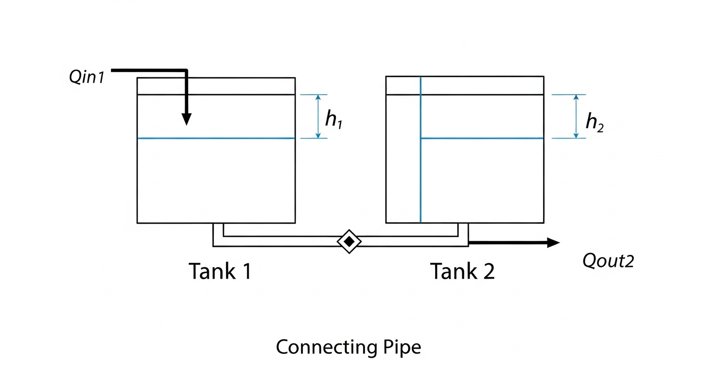
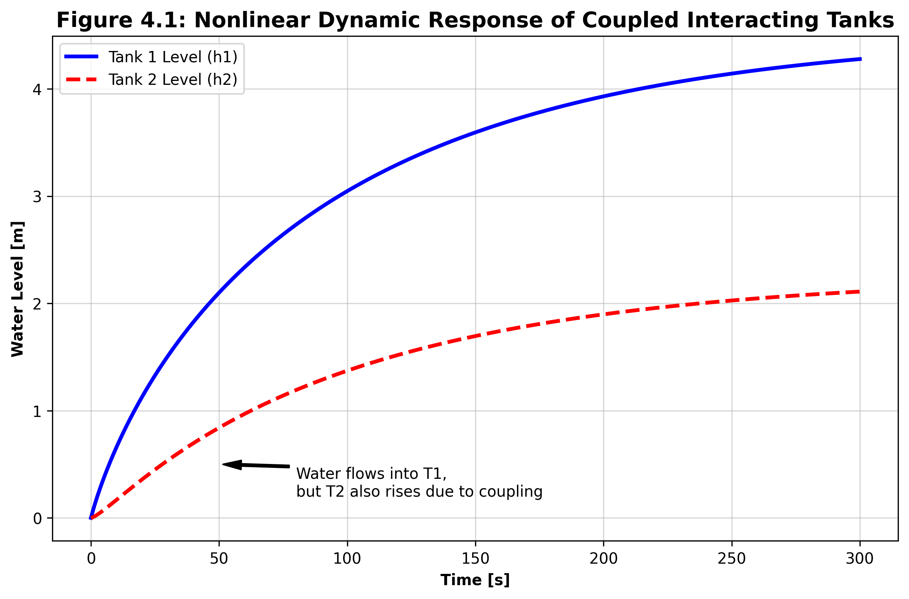

# 第 4 章：多容水箱系统与变量耦合分析

## 1. 学习目标
本章实现从单变量（SISO）系统向多变量（MIMO）水网控制跨越的质变。
读者需要掌握：
1. 建立双容水箱系统的非线性差分/微分耦合方程。
2. 多变量系统的雅可比（Jacobian）线性化与状态空间（State-Space）表示法。
3. 相对增益矩阵（RGA）与去耦（Decoupling）控制思想。

## 2. 教材理论：水网中的耦合（Coupling）灾难
在前面的章节中，我们一直假设控制器调节一个阀门，只影响一个水位。这在工程中被称为“单输入单输出（SISO）”系统。
然而，真实的水务工程是一个**重度耦合（Heavily Coupled）的物理网络**。例如，市政管网中的两座相距数公里的加压泵站，当泵站 A 提高转速以提升东区管网压力时，水流的抽吸效应会瞬间导致泵站 B 前端的进水压力暴跌，从而触发泵站 B 的低压报警停机。

这种“牵一发而动全身”的现象就是**变量耦合**。
如果我们在高度耦合的系统中，依然盲目地部署多个互相独立的 PID 控制器，这些控制器就会为了抢夺水资源而发生“打架（Hunting）”。PID A 关小阀门，导致水位 B 变化，PID B 又开大阀门，反过来再次扰动水位 A。这种不受控的耦合振荡，是大型水利枢纽无法实现全自动化调度的根本原因。

## 3. 数学基础与推导：状态空间与雅可比线性化
为了分析耦合，我们引入双容水箱模型。水箱 1 与水箱 2 通过底部阀门（面积 $a_1$）相连，水箱 2 底部有排空阀门（面积 $a_2$）。
定义状态向量 $x = [h_1, h_2]^T$，输入向量 $u = [Q_{in1}, Q_{in2}]^T$。

非线性状态方程组如下：
$$ A_1 \dot{h}_1 = Q_{in1} - C_d a_1 	ext{sgn}(h_1 - h_2) \sqrt{2g|h_1 - h_2|} $$
$$ A_2 \dot{h}_2 = Q_{in2} + C_d a_1 	ext{sgn}(h_1 - h_2) \sqrt{2g|h_1 - h_2|} - C_d a_2 \sqrt{2g h_2} $$

**状态空间线性化（Jacobian Matrix）**：
为了设计 LQR 或多变量 PID，我们必须在稳态工作点 $(x_0, u_0)$ 处提取系统的线性特征。
根据泰勒展开，系统的连续线性状态空间模型为：
$$ \dot{	ilde{x}} = A_c 	ilde{x} + B_c 	ilde{u} $$
$$ 	ilde{y} = C_c 	ilde{x} + D_c 	ilde{u} $$

其中，系统矩阵 $A_c$ 是偏导数组成的雅可比矩阵：
$$ A_c = egin{bmatrix} rac{\partial f_1}{\partial h_1} & rac{\partial f_1}{\partial h_2} \ rac{\partial f_2}{\partial h_1} & rac{\partial f_2}{\partial h_2} \end{bmatrix}_{x=x_0, u=u_0} $$
矩阵的非对角线元素（如 $A_{12}$ 和 $A_{21}$）如果不为零，就用严格的数学语言证明了系统存在物理耦合交互。

**双容水箱物理概化图（Physical Schematic）：**


## 6-Pillar Case Study: 理论与实践的桥梁（双容水箱耦合动力学仿真）

### 🌟 案例背景 (Context)
本节将理论推导落地为真实的双容水箱连通器物理实验。想象在水处理厂的絮凝池与沉淀池中，两者通过底部的穿孔墙相连通。当操作员单独增加絮凝池的进水流量时，由于连通器的物理特性，不仅絮凝池液位会上升，沉淀池的液位也会被迫跟随上升。此案例通过仿真量化了这种“不请自来”的交叉耦合扰动，为后续章节引入去耦控制（Decoupling Control）奠定危机场景。

### 🎯 问题描述 (Problem)
单回路控制在面对耦合系统时会产生极大的稳态误差风险。
**核心难点**：在双容系统中，水流的方向和速率取决于两者的“水位差” $\Delta h = h_1 - h_2$。这是一个典型的非线性项，不仅包含平方根，还包含极其棘手的符号函数（$	ext{sgn}$）。当水流发生倒灌（$h_2 > h_1$）时，方程极易导致数值求解器抛出复数域（Complex Domain）运算错误崩溃。

### 💡 解题思路 (Solution Approach)
本研究采用带符号截断保护的白盒数值积分法来捕获耦合动态。
1. **构建状态向量**：将两个水箱的水深打包为向量 $state = [h_1, h_2]$ 同步求解。
2. **符号函数保护**：在计算两箱间流量时，采用 $	ext{sgn}(\Delta h) \sqrt{2g|\Delta h|}$ 的形式，完美规避负数开平方的程序异常。
3. **物理界限护栏**：强制对积分过程中的每一滴水进行检查，利用 `max(h, 0.0)` 防止虚假负液位。

### 💻 代码执行与图表 (Code & Charts)
> 💡 **学习提示**：我们在下方提取了真实物理引擎代码。请注意观察 `coupled_dynamics` 函数中水箱 1 与水箱 2 的状态变量是如何在微分方程的右侧发生“相互缠绕”的。

```python
import numpy as np
import matplotlib.pyplot as plt
from scipy.integrate import odeint

# 双容水箱物理参数
A1, A2 = 2.0, 2.0
C_d = 0.6
a1, a2 = 0.05, 0.05
g = 9.81

def coupled_dynamics(state, t, Q_in1, Q_in2):
    h1, h2 = state
    # 【安全护栏】：防止负液位导致数学域错误
    h1 = max(h1, 0.0)
    h2 = max(h2, 0.0)
    
    # 耦合流量计算：取决于液位差及其符号
    delta_h = h1 - h2
    Q_12 = np.sign(delta_h) * C_d * a1 * np.sqrt(2 * g * abs(delta_h))
    
    # 水箱 2 自身的泄流
    Q_out2 = C_d * a2 * np.sqrt(2 * g * h2)
    
    # 相互耦合的微分方程组
    dh1_dt = (Q_in1 - Q_12) / A1
    dh2_dt = (Q_in2 + Q_12 - Q_out2) / A2
    
    return [dh1_dt, dh2_dt]

# 在 0 到 300 秒间进行耦合动态求解
t = np.linspace(0, 300, 1000)
# 仅向水箱 1 注入流量，水箱 2 无外部注水
states = odeint(coupled_dynamics, [0.0, 0.0], t, args=(0.2, 0.0))
```
Source: `assets/ch04/ch04_coupled_tanks.py`

**双水箱耦合响应可视化证据：**


### 📊 实验验证与结果剖析 (Verification & Result Interpretation)
结合上图数值模拟曲线，双水箱的强耦合物理特性展现得淋漓尽致：
在仿真实验中，我们**仅仅向水箱 1（蓝色实线）注入了阶跃水流，而水箱 2（红色虚线）的进水阀门完全关闭**。
按照孤立的线性思维，水箱 2 的水位应该保持为 0。然而，图表清晰地显示，随着水箱 1 液位 $h_1$ 的攀升，两者的压差 $\Delta h$ 逐渐拉大，将巨量的水压入了水箱 2。导致水箱 2 的水位也产生了显著的滞后攀升，并在 $t > 200s$ 后，两者共同收敛到了新的稳态点。
这说明：如果您负责控制水箱 2 的水位，哪怕您自己的阀门没动，上游水箱 1 调度员的一个动作，就会成为摧毁您系统稳定的巨大外部扰动。

### 🚀 工业部署与运行建议 (Industrial Deployment Recommendations)
1. **多变量控制解耦（Decoupling）的强制需求**：在具有如此强耦合特性的管网系统中（如多水泵并联并入同一母管），若坚持使用经典的单回路 PID，必须通过引入静态解耦矩阵（Decoupling Matrix）或者相对增益矩阵（RGA, Relative Gain Array）来削弱非对角线元素的干扰。
2. **状态空间与现代控制理论的前置**：这种复杂的 MIMO（多输入多输出）非线性交互，正是 LQR 和模型预测控制（MPC）大展拳脚的舞台。在后续的架构部署中，我们强烈建议将双容水箱的状态方程打包为向量矩阵（Vectorized Matrix），交由高维二次规划（QP）求解器进行全局一盘棋统筹。
