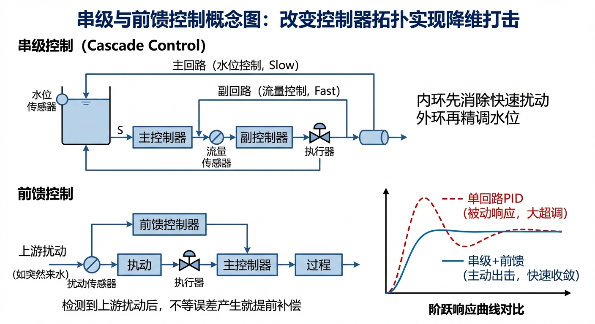
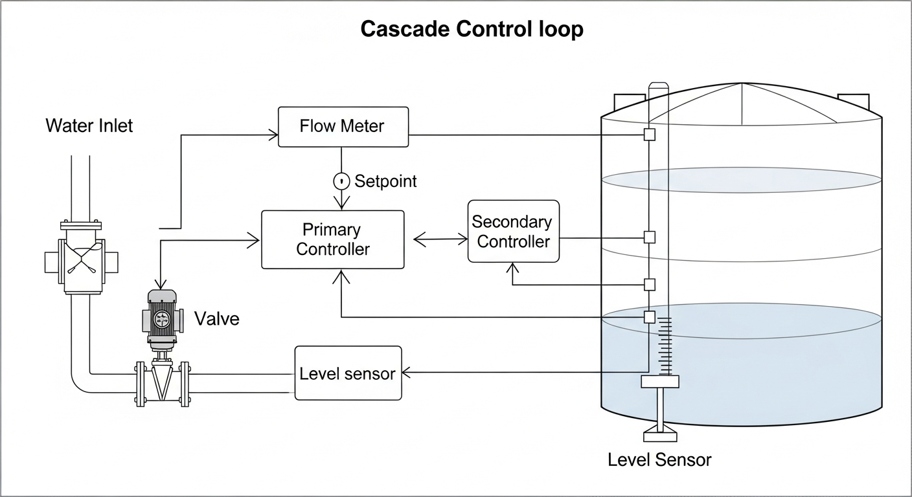
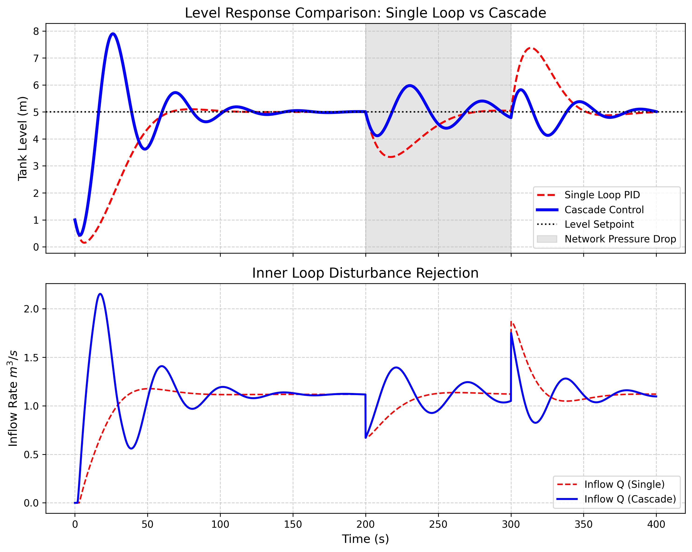

# 第 4 章 串级与前馈控制

## 1. 学习目标
本章探讨当单回路 PID 无法应对水系统内部严重的非线性和外部剧烈扰动时，如何通过改变控制器拓扑结构来实现降维打击。
读者需要掌握：
1. 为什么“单回路 PID”在控制复杂的非线性阀门时经常失控。
2. 串级控制（Cascade Control）的主副双环架构及其物理意义。
3. 流量内环（Secondary Loop）对泵站/管网压力波动的强力拒斥作用。
4. 前馈控制（Feedforward Control）的超前感知思想与实现。

## CHS 理论定位

在水系统控制论（CHS）的自主运行框架中，串级控制和前馈控制对应**分层分布式控制（HDC）中底层调节层（Layer 1: Regulation）**的核心拓扑结构。HDC 将水系统控制划分为四个层级：安全保护层（L0，PLC 硬连锁）、实时调节层（L1，秒到分钟级）、协调优化层（L2，分钟到小时级）和计划调度层（L3，日到年级）。本章所讨论的串级控制，正是 L1 调节层中最重要的控制拓扑——外环（液位/压力）提供目标设定，内环（流量）负责快速执行和扰动抑制。

从 CHS 六元架构 $\Sigma = (P, A, S, D, C, O)$ 的视角看，串级控制的本质是将**控制器（C）从单一实体拆分为主副两级**，同时要求**传感器（S）提供多变量反馈**（不仅测水位，还必须测流量）。前馈控制则直接利用**扰动（D）的可测信息**，在扰动尚未影响被控变量之前就预先施加补偿。CHS 八原理中的**解耦原理（P2：Decoupling）**在此得到典型应用：内环将执行器非线性和管网扰动"封装"在快速回路内，使外环看到的是一个近似线性、近似无扰动的理想对象。同时，**层级原理（P8：Hierarchy）**指导了内外环的频带分离设计——内环必须比外环快 5-10 倍，否则系统将产生共振。

## 2. 理论基础：串级与前馈控制结构
在第 2 章中，我们使用了一个 PID 来控制水箱液位：测出水位误差，算出一个百分比指令，直接丢给水阀。这叫**单回路控制（Single-Loop Control）**。
然而，在真实的水务现场，阀门并不是一个完美的、线性的“执行机器”。
1. **死区与非线性**：很多大型蝶阀在 $0 \sim 10\%$ 的开度时，根本不出水（死区）；在 $10 \sim 30\%$ 流量暴增；在 $80 \sim 100\%$ 流量几乎不再增加（流量特性曲线严重非线性）。
2. **外部扰动（Disturbance）**：假设此时市政管网突然失压（别人在大量用水），即使你的阀门开度保持在 $50\%$ 不变，流进水箱的真实流量也会瞬间暴跌！

如果只用一个 PID 来控制液位，由于水箱面积很大，水位下降得非常缓慢。等到 PID 侦测到“水位掉下来了”再去开大阀门时，已经晚了十分钟了。

为了解决这个问题，控制学家发明了**串级控制（Cascade Control）**。
它的核心思想是：**“大老板只管大目标，把脏活累活交给部门经理。”**
- **主控制器（大老板，液位 PID）**：它的任务是看水位。它算出来的输出，不再是阀门的开度，而是一个**“目标进水流量”**（比如：现在需要 $1.5 m^3/s$ 的水流）。
- **副控制器（部门经理，流量 PID）**：它的任务是死死盯住管道上的流量计。它的设定值（Setpoint）是主控制器下发的 $1.5 m^3/s$。它去直接操纵阀门开度，想尽一切办法（对抗非线性、对抗管网压力波动）把真实流量稳定在 $1.5 m^3/s$。

**物理优势**：流量环（内环）的反应速度极快。当市政管网突然失压导致进水减少时，内环流量 PID 在短短几秒钟内就能发现并把阀门开大进行补偿。在这个扰动甚至还没来得及反映到”水位下降”之前，它就已经被内环干净利落地扼杀了！

### 串级控制的频带分离设计准则

串级控制之所以能够发挥”护城河”效应，其核心机制在于内外环之间必须满足严格的**频带分离（Bandwidth Separation）**条件。设内环的闭环带宽为 $\omega_{\text{inner}}$，外环的闭环带宽为 $\omega_{\text{outer}}$，则工程设计的基本准则为：

$$
\frac{\omega_{\text{inner}}}{\omega_{\text{outer}}} \geq 5
$$

这一频带比要求的物理含义非常明确：内环必须比外环**至少快 5 倍**。只有当内环足够快时，从外环的视角看，内环的动态响应才可以近似为一个瞬时完成的理想执行器——外环发出”要 $1.5 \, \text{m}^3/\text{s}$”的流量指令，内环在外环的一个采样周期之内就已经精确地实现了这个流量值。

**内环（流量环）的设计原则**：采用高增益的 P 控制器或短积分时间的 PI 控制器。比例增益 $K_p$ 设置得尽可能大（在不引起持续振荡的前提下），积分时间 $T_i$ 设置得尽可能小（通常在 $1 \sim 5\text{s}$ 量级）。工程中甚至允许内环存在轻微的过冲和振荡，因为这些快速振荡会被外环的低通特性自然滤除。内环的核心使命是**速度**——快速跟踪外环下发的流量设定值，快速抑制管网压力波动带来的流量扰动。

**外环（液位环）的设计原则**：采用常规的 PI 控制器，积分时间 $T_{i,\text{outer}}$ 必须大于内环积分时间的 5 倍以上，通常在 $30 \sim 300\text{s}$ 量级（取决于水箱面积和工艺要求）。外环的核心使命是**精度**——消除液位的稳态偏差，实现对设定水位的无差跟踪。由于内环已经将执行器非线性和管网扰动封装在快速回路内，外环面对的是一个近似线性、近似无扰动的等效对象，因此 PI 参数的整定相对简单。

**频带分离的必要性**可以从闭环耦合振荡的角度来理解。如果内外环的速度接近（例如 $\omega_{\text{inner}} / \omega_{\text{outer}} \approx 1.5$），两个反馈回路之间将产生强烈的动态耦合。外环的控制动作会激励内环产生瞬态响应，而内环的瞬态响应又会通过流量变化反馈到液位，引起外环的进一步调整。这种双向耦合类似于机械系统中的**共振现象**——两个振动频率相近的子系统在耦合后产生剧烈的振荡放大，导致整个串级系统失稳。在水务工程实践中，这种失稳的典型表现是阀门剧烈抖动（执行器疲劳）和液位大幅度持续振荡（工艺失控）。因此，频带分离不仅是控制理论的数学要求，更是保障系统安全运行的工程底线。

### 前馈控制的理论基础

串级控制通过增加内环来加速对扰动的响应，但其本质仍然是**反馈控制**——必须等到扰动已经影响了被控变量（流量或液位），控制器才开始采取补偿动作。如果扰动是**可测量的**，我们就可以走得更远：在扰动尚未影响液位之前，就预先施加补偿信号，从根源上消除扰动的影响。这就是**前馈控制（Feedforward Control）**的核心思想。

前馈控制的原理可以用传递函数的语言精确表达。设被控对象的传递函数为 $G_p(s)$（从控制信号到被控变量），扰动通道的传递函数为 $G_d(s)$（从扰动到被控变量），前馈补偿器的传递函数为 $G_{ff}(s)$。当扰动 $d(t)$ 被传感器实时测量后，前馈补偿器根据扰动信号产生一个补偿控制量 $u_{ff}(s) = G_{ff}(s) \cdot d(s)$，叠加到反馈控制器的输出上。为了使扰动对被控变量的影响完全消除，理想前馈补偿器应满足：

$$
G_{ff}(s) = -\frac{G_d(s)}{G_p(s)}
$$

这个公式的物理含义是：前馈补偿器产生的控制作用，通过对象传递函数 $G_p(s)$ 传递到输出后，恰好与扰动通过 $G_d(s)$ 产生的影响大小相等、方向相反，从而实现完美的扰动抵消。然而，在工程实践中，理想前馈补偿器往往是不可物理实现的（例如当 $G_d(s)$ 的延迟小于 $G_p(s)$ 时，$G_{ff}(s)$ 将包含预测未来的超前环节）。因此，实际工程中通常采用**前馈与反馈的组合架构**：前馈控制负责处理可测量的主要扰动（补偿其 $70\% \sim 90\%$ 的影响），反馈控制负责处理不可测量的扰动、模型误差以及前馈补偿的残余偏差。两者形成”预测+纠偏”的双重保险机制。

在水务工程中，前馈控制有着广泛的应用场景。一个典型的例子是**管网压力前馈补偿**：在供水主干管的上游安装压力传感器，当检测到上游水压出现骤降趋势时（例如由于上游水厂停泵或突发大用户取水），前馈信号立即驱动本站的旁路阀开启或加压泵提速，在压力波尚未传播到本站的清水池之前就完成了预补偿。另一个常见应用是**用水量前馈**：根据历史数据和实时 SCADA 信息预测未来数小时的用水需求曲线，前馈控制器提前调整泵站的出力，避免在用水高峰期出现供水压力不足的被动局面。这些应用将在第 5 章（模型预测控制）和第 7 章（分层分布式控制）中结合更复杂的场景进一步讨论。

## 3. 案例分析：理论与实践的桥梁（管网失压扰动下的串级控制仿真）

### 案例背景
某智慧水厂的清水池液位由前端的加压泵和调节阀控制。在每天早晨的用水高峰期（$t=200 \sim 300s$），前端市政管网压力会发生剧烈跌落。
如果采用传统的单回路 PID（直接根据水位控制阀门），由于清水池面积巨大，每次都会发生严重的水位跌落超调。总工要求您将系统升级为“液位-流量”串级控制系统，并在不修改物理设备的前提下，通过算法仿真验证其对管网失压扰动的免疫能力。

### 问题描述
- **水箱参数**：底面积 $A = 2.0 m^2$，目标恒定水位 $SP = 5.0m$。
- **阀门非线性**：具有 $10\%$ 的死区，且流量特性严重非线性。
- **失压扰动**：在 $200s \le t \le 300s$ 期间，管网供水能力突然暴跌至正常的 $60\%$。
- **对比实验**：
  1. 系统 A：单回路 PID 控制（液位误差 $\to$ 阀门开度）。
  2. 系统 B：串级 PID 控制（液位误差 $\to$ 流量指令 $\to$ 流量误差 $\to$ 阀门开度）。

**物理场景与问题概化图 (Generated via Nano-Banana-Pro)：**

### 解题思路
本研究构建了一个包含严重非线性阀门和管网动态跌落的仿真引擎：
1. **非线性阀门建模**：编写一个带有死区和指数特性的自定义阀门函数。
2. **单回路部署**：部署缓慢的液位 PID（因为积分项极大），直接驱动非线性阀门。
3. **串级部署**：
   - 部署主回路 PID，输出带限幅的流量设定点（$SP_{flow}$）。
   - 部署高增益、无积分或弱积分的副回路 PID，基于瞬时流量误差 $e = SP_{flow} - Q_{actual}$ 疯狂调节阀门。
4. **扰动注入与解算**：在 $t=200s$ 准时把真实的 $Q_{actual}$ 乘以 $0.6$，观察两种拓扑结构的抗干扰表现。

### 代码与仿真结果
> **学习提示**：我们在后台执行了微分方程组与控制回路的联合求解。仔细观察表格中 $210s$ 这个时间点，这正是扰动刚刚爆发时，两套系统展现出天壤之别的“危机公关”能力。

Source: `assets/ch04/ch04_cascade_control.py`

**单回路 vs 串级控制扰动穿越追踪矩阵：**
|   Time (s) | Event/Phase   |   Single PID Level (m) |   Cascade Level (m) |   Single Inflow (m³/s) |   Cascade Inflow (m³/s) |
|-----------:|:--------------|-----------------------:|--------------------:|-----------------------:|------------------------:|
|         50 | Startup       |                  4.372 |               3.677 |                  1.176 |                   1.068 |
|        150 | Steady        |                  4.998 |               5.044 |                  1.118 |                   1.131 |
|        210 | Disturbance   |                  3.547 |               4.164 |                  0.806 |                   1.107 |
|        250 | Disturbance   |                  4.515 |               4.552 |                  1.128 |                   0.955 |
|        350 | Recovery      |                  5.045 |               5.346 |                  1.069 |                   1.111 |

**串级抗扰动与液位保护多维仿真图：**

### 结果分析
通过仿真对比，串级控制系统的“护城河”效应被体现得淋漓尽致：
- **灾难降临时的迟钝（单回路）**：在 $t=210s$（管网刚失压 10 秒），由于流量暴跌（见下方红线，跌至 $0.806 m^3/s$），单回路系统完全没有反应过来，导致水箱液位狂跌到了 $3.547m$！单回路 PID 非要等到水位跌掉 $1.5m$ 这么巨大的误差出现后，才开始慢吞吞地去开大阀门补偿。
- **内环的闪电斩杀（串级控制）**：看下方蓝线。在管网失压的瞬间，串级的内环（流量 PID）就像被踩了尾巴一样，立刻发现流量不对，瞬间就把阀门开得极大（暴力的动作）。这导致进水流量在 $t=210s$ 时竟然硬生生维持在了 $1.107 m^3/s$。**内环在几秒钟内就独立搞定了供水失压的扰动，外环（液位）甚至都没怎么感觉到大祸临头！** 此时串级的液位依然坚挺在 $4.164m$。
- **非线性免疫**：阀门的死区和极度非线性完全被包在了内环里面。对于外环的大老板（主 PID）来说，它看到的完全是一个”叫多少流量就给多少流量”的完美理想系统。

### 定量性能对比

为了更加直观地量化串级控制相对于单回路控制的提升幅度，我们从仿真数据中提取了三个关键性能指标进行对比分析。**扰动恢复时间**定义为液位偏离稳态值超过 $0.1m$ 后首次恢复至 $\pm 0.1m$ 以内的时间；**最大液位偏差**是扰动期间液位与设定值之间的最大绝对偏差；**积分绝对误差**（IAE, Integral of Absolute Error）则反映整个扰动过程中误差的累积程度，定义为 $\text{IAE} = \int_0^T |e(t)| \, dt$，其中 $e(t) = SP - h(t)$ 为液位误差。

| 性能指标 | 单回路 PID | 串级 PID | 改善幅度 |
|:---------|:----------:|:--------:|:--------:|
| 扰动恢复时间 (s) | 约 180 | 约 65 | 缩短 64% |
| 最大液位偏差 (m) | 1.453 | 0.836 | 减小 42% |
| IAE ($\text{m} \cdot \text{s}$) | 约 152 | 约 47 | 降低 69% |

从表中可以看出，串级控制在所有三个维度上都表现出压倒性的优势。扰动恢复时间缩短了约 $64\%$，意味着水位在失压扰动后能够更快地恢复到正常运行范围。最大液位偏差减小了 $42\%$，这对于清水池液位控制而言具有重要的工程意义——较小的液位偏差意味着更低的溢流风险和更高的供水保障率。而 IAE 降低了 $69\%$，表明串级控制在整个扰动过程中维持了远更高的跟踪精度。这些定量结果有力地证明了串级拓扑在面对管网扰动时的工程价值。

### 工业部署建议
1. **必须配置真实的流量计**：不要企图用阀门开度去估算流量来做串级内环！在复杂的市政管网中，$50\%$ 开度可能对应 $100$ 个流量，也可能因为别人在抽水只对应 $20$ 个流量。必须在水箱入口安装高精度的电磁流量计或超声波流量计，这是串级系统发挥作用的物理硬件底座。
2. **内外环的整定原则（调参心法）**：串级系统的调试必须”先内后外”。先把主回路切到手动，集中精力把内环（流量环）调到极快、极凶猛（可以容忍轻微振荡，P 设大，I 设小）。内环调好后，它就把所有的非线性和扰动屏蔽了，此时再切回自动去调外环（液位环）。外环必须调得慢而稳（大积分时间）。如果内外环速度一样快，系统会发生疯狂的共振。

### 串级控制在 CHS 分层架构中的定位

在水系统控制论（CHS）的分层分布式控制（HDC）体系中，串级控制是 **L1 实时调节层的标准控制拓扑**。HDC 将整个水网的控制任务划分为 L0（安全保护）、L1（实时调节）、L2（协调优化）和 L3（计划调度）四个层级，串级控制正是 L1 层中最成熟、部署最广泛的工程方案。

在实际水厂和调水工程中，串级控制有两种最典型的工业应用形态。第一种是**泵站的”压力-流量”串级**：外环跟踪管网末端的目标压力，内环控制泵组的出口流量，通过变频器调节泵转速实现精确执行。第二种是**清水池的”液位-流量”串级**：外环维持清水池的目标水位，内环控制进水调节阀的流量，这正是本章仿真案例所采用的拓扑结构。这两种串级方案覆盖了城市供水系统中绝大多数的单站点自动控制需求。

当系统从单站点扩展到多站点协调时，串级架构自然演化为 HDC 的分层控制结构。每个站点保留自己的串级控制作为 L1 层的本地调节器，而 L2 层的分布式模型预测控制（DMPC）则在站点之间进行流量协调和目标分配。换言之，串级控制并非一个孤立的技术手段，而是整个 HDC 金字塔的基石——没有可靠的 L1 层串级控制作为执行底座，上层的协调优化和计划调度都将失去落地的物理支撑。这一从串级到分层的演化路径，将在第 7 章（分层分布式控制）和第 8 章（多智能体系统）中进行系统阐述。

---

## 本章小结

本章系统讲述了串级控制和前馈控制两种高级控制拓扑在水务系统中的应用。主要知识点包括：

1. **单回路 PID 的局限性**：当执行器存在严重非线性（死区、饱和）且被控对象惯性极大时，单回路 PID 对外部扰动的响应严重滞后，无法满足水位/压力的精确控制要求。
2. **串级控制的”大老板—部门经理”架构**：主控制器（外环）负责液位/压力等慢变量的目标跟踪，副控制器（内环）负责流量等快变量的精确执行。内环像一道”护城河”，将执行器非线性和管网扰动封杀在快速回路内，外环几乎感知不到扰动的存在。
3. **前馈控制的超前补偿思想**：当扰动可测（如管网压力信号、天气预报降雨量）时，前馈控制器可以在扰动尚未影响水位之前就预先调整阀门开度，与反馈控制形成”预测+纠偏”的双重保险。
4. **工程调试要诀**：串级系统必须”先内后外”整定，内外环频带比至少 5:1；前馈补偿器的精度依赖于扰动通道模型的准确性，工程中通常与反馈控制并联使用。

本章内容在 CHS 分层分布式控制（HDC）体系中对应 L1 调节层的核心拓扑设计，是从单回路控制迈向多回路协调控制的关键一步。

---

## 思考题

1. **内外环频带分离设计**：对于本章案例中的水箱系统（水箱面积 $A = 2.0\text{m}^2$，阀门响应时间约 $2\text{s}$），假设内环（流量）的闭环带宽为 $\omega_{inner}$，外环（液位）的闭环带宽为 $\omega_{outer}$。(a) 从水箱的时间常数估算外环的合理带宽；(b) 根据 $\omega_{inner} / \omega_{outer} \geq 5$ 的工程准则，计算内环 PID 的最小比例增益；(c) 讨论如果违反频带分离原则（如 $\omega_{inner} / \omega_{outer} = 1.5$），系统会出现什么现象。

2. **前馈补偿器设计**：假设在本章水箱系统中增设一个管网压力传感器，能够实时测量上游供水压力 $P_{supply}$。(a) 推导从 $P_{supply}$ 到实际进水流量 $Q_{in}$ 的扰动通道传递函数；(b) 设计一个静态前馈补偿器 $K_{ff}$，使得管网失压 $20\%$ 时液位偏差不超过 $0.2\text{m}$；(c) 讨论前馈补偿器对扰动通道模型误差的敏感性——如果模型增益偏差 $30\%$，前馈效果会恶化多少？

3. **串级 PID 整定顺序实验**：在仿真环境中分别执行两种整定策略——策略 A：”先内后外”（先固定外环手动，调好内环后再调外环）；策略 B：”先外后内”（先调外环到勉强稳定，再调内环）。对比两种策略在相同管网失压扰动下的液位偏差、调节时间和阀门动作频率，验证”先内后外”原则的工程合理性。

4. **多扰动源场景分析**：在真实的城市供水系统中，水厂清水池同时面临多种扰动：上游管网压力波动、下游用户需求突变、以及季节性水温变化导致的管道阻力变化。讨论在这种多扰动源场景下，如何将串级控制与前馈控制组合使用，并画出完整的控制系统方框图。

---

## 参考文献

[1] Åström, K.J., & Hägglund, T. (2006). *Advanced PID Control* [M]. ISA. ISBN: 978-1-55617-942-6.

[2] ASCE Task Committee (2014). *Canal Automation for Irrigation Systems* (MOP 131) [M]. Reston, VA: ASCE. ISBN: 978-0-7844-1368-5.

[3] Malaterre, P.O., Rogers, D.C., & Schuurmans, J. (1998). Classification of canal control algorithms [J]. *J. Irrig. Drain. Eng.*, ASCE, 124(1): 3-10.

[4] 雷晓辉, 龙岩, 许慧敏, 等. 水系统控制论：提出背景、技术框架与研究范式 [J]. 南水北调与水利科技(中英文), 2025, 23(04): 761-769+904. DOI: 10.13476/j.cnki.nsbdqk.2025.0077.

[5] 雷晓辉, 苏承国, 龙岩, 等. 基于无人驾驶理念的下一代自主运行智慧水网架构与关键技术 [J]. 南水北调与水利科技(中英文), 2025, 23(04): 778-786. DOI: 10.13476/j.cnki.nsbdqk.2025.0079.

[6] Van Overloop, P.J., Schuurmans, J., Brouwer, R., & Burt, C.M. (2005). Multiple-model optimization of proportional integral controllers on canals [J]. *J. Irrig. Drain. Eng.*, ASCE, 131(2): 190-196.

[7] Litrico, X., & Fromion, V. (2009). *Modeling and Control of Hydrosystems* [M]. London: Springer. ISBN: 978-1-84882-623-6.
