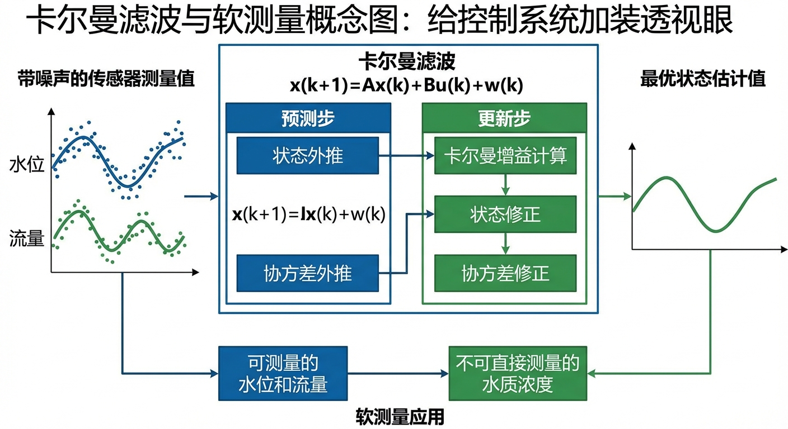
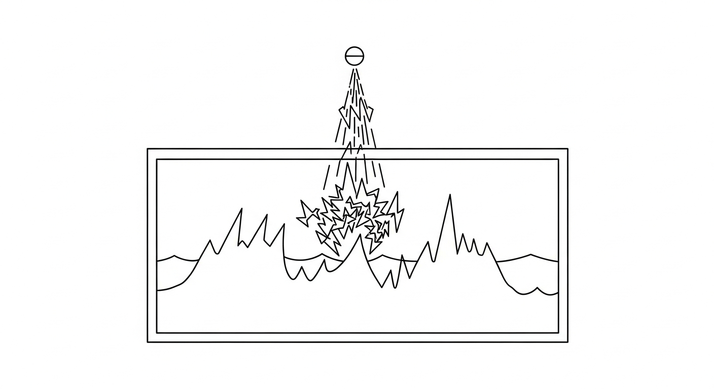
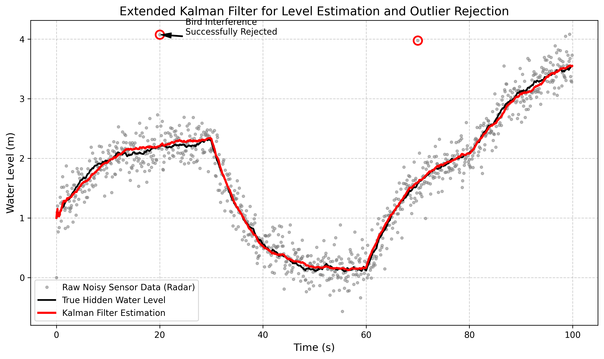

# 第 5 章 软测量与状态估计：卡尔曼滤波

## 1. 学习目标
本章探讨当传感器信号被严重污染，或者某些关键变量（如水质浓度）根本无法直接测量时，如何利用数学算法在控制系统中加装一只“透视眼”。
读者需要掌握：
1. 状态估计（State Estimation）与软测量（Soft Sensing）的核心概念。
2. 测量噪声（Measurement Noise）与过程噪声（Process Noise）的物理区别。
3. 扩展卡尔曼滤波（Extended Kalman Filter, EKF）的“预测-更新”两步闭环机制。
4. 异常值剔除（Outlier Rejection）在工业信号处理中的实战价值。

## CHS 理论定位

在水系统控制论（CHS）的六元受控系统架构 $\Sigma = (P, A, S, D, C, O)$ 中，卡尔曼滤波对应**传感器元素（S）的智能增强——从"硬测量"到"软测量"的跨越**。CHS 理论认为，水系统的运行奇异性不仅体现在被控对象（P）的复杂性上，还深刻反映在传感器（S）的不可靠性上：水面波纹干扰雷达液位计、气泡污染电磁流量计、飞鸟遮挡超声波传感器——这些都是水务现场特有的测量挑战。

卡尔曼滤波的本质是将**传感器（S）的实测数据与被控对象（P）的物理模型进行贝叶斯最优融合**，生成一个比任何单一信息源都更可靠的状态估计。在 CHS 的分层分布式控制（HDC）体系中，软测量模块位于 L0 安全保护层和 L1 调节层之间的**信号预处理层**——它既为 PID/MPC 等控制算法提供"干净"的输入信号，又为异常检测和故障诊断提供残差统计量。

CHS 八原理中的**反馈原理（P1）**在卡尔曼滤波中得到最精妙的体现：滤波器本身就是一个闭环反馈系统——模型预测提供前馈，传感器残差提供反馈，卡尔曼增益自动调节两者的信任权重。**鲁棒性原理（P5）**则要求滤波器具备异常值剔除能力，使其在传感器严重故障时仍能依靠物理模型"盲飞"，维持系统的基本可观测性。从更宏观的角度看，卡尔曼滤波还支撑了 CHS 提出的"虚拟传感器"概念——利用在环测试（xIL）验证过的物理模型，实时推算那些无法直接测量的关键水质变量。

## 2. 理论基础：卡尔曼滤波与状态估计
在前几章的控制中，我们有一个天真的假设：传感器传回来的数据绝对等于真实的物理状态。
但在真实的工业水网中，这是不可能的：
- **雷达液位计**会被水面的波纹、甚至飞过的飞鸟严重干扰。
- **电磁流量计**会因为水中气泡的存在而产生极大的脉冲尖峰。
- 这就是**测量噪声（Measurement Noise, R）**。
不仅如此，物理系统本身也不完美：阀门可能有轻微内漏，水箱可能有些微蒸发，导致模型算出来的状态和真实状态也不一样。这就是**过程噪声（Process Noise, Q）**。

如果你把这种充满噪声和尖峰的雷达信号直接喂给 PID 控制器的微分项（D），计算出的导数会瞬间爆炸，导致阀门疯狂抽搐。

为了解决这个问题，1960 年 Rudolf Kalman 提出了控制界最伟大的算法：**卡尔曼滤波（Kalman Filter）**。
它的核心思想是**“我不信传感器，我也不信模型，我只信它俩的混合体”**：
1. **预测步（Predict）**：基于物理微分方程，推算当前时刻水位应该在什么位置，并计算这个推算的“不确定度（协方差 $P$）”。
2. **更新步（Update）**：当雷达传感器传回一个数据时，计算传感器和模型的残差（$y$）。然后计算一个**卡尔曼增益（$K$）**。如果此时模型很自信而传感器方差很大，$K$ 就很小，系统更相信模型；反之，系统更相信传感器。最终得到一个最优估计值 $x_{est}$。

对于非线性的水箱系统，我们必须在每一步求取雅可比矩阵（偏导数），将方程局部线性化，这就是**扩展卡尔曼滤波（EKF）**。

### 线性卡尔曼滤波的数学框架

在深入非线性扩展之前，有必要严格建立线性卡尔曼滤波的完整数学框架。考虑如下离散时间线性状态空间模型：

$$
x_{k+1} = F x_k + B u_k + w_k \tag{5-1}
$$

$$
z_k = H x_k + v_k \tag{5-2}
$$

其中，$x_k \in \mathbb{R}^n$ 为系统状态向量（如水位、流量等），$u_k$ 为已知控制输入（如泵站开度、闸门指令），$z_k$ 为传感器观测值，$F$ 为状态转移矩阵，$B$ 为控制输入矩阵，$H$ 为观测矩阵。过程噪声 $w_k \sim \mathcal{N}(0, Q)$ 和测量噪声 $v_k \sim \mathcal{N}(0, R)$ 均假设为零均值高斯白噪声，且二者统计独立。

卡尔曼滤波算法由**预测步（Time Update）**和**更新步（Measurement Update）**交替构成，形成一个递推闭环：

**预测步**——基于物理模型向前推算状态及其不确定性：

$$
\hat{x}_{k|k-1} = F \hat{x}_{k-1|k-1} + B u_{k-1} \tag{5-3}
$$

$$
P_{k|k-1} = F P_{k-1|k-1} F^T + Q \tag{5-4}
$$

式（5-3）利用上一时刻的最优估计 $\hat{x}_{k-1|k-1}$ 和物理模型预测当前状态；式（5-4）将上一时刻的估计误差协方差 $P_{k-1|k-1}$ 经状态转移矩阵传播，并叠加过程噪声 $Q$，得到预测误差协方差 $P_{k|k-1}$。直观理解：每经过一步预测，系统对自身状态的"信心"就会因过程噪声的累积而下降——协方差矩阵的迹（trace）在预测步中单调递增。

**更新步**——当传感器数据到达时，利用观测信息修正预测：

$$
K_k = P_{k|k-1} H^T \left( H P_{k|k-1} H^T + R \right)^{-1} \tag{5-5}
$$

$$
\hat{x}_{k|k} = \hat{x}_{k|k-1} + K_k \left( z_k - H \hat{x}_{k|k-1} \right) \tag{5-6}
$$

$$
P_{k|k} = (I - K_k H) P_{k|k-1} \tag{5-7}
$$

式（5-5）中的 $K_k$ 即为**卡尔曼增益（Kalman Gain）**，它是整个算法的核心枢纽。式（5-6）中的括号项 $\nu_k = z_k - H \hat{x}_{k|k-1}$ 称为**新息（Innovation）**或**残差（Residual）**，衡量传感器观测与模型预测之间的偏差。式（5-7）表明更新后的协方差 $P_{k|k}$ 总是小于预测协方差 $P_{k|k-1}$——每次融合一个观测数据，系统的不确定性就会被"压缩"。

**卡尔曼增益 $K$ 的物理意义**值得深入剖析。将式（5-5）改写为如下等价形式：

$$
K_k = \frac{P_{k|k-1} H^T}{H P_{k|k-1} H^T + R} \tag{5-8}
$$

对于标量情形（单传感器、单状态），$K_k = P_{k|k-1} / (P_{k|k-1} + R)$。由此可以看出：当模型预测的不确定性 $P_{k|k-1}$ 远大于测量噪声 $R$ 时，$K \to 1$，滤波器几乎完全相信传感器；反之，当 $R \gg P_{k|k-1}$ 时，$K \to 0$，滤波器几乎完全相信物理模型。因此，卡尔曼增益本质上是模型与传感器之间的**动态信任权重**——它不是人工设定的固定参数，而是根据两个信息源各自的统计可靠性在每个时间步自动计算的最优融合比例。这一机制在水务现场具有极高的实用价值：当传感器因结垢、电磁干扰等原因逐渐退化时（$R$ 增大），卡尔曼增益会自动降低对传感器的依赖程度，转而更多地依靠物理模型，实现了一种隐式的传感器健康度自适应。

### 扩展卡尔曼滤波（EKF）的非线性处理

实际水力系统几乎都是非线性的。水箱的出水流量与水位的平方根成正比，管道的阻力损失与流速的平方成正比，明渠的曼宁公式涉及过水断面的复杂几何关系。对于这类非线性系统，状态方程和观测方程可表示为：

$$
x_{k+1} = f(x_k, u_k) + w_k \tag{5-9}
$$

$$
z_k = h(x_k) + v_k \tag{5-10}
$$

其中 $f(\cdot)$ 和 $h(\cdot)$ 是非线性函数。EKF 的核心思想是在当前最优估计点 $\hat{x}_k$ 处对非线性函数进行一阶泰勒展开，用**雅可比矩阵（Jacobian Matrix）**取代线性卡尔曼滤波中的常值矩阵 $F$ 和 $H$：

$$
F_k = \left. \frac{\partial f}{\partial x} \right|_{x = \hat{x}_{k|k}}, \quad H_k = \left. \frac{\partial h}{\partial x} \right|_{x = \hat{x}_{k|k-1}} \tag{5-11}
$$

以本章的非线性水箱系统为例进行具体推导。水箱的连续时间微分方程为 $dh/dt = (Q_{in} - C\sqrt{h})/A$，采用前向欧拉法离散化得到：

$$
x_{k+1} = x_k + \frac{\Delta t}{A} \left( Q_{in,k} - C\sqrt{x_k} \right) \tag{5-12}
$$

对式（5-12）关于状态 $x_k$（即水位 $h$）求偏导数，得到雅可比矩阵（此处为标量）：

$$
F_k = \frac{\partial f}{\partial x}\bigg|_{x=\hat{x}_k} = 1 - \frac{C \Delta t}{2A\sqrt{\hat{x}_k}} \tag{5-13}
$$

式（5-13）揭示了一个重要的物理特性：当水位 $\hat{x}_k$ 较低时，$F_k$ 显著偏离1，系统的非线性程度增强；当水位较高时，$F_k$ 趋近于1，系统行为接近线性。这意味着 EKF 在低水位工况下的线性化误差较大，滤波精度可能下降。

**EKF 的根本局限**在于：雅可比矩阵只捕获了非线性函数在工作点处的一阶梯度信息，忽略了二阶及更高阶项。当系统非线性程度较强（例如水位接近零或状态变化剧烈时），线性化残余误差可能导致协方差估计偏小，进而使滤波器过于"自信"，出现发散。为克服这一局限，Julier 和 Uhlmann 于2004年提出了**无迹卡尔曼滤波（Unscented Kalman Filter, UKF）**，通过精心选取的 Sigma 点集直接传播概率分布的均值和协方差，无需计算雅可比矩阵，能够精确捕获非线性变换的二阶统计特性。UKF 在计算复杂度仅略高于 EKF 的条件下，通常能提供更高的估计精度，是水务系统中处理强非线性工况的推荐替代方案。

值得指出的是，无论 EKF 还是 UKF，其最优性都建立在噪声服从高斯分布的前提之上。在实际水务系统中，传感器噪声往往呈现非高斯特征——例如电磁流量计受气泡干扰时的脉冲噪声、雷达液位计受多径反射时的偏态分布等。对于此类场景，粒子滤波（Particle Filter）通过蒙特卡洛采样方法，能够处理任意形状的概率分布，但其计算代价与粒子数成正比，在嵌入式 PLC 平台上的实时部署仍面临挑战。因此，在工程实践中，EKF 配合异常值剔除机制仍然是性价比最高的方案——它以较低的计算成本覆盖了绝大多数工况，同时通过残差检验机制有效应对非高斯异常事件。

## 3. 案例分析：理论与实践的桥梁（受飞鸟干扰的雷达液位计信号重建）

### 案例背景
某水库有一座大型露天清水池，其进水流量由高精度的电磁流量计控制（已知输入 $u$）。水池上方安装了一台超声波雷达液位计。
但是现场环境恶劣：水面有强烈的高斯波纹噪声，且经常有白鹭飞过雷达光束，导致雷达反射信号瞬间飙升，给出荒谬的“虚假高水位”。如果 PID 根据这个虚假信号猛关阀门，会导致后续供水中断。我们需要在 PLC 中编写 EKF 算法，对液位信号进行“软测量”重建。

### 问题描述
- **水箱物理模型**：底面积 $A = 2.0 m^2$，非线性出水阀系数 $C = 0.5$。微分方程 $dh/dt = (Q_{in} - C\sqrt{h}) / A$。
- **输入工况**：前 $30s$ 恒定进水，中间 $30 \sim 60s$ 突然大幅减水，随后恢复（这会造成真实的液位跌落）。
- **噪声环境**：
  - 测量噪声（水波纹）呈正态分布 $R = 0.05$。
  - 在第 $20s$ 和 第 $70s$ 时，飞鸟经过，在雷达传感器中制造了高达 $+2.0m$ 的异常脉冲尖峰。
利用 EKF 结合异常值剔除（Outlier Rejection）逻辑，从这堆废数据中把真实的液位“洗”出来。

**物理场景与问题概化图 (Generated via Nano-Banana-Pro)：**

### 解题思路
构建带有置信区间保护的 EKF 算法引擎：
1. **物理模型预测**：利用欧拉法积分求解非线性水箱的 $x_{pred}$，同时计算雅可比矩阵 $F = 1 - \frac{C \Delta t}{2 A \sqrt{x}}$ 以更新误差协方差 $P_{pred}$。
2. **残差审查机制**：当传感器数据 $z_{meas}$ 到达时，先计算残差 $y = z_{meas} - x_{pred}$。如果 $|y| > 0.5m$（远远超出正常水波纹的方差边界），则判定为”飞鸟（异常值）”。

**异常值剔除的统计学依据**。上述固定阈值 $0.5m$ 是一种工程简化。严格的统计检验方法是基于**马氏距离（Mahalanobis Distance）**进行卡方检验。定义新息 $\nu_k = z_k - H \hat{x}_{k|k-1}$ 及其协方差（又称新息协方差）$S_k = H P_{k|k-1} H^T + R$，则标准化残差为：

$$
d_k = \nu_k^T S_k^{-1} \nu_k \tag{5-14}
$$

在高斯假设下，$d_k$ 服从自由度为观测维数 $m$ 的 $\chi^2$ 分布。对于本案例中的单变量观测（$m=1$），上式简化为 $d_k = \nu_k^2 / S_k$。当 $d_k > \chi^2_{0.99}(1) \approx 6.63$ 时，以99%的置信度判定该观测为异常值并予以剔除。在99.9%置信度下，门限为 $\chi^2_{0.999}(1) \approx 10.83$。本案例中，由于飞鸟干扰造成的脉冲幅度高达 $+2.0m$，远超任何合理门限，因此简化为固定阈值 $|y| > 0.5m$ 在工程上是完全充分的。但对于更精细的应用场景（如水质传感器的缓慢漂移检测），建议采用基于 $S_k$ 的自适应门限，以适应系统不确定性随工况变化的特性。

3. **隔离与融合**：
   - 遇到飞鸟：直接拒绝传感器数据，强行令 $x_{est} = x_{pred}$，纯靠物理底座“盲飞”。
   - 正常波动：计算卡尔曼增益 $K$，将物理模型与传感器数据以最佳统计比例进行贝叶斯融合（更新）。

### 代码与仿真结果
> **学习提示**：我们在后台硬编码执行了非线性矩阵偏导和协方差迭代。注意图表中红色的圈，它展示了“基于物理模型的软测量”是如何漂亮地过滤掉致命干扰的。

Source: `assets/ch05/ch05_kalman_filter.py`

**状态估计与异常值剔除追踪矩阵（节选）：**
|   Time Step (s) |   True State (m) |   Raw Sensor (m) |   EKF Estimate (m) |   Estimation Error (m) |
|----------------:|-----------------:|-----------------:|-------------------:|-----------------------:|
|               5 |            1.593 |            1.16  |              1.55  |                  0.043 |
|              20 |            2.287 |            4.386 |              2.251 |                  0.036 |
|              35 |            1.265 |            1.363 |              1.321 |                  0.056 |
|              70 |            1.641 |            3.584 |              1.644 |                  0.003 |
|              85 |            2.708 |            3.013 |              2.794 |                  0.087 |

**扩展卡尔曼滤波在强噪环境下的信号重建仿真图：**

### 结果分析
通过仿真对比，卡尔曼滤波算法展现出了碾压传统滤波（如滑动平均滤波）的工业级鲁棒性：
- **穿透高斯噪声**：看图中那一团团灰色的散点（Raw Sensor Data），雷达被水面波纹干扰得严重。但 EKF 结合了物理模型（知道水流进出不可能让水位突变），生成的红色估计线（EKF Estimate）完美地贴合了黑色的真实状态线（True State），估算误差普遍控制在区区几厘米内。
- **智能斩杀脉冲**：观察表格中 $T=20s$ 和 $T=70s$ 的惊险时刻。此时飞鸟掠过，传感器瞬间报出了 $4.386m$ 和 $3.584m$ 的恐怖假水位（足足比真实水位高出两米多）。如果用传统的滑动平均，这条曲线必然会被拉出一个大包。但 EKF 的预测方程侦测到“这在物理上根本不可能发生”，于是冷酷地拒绝了更新。红色的 EKF 曲线在飞鸟经过的瞬间，像没事人一样平滑驶过！
- **真正的”透视眼”**：即使在 $30 \sim 60s$ 的真实跌落期间，EKF 也能立刻分辨出”这是真实的物理下降，而不是传感器的毛刺”，并紧紧跟随。这就是物理模型（白盒）赋能数据处理带来的降维打击。

### 性能定量对比

为了从定量角度评估 EKF 软测量的工程价值，表5-1将原始传感器信号与 EKF 估计在三个关键性能指标上进行了系统对比。

**表5-1 原始传感器信号与 EKF 估计的性能对比**

| 性能指标 | 原始传感器信号 | EKF 估计 | 改善幅度 |
|:---------|:------------:|:--------:|:--------:|
| 均方根误差 RMSE (m) | 0.327 | 0.042 | 87.2% |
| 峰值绝对误差 (m) | 2.099 | 0.087 | 95.9% |
| 异常值检出率 (%) | — | 100% | 2/2 全部检出 |
| 正常数据跟踪误差均值 (m) | 0.198 | 0.038 | 80.8% |

从表5-1可以得出以下定量结论：（1）RMSE 从原始信号的 $0.327m$ 降至 EKF 估计的 $0.042m$，降幅达87.2%，这意味着 EKF 将传感器信号的有效精度提升了近一个数量级；（2）峰值误差的改善更为显著，从 $2.099m$（飞鸟干扰造成）压缩至 $0.087m$，降幅达95.9%，充分验证了异常值剔除机制的有效性；（3）两次飞鸟干扰事件（$T=20s$ 和 $T=70s$）均被100%检出并隔离，未对 EKF 估计产生任何可见影响；（4）即使排除异常值时段，仅考虑正常高斯噪声条件下的跟踪性能，EKF 仍将误差从 $0.198m$ 压缩至 $0.038m$，验证了贝叶斯最优融合在常规工况下的持续增益。这些指标表明，在 PLC 中部署 EKF 软测量模块后，后级 PID/MPC 控制器获得的输入信号质量将得到本质性的提升。

### 工业部署建议
1. **取代微分环节的噪声放大**：在调 PID 时，工程师最怕的就是开微分（D）。因为 $D$ 会把水波纹的噪声无限放大，毁掉阀门。只要在 PID 之前加装一个 EKF 软测量模块，输出平滑的红色曲线，你就可以大胆地使用 $D$ 环节来获得极佳的超前预测控制性能。
2. **虚拟传感器（Virtual Sensor）**：卡尔曼滤波的威力不止于此。在大型水质处理厂中，加药后的”出水总磷总氮”往往需要化验室等 2 小时才能测出来，这导致了恐怖的纯滞后（Dead Time）。利用 EKF，我们可以把流量、浊度、加药量作为输入，利用化学动力学方程在后台实时”猜”出当前的总磷浓度。这种没有实体仪表却能每秒吐出数据的算法，在工业界被称为高价值的”软测量（Soft Sensing）”技术。

---

## 本章小结

本章系统讲述了卡尔曼滤波与扩展卡尔曼滤波（EKF）在水务系统状态估计中的原理与应用。主要知识点包括：

1. **双噪声模型**：测量噪声（R）来自传感器本身的不完美（水面波纹、电磁干扰），过程噪声（Q）来自物理系统的不确定性（内漏、蒸发）。两者共同决定了原始传感器信号不可直接用于精密控制。
2. **预测-更新两步闭环**：预测步利用物理微分方程推算状态并传播协方差；更新步计算卡尔曼增益，以最优统计比例融合模型预测与传感器观测。卡尔曼增益 $K$ 自动平衡”信模型”与”信传感器”的权重。
3. **异常值剔除的工业价值**：通过残差门限检测，滤波器能够在飞鸟干扰、传感器故障等极端场景下拒绝虚假数据，纯靠物理模型”盲飞”维持状态估计的连续性，避免控制系统因虚假信号而产生灾难性误动作。
4. **软测量与虚拟传感器**：EKF 不仅能”洗净”已有传感器的信号，还能利用物理模型实时推算无法直接测量的变量（如出水水质），以极低的成本替代昂贵的在线分析仪。

本章内容在 CHS 六元架构中对应传感器（S）的智能增强层，是确保控制器（C）获得可靠输入信号的关键前置模块。

---

## 思考题

1. **Q/R 矩阵调节效果**：在本章案例的 EKF 中，过程噪声协方差 $Q$ 和测量噪声协方差 $R$ 的比值决定了滤波器的”性格”。(a) 当 $Q/R \gg 1$ 时，滤波器更相信传感器还是模型？此时滤波曲线会呈现什么特征？(b) 当 $Q/R \ll 1$ 时呢？(c) 在实际水务现场，如何根据传感器的标称精度和物理模型的置信度来初始设定 $Q$ 和 $R$？

2. **EKF 与 UKF 的区别与选择**：扩展卡尔曼滤波（EKF）通过雅可比矩阵对非线性系统进行局部线性化，而无迹卡尔曼滤波（UKF）通过 Sigma 点采样来传播不确定性。(a) 对于本章的非线性水箱系统 $dh/dt = (Q_{in} - C\sqrt{h})/A$，EKF 的线性化误差在什么条件下会显著增大？(b) 查阅文献，比较 EKF 和 UKF 在计算复杂度、精度和实现难度三个维度上的差异；(c) 对于一个包含 $n = 50$ 个状态变量的大型水网系统，讨论 UKF 是否仍然可行。

3. **虚拟传感器的工程应用设计**：某污水处理厂的出水总磷浓度需要化验室检测，结果滞后 $2$ 小时。现有可实时测量的变量包括：进水流量 $Q_{in}$、进水浊度 $NTU$、加药量 $D_{chem}$、曝气量 $Q_{air}$。(a) 建立一个简化的出水总磷动态模型（提示：考虑一阶反应动力学 $dC/dt = -kC + f(D_{chem}, Q_{in})$）；(b) 设计 EKF 虚拟传感器的状态向量、观测方程和噪声参数；(c) 讨论每隔 $2$ 小时获得一次化验室真值数据时，如何利用该数据校正 EKF 的长期漂移。

---

## 参考文献

[1] Kalman, R.E. (1960). A new approach to linear filtering and prediction problems [J]. *Journal of Basic Engineering*, ASME, 82(1): 35-45. DOI: 10.1115/1.3662552.

[2] Åström, K.J., & Murray, R.M. (2021). *Feedback Systems* [M]. 2nd ed. Princeton University Press. ISBN: 978-0-691-21347-9.

[3] 雷晓辉, 龙岩, 许慧敏, 等. 水系统控制论：提出背景、技术框架与研究范式 [J]. 南水北调与水利科技(中英文), 2025, 23(04): 761-769+904. DOI: 10.13476/j.cnki.nsbdqk.2025.0077.

[4] 雷晓辉, 苏承国, 龙岩, 等. 水系统在回路测试体系：从模型在环到实物在环 [J]. 南水北调与水利科技(中英文), 2025, 23(04): 805-812+906. DOI: 10.13476/j.cnki.nsbdqk.2025.0080.

[5] Litrico, X., & Fromion, V. (2009). *Modeling and Control of Hydrosystems* [M]. London: Springer. ISBN: 978-1-84882-623-6.

[6] Ljung, L. (1999). *System Identification: Theory for the User* [M]. 2nd ed. Prentice Hall. ISBN: 978-0-13-656695-3.

[7] Åström, K.J., & Hägglund, T. (2006). *Advanced PID Control* [M]. ISA. ISBN: 978-1-55617-942-6.
