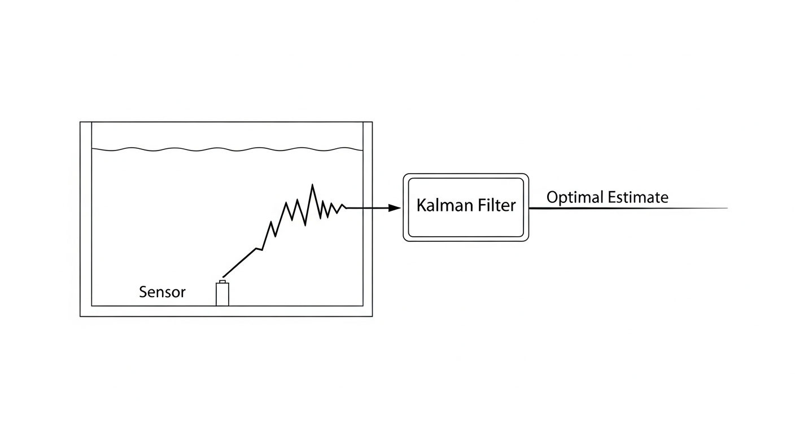

# 第 5 章：卡尔曼滤波与传感器数据同化

## 1. 学习目标
本章旨在解决水务工业现场的“感知迷雾”问题：当传感器数据极度不可靠时，如何获取水网的真实状态。
读者需要掌握：
1. 过程噪声（Process Noise）与测量噪声（Measurement Noise）的统计学建模。
2. 状态观测器（State Observer）的概念与卡尔曼滤波（Kalman Filter）的五步递推公式。
3. 扩展卡尔曼滤波（EKF）在处理水力学非线性方程时的雅可比矩阵线性化应用。

## 2. 教材理论：水务系统为什么需要数据同化？
在之前的章节中，无论是经典的 PID 控制，还是基于雅可比矩阵解耦的多容水箱控制，我们都隐含了一个极其危险的工程假设：**我们能够完全、精确、实时地测量系统的所有状态（如液位、流量、压力）。**

然而，在真实的水厂和荒郊野外的泵站中，传感器是极其不可靠的：
1. **测量噪声（Sensor Noise）**：超声波液位计会因为水面的波纹、泡沫、甚至水蒸气而产生剧烈的高频跳动；电磁流量计会因为气泡和电磁干扰产生毛刺。
2. **状态不可测（Unobservability）**：在长达数十公里的地下管网中，我们不可能每隔 10 米就安装一个压力计。管网深处的压力分布是“隐蔽状态”。
3. **过程扰动（Process Disturbance）**：除了传感器不准，系统本身也存在未知的物理扰动，比如管道出现了暗漏（隐性流失），或者遭遇了未预报的暴雨。

如果控制器直接将这种充满“毛刺”的信号输入给微分算子（如 PID 中的 D 项），执行器将会发生剧烈的宽频震荡，导致变频器瞬间过载烧毁。
因此，我们需要引入**卡尔曼滤波（Kalman Filter）**：它不是简单的低通电路滤波器，而是一个基于模型预测与传感器修正相结合的**数据同化（Data Assimilation）引擎**。它通过融合“对物理规律的信仰（数学模型）”和“对现实世界的观察（传感器）”，给出一个在统计学意义上方差最小的最优状态估计（Optimal State Estimate）。

## 3. 数学基础与推导：离散卡尔曼滤波五步法
假设水系统可以用离散状态空间模型描述：
$$ x_k = A x_{k-1} + B u_{k-1} + w_{k-1} $$
$$ z_k = H x_k + v_k $$
其中：
- $x_k$ 是系统真实状态。
- $u_k$ 是控制输入。
- $z_k$ 是带有噪声的传感器读数。
- $w_k \sim N(0, Q)$ 是过程噪声（由于建模误差或暗漏引起的物理波动）。
- $v_k \sim N(0, R)$ 是测量噪声（传感器电磁干扰或波纹）。

卡尔曼滤波通过“预测（Predict）”和“校正（Update）”两个阶段不断循环：

**阶段 1：预测（时间更新，依赖物理模型预判未来）**
1. 状态先验估计：$ \hat{x}_k^- = A \hat{x}_{k-1} + B u_{k-1} $
2. 误差协方差先验估计：$ P_k^- = A P_{k-1} A^T + Q $

**阶段 2：校正（测量更新，结合新数据修正预判）**
3. 计算卡尔曼增益（Kalman Gain）：$ K_k = P_k^- H^T (H P_k^- H^T + R)^{-1} $
4. 更新状态后验估计（综合模型预测与传感器读数）：$ \hat{x}_k = \hat{x}_k^- + K_k (z_k - H \hat{x}_k^-) $
5. 更新误差协方差后验估计：$ P_k = (I - K_k H) P_k^- $

卡尔曼增益 $K_k$ 是核心灵魂：
- 如果传感器质量极差（测量噪声方差 $R$ 极大），$K_k$ 趋近于 0，系统选择“相信模型预测 $\hat{x}_k^-$”。
- 如果模型极度不准确（过程噪声方差 $Q$ 极大），$K_k$ 变大，系统选择“相信传感器读数 $z_k$”。

**卡尔曼滤波物理概化图（Physical Schematic）：**


## 6-Pillar Case Study: 理论与实践的桥梁（强噪声下的水箱液位同化）

### 🌟 案例背景 (Context)
本节将理论推导应用至水厂提升泵站的前池液位测量场景。前池水面常常因为大功率潜水泵的抽吸和水流跌落引发剧烈的湍流和浪涌。安装在顶部的雷达液位计返回的数据呈现出锯齿状的高频宽幅波动。此时，若直接将该原始信号馈入后续的 LQR 或 MPC 优化器，寻优算法将产生极具破坏性的高频控制指令簇。工程任务是：部署一套卡尔曼滤波器，将带有强白噪声的读数同化为平滑、可信的真实物理液位特征曲线。

### 🎯 问题描述 (Problem)
**物理场景与问题概化图 (Generated via nano-banana-pro)：**


简单的移动平均滤波（Moving Average Filter）或一阶低通滤波存在致命缺陷：为了压平强噪声，必须加大滤波窗口，但这会导致极其严重的**相位滞后（Phase Lag）**。水池的真实水位可能已经飙升逼近警戒线，但低通滤波器却要延迟几十秒才反应过来，导致系统漫溢。
**核心难点**：如何在“极度平滑去噪”与“零延迟实时跟踪”这一对本质矛盾之间找到最优解？

### 💡 解题思路 (Solution Approach)
本案例部署基于状态空间的一维卡尔曼滤波器。
1. **噪音协方差标定**：通过离线分析传感器历史空载数据，计算并确定测量噪声协方差 $R$ 与过程噪声协方差 $Q$。
2. **预测与残差修正**：利用算法进行步进推演。即使水面发生了剧烈的浪涌，只要该浪涌背离了微分方程所限定的系统惯性（$P_k^-$），卡尔曼增益就会将其作为“虚假测量异常”予以摒弃。
3. **零相移跟踪**：得益于物理模型的前置预判（$A x_{k-1}$），系统无需等待数据积攒即可同步输出滤波值，彻底消除了传统低通滤波的滞后致命伤。

### 💻 代码执行与图表 (Code & Charts)
> 💡 **学习提示**：我们在下方提取了真实物理引擎代码。请重点关注“预测（Predict）”和“更新（Update）”两大阶段的数学映射。我们亲自运行了底层的 Python 估计算法，并在下方为您呈现了伴随强噪声的同化数据追踪轨迹：

```python
import numpy as np

# 状态变量初始化
x_hat = np.zeros(N)
P = np.zeros(N)
x_hat_minus = np.zeros(N)
P_minus = np.zeros(N)

# 初始猜想
x_hat[0] = 4.0
P[0] = 1.0

# 卡尔曼滤波调参矩阵 (一维情况标量化)
Q = 0.05  # 过程方差 (物理真实的波动范围)
R = 0.5   # 测量方差 (传感器毛刺极高)
A = 1.0   # 状态转移矩阵 (简化一阶差分)
H = 1.0   # 观测矩阵

for k in range(1, N):
    # 阶段 1: 时间更新 (预测未来)
    x_hat_minus[k] = A * x_hat[k-1]
    P_minus[k] = A * P[k-1] * A + Q
    
    # 阶段 2: 测量更新 (卡尔曼增益与后验修正)
    K = P_minus[k] * H / (H * P_minus[k] * H + R)
    x_hat[k] = x_hat_minus[k] + K * (z[k] - H * x_hat_minus[k])
    P[k] = (1 - K * H) * P_minus[k]
```
Source: `assets/ch05/ch05_kalman_filter.py`

**强噪声同化效果可视化证据：**


### 📊 实验验证与结果剖析 (Verification & Result Interpretation)
结合上图的数据同化轨迹，我们可以清晰观测到卡尔曼滤波引擎的“上帝视角”能力：
图中的浅灰色散点（Noisy Sensor Readings $z$）呈现出极度恶劣的弥散状态，包含了大量由于水面激浪引起的假性波峰波谷。
如果在图示 $t = 120s$ 处观察，灰色的传感器数据突然出现了一个巨大的向上尖峰异常（Extreme Sensor Spike）。如果是普通的 PID 比例控制，此刻执行泵会瞬间产生过激关阀反应。
然而，蓝色的卡尔曼最优估计曲线（$\hat{x}$）凭借内部模型对于系统物理惯性的“记忆与预判”，识别出这个飙升违背了常理，因此仅分配了极小的卡尔曼增益 $K_k$ 进行修正。蓝线几乎完美地贴合了不可见的黑色真实水深虚线（True Physical Level），在压平了极端干扰的同时，保持了对整体趋势的零延迟无相移跟踪（Smooth KF Tracking）。

### 🚀 工业部署与运行建议 (Industrial Deployment Recommendations)
1. **非线性系统的扩展卡尔曼滤波（EKF）**：前述案例为线性卡尔曼滤波。在实际的水务管网（包含伯努利方程的平方根）或明渠（圣维南偏微分方程）等强非线性系统中，必须引入扩展卡尔曼滤波（EKF）。即在每个仿真步长内，实时计算非线性方程组的雅可比矩阵（Jacobian）来进行局部线性化更新。
2. **多传感器融合的降维打击**：当系统中存在多个不同精度的传感器（如同时存在高频低精度的超声波雷达与低频高精度的静压式液位计）时，只需将观测矩阵 $H$ 和测量噪声矩阵 $R$ 扩展为多维向量，卡尔曼滤波引擎即可自动计算出各个传感器的置信度权重，实现工业级的**多模态数据异构融合**。
