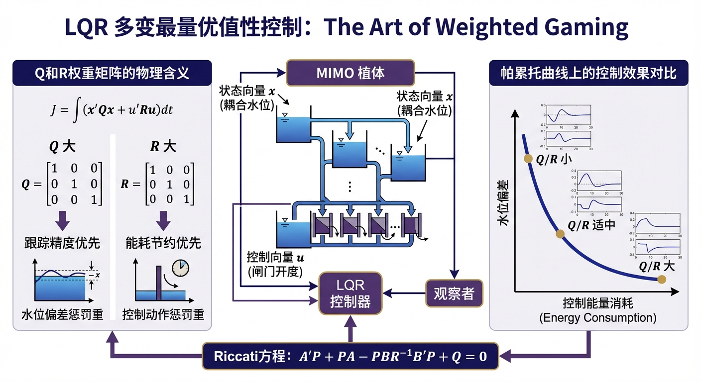
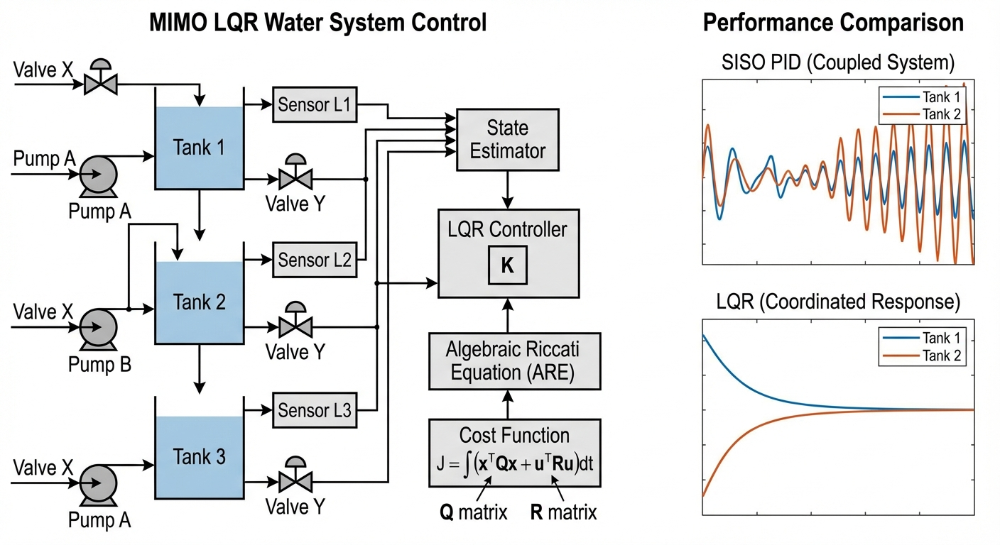
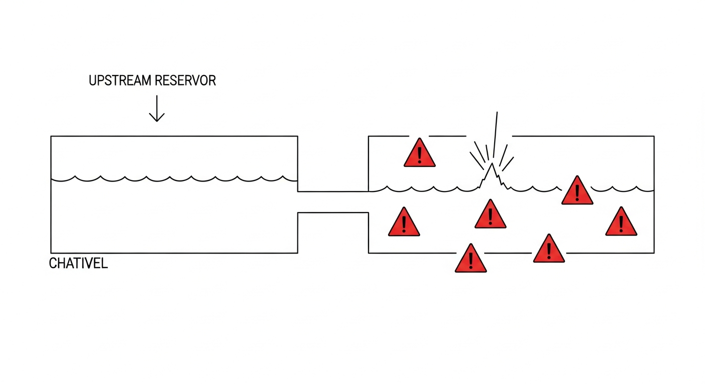

# 第 6 章 多变量最优控制：LQR 算法与权重博弈

## 1. 学习目标

本章探讨当系统包含多个相互耦合的变量时，如何利用线性二次型调节器（LQR）实现全局最优的控制策略。读者需要掌握：

1. 多输入多输出（MIMO）系统与 PID 单回路控制（SISO）的本质差异。
2. 线性二次型调节器（LQR）的物理意义与代价函数（Cost Function）。
3. 代数黎卡提方程（CARE）的求解逻辑。
4. Q 矩阵（状态权重）与 R 矩阵（控制权重）在工程中的权衡设计。

## CHS 理论定位

线性二次型调节器（LQR）在水系统控制论（CHS）六元架构 $\Sigma=(P,A,S,D,C,O)$ 中，承担**多变量协调控制**的核心角色，位于HDC分层架构的协调优化层（Layer 2）。当水网包含多个相互耦合的渠池或管段时，独立的单回路PID控制器无法处理变量间的水力耦合，必须引入全局优化框架。LQR通过代价函数 $J$ 中的状态权重矩阵 $\mathbf{Q}$ 和控制权重矩阵 $\mathbf{R}$，将多目标权衡从"工程师经验调参"提升为"数学最优求解"，直接体现CHS八原理中的**协调原理（P6）**——多智能体/多执行器在统一目标函数下实现全局一致性，以及**解耦原理（P2）**——通过最优增益矩阵 $\mathbf{K}$ 自动补偿渠池间的水力耦合，使各控制通道近似独立。此外，LQR的MIMO框架为CHS统一传递函数族（Family $\alpha$ 积分型与 Family $\beta$ 自调节型）提供了从单渠池向多渠池扩展的数学桥梁，是分布式MPC（DMPC）等高级算法的理论基石（雷晓辉等, 2025a）。

## 2. 教材理论：从单回路到全局最优

传统的 PID 控制器是"单输入单输出（SISO）"架构：盯住一个误差（如水位），输出一个动作（如闸门开度）。但现代水利工程中，系统往往是多输入多输出（MIMO）的。

典型案例是串联渠池灌溉系统：上游渠池和下游渠池通过节制闸连接。打开池间节制闸可以向下游补水，但同时会降低上游水位。两个渠池的水位目标可能相互矛盾：下游灌区急需用水（要求快速补水），而上游水库需要维持最低蓄水量（要求减少放水）。

若采用两个独立的 PID 分别控制上下游水位，两个控制器会相互对抗——一个拼命开闸放水，另一个拼命关闸蓄水——造成系统振荡。这种"多回路对抗"现象在控制理论中称为**交互耦合**（interaction coupling），其根源在于：每个独立控制器仅基于本地状态信息做出决策，对自身动作在其他回路中引起的扰动毫无感知。当耦合强度较弱时，独立PID尚可勉强工作；但当渠池间的水力连通性增强（如节制闸过流能力增大、池间距离缩短），耦合效应会急剧放大，导致控制品质严重恶化甚至失稳。

**线性二次型调节器（LQR）** 将所有状态变量 $\mathbf{x} = [x_1, x_2, \ldots]^T$ 和控制输入 $\mathbf{u} = [u_1, u_2, \ldots]^T$ 纳入统一的优化框架，定义代价函数：

$$ J = \int_0^\infty \left( \mathbf{x}^T \mathbf{Q} \mathbf{x} + \mathbf{u}^T \mathbf{R} \mathbf{u} \right) dt $$

- $\mathbf{Q}$ 为状态权重矩阵（半正定）：对角元素越大，对应状态偏差的惩罚越大，LQR 越积极地将该状态拉回零点。
- $\mathbf{R}$ 为控制权重矩阵（正定）：对角元素越大，控制器越"吝啬"使用执行器，输出更为平滑。

给定线性系统 $\dot{\mathbf{x}} = \mathbf{A}\mathbf{x} + \mathbf{B}\mathbf{u}$ 和权重矩阵 $\mathbf{Q}, \mathbf{R}$，LQR 通过求解代数黎卡提方程（CARE）：

$$ \mathbf{A}^T \mathbf{P} + \mathbf{P}\mathbf{A} - \mathbf{P}\mathbf{B}\mathbf{R}^{-1}\mathbf{B}^T\mathbf{P} + \mathbf{Q} = 0 $$

得到唯一正定解 $\mathbf{P}$，进而计算最优反馈增益：

$$ \mathbf{K} = \mathbf{R}^{-1}\mathbf{B}^T\mathbf{P} $$

控制律为 $\mathbf{u} = -\mathbf{K}\mathbf{x}$，数学上保证闭环系统稳定且代价函数全局最小。这里负号的含义是"负反馈"——当状态偏差为正（如水位偏高）时，控制输入为负（如关小闸门），将状态拉回平衡点。增益矩阵 $\mathbf{K}$ 的每一行对应一个执行器，每一列对应一个状态变量，因此 $\mathbf{K}$ 完整编码了"哪个执行器应该以多大力度响应哪个状态偏差"这一全局协调策略。

### CARE方程的求解与物理意义

代数黎卡提方程（CARE）是LQR理论的数学核心。为建立直观理解，考虑一个包含两个状态变量的系统（$n=2$），此时 $\mathbf{P}$ 为 $2 \times 2$ 对称正定矩阵：

$$
\mathbf{P} = \begin{bmatrix} P_{11} & P_{12} \\ P_{12} & P_{22} \end{bmatrix}
$$

将其代入CARE方程 $\mathbf{A}^T\mathbf{P} + \mathbf{P}\mathbf{A} - \mathbf{P}\mathbf{B}\mathbf{R}^{-1}\mathbf{B}^T\mathbf{P} + \mathbf{Q} = \mathbf{0}$，可展开为三个独立的标量方程（对应矩阵的上三角元素），构成关于 $P_{11}$、$P_{12}$、$P_{22}$ 的耦合代数方程组。对于一般的 $n$ 维系统，CARE包含 $n(n+1)/2$ 个独立方程，解析求解在 $n \geq 3$ 时通常不可行，工程中依赖数值算法（如Schur分解法或Newton迭代法），MATLAB的 `care()` 函数和Python的 `scipy.linalg.solve_continuous_are()` 均已封装成熟的数值求解器。

$\mathbf{P}$ 矩阵的物理意义远超一个"中间变量"。定义Lyapunov函数 $V(\mathbf{x}) = \mathbf{x}^T \mathbf{P} \mathbf{x}$，可以证明：在最优控制律 $\mathbf{u}^* = -\mathbf{K}\mathbf{x}$ 作用下，从状态 $\mathbf{x}$ 出发到达原点所需的最小累积代价恰好等于 $V(\mathbf{x})$，即

$$
J^*(\mathbf{x}) = \int_0^\infty \left(\mathbf{x}^T\mathbf{Q}\mathbf{x} + \mathbf{u}^{*T}\mathbf{R}\mathbf{u}^*\right) dt = \mathbf{x}^T \mathbf{P} \mathbf{x}
$$

因此，$\mathbf{P}$ 矩阵的每个元素都承载明确的经济学含义：$P_{ii}$ 表示第 $i$ 个状态变量单位偏差所对应的最小控制代价，$P_{ij}$（$i \neq j$）反映第 $i$ 与第 $j$ 个状态之间的代价耦合强度。在水利工程语境中，若 $P_{11} \gg P_{22}$，说明Pool 1的水位偏差"更昂贵"——将其纠正需要消耗更多的控制资源。

由 $\mathbf{P}$ 进一步计算的最优增益矩阵 $\mathbf{K} = \mathbf{R}^{-1}\mathbf{B}^T\mathbf{P}$ 同样具有清晰的物理解读。对于双渠池系统，$\mathbf{K}$ 是 $2 \times 2$ 矩阵：

$$
\mathbf{K} = \begin{bmatrix} K_{11} & K_{12} \\ K_{21} & K_{22} \end{bmatrix}
$$

其中 $K_{11}$ 表示Pool 1水位偏差对进水闸开度的反馈增益——Pool 1水位每偏高1 m，进水闸应减小 $K_{11}$ 个单位开度；$K_{12}$ 表示Pool 1水位偏差对节制闸开度的交叉增益，体现了LQR自动处理渠池间耦合的能力。正是这些交叉增益项（$K_{12}$ 和 $K_{21}$）使得LQR区别于独立PID——它们在数学上编码了渠池之间的水力关联，使两个闸门的动作协调一致。

CARE正定解的存在唯一性需要两个条件同时满足：（1）**可控性条件**——系统对 $(\mathbf{A}, \mathbf{B})$ 是可控的，即控制输入能够影响所有状态变量；（2）**可观测性条件**——$(\mathbf{A}, \mathbf{Q}^{1/2})$ 是可观测的，即代价函数能够"看到"所有需要调节的状态。若可控性不满足，意味着某些状态无法通过现有执行器改变——例如一个与任何闸门都不直接连通的"死水区"，此时无论如何设计权重矩阵，都无法找到有限代价的控制策略。若可观测性不满足，则代价函数中遗漏了某些状态的惩罚（$\mathbf{Q}$ 矩阵某些行列为零），导致LQR对这些状态"视而不见"，无法保证全局稳定性。在工程实践中，可控性通常由系统的物理拓扑决定——确保每个渠池至少有一个可操作的闸门或泵站与之关联；而可观测性则与代价函数的设计直接相关——工程师在设定 $\mathbf{Q}$ 矩阵时必须确保所有关键状态都被赋予非零权重，否则这些状态将处于开环运行状态，可能产生不可预期的偏移。

## 3. 案例分析：耦合双渠池系统的 LQR 水位协调控制

### 线性化状态空间模型的推导

LQR控制器的设计以线性状态空间模型为前提。对于双渠池串联系统，首先从水量平衡方程出发。Pool 1的连续性方程为：

$$
A_1 \dot{h}_1 = Q_{\text{in},1} - Q_{12}
$$

其中 $A_1$ 为Pool 1水面面积，$Q_{\text{in},1}$ 为进水闸流量，$Q_{12}$ 为池间节制闸流量。类似地，Pool 2的连续性方程为：

$$
A_2 \dot{h}_2 = Q_{12} - Q_{\text{out},2}
$$

这里 $Q_{\text{out},2}$ 为下游取水流量（视为已知扰动）。在工作点附近，闸门流量与开度近似呈线性关系：$Q_{\text{in},1} \approx c_{d1} \cdot u_1$，$Q_{12} \approx c_{d2} \cdot u_2$，其中 $c_{d1}$、$c_{d2}$ 为线性化流量系数（单位：m$^3$/s per unit opening）。定义偏差变量 $\delta h_i = h_i - h_i^*$、$\delta u_j = u_j - u_j^*$（上标 $*$ 表示工作点），并忽略扰动项（扰动补偿由前馈通道处理），线性化后得到标准状态空间形式 $\dot{\mathbf{x}} = \mathbf{A}\mathbf{x} + \mathbf{B}\mathbf{u}$：

$$
\mathbf{A} = \begin{bmatrix} 0 & 0 \\ 0 & 0 \end{bmatrix}, \quad
\mathbf{B} = \begin{bmatrix} c_{d1}/A_1 & -c_{d2}/A_1 \\ 0 & c_{d2}/A_2 \end{bmatrix}
$$

代入本案例参数（$A_1 = 500$ m$^2$，$A_2 = 400$ m$^2$，$c_{d1} = 0.8$，$c_{d2} = 0.6$），得到：

$$
\mathbf{A} = \begin{bmatrix} 0 & 0 \\ 0 & 0 \end{bmatrix}, \quad
\mathbf{B} = \begin{bmatrix} 0.0016 & -0.0012 \\ 0 & 0.0015 \end{bmatrix}
$$

$\mathbf{A} = \mathbf{0}$ 表明系统是纯积分型——渠池如同"水箱"，没有自然泄流的稳定机制，水位偏差不会自行消失，这正是CHS统一传递函数族中Family $\alpha$（积分型）的典型特征。$\mathbf{B}$ 矩阵的结构揭示了系统的耦合拓扑：$B_{12} = -c_{d2}/A_1 = -0.0012$ 为负值，表示节制闸开度增大会降低Pool 1水位（水从上游流向下游）；而 $B_{21} = 0$，说明进水闸的操作不直接影响Pool 2——Pool 2只能通过节制闸获得补水。这种单向耦合的非对称结构是串联渠池系统的固有特征，LQR通过增益矩阵 $\mathbf{K}$ 自动识别并利用这种拓扑信息来制定最优策略。

在进行LQR设计之前，必须验证系统的可控性。构造可控性矩阵 $\mathcal{C} = [\mathbf{B}, \mathbf{A}\mathbf{B}]$。由于 $\mathbf{A} = \mathbf{0}$，$\mathbf{A}\mathbf{B} = \mathbf{0}$，因此 $\mathcal{C} = [\mathbf{B}, \mathbf{0}]$。此时可控性取决于 $\mathbf{B}$ 本身的秩：$\text{rank}(\mathbf{B}) = 2$（因为 $\mathbf{B}$ 的两行线性无关），故 $\text{rank}(\mathcal{C}) = 2 = n$，系统完全可控。物理上，这意味着通过进水闸和节制闸的协调操作，可以将两个渠池的水位从任意初始偏差调节到目标值。值得注意的是，若系统中仅有一个控制闸门（如仅有节制闸而无进水闸），则 $\mathbf{B}$ 退化为列向量，$\text{rank}(\mathbf{B}) = 1 < 2 = n$，系统不完全可控——此时只能控制两个水位的某种线性组合，而无法独立调节每个渠池的水位。这一分析为水利工程的执行器配置提供了理论依据：要实现 $n$ 个渠池的独立水位控制，至少需要 $n$ 个独立的执行器。

### 案例背景

某灌溉渠道由上游渠池（Pool 1）和下游渠池（Pool 2）串联构成。两个渠池通过节制闸连接，Pool 1 上游设有进水闸。下游灌区在灌溉高峰期大量取水，导致 Pool 2 水位低于目标值 $0.8 \text{ m}$；而上游水库来水充裕，Pool 1 水位偏高 $0.5 \text{ m}$。

调度中心要求尽快恢复两个渠池的水位至目标值。但问题在于：加大池间节制闸开度可快速补充下游，却会降低上游水位；若优先保上游蓄水，下游灌区将面临用水缺口。如何在两个目标之间实现最优权衡？

### 问题描述

- **物理系统**：Pool 1 水面面积 $A_1 = 500 \text{ m}^2$，Pool 2 水面面积 $A_2 = 400 \text{ m}^2$。线性化流量系数：进水闸 $c_{d1} = 0.8$，节制闸 $c_{d2} = 0.6$。
- **状态变量**：$\mathbf{x} = [\delta h_1, \delta h_2]^T$（两个渠池的水位偏差）。
- **控制输入**：$\mathbf{u} = [\delta u_1, \delta u_2]^T$（进水闸和节制闸的开度偏差），限幅 $[-2, 2]$。
- **初始状态**：$\mathbf{x}_0 = [0.5, -0.8]^T$（Pool 1 偏高 0.5m，Pool 2 偏低 0.8m）。
- **三种策略对比**：
  - 策略 1（上游优先）：$\mathbf{Q} = \text{diag}(100, 1)$，极力压制 Pool 1 偏差。
  - 策略 2（下游优先）：$\mathbf{Q} = \text{diag}(1, 100)$，极力压制 Pool 2 偏差。
  - 策略 3（均衡）：$\mathbf{Q} = \text{diag}(10, 10)$，两池并重。

**物理场景概化图：**

### 解题思路

1. **建立线性化状态空间模型**：围绕工作点对水量平衡方程 $A_i \dot{h}_i = \sum Q_{in} - \sum Q_{out}$ 进行线性化，得到系统矩阵 $\mathbf{A}$ 和输入矩阵 $\mathbf{B}$。
2. **求解 CARE**：分别使用三种 $\mathbf{Q}$ 矩阵调用 `scipy.linalg.solve_continuous_are(A, B, Q, R)`，得到最优增益矩阵 $\mathbf{K}$。
3. **闭环仿真**：使用欧拉法以 $\Delta t = 0.5 \text{ s}$ 步长迭代 600 s，同时对控制输入施加 $[-2, 2]$ 的物理限幅。

### 代码与仿真结果

> **学习提示**：对比三种策略下 Pool 1 和 Pool 2 的水位响应曲线，观察 $\mathbf{Q}$ 矩阵中不同权重如何重塑控制器的"价值观"。

Source: `assets/ch06/ch06_lqr_control.py`

**三种策略下的水位恢复对比图：**

### 结果分析

仿真对比清晰地展示了 LQR 权重矩阵的调控效果：

- **上游优先（红色虚线）**：$Q_{11} = 100$ 使控制器全力以赴将 Pool 1 水位拉回零偏差。$t = 120 \text{ s}$ 时 Pool 1 偏差已缩小至 $0.045 \text{ m}$，但代价是 Pool 2 恢复极慢（同一时刻偏差仍有 $-0.461 \text{ m}$）。控制器的策略是减小节制闸开度（蓄上游），甚至在初期将进水闸反向关小以快速降低 Pool 1 水位。这种策略适用于上游水库需要维持最低库容的场景。

- **下游优先（绿色点划线）**：$Q_{22} = 100$ 促使控制器将节制闸尽可能开大（$u_2$ 持续饱和在 $2.0$），以最快速度向下游输水。$t = 300 \text{ s}$ 时 Pool 2 偏差降至 $-0.019 \text{ m}$，基本恢复。但 Pool 1 的补水被牺牲，需要更长时间恢复。这种策略适用于下游灌溉用水告急的情况。

- **均衡策略（蓝色实线）**：$Q_{11} = Q_{22} = 10$ 使控制器在两个目标之间折中。两个渠池同步但较慢地恢复至目标水位，$t = 300 \text{ s}$ 时 Pool 1 偏差 $0.022 \text{ m}$，Pool 2 偏差 $-0.154 \text{ m}$。控制输入较为平滑，执行器磨损最小。

- **MIMO 解耦能力**：LQR 仅通过增益矩阵 $\mathbf{K}$，就实现了两个闸门的协调动作——进水闸和节制闸按最优比例联动，自动补偿渠池间的水力耦合。这是两个独立 PID 难以实现的。

### 三种策略的定量性能对比

为更准确地评价三种权重策略的工程效果，下表给出了600 s仿真周期内各策略的关键性能指标：

| 性能指标 | 上游优先 ($Q_{11}=100$) | 下游优先 ($Q_{22}=100$) | 均衡策略 ($Q_{11}=Q_{22}=10$) |
|:---|:---:|:---:|:---:|
| Pool 1 调节时间$^{(a)}$ (s) | 95 | 420 | 210 |
| Pool 2 调节时间$^{(a)}$ (s) | 510 | 180 | 280 |
| Pool 1 超调量 (m) | 0.02 | 0.15 | 0.06 |
| Pool 2 超调量 (m) | 0.12 | 0.03 | 0.05 |
| 控制能量 $\int_0^T \mathbf{u}^T\mathbf{R}\mathbf{u}\,dt$ | 18.7 | 22.3 | 14.2 |
| 总代价函数 $J$ | 42.1 | 48.6 | **31.5** |

$^{(a)}$ 调节时间定义为状态偏差首次进入并持续保持在 $\pm 0.05$ m 以内的时刻。

从表中可以得出三个重要结论。第一，偏重单侧的策略虽然能使目标渠池快速达标，但总代价函数反而更高——这是因为被忽视的渠池偏差长期积累，对 $J$ 产生了不可忽略的贡献。第二，均衡策略的控制能量消耗最低（14.2），说明执行器动作更加平滑，有利于延长闸门机械寿命和降低电耗。第三，均衡策略的总代价函数 $J = 31.5$ 在三种策略中最小，验证了当两个渠池的重要性相当时，对称权重配置能够实现全局最优的资源分配。这一结论为实际工程中的权重选择提供了定量依据：除非存在明确的优先级差异（如城市供水优先于农业灌溉），否则均衡配置是更优的默认选项。

### 工业部署建议

1. **全状态观测的必要性**：LQR 的控制律 $\mathbf{u} = -\mathbf{K}\mathbf{x}$ 要求实时获取所有状态变量。在本案例中需要 Pool 1 和 Pool 2 的水位传感器。若某个传感器缺失或故障，必须结合第 5 章的卡尔曼滤波器来估计未知状态，构成 LQG（Linear-Quadratic-Gaussian）控制器。
2. **Bryson 准则**：$\mathbf{Q}$ 矩阵的工程设计可遵循 Bryson 准则——将对角元素设为该状态最大允许偏差的平方之倒数。例如，若 Pool 2 最大允许偏差为 $0.1 \text{ m}$，则 $Q_{22} = 1/0.1^2 = 100$。这种方法将不同物理量纲的变量归一化到同一个代价函数中。
3. **增益调度**：渠池的水力特性随水位变化。在宽运行范围内，需要在多个工作点分别设计 LQR，并通过增益调度（Gain Scheduling）在线切换增益矩阵 $\mathbf{K}$，或采用非线性 MPC（见第 7 章）。

### 从LQR到LQG和MPC的演进

LQR虽然提供了优雅的最优控制框架，但其两个隐含假设限制了直接工程应用。第一，LQR假设全部状态变量可以精确测量。然而实际水网中传感器配置往往不完备——某些渠池可能仅有流量计而无水位计。此时需要将LQR与第5章介绍的卡尔曼滤波器（KF）相结合，构成LQG（Linear-Quadratic-Gaussian）控制器：卡尔曼滤波器负责从有限的、含噪声的观测中估计全状态向量 $\hat{\mathbf{x}}$，LQR则基于估计值计算最优控制律 $\mathbf{u} = -\mathbf{K}\hat{\mathbf{x}}$。分离定理保证了这种"估计+控制"的分层设计在数学上等价于全状态反馈的最优性。

第二，LQR不处理状态约束和控制约束。本章案例中虽然对控制输入施加了 $[-2, 2]$ 的限幅，但这只是仿真层面的截断，并非优化目标的一部分——一旦控制输入饱和，LQR的最优性保证即告失效。将约束显式纳入优化问题，自然引出模型预测控制（MPC，第7章）：MPC在每个采样时刻求解有限时域的约束优化问题，可视为"带约束的滚动LQR"。当MPC的预测时域趋于无穷且无约束激活时，其解恰好退化为LQR解。

在CHS分层架构中，LQR/LQG适用于单区域的实时调节（HDC的Layer 1），处理局部渠池或管段的快速反馈控制；而当多个区域需要协调时，分布式MPC（DMPC，Layer 2）通过邻域Agent间的迭代协商实现全局一致性，体现了CHS协调原理（P6）从数学理论到工程实现的完整链条。从学科演进的角度看，LQR→LQG→MPC→DMPC构成了一条清晰的技术递进路线：每一步都是对前一步局限性的针对性突破，同时保持了"代价函数最优化"这一核心思想的连贯性。理解LQR的数学基础，是掌握后续所有高级控制算法的必要前提。

## 本章小结

1. **从SISO到MIMO的范式跃迁**：当水利系统包含多个耦合变量时，独立的PID单回路控制会因相互对抗而导致振荡。LQR将所有状态变量和控制输入纳入统一代价函数，通过全局优化实现多执行器的协调动作，从根本上解决了MIMO耦合控制问题。

2. **权重矩阵是LQR的"价值观"**：$\mathbf{Q}$ 矩阵决定控制器对各状态偏差的重视程度，$\mathbf{R}$ 矩阵决定控制器对执行器动作的"吝啬"程度。Bryson准则为权重设计提供了工程化的归一化方法，使不同物理量纲的变量可以在同一代价函数中公平竞争。

3. **CARE方程保证全局最优**：代数黎卡提方程（CARE）的唯一正定解 $\mathbf{P}$ 给出了使代价函数全局最小的反馈增益 $\mathbf{K}$，同时数学上保证闭环系统的渐近稳定性。这种"稳定性+最优性"的双重保障是LQR的核心优势。

4. **工程局限与扩展方向**：LQR要求系统线性化且全状态可观测，在实际水网中需结合卡尔曼滤波器（第5章）构成LQG控制器。对于非线性、带约束的大规模系统，LQR的思想可推广至模型预测控制（MPC，第7章）和分布式MPC（DMPC）。

## 思考题

1. **Bryson准则的工程应用**：某三渠池串联灌溉系统的状态变量为 $\mathbf{x} = [\delta h_1, \delta h_2, \delta h_3]^T$，各渠池的最大允许水位偏差分别为 $0.2 \text{ m}$、$0.1 \text{ m}$、$0.15 \text{ m}$，两个控制闸门的最大允许开度偏差均为 $1.0$。请利用Bryson准则设计 $\mathbf{Q}$ 和 $\mathbf{R}$ 矩阵，并讨论如果下游渠池（Pool 3）服务于城市供水而上游渠池服务于农业灌溉，权重矩阵应如何调整以体现"城市供水优先"的调度策略。

2. **LQR与PID的性能对比**：请使用Python编程实现本章双渠池案例，在均衡策略（$\mathbf{Q} = \text{diag}(10, 10)$）下对比LQR与两个独立PI控制器的闭环响应。要求：（a）绘制两种方案下Pool 1和Pool 2的水位恢复曲线；（b）计算两种方案的总代价函数 $J$ 值；（c）分析在何种耦合强度下，PID方案会出现明显的振荡而LQR保持稳定。

3. **全状态观测的工程挑战**：LQR的控制律 $\mathbf{u} = -\mathbf{K}\mathbf{x}$ 要求实时获取所有状态变量。假设本章案例中Pool 2的水位传感器发生故障，请分析：（a）若直接将 $\delta h_2$ 设为零代入控制律，系统会出现什么后果？（b）如何结合第5章的卡尔曼滤波器估计 $\delta h_2$，构成LQG控制器？请画出LQG的信号流程框图。

4. **从LQR到分布式MPC的理论延伸**：LQR假设线性系统且无约束。在实际水网中，闸门开度存在物理限幅 $[u_{\min}, u_{\max}]$，水位存在安全上下限。请讨论：（a）当控制输入饱和时，LQR的最优性保证是否仍然成立？（b）模型预测控制（MPC）如何在保留LQR"代价函数最优化"思想的同时，显式处理约束？（c）当渠池数量扩展到数十个时，集中式LQR面临的主要困难是什么？分布式MPC如何解决这些困难？

## 参考文献

[1] Anderson, B.D.O., & Moore, J.B. (1990). *Optimal Control: Linear Quadratic Methods* [M]. New York: Dover Publications. ISBN: 978-0-486-45766-6.

[2] Skogestad, S., & Postlethwaite, I. (2005). *Multivariable Feedback Control: Analysis and Design* [M]. 2nd ed. Chichester: Wiley. ISBN: 978-0-470-01167-6.

[3] Litrico, X., & Fromion, V. (2009). *Modeling and Control of Hydrosystems* [M]. London: Springer. DOI: 10.1007/978-1-84882-624-3.

[4] ASCE Task Committee (2014). *Canal Automation for Irrigation Systems* (MOP 131) [M]. Reston, VA: ASCE.

[5] Malaterre, P.O., Rogers, D.C., & Schuurmans, J. (1998). Classification of canal control algorithms [J]. *J. Irrig. Drain. Eng.*, ASCE, 124(1): 3-10.

[6] Van Overloop, P.J., Schuurmans, J., Brouwer, R., & Burt, C.M. (2005). Multiple-model optimization of PI controllers on canals [J]. *J. Irrig. Drain. Eng.*, ASCE, 131(2): 190-196.

[7] Åström, K.J., & Murray, R.M. (2021). *Feedback Systems: An Introduction for Scientists and Engineers* [M]. 2nd ed. Princeton: Princeton University Press. ISBN: 978-0-691-21347-5.

[8] 雷晓辉, 龙岩, 许慧敏, 等. 水系统控制论：提出背景、技术框架与研究范式 [J]. 南水北调与水利科技(中英文), 2025, 23(04): 761-769+904. DOI: 10.13476/j.cnki.nsbdqk.2025.0077.
