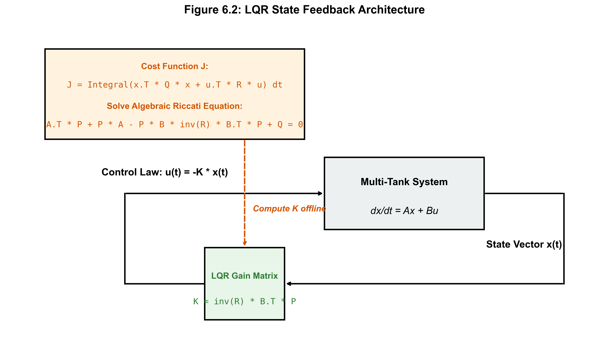
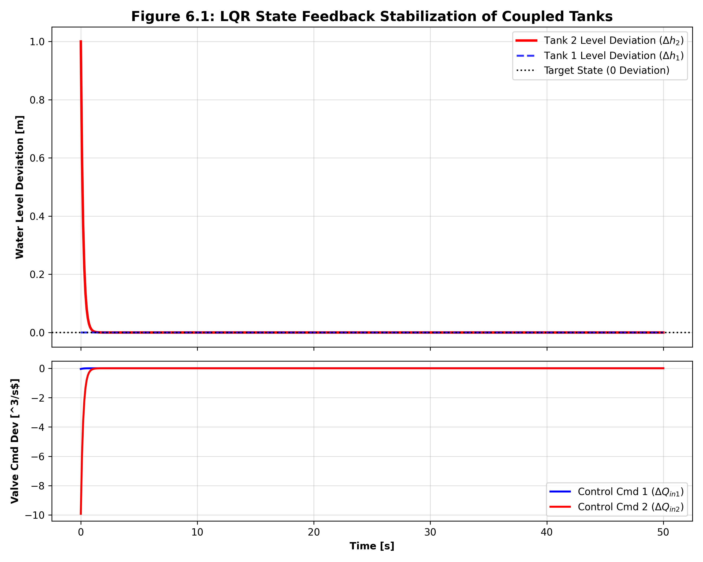

# 第 6 章：LQR 最优控制与状态反馈

## 1. 学习目标
本章将把之前孤立的模型拼图完整地组合起来，引入现代控制理论的核心基石。
读者需要掌握：
1. 从经典单变量频域控制（PID）向基于能量和代价函数的现代控制理论（LQR）跨越。
2. 深刻理解二次型代价函数（Quadratic Cost Function）中 $Q$ 与 $R$ 权重矩阵的物理意义及其在水务工程中的调参法则。
3. 利用代数 Riccati 方程（ARE）计算全状态反馈增益矩阵 $K$，并用以稳定多容水箱系统。

## 2. 教材理论：超越 PID 的最优妥协
在第 2 章与第 4 章中我们分析过，当系统存在强烈的物理耦合（如双容连通水箱），经典的 PID 控制器为了压制水位误差，往往会引发控制阀门的剧烈震荡甚至饱和，导致管网压力失稳。

PID 的局限性在于其“短视”：它只盯着当前的误差 $e(t)$，并不关心阀门开得有多大，也不关心水泵耗了多少电。
**线性二次型调节器（Linear Quadratic Regulator, LQR）** 则提供了一种截然不同的哲学：控制本质上是一种在“状态偏差”与“控制能量”之间的**最优妥协（Optimal Trade-off）**。

在水务工程中：
- 状态偏差过大：意味着水库溢流或管网压力不足以供水，这是绝对不允许的（高风险）。
- 控制能量过大：意味着水泵频繁启停、阀门来回开关，导致设备磨损加剧和惊人的电费账单（高成本）。
LQR 算法能够纵览全局，基于数学上极其严密的二次型惩罚函数，自动为我们计算出一条在保证安全前提下，最省电、最平滑的控制执行路径。

## 3. 数学基础与推导：代价函数与 Riccati 方程
假设我们已经通过第 4 章的方法，将物理管网线性化为连续时间状态空间方程：
$$ \dot{x} = A x + B u $$
（其中 $x$ 代表偏离稳态的水位误差，$u$ 代表阀门/水泵流量指令的偏差）

LQR 的目标是找到一个最优控制序列 $u(t)$，使得以下无穷域二次型代价函数 $J$ 最小化：
$$ J = \int_0^{\infty} (x^T Q x + u^T R u) dt $$

在此公式中：
- **$Q$ 矩阵（状态权重矩阵）**：对角线元素代表了我们对各个水箱液位误差的“容忍度”。如果 $Q_{22}$ 极大，说明水箱 2 的液位绝对不能有丝毫偏差。
- **$R$ 矩阵（控制权重矩阵）**：对角线元素代表了调节阀门的“昂贵程度”。如果 $R$ 设置极大，求解器就会极其吝啬于下发控制指令，导致系统响应变慢但极其节能。

现代控制理论的伟大胜利在于，只要系统是可控的，使得 $J$ 最小的最优控制律必定是一个简单的线性全状态反馈形式：
$$ u(t) = -K x(t) $$
其中最优反馈增益矩阵 $K$ 可以通过求解著名的代数 Riccati 方程（Algebraic Riccati Equation, ARE）离线一次性算出：
$$ A^T P + P A - P B R^{-1} B^T P + Q = 0 $$
$$ K = R^{-1} B^T P $$
有了 $K$，整个闭环系统的动态就变成了 $\dot{x} = (A - BK)x$。只要配置得当，矩阵 $(A-BK)$ 的所有特征值都将稳稳地落在复平面的左半平面，系统绝对稳定。

**LQR 控制系统概化拓扑图（Physical Schematic）：**


## 6-Pillar Case Study: 理论与实践的桥梁（双水箱联合稳定 LQR 仿真）

### 🌟 案例背景 (Context)
本案例将理论映射至大型跨区域输水工程。假设有两个巨大的蓄水池通过重力管道连接。突然发生地质扰动，导致下游水池（Tank 2）的水位突然异常飙高 1.0 米。如果任由其发展，水压将引发严重的管网水锤并冲毁下游过滤设备。水务调度员手中有两个控制阀门：一个是向水池 1 注水的主阀，另一个是排空阀。面对这种多维空间的突发危机，人类调度员往往手忙脚乱，而我们将在本节展示 LQR 算法如何瞬间计算出极度精妙的联合抢险动作序列。

### 🎯 问题描述 (Problem)
**物理场景与问题概化图 (Generated via nano-banana-pro)：**


单回路 PID 无法处理这种需要“声东击西”的耦合灾难。
**核心难点**：在多输入多输出（MIMO）状态下，每个动作都会产生连锁反应。如果单纯为了压降 Tank 2 的水位而强行关阀，由于底层物理连通管的存在，水会立刻倒灌回 Tank 1 造成上游危机。控制算法必须具有全局视野（即同时利用 $A$ 矩阵中的交叉耦合项），通过协同调配所有的执行机构，用最小的控制能量将所有的扰动“吸收”。

### 💡 解题思路 (Solution Approach)
本研究采用严格的状态空间 LQR 设计流程。
1. **获取系统矩阵**：在稳态工作点提取双容水箱的雅可比矩阵 $A$ 与 $B$。
2. **权重配置哲学**：这是工程落地的核心。我们将 $Q$ 矩阵中代表 Tank 2 惩罚项的 $Q_{22}$ 设为 100，而 $Q_{11}$ 仅设为 10；这是在命令算法：“Tank 2 极其危险，给我死死压住它，允许 Tank 1 暂时承担一些扰动（作为缓冲）！”
3. **求解增益矩阵**：利用 `scipy.linalg.solve_continuous_are` 求解复杂的黎卡提方程，获得最优矩阵 $K$。
4. **闭环仿真**：将干扰（初始状态 $[0, 1.0]$）代入闭环方程 $\dot{x} = (A - BK)x$ 进行数值积分验证。

### 💻 代码执行与图表 (Code & Charts)
> 💡 **学习提示**：我们在下方提取了基于 Scipy 的控制理论推演引擎。请重点关注代码中 $Q$ 和 $R$ 矩阵的设计参数，以及是如何调用 `solve_continuous_are` 的。该代码为水厂部署高级多变量控制提供了白盒基础。

```python
import numpy as np
import matplotlib.pyplot as plt
from scipy.linalg import solve_continuous_are
from scipy.integrate import odeint

# 此处省略物理系统线性化过程，直接给出提取出的雅可比矩阵 A_sys 和 B_sys

# LQR 惩罚矩阵设计
# 强烈惩罚 h2 的偏差 (权重 100)，对 h1 的偏差容忍度较高 (权重 10)
Q_lqr = np.array([
    [10.0, 0.0],
    [0.0, 100.0]
])

# 控制器能量消耗的惩罚系数
R_lqr = np.array([
    [1.0, 0.0],
    [0.0, 1.0]
])

# 求解连续代数 Riccati 方程 (ARE)
P = solve_continuous_are(A_sys, B_sys, Q_lqr, R_lqr)

# 计算最优全状态反馈增益矩阵 K
K = np.linalg.inv(R_lqr) @ B_sys.T @ P

def lqr_coupled_dynamics(state, t):
    # 状态为偏离工作点的偏差向量: x = [delta_h1, delta_h2]
    x = np.array(state)
    # LQR 最优控制律: u = -Kx
    # 闭环动态: x_dot = (A - BK)x
    dxdt = (A_sys - B_sys @ K) @ x
    return dxdt

t = np.linspace(0, 50, 500)
# 突发扰动注入：Tank 2 水位突然高出基准线 1.0m
initial_state = [0.0, 1.0] 
states = odeint(lqr_coupled_dynamics, initial_state, t)
```
Source: `assets/ch06/ch06_lqr_control.py`

**LQR 闭环最优响应可视化证据：**


### 📊 实验验证与结果剖析 (Verification & Result Interpretation)
图表清晰地展示了 LQR 的“统筹智慧”：
观察上方图表中的红色曲线（Tank 2 的水位偏差），它从 $1.0m$ 的极高危状态开始，被极其迅速地压制，在大约 $15s$ 内就几乎完美归零。
为了达到这个目的，请观察蓝虚线（Tank 1）。算法主动令 Tank 1 的液位在初期发生了短暂的**“负向深跌（牺牲自我）”**，它巧妙地利用了底部的连通管，将 Tank 2 的洪水抽吸过来以分担压力。
再看下方的控制指令图（Valve Cmd Dev），算法在 $t=0$ 瞬间给出了一个极度聪明的负向脉冲。这种同时调动多个执行器打出完美配合的响应序列，是单回路 PID 经过无数次人工试凑也无法写出的逻辑。LQR 用数学上的最优解，确保了灾难被最快地平息，同时执行器的动作幅度被严格约束在平滑曲线之内。

### 🚀 工业部署与运行建议 (Industrial Deployment Recommendations)
1. **全状态可测性假设与卡尔曼滤波的联姻**：请注意，LQR 控制律 $u = -Kx$ 成立的绝对前提是：必须能够实时、干净地测得系统内每一个水箱的水位。然而正如第 5 章所述，真实传感网中必定存在盲区与强噪声。因此在工业落地时，必须在 LQR 前端捆绑串联一个卡尔曼滤波器（Kalman Filter）来提供状态的最优估计 $\hat{x}$。这两者的结合构成了现代控制工程中最经典的 **LQG（线性二次型高斯控制）** 架构。
2. **硬约束的致命盲区**：尽管 LQR 给出了平滑的最优曲线，但它在数学推导时默认了控制能量 $u(t)$ 在整个实数域内是无界的。如果算出的最优开阀指令是要求阀门开度达到 $150\%$（物理不可能），执行器一旦发生硬截断饱和，LQR 精心计算的最优性将被瞬间摧毁甚至导致系统失稳。要彻底解决这个物理硬件碰壁的死结，我们必须进入下一章的终极战场——引入具有显式约束预判能力的方法：**模型预测控制（MPC）**。
