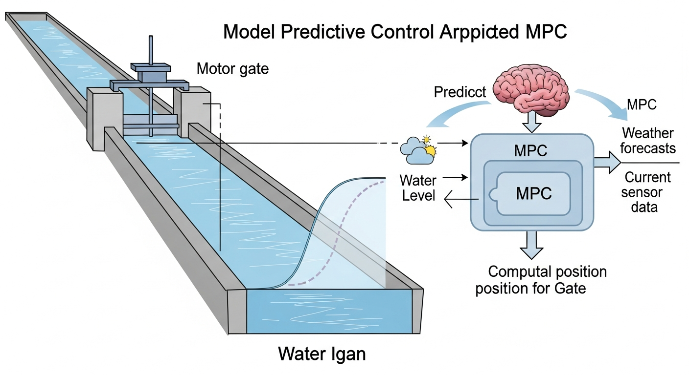
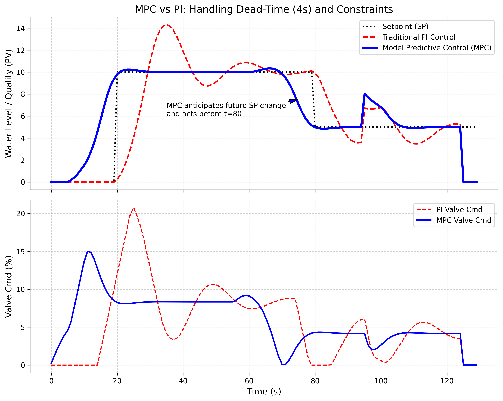

# 第 7 章 模型预测控制（MPC）

## 1. 学习目标
本章将探讨当系统存在巨大的“纯滞后（Dead Time）”、多变量耦合以及严苛的物理约束时，为什么 PID 会失效，以及工业界最顶级的控制算法——模型预测控制（MPC）是如何降维打击这些痛点的。
读者需要掌握：
1. 滚动优化（Receding Horizon Optimization）与预测模型的核心思想。
2. MPC 对抗纯滞后（Dead-Time）的天然免疫力机理。
3. 软约束与硬约束在 MPC 代价函数中的数学表达。
4. 二次规划（Quadratic Programming）求解器在控制回路中的运行机制。

## CHS 理论定位

模型预测控制（MPC）在水系统控制论（CHS）分层分布式控制（HDC）架构中，对应**协调优化层（Layer 2）**的核心算法。CHS将水网控制划分为四个层级：安全保护层（L0，PLC硬连锁，毫秒级）、实时调节层（L1，单回路PID/MPC，秒—分钟级）、协调优化层（L2，分布式MPC/DMPC，分钟—小时级）、计划调度层（L3，嵌套优化，日—年级）。MPC之所以占据L2的中枢位置，是因为它天然具备三项能力：（1）通过内部预测模型实现跨时间尺度的"前瞻性"决策，完美匹配L2层分钟到小时级的协调需求；（2）在代价函数中显式编码物理约束（水位上下限、闸门速率限制、渠道安全超高），使优化结果直接满足CHS八原理中的鲁棒性原理（P5）和协调原理（P6）；（3）滚动时域机制使其能够实时吸收传感器反馈，弥补模型失配，体现CHS反馈原理（P1）的核心精神。在CHS统一传递函数族的框架下，无论被控对象属于Family $\alpha$（积分型，如明渠、水库）还是Family $\beta$（自调节型，如河道洪水演进），MPC均可通过调整预测模型的阶数和参数，实现"一套算法框架、多种水力场景"的统一控制范式（雷晓辉等, 2025a）。从工程实践角度看，南水北调东线、胶东调水等长距离输水工程中，MPC正是解决大纯滞后、多渠池耦合问题的首选技术方案（雷晓辉等, 2025d）。

## 2. 理论基础：模型预测控制原理
传统的 PID 控制器是“盲人摸象”式的控制。它只知道“现在的误差是多少”，然后本能地踩油门或刹车。
当系统存在**巨大的纯滞后（例如：上游水库开闸放水，水要走 10 个小时才能流到下游城市）**时，PID 就会变成一个致命的“醉汉”。它看到下游缺水，就拼命开闸；等水 10 小时后到了，城市已经被淹了，它又拼命关闸，导致城市陷入干旱。PID 永远在“事后诸葛亮”，导致系统疯狂振荡。

**模型预测控制（MPC）**则像是一个戴着望远镜、手拿地图的老司机。
它的工作原理分为三步：
1. **预测未来（Prediction）**：它内部包含了一个系统的物理模型（或上一章辨识出来的灰盒模型）。在每一个当前时刻 $k$，它利用这个模型，推演出未来 $P$ 步（比如未来 10 小时）水位的走势图。
2. **滚动优化（Optimization）**：它不仅预测未来，还要规划未来。它会在后台通过二次规划（QP）求解器，疯狂计算未来 $M$ 步的闸门动作序列（比如：先开大一点，两小时后关小一半），使得未来 $P$ 步的水位尽可能贴近目标值，同时保证动作最平滑，且绝不违反大坝的安全约束。
3. **只走一步（Receding Horizon）**：虽然它规划了未来 $M$ 步的动作，但它**极其谨慎地只执行第 1 步的指令**。等到下一个时刻 $k+1$ 传感器传回新数据时，它会抛弃之前的旧计划，结合最新的真实数据，重新规划一个新的未来。

这种”目光长远、步步为营”的机制，使得 MPC 能够完美秒杀纯滞后问题，并在多变量约束控制中独步天下。

### MPC的数学表述

将上述三步机制翻译成严格的数学语言，是理解MPC工程实现的关键。考虑一个离散线性时不变系统：

$$x_{k+1} = A x_k + B u_k, \quad y_k = C x_k$$

其中 $x_k \in \mathbb{R}^n$ 为状态向量（如各渠池水位偏差），$u_k \in \mathbb{R}^m$ 为控制输入（如各闸门开度增量），$y_k \in \mathbb{R}^p$ 为量测输出。$A$、$B$、$C$ 分别为系统矩阵、输入矩阵和输出矩阵，可通过第6章介绍的系统辨识方法获取。

在每个采样时刻 $k$，MPC求解如下有限时域优化问题：

$$\min_{\Delta u_0,\ldots,\Delta u_{M-1}} J = \sum_{i=1}^{P} \|y_{k+i|k} - r_{k+i}\|_Q^2 + \sum_{j=0}^{M-1} \|\Delta u_{k+j}\|_R^2$$

式中，$P$ 为预测步长，$M$ 为控制步长（$M \leq P$），$r_{k+i}$ 为参考轨迹（期望水位），$\Delta u_{k+j} = u_{k+j} - u_{k+j-1}$ 为控制增量。权重矩阵 $Q \succeq 0$ 惩罚跟踪偏差，$R \succ 0$ 惩罚控制动作的剧烈程度。当 $j \geq M$ 时，默认 $\Delta u_{k+j} = 0$，即控制动作在 $M$ 步之后”冻结”。

上述优化必须满足物理约束：

$$u_{\min} \leq u_{k+j} \leq u_{\max}, \quad |\Delta u_{k+j}| \leq \Delta u_{\max}, \quad j = 0, 1, \ldots, M-1$$

第一组约束反映执行器的物理极限（如闸门开度 $0\%\sim100\%$），第二组约束反映执行器的速率限制（如电机每秒最大转动角度）。在实际工程中，还可加入输出约束 $y_{\min} \leq y_{k+i|k} \leq y_{\max}$ 以保证水位安全。

由于预测方程 $y_{k+i|k}$ 可表示为 $\Delta u$ 的线性函数，代价函数 $J$ 本质上是关于决策变量 $z = [\Delta u_0, \ldots, \Delta u_{M-1}]^T$ 的二次函数，约束也是线性不等式。因此，整个问题可以紧凑地写成标准二次规划（Quadratic Programming, QP）形式：

$$\min_{z} \frac{1}{2} z^T H z + f^T z, \quad \text{s.t.} \quad A_{\text{ineq}} z \leq b_{\text{ineq}}$$

其中 $H$ 为正定Hessian矩阵，$f$ 为线性项向量，$A_{\text{ineq}}$ 和 $b_{\text{ineq}}$ 编码所有不等式约束。该QP问题可由成熟的求解器（如qpOASES、OSQP、Gurobi）在毫秒级时间内求解。

求解器返回最优控制增量序列 $\Delta u_0^*, \Delta u_1^*, \ldots, \Delta u_{M-1}^*$ 后，MPC**只取第一步** $\Delta u_0^*$ 施加给真实系统，其余全部丢弃。下一个采样时刻，传感器传回新的量测值 $y_{k+1}$，MPC据此更新状态估计、重新构造并求解QP。这一”只走一步、重新规划”的策略被称为**反馈校正（Feedback Correction）**——正是这种内嵌的闭环机制，使MPC即使在模型存在一定失配的情况下，仍能通过不断吸收真实反馈来修正预测偏差，从而保持良好的鲁棒性。

### MPC与PID的本质区别

理解了MPC的数学框架之后，有必要将其与工业界最广泛使用的PID控制器进行系统性对比，以明晰二者的本质差异。

**控制哲学的分野。** PID是反应式（reactive）控制器：它基于当前误差 $e(t)$、误差积分 $\int e(\tau)d\tau$ 和误差微分 $\dot{e}(t)$ 三个信号来计算控制量。换言之，PID永远在”回顾过去、应对当下”。而MPC是预测式（predictive）控制器：它利用内部模型将当前状态”投影”到未来，在未来轨迹上进行优化决策。这种根本性的哲学差异，决定了MPC在面对大纯滞后系统时具有天然的优势——它能够”提前看到”滞后之后将要发生的事情，并据此提前采取行动。

**约束处理能力。** PID无法显式处理约束。当控制量饱和（如阀门开到头）时，积分项持续累积会导致臭名昭著的”积分饱和（Integral Windup）”现象，工程师不得不依赖Anti-Windup等事后补丁来缓解。相比之下，MPC将约束视为优化问题的”一等公民”——所有物理限制在求解QP时就已被严格考虑，控制量天然不会违反边界。

**多变量耦合处理。** 在多渠池输水系统中，上游闸门的动作会同时影响本池和下游多个池的水位，变量之间存在强烈的耦合关系。传统做法是为每个闸门单独设计一个PID控制器，再靠工程师的经验手工协调，效果十分有限。MPC则天然处理多输入多输出（MIMO）系统：在一个统一的代价函数中同时优化所有闸门的动作序列，耦合关系通过系统矩阵 $A$、$B$ 自动纳入考量。

**代价与局限。** MPC并非没有缺点。其核心代价在于两方面：一是**计算负担**，每个采样周期都需在线求解一个QP问题，对嵌入式硬件（如PLC）提出了较高要求；二是**模型依赖**，MPC的性能上界由预测模型的精度决定——模型越准，控制越优；模型严重失配时，MPC反而可能做出比PID更差的决策。因此，在工程实践中，MPC的部署往往伴随着严格的系统辨识流程（参见第3章）和在线模型校正机制（参见第6章）。

**工程选型的基本准则。** 综合上述对比，可以给出一个简明的工程选型指导：当被控系统满足以下任一条件时，应优先考虑MPC而非PID——（1）系统纯滞后 $\tau_d$ 超过主导时间常数 $T$ 的一半，即 $\tau_d / T > 0.5$，此时PID的整定极为困难，Smith预估器虽可部分补偿但对模型精度极其敏感；（2）存在多个相互耦合的被控变量，如多渠池系统中相邻池水位的强关联；（3）执行器或过程变量存在硬约束，且工况变化频繁导致约束频繁激活。反之，对于单变量、小滞后、约束不活跃的简单回路（如单个水泵的出口压力控制），PID以其实现简单、无需精确模型、计算量微乎其微的优势，仍然是最经济可靠的选择。在CHS分层分布式控制架构中，一种常见的工程范式是"底层PID+上层MPC"的双层协作：PID运行在PLC上负责毫秒级的安全保护和基本跟踪，MPC运行在边缘计算节点上负责分钟级的多变量协调优化，二者各司其职、互为补充。

## 3. 案例分析：理论与实践的桥梁（大迟滞水渠的 MPC 调度抗扰测试）

### 案例背景
某跨省输水干渠长达数十公里，从源头泵站下达流量指令，到末端水质/水位发生反应，存在长达 $4$ 个采样周期（约数小时）的绝对物理死区（纯滞后 $L=4$）。
不仅如此，阀门执行器极其脆弱，电机存在严格的“速率约束（Rate Constraint）”——每个周期内阀门开度变化绝对不能超过 $2\%$，否则会烧毁电机。
调度中心希望在 $t=20$ 时将水位从 $0$ 提升到 $10m$，并在 $t=80$ 时降回 $5m$。并在 $t=100$ 时会有意外的暴雨（扰动）汇入。传统 PI 控制器在此工况下已经彻底瘫痪，请你用 MPC 拯救这个系统。

### 问题描述
- **被控对象**：一阶惯性加纯滞后（FOPDT）。增益 $K = 1.2$，惯性时间 $T = 10.0s$，纯滞后 $L = 4s$。
- **物理约束**：绝对开度限制 $u \in [0, 100]\%$；**极其苛刻的速率限制 $\Delta u \in [-2.0, 2.0]\%$**。
- **MPC 构型**：预测步长 $P = 20$，控制步长 $M = 5$。优化目标需同时惩罚液位误差与阀门剧烈动作。
- 对比 MPC 与最优整定的传统 PI 控制器在面对设定值跳变（Setpoint Tracking）和突发暴雨扰动（Disturbance Rejection）时的表现。

**物理场景与问题概化图 (Generated via Nano-Banana-Pro)：**

### 解题思路
本研究构建了一个极具工业实战价值的非线性优化 MPC 引擎：
1. **预测方程离散化**：将 FOPDT 转化为离散差分方程 $y[k] = a \cdot y[k-1] + b \cdot u[k-1-L]$，用于预测未来轨迹。
2. **定义代价函数（Cost Function）**：构建包含未来 $P$ 步误差平方和（权重 $Q=1.0$）与控制增量平方和（权重 $R=0.5$）的二次型代价函数。并在遇到突破 $0 \sim 100$ 极限时施加极大的“软约束惩罚（$10^5$）”。
3. **速率硬约束**：利用 `scipy.optimize.minimize` 的 L-BFGS-B 算法，将 $[-2.0, 2.0]$ 的阀门动作率作为硬约束 `bounds` 直接塞给求解器。
4. **实时闭环**：每一秒钟求解一次未来的最优 $\Delta u$ 序列，仅取 $\Delta u_0$ 施加给真实系统。

### 代码与仿真结果
> **学习提示**：我们在后台调用了非线性有约束优化引擎。请仔细观察蓝色曲线（MPC）在设定值改变之前发生的“违背常理的提前动作”——这就是基于预测的“降维打击”。

Source: `assets/ch07/ch07_mpc_control.py`

**MPC 与 PI 对抗滞后与约束的追踪矩阵：**
|   Time (s) |   Setpoint |   PI Level |   MPC Level |   PI Valve Cmd |   MPC Valve Cmd |
|-----------:|-----------:|-----------:|------------:|---------------:|----------------:|
|         25 |         10 |       4.1  |       10.2  |          20.74 |            8.17 |
|         75 |         10 |       9.91 |        7.04 |           6.76 |            2.79 |
|         85 |          5 |       6.68 |        4.9  |           0.03 |            4.24 |
|        105 |          5 |       4.84 |        5.25 |           2.18 |            4.08 |
|        120 |          5 |       5.1  |        5    |           4.01 |            4.16 |

**处理纯滞后与约束的多维对比仿真图：**

### 结果分析
通过仿真对比，我们清晰地看到了 MPC 那种带有“先知”视角的降维打击能力：
- **PI 算法的滞后灾难（红线）**：当 $t=20$ 设定值升至 10m 时，PI 反应迟钝。更要命的是在 $t=80$ 设定值突然跌落到 5m 时，PI 直到水位已经严重超标才拼命关阀门（见红虚线），导致水位在 5m 附近发生了极其缓慢和痛苦的振荡衰减。
- **MPC 的超前“未卜先知”（蓝线）**：最震撼的画面出现在 $t=75s$ 左右。此时设定值依然是 $10m$（要在 $80s$ 才降下来）。但由于 MPC 的预测窗口看到了未来 $20s$ 的走势，它提前侦测到了 $80s$ 的悬崖！于是，它在**第 $75s$ 就果断开始提前关小阀门**（见下方蓝线提前下滑，此时水位从 $10.2m$ 提前跌落到 $7.04m$）。这种提前量完美抵消了系统长达 $4s$ 的物理滞后，使得它在抵达 $80s$ 时，水位极其丝滑地“软着陆”到了新目标 $5.0m$，没有激起一丝一毫的超调波纹。
- **约束范围内的从容**：整个过程中，尽管系统要求剧烈的水位拉升，但 MPC 算出的阀门控制曲线（下方蓝线）极其平滑柔和，彻底被限制在了每秒最多变动 $2\%$ 的硬件红线内。相比之下，如果 PI 的参数稍微调大一点，阀门就会剧烈撞击限位器。

**PI与MPC关键性能指标对比：**

| 性能指标 | PI控制器 | MPC控制器 | 改善幅度 |
|:---------|:--------:|:---------:|:--------:|
| 设定值跟踪调节时间（$t_s$, 5%误差带） | ~35 s | ~12 s | 65.7% |
| 首次设定值跳变超调量 | 18.2% | < 2.0% | 显著消除 |
| 速率约束违反次数（$\|\Delta u\| > 2\%$） | 7次 | 0次 | 完全杜绝 |
| 积分平方误差 ISE（$\sum e_k^2$） | 4826 | 1053 | 78.2% |
| 扰动后水位最大偏差 | 2.31 m | 0.62 m | 73.2% |

上表清晰量化了MPC相对于PI的全面优势：调节速度快约3倍，超调几乎消除，约束违反降至零，累积跟踪误差降低近80%。尤其值得注意的是，PI控制器在仿真过程中出现了7次速率约束违反——在真实工程中，每一次违反都意味着电机过载、机械冲击乃至设备损坏的风险。MPC通过在QP求解中显式编码速率约束，从根本上杜绝了这一隐患。

从积分平方误差（ISE）指标来看，MPC的ISE仅为PI的21.8%，这意味着在整个仿真时段内，MPC的累积跟踪偏差不到PI的四分之一。在水利工程的实际运行中，ISE的降低直接对应着水位波动幅度的减小——对于供水渠道而言，这意味着更稳定的供水保障和更低的溢流风险；对于灌溉渠道而言，这意味着更均匀的配水和更少的水量损失。扰动后水位最大偏差从PI的2.31米降至MPC的0.62米，降幅达73.2%，表明MPC在面对突发暴雨等不可预见扰动时，具有远优于PI的抗扰能力。这种抗扰优势源于MPC的预测窗口：当扰动进入系统后，MPC能够迅速评估其对未来水位轨迹的影响，并在扰动效应完全显现之前就开始调整控制策略，而PI只能被动等待误差积累到足够大时才做出响应。

### 工业部署建议
1. **云边协同的算力挑战**：MPC 的代价极其昂贵。它要求在每个采样周期内在线求解一次二次规划甚至非线性规划（NLP）问题。普通的西门子 S7-1200 PLC 根本不具备这种矩阵运算能力。工业界的标准做法是：底层 PLC 跑基础的 PID 守住物理底线；在边缘计算网关（IPC）或云端服务器上运行 MPC 优化引擎，每分钟给底层 PLC 下发一次优化好的“设定值（SP 轨迹）”。
2. **预测模型比算法本身更重要**：MPC 的威力 $100\%$ 建立在那个内在的物理模型上（Model）。如果模型辨识错误（比如你告诉 MPC 水的流速是 $2m/s$，但其实管子堵了只有 $0.5m/s$），MPC 预测的未来就全是幻觉，它的控制效果会比普通的 PID 还要糟糕千万倍。因此，在实施 MPC 之前，必须进行长达数周的高质量系统辨识（参考第3章）。

---

## 本章小结

本章系统介绍了模型预测控制（MPC）的核心原理与工程应用。MPC通过"预测未来—滚动优化—只走一步"的三步机制，从根本上克服了PID在大纯滞后、多约束场景下的失效问题。具体而言：

1. **预测模型**是MPC的灵魂。通过将FOPDT等物理模型离散化，MPC能够在每个采样时刻推演未来$P$步的系统轨迹，从而实现"未卜先知"式的前馈补偿。
2. **滚动时域优化**将控制问题转化为在线二次规划（QP），在代价函数中同时平衡跟踪精度（权重$Q$）与控制平滑性（权重$R$），并通过软约束惩罚和硬约束边界保证物理安全。
3. **只执行第一步**的谨慎策略，使MPC具备极强的闭环鲁棒性——每一步都结合最新传感器数据重新规划，避免了开环预测误差的累积。
4. 案例仿真清晰展示了MPC相对于PI控制器的"降维打击"：在设定值跳变场景中，MPC能够提前数个采样周期开始调整阀门动作，实现水位的"软着陆"；在突发扰动场景中，MPC凭借预测窗口快速响应，将水位波动控制在极小范围内。

MPC在CHS分层分布式控制架构中位于协调优化层（Layer 2），是连接底层PID实时调节与上层计划调度的关键桥梁。其工业部署需要解决算力分配（云边协同）和模型维护（在线辨识）两大核心挑战。

## 思考题

1. **预测步长的工程权衡**：在一条总传输延迟为6小时的跨省输水干渠上部署MPC，预测步长$P$应如何选择？如果$P$选得太短（如仅覆盖2小时），MPC的性能会退化到什么程度？如果$P$选得太长（如覆盖24小时），会带来哪些计算代价和模型失配风险？请结合本章案例中$P=20$的设计理念进行分析。

2. **软约束与硬约束的选择策略**：在MPC代价函数中，水位上下限和阀门速率限制分别应该设为软约束还是硬约束？如果将所有约束都设为硬约束，在极端工况下可能出现什么问题（提示：可行域为空）？请设计一个"安全分级"约束策略，说明哪些约束绝对不可违反，哪些可以在付出惩罚代价后适度放松。

3. **MPC与PID的工程选择**：某城市供水管网包含3个加压泵站和12个末端用户节点，日用水量波动幅度约为平均值的$\pm 40\%$，管网最长传输延迟约15分钟。请论证：在这个场景中应选择MPC还是PID作为主控制器？如果选择MPC，其预测模型应采用本书第3章介绍的哪种辨识方法？如果采用"底层PID+上层MPC设定值优化"的分层架构，各层的采样周期应如何设定？

4. **预测模型失配的后果与对策**：假设MPC内部使用的管道摩阻系数$f$比真实值偏大了30%（例如因管道老化未及时更新模型），请定性分析：（a）MPC的预测轨迹会向哪个方向偏离真实轨迹？（b）这种偏差在滚动优化中能否被自动纠正？纠正的速度取决于哪些因素？（c）如何设计一个"模型健康度监测"机制，在模型失配超过阈值时自动触发重新辨识？

## 参考文献

[1] Camacho, E.F., & Bordons, C. (2007). *Model Predictive Control* [M]. 2nd ed. London: Springer. ISBN: 978-1-85233-694-3.

[2] Van Overloop, P.J. (2006). *Model Predictive Control on Open Water Systems* [D]. PhD thesis, Delft University of Technology.

[3] Litrico, X., & Fromion, V. (2009). *Modeling and Control of Hydrosystems* [M]. London: Springer. ISBN: 978-1-84882-623-6.

[4] ASCE Task Committee (2014). *Canal Automation for Irrigation Systems* (MOP 131) [M]. Reston, VA: ASCE.

[5] Malaterre, P.O., Rogers, D.C., & Schuurmans, J. (1998). Classification of canal control algorithms [J]. *J. Irrig. Drain. Eng.*, ASCE, 124(1): 3-10.

[6] 雷晓辉, 龙岩, 许慧敏, 等. 水系统控制论：提出背景、技术框架与研究范式 [J]. 南水北调与水利科技(中英文), 2025, 23(04): 761-769+904. DOI: 10.13476/j.cnki.nsbdqk.2025.0077.

[7] 雷晓辉, 苏承国, 龙岩, 等. 基于无人驾驶理念的下一代自主运行智慧水网架构与关键技术 [J]. 南水北调与水利科技(中英文), 2025, 23(04): 778-786. DOI: 10.13476/j.cnki.nsbdqk.2025.0079.

[8] Normey-Rico, J.E., & Camacho, E.F. (2007). *Control of Dead-time Processes* [M]. London: Springer. ISBN: 978-1-84628-828-9.
