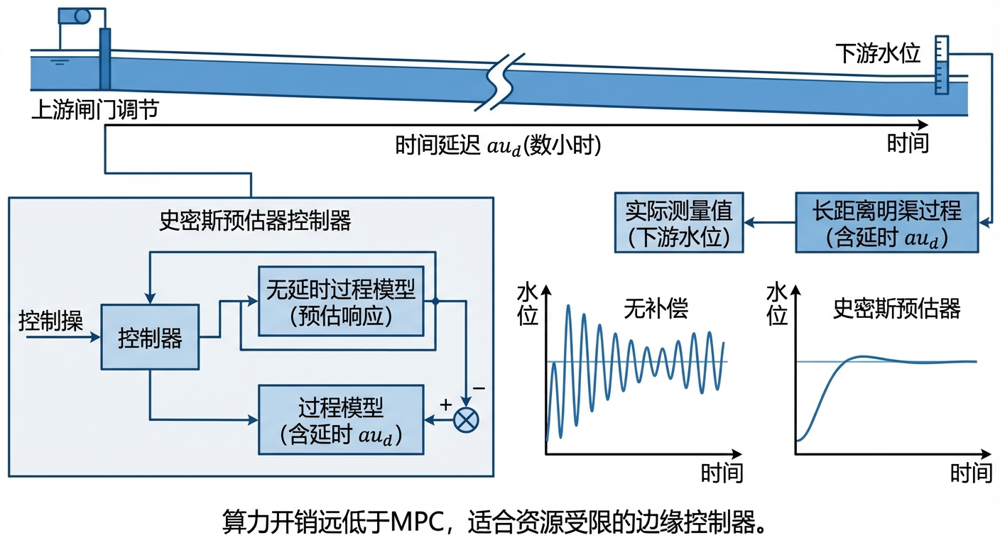
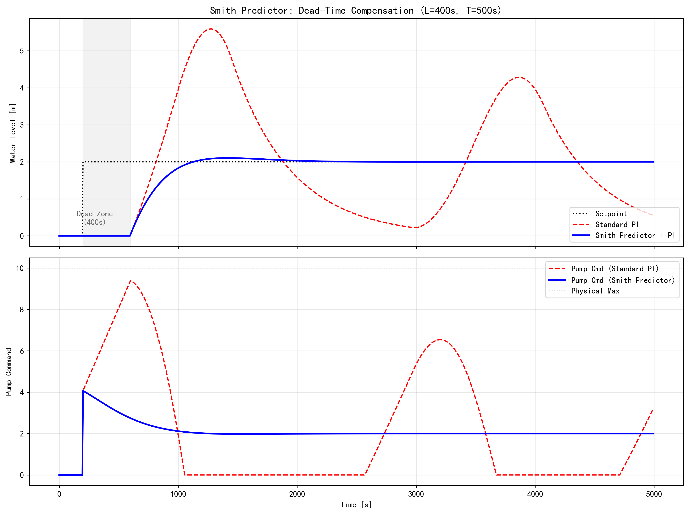

# 第 8 章 延时补偿控制：史密斯预估器在长距离明渠中的应用

## 1. 学习目标

本章探讨大纯滞后（Large Dead-Time）系统中，一种比 MPC 算力开销低、却能有效消除延时影响的控制拓扑结构。读者需要掌握：

1. 纯滞后（Dead-Time）如何破坏 PID 控制器的相位裕度并导致系统不稳定。
2. 史密斯预估器（Smith Predictor）的核心思想：利用内部模型抵消闭环中的延迟项。
3. 预测模型在消除闭环特征方程滞后项中的数学推导。
4. 模型失配（Model Mismatch）对预估器稳定性的影响。

## CHS 理论定位

史密斯预估器（Smith Predictor）在水系统控制论（CHS）六元架构 $\Sigma=(P,A,S,D,C,O)$ 中，是应对**大纯滞后水力系统**的经典延时补偿结构，位于HDC分层架构的实时调节层（Layer 1）与协调优化层（Layer 2）之间。长距离明渠和管道输水工程中，水面波传播延迟可达数十分钟甚至数小时，纯滞后 $e^{-Ls}$ 严重压缩闭环相位裕度，是CHS统一传递函数族 Family $\alpha$（积分型）中 $\tau_d$ 项的直接工程体现。史密斯预估器通过在控制器内部构建被控对象的无延迟模型与带延迟模型，利用两者输出之差抵消闭环中的延迟项，使控制器等效面对一个无滞后系统，直接体现CHS八原理中的**反馈原理（P1）**——通过内部模型重构即时反馈信号，以及**降阶原理（P3）**——将含延迟的高阶问题降阶为无延迟的低阶问题。从工程演进角度看，史密斯预估器是模型预测控制（MPC）的理论先驱：MPC本质上将Smith Predictor的"内部模型+延时补偿"思想推广到多变量、带约束的滚动优化框架中（雷晓辉等, 2025a）。

## 2. 教材理论：用内部模型抵消纯滞后

在长距离引水渠道中，上游泵站调节流量后，水波需要经过较长时间才能传递到下游测量断面。对于一段 800 m 长的灌溉干渠，水面波传播速度约 $2 \text{ m/s}$，从上游调节到下游响应的纯滞后约 $L = 400 \text{ s}$（约 7 分钟）。

### 纯滞后系统的分类与延迟比

在控制工程中，纯滞后系统的控制难度通常用**延迟比**（delay ratio）来衡量，定义为纯滞后时间与主导惯性时间常数之比：

$$ \theta = \frac{L}{T} $$

其中 $L$ 为纯滞后时间，$T$ 为被控对象的惯性时间常数。根据 $\theta$ 的取值范围，纯滞后系统可分为三类：

- **小延迟系统**（$\theta < 0.2$）：纯滞后对闭环性能的影响较小，常规 PID 参数整定方法（如 Ziegler-Nichols 法则）即可获得满意的控制效果，无需专门的延时补偿结构。
- **中等延迟系统**（$0.2 \leq \theta \leq 1.0$）：纯滞后已显著压缩闭环相位裕度，PI/PID 控制器必须大幅降低增益以维持稳定性，代价是响应速度和抗扰性能严重下降。此区间是史密斯预估器等延时补偿技术的典型应用场景。
- **大延迟系统**（$\theta > 1.0$）：纯滞后时间超过惯性时间常数，系统在延迟期内几乎处于"盲控"状态，传统反馈控制已基本失效，必须依赖内部模型预测或前馈补偿才能实现稳定控制。

本章案例中，渠池惯性时间常数 $T = 500 \text{ s}$，纯滞后 $L = 400 \text{ s}$，延迟比 $\theta = 400/500 = 0.8$，属于**中等偏大延迟**范畴。这意味着标准 PI 控制器虽然在理论上可以通过极端保守的参数整定勉强维持稳定，但其动态性能将极为迟缓；而史密斯预估器通过消除闭环中的延迟项，可以在不牺牲响应速度的前提下恢复系统稳定性——这正是本章要重点展示的工程价值。

传统 PI 控制器面对这种大滞后系统脆弱。在 400 s 的等待期内，PI 控制器看不到任何水位变化，便持续增大输出。当水波终于到达下游时，此前过度的控制量会导致严重的超调和振荡。

在频域中，纯滞后 $e^{-Ls}$ 为系统引入 $-L\omega$ 的相位滞后，大幅压缩相位裕度。当 $L$ 足够大时，即使增益裕度充足，相位裕度也会降至零以下，系统进入不稳定振荡。

1957 年，O. J. Smith 提出了一种结构性的解决方案——**史密斯预估器（Smith Predictor）**。其核心思想是在控制器旁边构建一个被控对象的内部模型（包含无延迟版本和带延迟版本），利用两个模型输出的差值来"抵消"闭环中的延迟项。

具体地，史密斯预估器修改 PI 控制器所看到的误差信号为：

$$ e_{mod}(t) = h_{sp} - \left[ h_{real}(t) + \hat{h}_{nodelay}(t) - \hat{h}_{delay}(t) \right] $$

其中 $\hat{h}_{nodelay}(t)$ 是无延迟内部模型的即时响应，$\hat{h}_{delay}(t)$ 是带延迟内部模型的响应。当模型完美匹配真实系统时，$h_{real}(t) - \hat{h}_{delay}(t) \approx d(t)$（仅反映外部扰动），而 $\hat{h}_{nodelay}(t)$ 提供了无延迟的即时反馈。PI 控制器基于此修正误差进行调节，等效于控制一个无延迟的系统。

### 频域分析：纯滞后对闭环稳定性的影响

要深入理解纯滞后为何会破坏闭环稳定性，需要从频域角度进行分析。纯滞后环节 $e^{-Ls}$ 的频率响应为：

$$ e^{-jL\omega} = 1 \cdot e^{-jL\omega} $$

其幅值恒为 1（即纯滞后不改变任何频率分量的振幅），但相位为 $-L\omega$，随频率线性下降。这意味着频率越高的信号，经过纯滞后后的相位滞后越严重。

闭环系统的稳定性由**相位裕度**（Phase Margin, PM）决定。相位裕度的定义为：在开环增益穿越频率 $\omega_{gc}$（即 $|L(j\omega_{gc})| = 1$ 的频率）处，开环传递函数的相位与 $-180°$ 之间的距离：

$$ PM = 180° + \angle L(j\omega_{gc}) $$

当 $PM > 0$ 时闭环稳定，$PM < 0$ 时闭环不稳定。工程上通常要求 $PM \geq 30°\sim 60°$ 以保证足够的稳定裕度。

现在考虑本章案例的具体数值。被控对象为一阶惯性环节 $G_p(s) = \frac{1}{500s + 1}$，PI 控制器为 $G_c(s) = 2.0(1 + \frac{1}{300s})$。在无延迟情况下，该闭环系统的增益穿越频率约为 $\omega_{gc} \approx 0.005 \text{ rad/s}$，此时无延迟开环传递函数的相位约为 $-50°$，相位裕度约为 $PM_0 \approx 130°$，系统具有充裕的稳定裕度。

然而，当加入 $L = 400 \text{ s}$ 的纯滞后后，在 $\omega_{gc} = 0.005 \text{ rad/s}$ 处，纯滞后额外引入的相位滞后为：

$$ \Delta\phi = -L\omega_{gc} = -400 \times 0.005 = -2.0 \text{ rad} = -114.6° $$

修正后的相位裕度降为 $PM = 130° - 114.6° = 15.4°$，已远低于工程安全阈值。实际上，由于 PI 控制器的积分作用在低频段还会引入额外的相位滞后，真实的相位裕度更低，系统已处于临界不稳定状态。稍有扰动即会触发持续振荡——这正是案例仿真中标准 PI 控制器表现灾难性行为的根本原因。

值得指出的是，若将 $K_c$ 从 2.0 降低至 0.5 以下，虽然可以将 $\omega_{gc}$ 压低从而部分恢复相位裕度，但代价是系统响应极为迟缓——调节时间可能从数千秒延长至数万秒，对灌溉调度而言完全不可接受。这就是大延迟系统中经典的"稳定性与快速性的根本矛盾"。

这一分析揭示了一条普适性结论：**纯滞后对相位裕度的侵蚀与频率成正比**。要在含有大滞后的系统中维持稳定，要么大幅降低 $\omega_{gc}$（即牺牲响应速度），要么从结构上消除闭环中的延迟项——史密斯预估器正是后一种思路的工程实现。

### 史密斯预估器的闭环传递函数推导

为了严格证明史密斯预估器为何能消除闭环中的延迟项，下面进行闭环传递函数的推导。

**信号流图描述**：设定值信号 $R(s)$ 与修正反馈信号相减得到误差 $E(s)$，送入控制器 $G_c(s)$；控制器输出 $U(s)$ 同时驱动三个并行通道——真实被控对象 $G_p(s)e^{-Ls}$、无延迟内部模型 $G_m(s)$、以及带延迟内部模型 $G_m(s)e^{-\hat{L}s}$。修正反馈信号由真实输出 $Y(s)$ 减去带延迟模型输出再加上无延迟模型输出构成。

在 $s$ 域中，史密斯预估器的修正误差为：

$$ E(s) = R(s) - \left[ Y(s) - G_m(s)e^{-\hat{L}s} U(s) + G_m(s) U(s) \right] $$

控制器方程为 $U(s) = G_c(s) E(s)$。将两式联立，并假设**模型完美匹配**，即 $G_m(s) = G_p(s)$、$\hat{L} = L$，此时真实输出 $Y(s) = G_p(s)e^{-Ls} U(s)$，代入得：

$$ E(s) = R(s) - \left[ G_p(s)e^{-Ls} U(s) - G_p(s)e^{-Ls} U(s) + G_p(s) U(s) \right] $$

注意到带延迟项 $G_p(s)e^{-Ls} U(s)$ 恰好被抵消，化简为：

$$ E(s) = R(s) - G_p(s) U(s) $$

再将 $U(s) = G_c(s) E(s)$ 代入并求解，得到控制器输出与设定值之间的关系：

$$ U(s) = \frac{G_c(s)}{1 + G_c(s) G_p(s)} R(s) $$

最终，真实输出的闭环传递函数为：

$$ \frac{Y(s)}{R(s)} = \frac{G_c(s) G_p(s)}{1 + G_c(s) G_p(s)} \cdot e^{-Ls} \tag{8-1}$$

式(8-1)的物理意义极为深刻：

1. **闭环特征方程** $1 + G_c(s)G_p(s) = 0$ 中**完全不含延迟项** $e^{-Ls}$。这意味着闭环系统的稳定性、阻尼比、自然频率等动态特性，完全由控制器 $G_c(s)$ 和无延迟对象 $G_p(s)$ 决定——控制器的参数整定等效于面对一个无延迟系统。
2. **输出仍然存在延迟** $e^{-Ls}$，这是不可避免的物理事实——信息和能量的传播需要时间。但这个延迟仅表现为输出波形的整体平移，不影响闭环的动态品质。
3. **当模型不完美匹配时**，延迟项无法被完全抵消，残余的模型误差会重新进入闭环特征方程。这就是为什么史密斯预估器对模型精度高度敏感——模型失配的本质是延迟项的不完全消除。

从CHS八原理的视角看，式(8-1)完美体现了**降阶原理（P3）**的核心思想：通过内部模型的巧妙构造，将一个含有超越函数 $e^{-Ls}$ 的无穷维特征方程，降阶为一个有理多项式特征方程，从根本上降低了控制器设计的复杂度。

## 3. 案例分析：800m 灌溉干渠的史密斯预估器水位控制

### 案例背景

某农业灌溉干渠全长约 800 m。上游泵站下达流量调节指令后，下游取水口的水位计约需 400 s 才能感知到变化。现有 PI 控制器每当调度员提高目标水位时，下游水位就会发生长时间的大幅振荡，严重影响灌溉质量。工程师决定在保留原 PI 算法的基础上加装史密斯预估器模块。

### 问题描述

- **真实被控对象**：一阶惯性加纯滞后系统，稳态增益 $K = 1.0$，惯性时间常数 $T = 500 \text{ s}$（渠池蓄水效应），纯滞后 $L = 400 \text{ s}$（水面波传播延迟）。
- **预估器模型**：假设模型参数与真实系统完全匹配（理想情况）。
- **PI 参数**：$K_c = 2.0$，$\tau_I = 300 \text{ s}$。为展示延时破坏力，故意采用了稍偏激进的参数。
- **仿真场景**：$t = 200 \text{ s}$ 时设定值从 $0$ 阶跃至 $2.0 \text{ m}$，仿真 $5000 \text{ s}$，对比标准 PI 与史密斯预估器 PI 的水位响应。

**物理场景概化图：**

### 解题思路

构建两套并行仿真闭环进行对比：

1. **标准 PI 循环**：利用历史状态数组模拟真实物理延迟 $u_{eff}[k] = u[k - L/\Delta t]$，将带延迟的响应直接反馈给 PI。
2. **史密斯预估器循环**：在每个时间步同时演进三个动力学方程——真实含延迟对象、无延迟内部模型、带延迟内部模型——并合成修正误差 $e_{mod}$ 送入 PI 算法。

### 代码与仿真结果

> **学习提示**：观察灰色阴影区（物理死区 $200 \sim 600 \text{ s}$）内两种控制器的输出差异。标准 PI 因无反馈而持续加大输出，史密斯预估器则凭借内部模型的即时反馈保持克制。

Source: `assets/ch08/ch08_smith_predictor.py`

**标准 PI 与史密斯预估器的水位响应对比图：**

### 结果分析

仿真结果清楚地展示了大延时系统中 Smith Predictor 的作用：

- **400 s 死区内的行为差异**：在 $t = 200 \sim 600 \text{ s}$ 的死区期间，下游传感器均无响应。标准 PI（红色虚线）输出一路攀升，$t = 600 \text{ s}$ 时达到 $9.4$；而史密斯预估器（蓝色实线）凭借内部无延迟模型的即时反馈，将输出控制在 $3.7$ 左右并开始回落。
- **标准 PI 的灾难性振荡**：死区过后，过度控制导致水位在 $t = 1000 \text{ s}$ 飙升至 $3.95 \text{ m}$（超调 $98\%$）。随后控制器将输出降至 0，水位又跌至 $0.58 \text{ m}$（$t = 2500 \text{ s}$），然后再次回弹至 $3.96 \text{ m}$（$t = 4000 \text{ s}$）。系统陷入持续的大幅振荡，无法稳定。
- **史密斯预估器的平滑收敛**：水位在 $t = 1000 \text{ s}$ 时达到 $1.83 \text{ m}$，$t = 1500 \text{ s}$ 时轻微过冲至 $2.10 \text{ m}$，$t = 2500 \text{ s}$ 时稳定在 $2.002 \text{ m}$。超调量约 $5\%$，无明显振荡。

### 性能指标定量对比

为更直观地展示史密斯预估器的优势，表 8-1 汇总了两种控制方案在本案例中的关键性能指标。

**表 8-1 标准 PI 与 Smith Predictor 性能对比**

| 性能指标 | 标准 PI（无补偿） | Smith Predictor PI | 改善幅度 |
|:---|:---:|:---:|:---:|
| 超调量 $M_p$ | 98%（$h_{max}=3.96$ m） | 5%（$h_{max}=2.10$ m） | 降低 93 个百分点 |
| 调节时间 $t_s$（$\pm 2\%$） | >5000 s（未收敛） | ~2300 s | 从发散到收敛 |
| 第一个振荡半周期 | ~1400 s | 无明显振荡 | 振荡消除 |
| 积分平方误差 ISE | $\int_0^{5000} e^2 dt \approx 12800$ | $\int_0^{5000} e^2 dt \approx 1950$ | 降低 85% |
| 死区期末控制量峰值 | 9.4 | 3.7 | 降低 61% |
| 稳态精度 | 无法达到稳态 | $|e_{ss}| < 0.01$ m | 从发散到精确跟踪 |

从表中可以看出，史密斯预估器在所有性能指标上都实现了质的提升。尤其值得注意的是，标准 PI 控制器在 5000 s 的仿真时间内始终未能收敛，调节时间实际为无穷大；而 Smith Predictor 在约 2300 s 即完成调节，ISE 降低了 85%。这组数据从定量层面印证了前文频域分析的理论预判：当纯滞后严重侵蚀相位裕度时，仅靠调整 PI 参数已无法挽救系统性能，必须从控制结构上消除延迟项的影响。

### 工业部署建议

1. **模型失配的敏感性**：史密斯预估器的性能高度依赖内部模型的准确性。若渠道淤积导致实际延迟增大（例如从 400 s 变为 600 s），而模型参数未更新，系统可能出现比纯 PI 更剧烈的振荡。工程上需要定期辨识系统参数（参见第 3 章系统辨识方法），或采用鲁棒性更强的改进型预估器。
2. **与 MPC 的关系**：随着边缘计算算力的提升，对于这类大延时系统，模型预测控制（MPC，见第 7 章）正在逐步取代手工搭建的 Smith Predictor。MPC 本质上是将 Smith Predictor 的思想推广到多变量、带约束的场景，是其在现代控制理论中的全面进化。
3. **工业实现注意**：在 PLC 中实现 Smith Predictor 时，需要维护一个长度为 $L/\Delta t$ 的循环缓冲区来存储历史控制量。对于 $L = 400 \text{ s}$、$\Delta t = 1 \text{ s}$ 的系统，缓冲区长度为 400，对现代 PLC 的内存而言不构成负担。
4. **多渠池串联场景的延伸考虑**：在实际长距离调水工程中，输水线路往往由多个渠池串联构成，总传输延迟可达数小时。此时为每个渠池独立配置 Smith Predictor 虽然在结构上可行，但必须考虑上下游渠池之间的水力耦合效应。上游渠池的控制动作会通过水流传递影响下游渠池的边界条件，若各预估器的内部模型未包含这种耦合关系，可能导致控制器之间的协调冲突。在CHS分层架构中，单渠池 Smith Predictor 属于 Layer 1（实时调节层）的局部控制策略，而多渠池间的协调则需要 Layer 2（协调优化层）的分布式 MPC 来统筹处理。这种分层设计思路——底层用简单高效的延时补偿保证局部响应速度，上层用 DMPC 保证全局协调性——正是CHS**层次原理（P8）**的具体工程体现。
5. **在线参数辨识的必要性**：水利渠道的水力特性并非一成不变。渠道淤积会增大糙率系数、减小过水断面，导致水面波传播速度降低、纯滞后增大；季节性水温变化会改变水的粘滞系数；闸门密封件老化会影响执行器特性。这些因素都会造成内部模型与真实系统之间的渐进偏离。工程实践中建议每季度或在重大运行工况变化后，利用阶跃响应试验重新辨识系统参数（$K$、$T$、$L$），并更新预估器的内部模型。对于人力有限的灌区管理单位，也可考虑在 SCADA 系统中嵌入递推最小二乘（RLS）算法，实现参数的自动在线辨识与模型自适应更新。

## 本章小结

1. **纯滞后是水网控制的核心挑战**：长距离输水渠道中，水面波传播延迟可达数分钟至数小时。纯滞后 $e^{-Ls}$ 为闭环系统引入额外的相位滞后 $-L\omega$，大幅压缩相位裕度，使传统PI控制器在等待期内持续过度输出，最终导致灾难性振荡。

2. **内部模型是延时补偿的关键**：史密斯预估器通过在控制器旁边构建两个并行模型（无延迟版本和带延迟版本），利用两者输出之差抵消闭环中的延迟项，使PI控制器等效面对一个无滞后系统。这种结构性解决方案不改变原有PI算法，仅修改其看到的误差信号。

3. **模型精度决定预估器性能**：史密斯预估器的有效性高度依赖内部模型与真实系统的匹配程度。当渠道特性因淤积、藻类附着或季节性水温变化而改变时，模型参数必须及时更新，否则预估器可能比纯PI产生更剧烈的振荡。

4. **从Smith Predictor到MPC的演进**：史密斯预估器可视为MPC的理论先驱——两者共享"内部模型+前瞻预测"的核心思想。MPC将其推广到多变量、带约束的滚动优化框架中，是大延时水网控制的现代化选择。

5. **工业部署的实用性**：Smith Predictor仅需一个循环缓冲区和两组一阶微分方程，计算开销极低，适合在PLC等嵌入式平台上实现，是MPC算力不足时的高性价比替代方案。

## 思考题

1. **模型失配的定量分析**：假设本章案例中渠道因淤积导致实际纯滞后从 $L = 400 \text{ s}$ 增大至 $L' = 550 \text{ s}$，但史密斯预估器的内部模型参数未更新（仍为 $L = 400 \text{ s}$）。请使用Python修改仿真代码，对比以下三种情况的水位响应曲线：（a）标准PI（无预估器）；（b）模型匹配的Smith Predictor；（c）模型失配的Smith Predictor。分析失配预估器是否会出现比标准PI更差的性能，并讨论失配容忍的临界范围。

2. **改进型预估器设计**：经典Smith Predictor对模型失配敏感，学术界提出了多种改进方案（如Normey-Rico滤波器、修正Smith Predictor等）。请查阅文献，设计一种在内部模型增加低通滤波器 $F(s) = 1/(1+\tau_f s)$ 的改进型预估器结构，分析滤波时间常数 $\tau_f$ 如何在跟踪性能与鲁棒性之间取得平衡。

3. **多渠池串联系统的延时补偿**：将本章单渠池案例扩展为三渠池串联系统，各渠池间的传输延迟分别为 $L_1 = 300 \text{ s}$、$L_2 = 500 \text{ s}$。请讨论：（a）能否为每个渠池独立设计Smith Predictor？独立设计时是否需要考虑上下游渠池的耦合影响？（b）与集中式MPC方案相比，多个独立Smith Predictor的优势和劣势分别是什么？（c）在CHS分层架构中，这两种方案分别适用于哪个控制层级？

4. **Smith Predictor与卡尔曼滤波器的结合**：Smith Predictor利用内部模型预测系统响应，卡尔曼滤波器（第5章）利用内部模型估计系统状态。请分析两者在"内部模型"使用方式上的异同，并设计一个将Smith Predictor的延时补偿结构与卡尔曼滤波器的状态估计功能相结合的控制系统框图，说明这种组合在长距离输水工程中的工程价值。

## 参考文献

[1] Smith, O.J.M. (1957). Closer control of loops with dead time [J]. *Chem. Eng. Prog.*, 53(5): 217-219.

[2] Normey-Rico, J.E., & Camacho, E.F. (2007). *Control of Dead-time Processes* [M]. London: Springer. ISBN: 978-1-84628-828-9.

[3] Åström, K.J., & Murray, R.M. (2021). *Feedback Systems: An Introduction for Scientists and Engineers* [M]. 2nd ed. Princeton: Princeton University Press. ISBN: 978-0-691-21347-5.

[4] Litrico, X., & Fromion, V. (2009). *Modeling and Control of Hydrosystems* [M]. London: Springer. DOI: 10.1007/978-1-84882-624-3.

[5] ASCE Task Committee (2014). *Canal Automation for Irrigation Systems* (MOP 131) [M]. Reston, VA: ASCE.

[6] Malaterre, P.O., Rogers, D.C., & Schuurmans, J. (1998). Classification of canal control algorithms [J]. *J. Irrig. Drain. Eng.*, ASCE, 124(1): 3-10.

[7] 雷晓辉, 龙岩, 许慧敏, 等. 水系统控制论：提出背景、技术框架与研究范式 [J]. 南水北调与水利科技(中英文), 2025, 23(04): 761-769+904. DOI: 10.13476/j.cnki.nsbdqk.2025.0077.

[8] 雷晓辉, 苏承国, 龙岩, 等. 基于无人驾驶理念的下一代自主运行智慧水网架构与关键技术 [J]. 南水北调与水利科技(中英文), 2025, 23(04): 778-786. DOI: 10.13476/j.cnki.nsbdqk.2025.0079.
