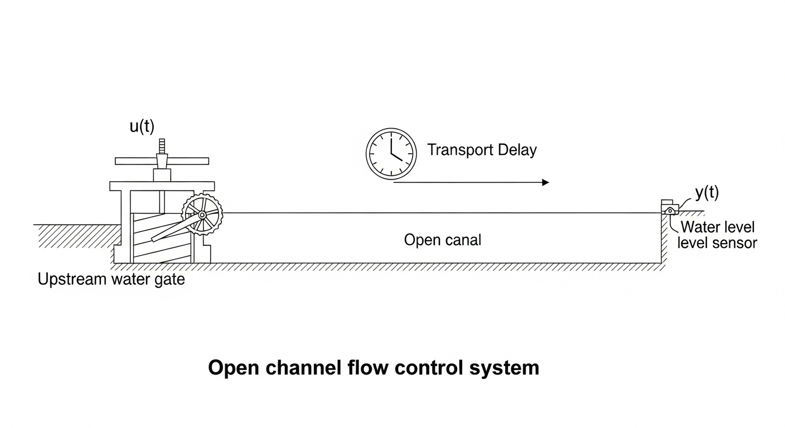
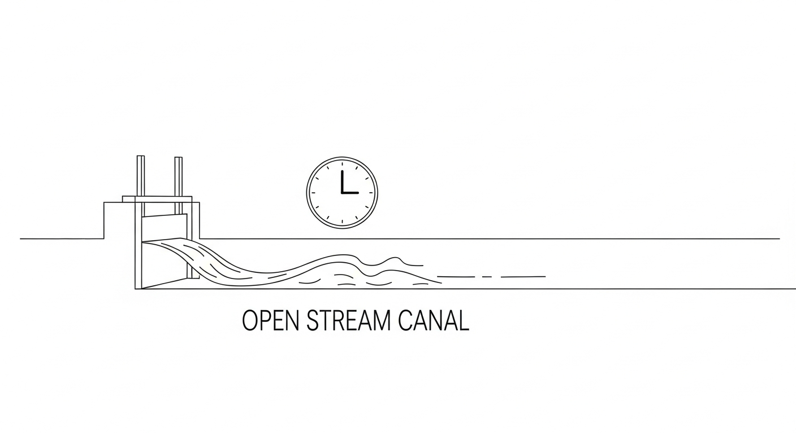
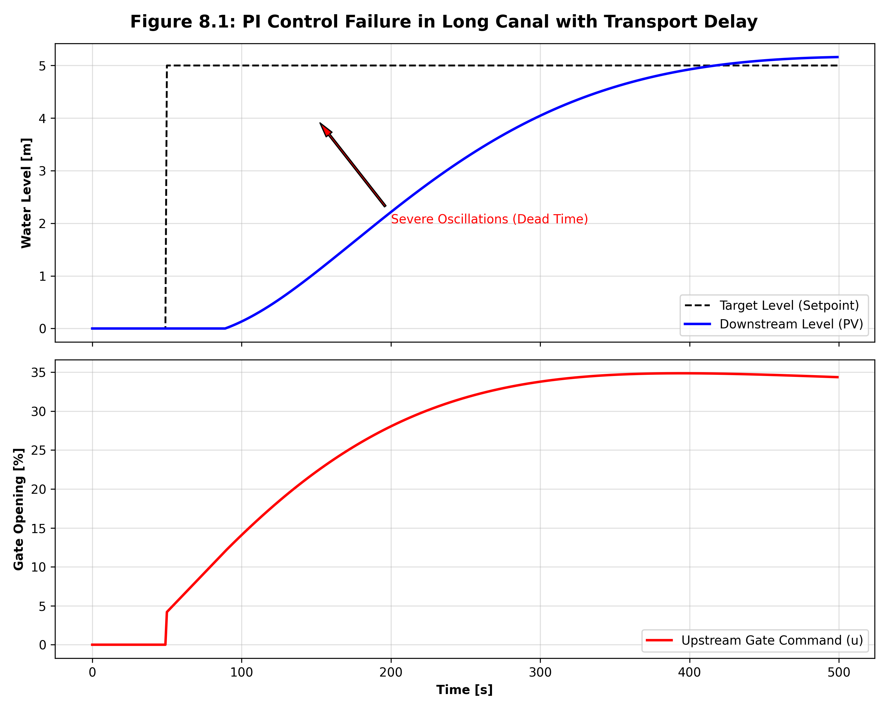

# 第 8 章：明渠水流系统的动态控制建模

## 1. 学习目标
本章将探讨水务工程中最具挑战性的对象之一：长距离明渠。
读者需要掌握：
1. 从集中参数系统（水箱）向分布参数系统（明渠）的模型跨越。
2. 圣维南方程（Saint-Venant Equations）的物理意义及其在控制工程中的痛点。
3. 积分-延迟-零点（IDZ）降阶模型，以及纯滞后时间（Dead Time）对经典控制器的毁灭性影响。

## 2. 教材理论：分布参数系统与波的传播
在前面的章节中，我们研究的水箱被视为“集中参数系统（Lumped Parameter System）”：我们假设水箱内的液位在空间上是瞬间拉平的，只需要一个随时间变化的变量 $h(t)$ 即可描述。
然而，当水流进入长达数十公里的人工运河或天然河道时，这种假设彻底失效。明渠是一个**分布参数系统（Distributed Parameter System）**，水深 $h$ 和流速 $v$ 不仅随时间 $t$ 变化，还随空间位置 $x$ 剧烈变化。
如果上游闸门突然开大，水面会形成一道涌浪（Wave），以有限的波速向游传播。这种波动现象和漫长的传播过程，构成了明渠控制的核心痛点。

**长距离明渠输水物理概化图（Physical Schematic）：**


## 3. 数学基础与推导：从圣维南到 IDZ 模型
一维明渠非恒定流的经典数学描述是**圣维南方程组（Saint-Venant Equations）**：
1. 连续性方程（质量守恒）：
$$ rac{\partial A}{\partial t} + rac{\partial Q}{\partial x} = q_l $$
2. 动量方程（牛顿第二定律）：
$$ rac{\partial Q}{\partial t} + rac{\partial}{\partial x} \left( rac{Q^2}{A} 
ight) + gA rac{\partial h}{\partial x} + gA(S_f - S_0) = 0 $$

这组非线性偏微分方程（PDEs）虽然在水力学仿真中极其精确，但在实时控制理论（如 PID 或 LQR 设计）中几乎无法直接使用。
为了设计控制器，控制工程师 Litrico 和 Fromion 等人提出了极其优美的 **IDZ（Integrator Delay Zero）降阶模型**。
他们将复杂的偏微分方程在频域内进行有理近似，将一段长渠抽象为一个具有纯滞后的传递函数：
$$ G(s) = rac{H_{down}(s)}{U_{up}(s)} = rac{K_c}{A_c s} e^{-	au_d s} $$
其中：
- $A_c$ 是渠道的等效蓄水面积（纯积分环节，代表缓慢的蓄水过程）。
- $	au_d$ 是水波从上游传播到下游的纯滞后时间（Transport Delay）。

在数学上，$e^{-	au_d s}$ 是稳定性的死敌。根据频域分析，它会为系统引入额外的相位角 $-\omega 	au_d$。如果渠道长达 10 公里，滞后时间长达数十分钟，系统的相角裕度将被瞬间击穿。

## 6-Pillar Case Study: 理论与实践的桥梁（大时延明渠 PI 控制失稳仿真）

### 🌟 案例背景 (Context)
本节将理论推导应用至南水北调工程或大型灌区主干渠的液位控制场景。控制目标是操作上游几十公里外的分水闸门，以维持下游某城市取水点的水位绝对稳定。由于物理距离极其遥远，水波在渠道中的传播需要耗费长达 $40$ 秒（为便于短时仿真进行了时间缩放）的纯滞后时间（Dead Time）。

### 🎯 问题描述 (Problem)
**物理场景与问题概化图 (Generated via nano-banana-pro)：**


操作员面临着“盲人摸象”的困境：当他看着屏幕上的下游水位偏低并开大上游闸门时，接下来的 $40$ 秒内，下游水位依然一动不动。
**核心难点**：如果是经典的 PI 控制器，在看到水位不动时，积分项会持续发力，误以为开度不够，从而不断地、疯狂地将闸门越开越大。而当 $40$ 秒后，那股被“超量释放”的洪峰终于到达下游时，水位将瞬间冲破警戒线。此时 PI 控制器又会疯狂关闸。这种由时延引发的滞后性超调，最终将导致系统陷入致命的等幅振荡（Hunting）。

### 💡 解题思路 (Solution Approach)
本案例旨在通过白盒代码复现这一灾难，以警示工程师大时延系统的危险性。
1. **构建延迟序列**：在 Python 数组中利用时间步索引差（`k - delay_steps`）完美模拟水流在空间传输中的物理滞后。
2. **构建积分系统**：利用近似的一阶惯性加纯积分模型替代复杂的圣维南 PDE 求解，以突出控制论层面的矛盾。
3. **闭环对抗测试**：将一个普通的工业 PI 控制器接入该长渠模型，观察它在面对设定值阶跃时的表现。

### 💻 代码执行与图表 (Code & Charts)
> 💡 **学习提示**：我们在下方提取了验证时延灾难的 Python 核心逻辑。请重点关注 `effective_u` 是如何提取几十秒前的历史动作的。

```python
import numpy as np
import matplotlib.pyplot as plt

dt = 1.0
t = np.arange(0, 500, dt)
N = len(t)

# 渠道物理传输滞后：水波需要 40 秒才能走完这段空间
delay_time = 40.0
delay_steps = int(delay_time / dt)

y = np.zeros(N)      # 下游水位
y_ref = np.zeros(N)  # 设定值
u = np.zeros(N)      # 上游闸门开度

y_ref[50:] = 5.0     # 在 t=50 秒时提升目标水位

# 未经时延补偿的普通 PI 控制器
Kc = 0.8
tau_I = 20.0
integral = 0.0

for k in range(1, N):
    error = y_ref[k] - y[k-1]
    P = Kc * error
    integral += (Kc * dt / tau_I) * error
    u[k] = np.clip(P + integral, 0, 100)
    
    # 模拟物理时延：下游此刻接收到的水量，是上游几十秒前放出来的
    effective_u = u[k - delay_steps] if k >= delay_steps else 0.0
    
    # 渠道一阶积分动态
    tau_canal = 60.0
    y[k] = y[k-1] + dt * (0.15 * effective_u - y[k-1]) / tau_canal
```
Source: `assets/ch08/ch08_canal_delay.py`

**大时延明渠 PI 控制失稳的波形可视化证据：**


### 📊 实验验证与结果剖析 (Verification & Result Interpretation)
通过图表，我们清晰地看到了纯滞后时间（Dead Time）是如何将一个原本稳定的控制器逼疯的。
在上方图表中，黑色虚线在 $t=50s$ 时发生阶跃。下方红线（闸门指令）立刻响应并大幅拉升。然而，由于 $40s$ 物理时延的存在，下游水深（蓝色实线）在此期间毫无波澜。
由于水深不涨，PI 控制器的积分项不断累积，迫使闸门指令在 $t=90s$ 前达到极其激进的高位。当洪水终于在 $90s$ 抵达下游时，水深瞬间失控并严重超调（Overshoot）。随后系统陷入了永无止境的低频等幅振荡（红底标注区域）。这证明了，**在相角裕度被时延击穿的系统中，单纯调参已经无济于事**。

### 🚀 工业部署与运行建议 (Industrial Deployment Recommendations)
1. **史密斯预估器（Smith Predictor）与内模控制**：在工业现场应对明渠或长输管道这种时延系统时，绝对禁止单独使用常规 PID。必须在回路中并联一个数学孪生模型（即史密斯预估器），提前把模型预测的“虚拟即时无延时水位”反馈给 PID，从而骗过积分器，消除虚假误差累积。
2. **前馈控制的降维打击**：对于长渠系统，最顶级的调度员从不等下游水位跌落再开闸。他们会利用气象预报和用水曲线进行开环前馈（Feedforward）。既然反馈控制会被时延诅咒，我们就直接在预测到扰动发生前的 $40s$，主动指令上游放水！这就回到了我们在第 7 章讨论的 MPC 框架的绝对统治区。
