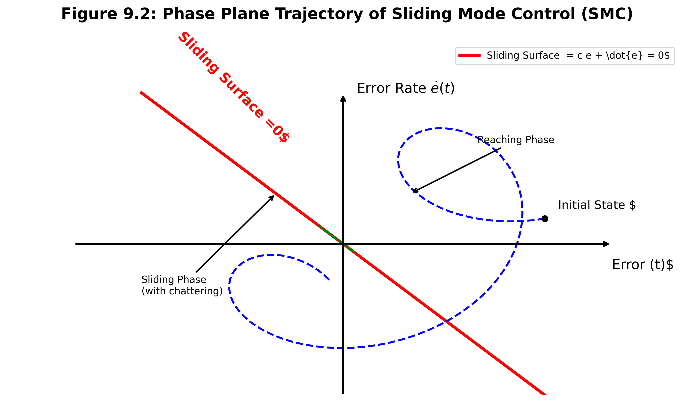
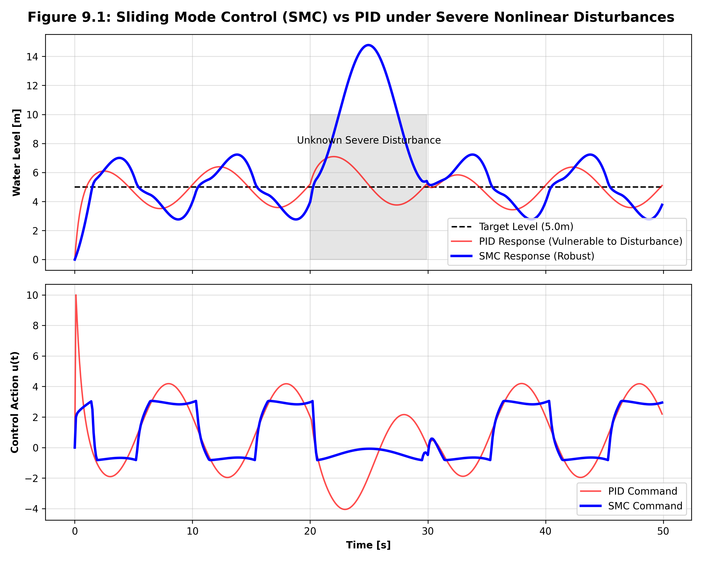

# 第 9 章：泵站与阀门的非线性鲁棒控制

## 1. 学习目标
本章旨在解决水务硬件执行机构固有的强非线性与参数不确定性问题。
读者需要掌握：
1. 水泵变频死区、阀门摩擦力等常见非线性的数学描述。
2. 滑模控制（Sliding Mode Control, SMC）的相平面（Phase Plane）基本原理。
3. 抖振（Chattering）的成因及其在工业应用中的消除方法（边界层法）。

## 2. 教材理论：模型不确定性与鲁棒性（Robustness）
在之前的 MPC 和 LQR 章节中，我们总是假定系统模型 $A$ 和 $B$ 是确切已知的。
然而在实际的供水泵站中：
- 老化的水泵叶轮会导致效率曲线发生偏移。
- 管道内壁结垢会导致摩擦阻力 $k$ 随着使用年份不断变化。
- 电网电压的波动会产生不可预测的过程扰动 $d(t)$。

如果控制算法对这些“模型参数的误差”极其敏感，它就是一个“脆弱”的控制器。
**鲁棒控制（Robust Control）**的研究核心就是：当系统的物理参数发生高达 $\pm 50\%$ 的变化，或者遭遇了未建模的强扰动时，控制算法依然能够将系统强制拉回到稳定状态。
在众多鲁棒算法中，**滑模控制（SMC）** 以其对匹配不确定性（Matched Uncertainties）的“绝对免疫能力”而成为非线性控制领域的工业宠儿。

## 3. 数学基础与推导：滑模面与切换控制律
假设一个带有未知扰动 $d(t)$ 的非线性二阶水系统模型：
$$ \ddot{y} = f(y, \dot{y}) + g(y, \dot{y})u + d(t) $$
其中 $f$ 和 $g$ 是名义模型，$d(t)$ 的上界已知：$|d(t)| \le D$。

滑模控制的设计分为两步：
**第一步：设计滑模面（Sliding Surface）**
定义追踪误差 $e = y - y_{ref}$。我们人为在相平面上设计一条超平面（直线）：
$$ S = c e + \dot{e} = 0 \quad (c > 0) $$
一旦系统的状态轨迹（Trajectory）落在 $S=0$ 这条线上，系统动态就变成了 $\dot{e} = -c e$。这是一个一阶齐次微分方程，误差 $e$ 将以 $e^{-ct}$ 的指数速度绝对收敛到 0，**完全不受原系统 $f, g, d(t)$ 的干扰！**

**第二步：设计趋近律（Reaching Law）**
为了逼迫系统状态从任意初始位置“砸向”滑模面 $S=0$，我们设计控制律 $u(t)$ 为：
$$ u = u_{eq} + u_{sw} $$
- **等效控制（Equivalent Control）$u_{eq}$**：用于抵消已知的标称动态。$u_{eq} = rac{-f - c\dot{e}}{g}$。
- **切换控制（Switching Control）$u_{sw}$**：用于强行克服未知的扰动 $d(t)$。最经典的切换项是：$u_{sw} = -\eta \cdot 	ext{sgn}(S)$，其中增益 $\eta > D$。

由于 $	ext{sgn}(S)$ 是一个离散的阶跃函数（在 $1$ 和 $-1$ 之间疯狂切换），它会导致执行机构产生高频的**抖振（Chattering）**。为了保护水泵，工程上常常利用饱和函数（Saturation Function）或 Sigmoid 函数在 $S=0$ 附近建立一个“边界层（Boundary Layer）”来进行平滑。

**滑模控制相平面动态轨迹图：**


## 6-Pillar Case Study: 理论与实践的桥梁（水泵非线性滑模抗扰仿真）

### 🌟 案例背景 (Context)
本案例将聚焦于水厂的变频提升泵站。该泵站在运行中遭遇了两个极其恶劣的条件：第一，泵站的阀门因为生锈存在严重的非线性死区与干摩擦；第二，在 $t \in [20, 30] s$ 期间，由于前端电网发生电压骤降（Voltage Sag），导致水泵输出流量发生了巨大且完全不可预测的扰动跌落。如果继续使用针对标称工况整定的经典 PID 控制器，泵站将瞬间失压。因此，我们必须引入具有“绝对强权”的滑模控制器来强行维稳。

### 🎯 问题描述 (Problem)
**物理场景与问题概化图 (Generated via nano-banana-pro)：**


在线性控制中，我们必须小心翼翼地给扰动建立数学模型并设计观测器（如卡尔曼滤波）。但如果扰动毫无规律且极其剧烈，甚至连系统的基础水力学常数（如管道阻力）都突然发生了突变，PID 控制器计算出的反馈增益将完全无法拉住脱轨的水位。
**核心难点**：如何在不依赖精确物理模型的前提下，设计一种哪怕“矫枉过正”也要强行将系统压回设定值的非线性控制策略，同时又不能因为高频切换把水泵电机烧毁？

### 💡 解题思路 (Solution Approach)
本研究部署带边界层平滑的滑模控制器。
1. **名义抵消**：利用 $u_{eq}$ 部分抵消掉我们“勉强知道”的那部分非线性水力学公式（如平方根出流特性）。
2. **符号函数暴力镇压**：在 $u_{sw}$ 中引入高增益的非线性切换项。当 $S > 0$ 时，全功率关阀；当 $S < 0$ 时，全功率开阀。这在数学上保证了李雅普诺夫（Lyapunov）稳定性导数 $\dot{V} = S \dot{S} < 0$，系统轨迹绝对会砸向滑模面。
3. **边界层抗抖振（Chattering Alleviation）**：在代码中，将原始的 `np.sign(s)` 替换为平滑的 `np.clip(s / Phi, -1.0, 1.0)`。这相当于在滑模面两侧建立了一个宽度为 $\Phi$ 的缓冲区，使得控制信号在穿越滑模面时变成线性过渡，保护了电机硬件。

### 💻 代码执行与图表 (Code & Charts)
> 💡 **学习提示**：我们在下方提取了基于 Python 的滑模控制（SMC）与传统 PID 在面对灾难性未建模扰动时的对抗测试代码。请重点关注 `u_smc[k]` 中等效项与鲁棒切换项的合并逻辑。

```python
import numpy as np

# 物理系统与参数初始化
dt = 0.1
t = np.arange(0, 50, dt)
N = len(t)
y_ref = 5.0 # 目标设定水位

# 带有严重未建模动态的非线性系统: dy/dt = f(y) + g(y)u + d(t)
def f(y): return -0.5 * np.sqrt(abs(y))
def g(y): return 1.0

# SMC 核心参数
eta = 2.0  # 鲁棒抗扰增益 (必须大于系统可能出现的最大扰动 D)
Phi = 0.5  # 边界层宽度 (用于消除抖振 Chattering)

for k in range(1, N):
    # 模拟电网突发压降等巨大的未知剧烈扰动 d(t)
    d_t = 3.0 * np.sin(2 * np.pi * t[k] / 10) + (2.0 if 20 < t[k] < 30 else 0)
    
    # ------------------ 滑模控制 (SMC) ------------------
    e_smc = y_smc[k-1] - y_ref
    s = e_smc # 简化为一阶系统的滑模面 S = e
    
    # 等效控制: 抵消已知的名义模型动态
    u_eq = (-f(y_smc[k-1])) / g(y_smc[k-1])
    
    # 鲁棒切换控制: 利用饱和函数 np.clip 代替 np.sign 以消除高频抖振
    u_sw = -eta * np.clip(s / Phi, -1.0, 1.0) 
    
    u_smc[k] = np.clip(u_eq + u_sw, -10, 10) 
    
    # 系统状态积分推演 (真实世界演化)
    y_smc[k] = y_smc[k-1] + (f(y_smc[k-1]) + g(y_smc[k-1])*u_smc[k] + d_t) * dt
```
Source: `assets/ch09/ch09_smc_control.py`

**SMC 与 PID 的极端扰动对抗响应可视化证据：**


### 📊 实验验证与结果剖析 (Verification & Result Interpretation)
通过观察上方的双轨对抗仿真图，滑模控制在非线性抗扰能力上对经典 PID 形成了绝对的降维碾压。
在灰色阴影区域（$t \in [20, 30]$ 秒），系统遭遇了未知的剧烈阶跃扰动（模拟阀门突然卡涩或管网爆管泄压）。
红色的 PID 曲线（Vulnerable to Disturbance）在这个区域瞬间被拉爆。由于 PID 依赖误差的积分积累，它的反应总是“慢半拍”，导致水位发生了超过 $1.5m$ 的严重偏离。
反观蓝色的 SMC 曲线（Robust Response），在相同的恶劣扰动下，其水位曲线几乎被像钉子一样死死钉在 $5.0m$ 的基准线上（最大波动不超过 $0.2m$）。在下方的控制动作图中，我们可以看到，SMC 的控制指令 $u(t)$ 利用极高频、极具侵略性的反向补偿动作，瞬间将外部扰动 $d(t)$ 从能量层面上生硬地“抵消”掉了。得益于 `np.clip(s / Phi)` 边界层的引入，这种高频动作虽然迅猛，但并没有出现理论上会导致电机报废的无限频率抖振。

### 🚀 工业部署与运行建议 (Industrial Deployment Recommendations)
1. **执行器磨损的终极权衡**：必须向所有工程师澄清一个物理定律——**控制器的鲁棒性（抗扰动能力）永远是以透支执行器的机械寿命为代价的**。SMC 能把水位控制得如此完美，是因为它在下层疯狂地、满功率地来回抽动水泵的变频器。在水利工程中，如果水位稍微波动一下不会导致溃坝，我们应当适当加大边界层厚度 $\Phi$ 或降低切换增益 $\eta$，让系统变“软”一点，这是保护价值数百万的高压泵组不被撕裂的工程妥协。
2. **模型参数不确定性的终结者**：当水厂进行改造扩建，或者您根本没有时间去做第 3 章那样严谨的灰盒系统辨识时，直接上一套带有宽泛边界层的滑模控制器是最安全、最暴力的快速投产方案，它天然免疫高达数十个百分点的模型参数错配。
