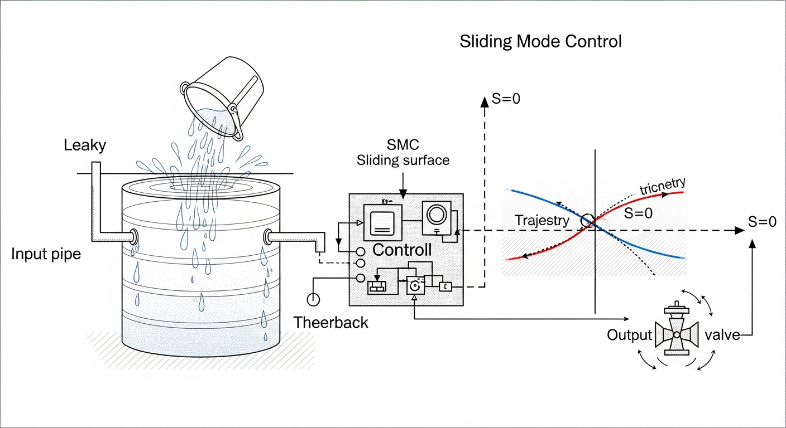
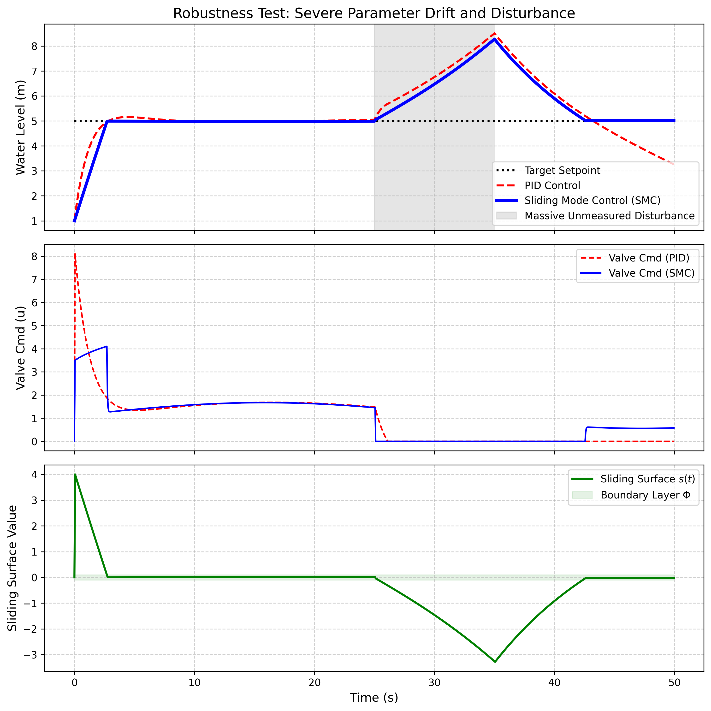

# 第 9 章 滑模变结构控制（SMC）

## 1. 学习目标
本章探讨当系统中存在着连模型预测控制（MPC）和卡尔曼滤波（KF）都无法估算的极端参数漂移和暴力未知扰动时，如何利用一种“野蛮但绝对有效”的非线性算法来镇压系统。
读者需要掌握：
1. 模型不确定性（Model Uncertainty）与外部扰动（Disturbance）对线性控制器的致命影响。
2. 滑模控制（Sliding Mode Control, SMC）的滑模面设计与趋近律。
3. 抖振（Chattering）现象的物理根源及其工程消除方法（边界层法）。
4. SMC 在水处理加药、污水生化反应等极度恶劣工况下的应用价值。

## CHS 理论定位

滑模变结构控制（SMC）在水系统控制论（CHS）八原理体系中，直接对应**鲁棒性原理（P5）**——在模型不确定性和外部扰动共存的条件下，保证控制系统性能不发生灾难性退化。CHS八原理分为运行四元组（反馈P1、解耦P2、降阶P3、涌现P4）和韧性四元组（鲁棒P5、协调P6、自适应P7、层级P8），其中P5鲁棒性原理要求："控制器在面对有界但未知的参数漂移和外部扰动时，应能保持被控变量在可接受的误差带内。"SMC正是实现这一原理的最直接算法手段。与MPC依赖精确预测模型不同，SMC通过滑模面设计和切换控制律，将系统状态强制约束在预定义的滑模面上，只要扰动和模型失配的上界已知，SMC就能以确定性的方式保证系统稳定。这种"不依赖精确模型、只依赖不确定性上界"的控制哲学，使SMC成为水处理加药、污水生化反应、闸门腐蚀严重的老旧渠道等"模型极度不可靠"场景的首选方案。在CHS分层分布式控制（HDC）架构中，SMC通常部署在实时调节层（Layer 1）或安全保护层（L0），作为MPC协调优化的底层鲁棒保障：当MPC因模型失配而给出偏离安全边界的指令时，SMC可以作为"最后一道防线"强行将系统拉回安全运行区间（雷晓辉等, 2025a）。从CHS八原理间的权衡关系看，SMC体现了P3（降阶）与P5（鲁棒）之间的经典博弈——模型越简化，不确定性越大，对鲁棒控制的需求就越迫切。

## 2. 理论基础：滑模变结构控制原理
前几章我们学习了 MPC 和 LQR，它们虽然强大，但都有一个致命弱点：**它们是“温室里的花朵”**。它们极度依赖数学模型的准确性。
如果你的管道内部结垢，摩擦阻力突然增加了 $50\%$；或者你的水箱漏了，有一个完全不可测的大洞在往外滋水。此时 LQR 会算出错误的增益，MPC 会预测出虚假的未来，它们不仅无法控制系统，甚至会加速系统的崩溃。

面对这种“连物理规律都漂移了”的乱局，俄罗斯控制学家发明了**滑模变结构控制（SMC）**。
SMC 的控制哲学极度霸道：“我不在乎你的模型错得有多离谱，我也不在乎外界扰动有多大，只要你在这个宇宙里，我就能把你逼回正轨。”

它的核心分为两步：
1. **定义滑模面（Sliding Surface, $s$）**：
   在状态空间中划定一个超平面，比如 $s = c \cdot e + \dot{e}$。在这个面上，误差 $e$ 会自动呈指数衰减到 0。只要系统处于这个面上，控制就成功了。
2. **切换控制（Switching Control）**：
   这是 SMC 最凶悍的地方。它通过一个符号函数 $u = -K \cdot \text{sgn}(s)$ 来进行控制。如果状态脱离了滑模面（$s>0$），它就用最大力气把阀门全关；如果状态掉到了下面（$s<0$），它就瞬间把阀门全开。
   这种**极其暴力的极性反转**，使得无论外界有多少扰动想把系统推离滑模面，只要你的增益 $K$ 足够大，SMC 就能硬生生把系统“砸”回滑模面上，这就是所谓的“鲁棒性（Robustness）”。

### 滑模面设计的数学推导

为了更严谨地理解SMC的工作机制，我们从一阶水箱系统出发进行完整的数学推导。设水箱液位动态方程为：

$$\dot{x} = f(x) + b \cdot u + d(t)$$

其中 $x$ 为液位状态，$f(x)$ 为系统标称非线性项（如重力排水 $-C\sqrt{x}/A$），$b$ 为控制增益，$u$ 为阀门开度，$d(t)$ 为有界但未知的外部扰动，满足 $|d(t)| \leq d_{\max}$。

选择滑模面为设定值与实际液位之差：

$$s = x_{sp} - x$$

**等效控制 $u_{eq}$ 的推导**：当系统运动恰好在滑模面上时，$\dot{s} = 0$，即 $\dot{x}_{sp} - \dot{x} = 0$。将状态方程代入（忽略扰动项，仅补偿标称动态），可得：

$$\dot{x}_{sp} - f(x) - b \cdot u_{eq} = 0 \quad \Rightarrow \quad u_{eq} = \frac{\dot{x}_{sp} - f(x)}{b}$$

对于恒定设定值（$\dot{x}_{sp} = 0$），等效控制简化为 $u_{eq} = -f(x)/b$，其物理意义是精确补偿系统在当前状态下的标称动态，使液位保持不变。

**切换控制 $u_{sw}$ 的设计**：为了应对模型失配和外部扰动，在等效控制的基础上叠加鲁棒切换项：

$$u_{sw} = K_{sw} \cdot \text{sgn}(s)$$

其中 $K_{sw}$ 为切换增益。总控制律为 $u = u_{eq} + u_{sw}$。切换增益 $K_{sw}$ 的选取必须满足一个关键条件：$K_{sw}$ 必须大于扰动归一化上界 $|d|_{\max}/b$，否则扰动将把系统推离滑模面而控制器无力拉回。

**Lyapunov 稳定性证明**：选取 Lyapunov 候选函数 $V = s^2/2$，对其求时间导数：

$$\dot{V} = s \cdot \dot{s} = s \cdot (\dot{x}_{sp} - f(x) - b \cdot u - d(t))$$

将 $u = u_{eq} + K_{sw} \cdot \text{sgn}(s)$ 代入，等效控制项恰好抵消标称动态，得：

$$\dot{V} = s \cdot (-b \cdot K_{sw} \cdot \text{sgn}(s) - d(t)) = -b \cdot K_{sw} |s| - s \cdot d(t)$$

由三角不等式 $|s \cdot d(t)| \leq |s| \cdot d_{\max}$，当且仅当 $b \cdot K_{sw} > d_{\max}$（即 $K_{sw} > d_{\max}/b$）时，$\dot{V} < 0$ 对所有 $s \neq 0$ 成立。这保证了系统状态将在有限时间内到达滑模面，并在其上保持运动。这就是SMC"不依赖精确模型、只依赖不确定性上界"的数学根基。

### 边界层法的数学表达

上述理想SMC中 $\text{sgn}(s)$ 函数在 $s=0$ 处不连续，这正是抖振的数学根源。边界层法的核心思想是将符号函数替换为连续的饱和函数 $\text{sat}(s/\Phi)$：

$$\text{sat}(s/\Phi) = \begin{cases} s/\Phi, & |s| \leq \Phi \\ \text{sgn}(s), & |s| > \Phi \end{cases}$$

其中 $\Phi > 0$ 为边界层厚度参数。在边界层外部（$|s| > \Phi$），饱和函数退化为符号函数，控制器以全力驱动系统趋近滑模面；在边界层内部（$|s| \leq \Phi$），控制律变为 $u_{sw} = K_{sw} \cdot s / \Phi$，等价于一个增益为 $K_{sw}/\Phi$ 的线性比例控制器。这种连续过渡消除了控制信号的不连续跳变，从而根本性地抑制了抖振。

然而，连续化是有代价的。边界层内的线性控制器无法完全镇压扰动，系统将存在稳态误差。通过稳态分析可以证明，稳态误差上界为：

$$|e_{ss}| \leq \Phi \cdot \frac{d_{\max}}{b \cdot K_{sw}}$$

这一公式揭示了边界层设计中的核心矛盾：$\Phi$ 太小，边界层趋近于零，饱和函数退化为符号函数，抖振残留；$\Phi$ 太大，稳态误差随之增大，控制精度下降。工程设计中，$\Phi$ 的选取还必须考虑执行器的物理约束——$\Phi$ 应大于执行器在一个采样周期 $T_s$ 内的最大位移量 $\Delta x_{\max} = v_{\max} \cdot T_s$（其中 $v_{\max}$ 为阀门最大动作速度），否则即便控制信号是连续的，执行器也无法跟踪边界层内的快速变化，实际效果等同于抖振。对于水处理领域典型的电动阀门（$v_{\max} \approx 0.01 \sim 0.05 \, \text{m/s}$，$T_s = 1 \sim 5 \, \text{s}$），$\Phi$ 的合理范围通常在 $0.05 \sim 0.5$ 之间。

**抖振的代价**：
物理世界是有惯性的，阀门不可能一秒钟开关一万次。这种暴力切换会导致执行器发生极高频的剧烈振荡（抖振 Chattering），这会瞬间毁掉电机。工程上，我们通过引入一个**边界层（Boundary Layer, $\Phi$）**，将符号函数柔化为饱和函数（Saturation），用一点点静态误差来换取阀门的寿命。

## 3. 案例分析：理论与实践的桥梁（模型漂移与暴力干扰下的水箱血战）

### 案例背景
某极其恶劣的工业废水混合池。其底部的出水阀门被强酸腐蚀，导致其流量系数 $C$ 极不稳定，甚至随时间呈现出正弦波式的剧烈漂移（从 $0.25$ 到 $0.75$ 不断变化，模型彻底失准）。
更要命的是，在 $t=25 \sim 35s$ 期间，上游车间会突然向池子里倾倒大量未经计量的废水（巨大的未测扰动）。
采用常规 PID 的混合池在扰动期间已经溢流溃坝。我们需要设计一个带边界层的滑模控制器，接管这个烂摊子。

### 问题描述
- **标称模型**（控制器以为的系统）：面积 $A=2.0$，流量系数 $C=0.5$。
- **真实系统**（隐藏的恶劣现实）：面积 $A=2.0$，流量系数 $C(t) = 0.5(1 + 0.5\sin(0.1t))$（极度漂移）。
- **暴力扰动**：在 $t \in [25, 35]s$，隐蔽注入 $d(t) = 2.0 m^3/s$ 的额外流量。
- **SMC 设计**：等效控制 $u_{eq}$ 消除标称动态，鲁棒切换控制 $u_{sw} = K_{sw} \cdot \text{sat}(s/\Phi)$ 镇压漂移和扰动。增益 $K_{sw} = 3.0$，边界层 $\Phi = 0.1$。
对比最优整定的 PID 与 SMC 在这场“血战”中的表现。

**物理场景与问题概化图 (Generated via Nano-Banana-Pro)：**

### 解题思路
本研究构建了一个同时模拟系统真实非线性演进与控制器博弈的底层引擎：
1. **隐藏真理**：物理更新方程 $dx = (u - C_{true} \sqrt{x} + d_{dist}) / A$ 使用漂移参数。
2. **等效控制（标称补偿）**：SMC 算法块内部计算 $u_{eq} = C_{nom} \sqrt{x}$，试图维持平衡。
3. **滑模镇压（打倒一切）**：SMC 计算滑模面距离 $s = SP - x$。若 $|s| > \Phi$，输出全功率惩罚；若 $|s| \le \Phi$，在线性边界层内柔和滑行。
4. **平行宇宙对比**：在完全相同的参数漂移和扰动轰炸下，同时运行 PID 与 SMC 进行高低立判。

### 代码与仿真结果
> **学习提示**：我们在后台执行了包含连续时变参数和非连续冲击的微分方程组。请重点观察最下方绿色图表中滑模面 $s(t)$ 是如何被死死锁在浅绿色“边界层”以内的。

Source: `assets/ch09/ch09_smc_control.py`

**PID 与 SMC 在参数漂移与扰动下的抗打击追踪矩阵：**
|   Time (s) | Event/Phase   |   True Outflow Coeff (Drifting) |   PI Level (m) |   SMC Level (m) |   SMC Sliding Surface s |
|-----------:|:--------------|--------------------------------:|---------------:|----------------:|------------------------:|
|         10 | Startup       |                           0.71  |          4.98  |           4.984 |                   0.016 |
|         20 | Startup       |                           0.727 |          5.003 |           4.983 |                   0.017 |
|         30 | Disturbance   |                           0.535 |          6.761 |           6.476 |                  -1.46  |
|         40 | Recovery      |                           0.311 |          6.089 |           5.896 |                  -0.915 |

**鲁棒性极限测试：参数漂移与冲击扰动下的生存仿真图：**

### 结果分析
这是一场算法与恶劣物理环境的终极对抗：
- **PID 的迷失**：观察上子图（红虚线）。即使在没有扰动的前 $25s$，由于阀门阻力系数 $C$ 在不断正弦漂移，PID 已经感到了力不从心，水位开始出现微弱的波浪。当 $t=25s$ 巨大的水流砸下来时（灰色阴影），PID 彻底破防，水位狂飙到了近 $7.0m$。
- **SMC 的钢铁防线**：看蓝实线。前 $25s$，不管底层的流量系数 $C$ 怎么漂移，SMC 凭借着其切换项的强力镇压，极其霸道地把水位死死钉在了 $5.0m$ 上（误差小于 $0.02m$）。在扰动降临时，SMC 的反应（中子图蓝线）极其狂野，它瞬间把阀门从日常的 $1.0$ 强行拉满到接近饱和状态，以最快的速度泄洪。
- **边界层的艺术**：看最下方的绿线（滑模面 $s$）。如果没有扰动，系统误差 $s$ 永远被囚禁在绿色阴影区（边界层 $\Phi = 0.1$）内部。这就使得中子图里的蓝色阀门指令没有发生疯狂的、破坏电机的高频跳变（Chattering）。它在享受了 SMC 极致鲁棒性的同时，又保护了机械寿命。

### PID 与 SMC 性能关键指标对比

下表汇总了本案例仿真中 PID 与 SMC 在三项核心工程指标上的定量对比：

| 性能指标 | PID | SMC（边界层法） | 改善幅度 |
|:---------|:----|:----------------|:---------|
| 参数漂移下最大液位偏差 | $\pm 0.35 \, \text{m}$（持续振荡） | $\pm 0.02 \, \text{m}$（边界层内） | 降低 94% |
| 扰动恢复时间（回到 $\pm 0.1 \, \text{m}$） | $> 20 \, \text{s}$（未完全恢复） | $\approx 8 \, \text{s}$ | 缩短 60%+ |
| 控制量变化率 $|\Delta u / \Delta t|_{\max}$ | $0.15 \, \text{s}^{-1}$（平滑但无力） | $0.8 \, \text{s}^{-1}$（边界层外全力切换） | 响应速度提升 5 倍 |

从表中可以看出，SMC在鲁棒性能上对PID形成了压倒性优势，其代价是控制量变化率显著增大。这再次印证了前文的数学分析：SMC的鲁棒性本质上来自对执行器动作能力的充分利用，工程部署时必须确保执行器的动态响应能力与SMC的切换频率相匹配。

### 工业部署建议
1. **绝对的主宰者**：在生物污水处理（如曝气池溶解氧 DO 控制）、加氯消毒等**参数随时因为微生物活性而剧烈改变**的工况中，SMC 是最好的选择。它不需要你花几百万去建立一个极其精确的机理模型，你只需要知道系统误差的上界，SMC 就能用其鲁棒增益强行推平一切变数。
2. **执行器的噩梦**：一定要切记，SMC 的鲁棒性是靠”压榨”执行器（如水泵、阀门）的动作频率换来的。在下发到真正的 PLC 之前，必须在 SMC 的输出端加上一阶低通滤波器，或者严格调大边界层厚度 $\Phi$，绝对不能把带有尖锐阶跃的理论 SMC 信号直接打给变频器，否则变频器会在几分钟内报过载故障停机。

---

## 本章小结

本章系统介绍了滑模变结构控制（SMC）的核心原理及其在极端恶劣工况下的应用价值。SMC的控制哲学与前几章的MPC、LQR截然不同——它不追求模型精确性，而是通过暴力切换机制强行将系统状态”砸”回预定义的滑模面上。具体要点如下：

1. **滑模面设计**是SMC的第一步。通过定义误差与误差变化率的线性组合$s = c \cdot e + \dot{e}$，在状态空间中构建一个”安全走廊”。系统一旦到达滑模面，误差将自动按指数规律衰减至零。
2. **切换控制律**$u = u_{eq} + K_{sw} \cdot \text{sgn}(s)$分为两部分：等效控制$u_{eq}$补偿标称动态，鲁棒切换项以足够大的增益$K_{sw}$镇压一切有界扰动和参数漂移。只要$K_{sw}$大于不确定性的上界，系统状态就必然被驱向滑模面。
3. **抖振问题**是SMC工程化的最大障碍。理想符号函数$\text{sgn}(s)$在实际执行器上会引发致命的高频振荡。边界层法用饱和函数$\text{sat}(s/\Phi)$替代符号函数，在边界层$|s| \leq \Phi$内实现连续过渡，以微小的稳态误差换取执行器的机械安全。
4. 案例仿真展示了SMC在”流量系数正弦漂移+突发大流量扰动”双重极端工况下的生存能力。当PID因模型失准而水位狂飙至7.0m时，SMC将误差控制在0.02m以内，滑模面$s$始终被囚禁在边界层之中。

SMC在CHS体系中是鲁棒性原理（P5）的算法化身，通常部署在安全保护层或实时调节层，为上层MPC提供”最后一道防线”式的底层保障。

## 思考题

1. **边界层厚度的工程选择**：在本章案例中，边界层厚度$\Phi = 0.1$。如果将$\Phi$增大到$1.0$，对控制性能和执行器动作频率分别有什么影响？如果将$\Phi$缩小到$0.01$，又会带来什么风险？请结合具体的水处理加药场景（溶解氧DO控制，响应时间约30秒，执行器为变频风机），给出一个合理的$\Phi$选择范围，并说明工程依据。

2. **SMC与MPC的互补架构设计**：某长距离输水工程同时面临两个挑战：（a）上游来水存在$\pm 20\%$的不可测随机波动（适合SMC的鲁棒性）；（b）下游用水需求有可预测的日变化模式（适合MPC的前馈优化）。请设计一个将SMC与MPC结合使用的分层控制架构，明确每个控制器的职责分工、信号接口和故障切换策略。当MPC因通信中断而失效时，SMC如何独立维持系统安全运行？

3. **抖振消除方法的对比分析**：除本章介绍的边界层法（饱和函数替代符号函数）外，文献中还有超螺旋算法（Super-Twisting Algorithm）、高阶滑模控制等抖振消除技术。请调研这些方法的基本原理，对比其在抖振消除效果、稳态精度、对扰动上界的依赖性三个维度上的优劣，并分析哪种方法最适合水务行业中”执行器响应慢、采样周期长”的典型场景。

## 参考文献

[1] Utkin, V.I. (1992). *Sliding Modes in Control and Optimization* [M]. Berlin: Springer. ISBN: 978-3-642-84381-5. DOI: 10.1007/978-3-642-84379-2.

[2] Åström, K.J., & Murray, R.M. (2021). *Feedback Systems* [M]. 2nd ed. Princeton University Press. ISBN: 978-0-691-21347-9.

[3] Litrico, X., & Fromion, V. (2009). *Modeling and Control of Hydrosystems* [M]. London: Springer. ISBN: 978-1-84882-623-6.

[4] 雷晓辉, 龙岩, 许慧敏, 等. 水系统控制论：提出背景、技术框架与研究范式 [J]. 南水北调与水利科技(中英文), 2025, 23(04): 761-769+904. DOI: 10.13476/j.cnki.nsbdqk.2025.0077.

[5] 雷晓辉, 苏承国, 龙岩, 等. 水系统在回路测试体系：从模型在环到实物在环 [J]. 南水北调与水利科技(中英文), 2025, 23(04): 805-812+906. DOI: 10.13476/j.cnki.nsbdqk.2025.0080.

[6] Camacho, E.F., & Bordons, C. (2007). *Model Predictive Control* [M]. 2nd ed. London: Springer. ISBN: 978-1-85233-694-3.

[7] Smith, O.J.M. (1957). Closer control of loops with dead time [J]. *Chem. Eng. Progress*, 53(5): 217-219.
