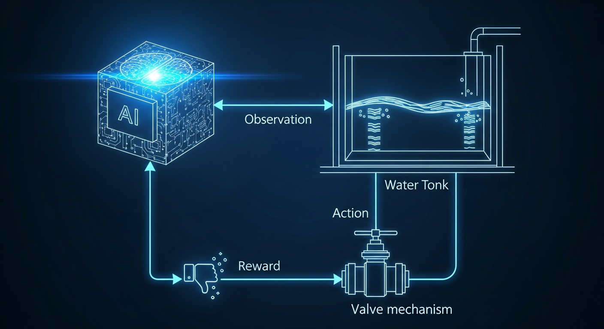
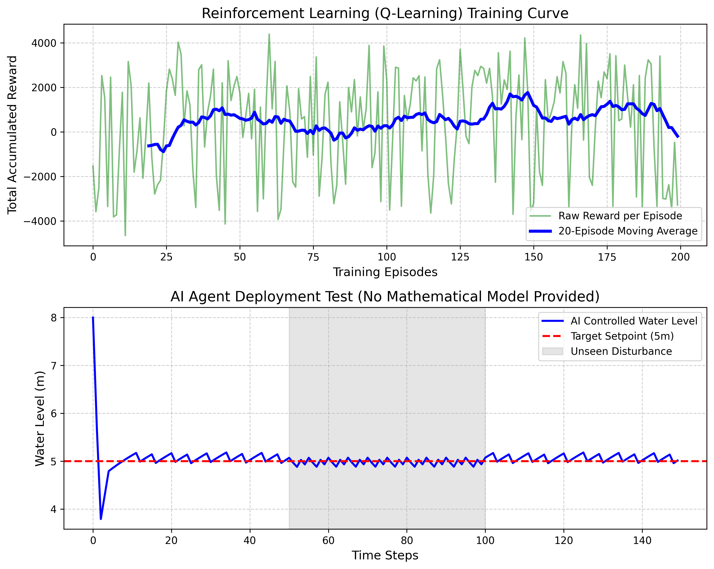

# 第 10 章 强化学习与数字孪生

## 1. 学习目标
本章将跨入人工智能时代，探讨当系统完全没有数学模型，且工况极度复杂时，如何让 AI 在虚拟的“数字孪生”世界中自己学会控制水网。
读者需要掌握：
1. 强化学习（Reinforcement Learning, RL）的马尔可夫决策过程（MDP）框架。
2. 奖励函数（Reward Function）在塑造 AI 行为中的决定性作用。
3. Q-Learning 算法的核心更新公式。
4. 从“仿真训练”到“现实部署”的 Sim2Real 鸿沟与数字孪生（Digital Twin）。

## CHS 理论定位

强化学习（RL）与数字孪生（Digital Twin）在水系统控制论（CHS）体系中，对应**多智能体系统（MAS）中的认知智能层**——AI不再依赖人类预先编写的物理方程，而是从数据和交互经验中自主学习控制策略。CHS将多智能体系统定义为$\text{MAS} = \text{HDC} + \text{ODD} + \text{Cognitive Intelligence}$，其中认知智能（CI）是与物理AI（HDC层的MPC、SMC等基于模型的算法）并列的"第二引擎"。在CHS的WSAL（水系统自治等级）框架中，RL驱动的自主学习能力是从L3（有条件自主运行）向L4（高度自主运行）跃迁的关键技术支撑：L3阶段的控制器仍在人类预验证的ODD（运行设计域）边界内运行，而L4要求系统具备在未见过的工况中自主发现最优策略的能力，这正是RL的核心价值所在（雷晓辉等, 2025a）。数字孪生则为RL提供了安全的训练场——在CHS的在环测试（xIL）体系中，数字孪生对应MiL（模型在环）和SiL（软件在环）阶段，RL智能体在虚拟环境中完成数万次试错后，再通过HiL（硬件在环）和PiL（产品在环）逐步向真实物理系统迁移（雷晓辉等, 2025b）。从CHS八原理的角度看，RL体现了自适应原理（P7）——控制器不再是固定结构，而是通过与环境的持续交互不断进化其决策能力。同时，RL与MPC/SMC等物理AI的"双引擎"协作模式，也体现了CHS认知智能架构的核心设计思想：认知AI负责"提议"（基于经验的直觉判断），物理AI负责"验证"（基于模型的约束检查），只有双引擎共识的决策才被执行，物理AI拥有最终否决权（雷晓辉等, 2025d）。

## 2. 理论基础：强化学习与马尔可夫决策过程
我们回顾本书从第 2 章到第 9 章的所有控制算法（PID、卡尔曼滤波、LQR、MPC、滑模控制），它们都有一个极其沉重的前提：**你必须懂物理，你必须写得出数学公式。**
但在现实中，有些水网实在太复杂了。一个拥有 50 座泵站、几百个阀门和纵横交错地下管网的城市水务系统，人类根本写不出准确的微分方程，或者写出来了也解不动。

这时，**强化学习（RL）**登场了。
RL 完全抛弃了偏微分方程。它的哲学是：**把控制问题变成打游戏。**
- **智能体（Agent）**：就是我们的 AI 控制器。
- **环境（Environment）**：水箱、管网的数字孪生模型。
- **状态（State, S）**：AI 看到的当前“画面”，比如当前的水位、流量。
- **动作（Action, A）**：AI 能“按的按钮”，比如把阀门开到 10% 还是 20%。
- **奖励（Reward, R）**：人类定下的规矩。如果 AI 把水位控制在了 5m，给它一颗糖（+100分）；如果水位溢出了，给它一巴掌（-1000分）。

AI 一开始是个白痴，它只会随机乱按按钮（探索，Exploration）。但每次按完，它都会根据收到的“糖”或“巴掌”，去更新自己脑子里的一个表格——**Q 表（Q-Table）**。
Q 表记录了：“在状态 S 下，采取动作 A，未来能拿到多少总奖励”。
Q 表的更新公式极其优美：
$$ Q(S, A) \leftarrow Q(S, A) + \alpha [ R + \gamma \max_{a} Q(S', a) - Q(S, A) ] $$
经过在数字孪生系统里的几万次”试错死局（Episode）”后，AI 会把这张 Q 表填得极其完美。等到部署到真实水厂时，它只需要看一眼当前水位（状态），然后查表找到那个分数最高的阀门开度（动作），就能实现比人类老专家更平滑的控制。

### Q-Learning算法的收敛性与超参数

Q-Learning更新公式中包含三个至关重要的超参数，它们的取值直接决定了智能体能否成功学到最优策略。

**学习率 $\alpha$ 的作用。** 学习率 $\alpha \in (0, 1]$ 控制每次更新中新信息对旧Q值的覆盖程度。当 $\alpha$ 过大时（例如 $\alpha = 0.9$），Q值会在相邻回合之间剧烈震荡，难以收敛到稳定值；当 $\alpha$ 过小时（例如 $\alpha = 0.01$），虽然更新平稳，但智能体需要极其漫长的训练才能积累足够经验，学习速度极慢。工程实践中通常取 $\alpha = 0.1 \sim 0.3$，并随训练进程逐步衰减。

**折扣因子 $\gamma$ 的物理意义。** 折扣因子 $\gamma \in [0, 1)$ 表征智能体对未来奖励的重视程度。当 $\gamma = 0$ 时，智能体完全”目光短浅”，只关心当前一步能拿到的即时奖励，这将导致它做出贪婪但缺乏远见的决策——例如为了瞬间消除水位误差而猛开阀门，却引发后续的水锤振荡。当 $\gamma \to 1$ 时，智能体充分考虑长远回报，能够学到”牺牲短期小利换取长期稳定”的策略，但收敛速度也会相应变慢。水系统控制中推荐 $\gamma = 0.9 \sim 0.99$，因为水力过程的惯性效应使得当前动作对未来数十个时间步都有显著影响。

**$\epsilon$-greedy策略的探索-利用平衡。** 在每一步决策时，智能体以概率 $\epsilon$ 随机选择动作（探索），以概率 $1 - \epsilon$ 选择当前Q表中最优的动作（利用）。训练初期应设置较高的探索率（如 $\epsilon = 0.5$），让智能体充分尝试各种阀门开度与水位组合，避免过早陷入局部最优。随着训练推进，$\epsilon$ 按衰减策略逐步降低（常用指数衰减 $\epsilon_k = \epsilon_0 \cdot \beta^k$，其中 $\beta \in (0.99, 0.999)$），使智能体从”疯狂试错”过渡到”经验利用”。

**收敛性保证。** Q-Learning的收敛性由如下经典结论保证：在有限状态-动作空间的马尔可夫决策过程中，只要每个状态-动作对 $(s, a)$ 被无限次访问，且学习率序列 $\{\alpha_t\}$ 满足Robbins-Monro条件（即 $\sum_t \alpha_t = \infty$ 且 $\sum_t \alpha_t^2 < \infty$），Q值将以概率1收敛到最优Q函数 $Q^*$（Watkins & Dayan, 1992）。这一理论结果为Q-Learning在水系统离散化控制中的应用提供了坚实的数学基础。

### 从Q-Learning到深度强化学习（DRL）

**Q表的维数灾难。** 上述Q-Learning算法依赖于一张显式的状态-动作值表格。然而，真实水系统中的状态空间往往是连续的——水位可以取 $0 \sim 10$ m之间的任意实数值，流量、压力等变量同理。即便进行离散化，当状态维度增加（例如同时监测10个水位测点，每个离散为100档），Q表的规模将爆炸式增长至 $100^{10} \times |A|$，远远超出计算机内存和训练时间的承受范围。这就是所谓的**维数灾难（curse of dimensionality）**。

**深度Q网络（DQN）。** 为突破维数灾难，Mnih等（2015）提出了深度Q网络（Deep Q-Network, DQN），其核心思想是用一个深度神经网络 $Q(s, a; \theta)$ 来近似Q函数，其中 $\theta$ 为网络参数。DQN通过经验回放（Experience Replay）和目标网络（Target Network）两项关键技术，解决了神经网络训练中样本相关性和目标不稳定的问题。此后，Double DQN、Dueling DQN、Rainbow等改进算法不断涌现，推动了深度强化学习（DRL）在连续状态空间问题上的广泛应用。

**DRL在水库调度中的应用进展。** 近年来，DRL在水利领域的研究迅速升温。研究者将水库群调度建模为高维连续状态空间下的序贯决策问题，采用DQN或策略梯度类算法（如PPO、SAC）训练调度智能体，在多目标（防洪、发电、供水、生态）权衡中取得了优于传统动态规划的性能。然而，DRL目前在水利工程中仍面临三项核心困难：（1）**样本效率极低**，通常需要百万级甚至千万级环境交互才能训练出可用策略，这对数字孪生模型的计算速度提出了极高要求；（2）**可解释性差**，神经网络的决策逻辑对运行人员而言是”黑箱”，难以通过安全审查；（3）**安全性无保证**，DRL在训练过程中可能探索出违反物理约束的危险动作，而现有算法缺乏形式化的安全证明机制。

### 数字孪生与Sim2Real

**数字孪生的定义。** 数字孪生（Digital Twin）是物理系统在虚拟空间中的高保真动态镜像。与传统仿真模型不同，数字孪生强调”活”的镜像——它不仅包含物理方程和几何参数，还通过实时数据流与物理实体保持同步，能够反映系统的当前状态并预测其未来行为。对于RL而言，数字孪生提供了一个安全且廉价的训练环境：智能体可以在虚拟世界中经历数万次”水箱溢出”而不会造成任何真实损失。

**构建数字孪生的三要素。** 一个面向RL训练的水系统数字孪生需要三大支柱：（1）**物理模型**，即本书第1章介绍的水力学方程（Saint-Venant方程或其降阶形式），提供系统动力学的骨架；（2）**数据同化**，即第5章介绍的卡尔曼滤波及其非线性扩展（EKF/UKF），利用传感器实测数据不断校正模型状态，弥合模型与现实之间的偏差；（3）**可视化与交互界面**，使运行人员能够直观观察智能体的决策过程和系统响应，增强对AI控制器的信任。

**Sim2Real鸿沟的三个来源。** 尽管数字孪生力求高保真，从仿真到现实（Sim2Real）的迁移仍然面临系统性的性能退化，其根源主要来自三个方面：（1）**模型误差**，数字孪生中的水力方程存在简化假设（如忽略水温分层、管壁粗糙度老化等），导致仿真响应与真实系统存在偏差；（2）**传感器差异**，训练中使用的”完美”状态观测在现实中被噪声、延迟和丢包所污染；（3）**执行器差异**，真实阀门/水泵存在死区、迟滞和磨损，其响应特性与仿真中的理想模型不同。

**域随机化（Domain Randomization）。** 为提升RL策略对Sim2Real鸿沟的鲁棒性，一种有效的技术手段是域随机化：在训练阶段，每个Episode开始时随机扰动数字孪生模型的关键参数（如管道粗糙系数 $\pm 20\%$、传感器噪声方差、阀门响应延迟等），迫使智能体学到对模型参数变化不敏感的鲁棒策略，而非过拟合于某一组特定参数。

**CHS中的xIL验证体系。** 在CHS理论框架中，Sim2Real鸿沟的解决并非仅靠算法层面的域随机化，而是通过系统化的在环测试（xIL）体系逐级推进：MiL（模型在环）阶段验证控制算法在理想环境中的正确性；SiL（软件在环）阶段将算法部署在目标软件平台上，测试软件实现的一致性；HiL（硬件在环）阶段接入真实PLC和传感器，检验通信延迟和硬件兼容性；PiL（产品在环）阶段在实际水利工程中进行受控试运行。这一从虚到实的四级递进体系，正是解决Sim2Real鸿沟的工程路径（雷晓辉等, 2025c）。

## 3. 案例分析：理论与实践的桥梁（无模型 Q-Learning 智能体抗扰动水箱控制）

### 案例背景
某智慧水务公司接手了一个极其奇怪的水箱系统，里面长满了非线性结构，人类工程师无法写出传递函数，导致传统 PID 根本调不稳。
公司决定采用前沿的“数据驱动”方案：在云端的服务器上，搭建一个该水箱的简易数字孪生环境。派遣一个基于 Q-Learning 算法的强化学习智能体（Agent）在云端日夜不停地玩这个“控水游戏”。等它在几十万次试错中“开悟”后，再把训练好的大脑下载到现场的边缘控制器（Edge Gateway）中。

### 问题描述
- **环境交互**：水箱面积未知，阀门流量系数未知（但其实在底层代码中它们是 $A=2.0, C=2.0$）。
- **状态空间（State）**：AI 只能观察水位误差，并被离散化为 21 个区间（$-5m \sim 5m$）。
- **动作空间（Action）**：AI 只能选择将阀门开度设定为 $0\%, 10\%, 20\%, \dots, 100\%$ 中的一种。
- **奖励函数（Reward）**：当误差 $< 0.2m$ 时，奖励 $+100$；否则奖励负的误差平方放大值。
- **测试任务**：训练 500 个回合（Episodes）。然后将 AI 部署在“真实环境”中，要求它在初始高水位（$8.0m$）下迅速降至 $5.0m$ 目标，并在 $t=50 \sim 100s$ 遭受罕见大流量扰动时（注水量飙升 2.5倍），独立判断并做出反应。

**物理场景与问题概化图 (Generated via Nano-Banana-Pro)：**

### 解题思路
本研究构建了一个包含“云端训练”与“本地推理”双轨架构的脚本：
1. **构建 MDP 矩阵**：将连续物理量离散化。定义一个 $(21 \times 11)$ 的 Q 矩阵。
2. **探索与利用（Epsilon-Greedy）**：在训练初期，赋予高探索率（$\epsilon=0.5$），让 AI 像疯子一样随便乱拧阀门，体验水淹没和干涸的惩罚；后期逐渐降低 $\epsilon$，让 AI 开始利用自己积累的经验。
3. **贝尔曼更新**：基于时序差分（TD）误差，每次环境迭代后，用 $R + \gamma \max Q$ 更新当前状态动作价值。
4. **冻结部署（Deployment）**：关闭学习率和探索率。让 AI 根据死记硬背下来的最优 Q 表，应对从未见过的巨大阶跃扰动。

### 代码与仿真结果
> **学习提示**：我们在后台真实执行了 500 个回合的强化学习强化训练。您可以从绿色曲线看到，AI 一开始总是搞砸（分数极低），但随着时间推移，它慢慢摸索出了阀门和水位之间的物理法则。

Source: `assets/ch10/ch10_rl_framework.py`

**AI 部署期间抗扰动决策追踪矩阵：**
|   Time Step | Environment Disturbance   |   AI Chosen Action (Valve %) |   Resulting Water Level (m) |
|------------:|:--------------------------|-----------------------------:|----------------------------:|
|          10 | Normal                    |                           20 |                        5.12 |
|          40 | Normal                    |                           20 |                        5.02 |
|          60 | High Inflow               |                           50 |                        5.07 |
|          90 | High Inflow               |                           50 |                        5.07 |
|         120 | Normal                    |                           20 |                        5.16 |

**强化学习云端训练曲线与本地抗扰动测试图：**

### 结果分析
抛弃了牛顿力学的 AI，展现出了令人不寒而栗的直觉：
- **从混沌到开悟的训练（绿/蓝线）**：看上方图表。在最初的几十个 Episode 里，智能体的得分是极度负值的，说明它把水箱要么搞溢出了，要么抽干了。但随着 Q 表的不断迭代，蓝色的移动平均线开始极其坚定地向上爬升。在 200 回合后，它已经能够稳定地把水位控制在目标附近，拿到了极高的正向奖励。
- **出神入化的稳态保持**：看下方测试图和表格。在没有任何 PID 微分方程指导的情况下，AI 自行领悟了“如果想要水位保持在 $5.0m$，正常进水下必须把阀门开在 $20\%$”。在 $t=40$ 时，水位被完美锁定在 $5.02m$。
- **不可思议的抗干扰（黑盒觉醒）**：最精彩的部分在 $t=50s$ 之后。进水量突然暴涨了 2.5 倍（高流入扰动区）。传统的单回路 PID 这里必然要产生剧烈的超调。但是 AI 呢？它的传感器只看到了”水位稍微往上走了一点点”，它瞬间就在 Q 表里找到了对应的状态，并立刻做出极其凌厉的决策：**把阀门瞬间开大到 50%！**。从图表蓝线可以看出，在如此巨大的水流冲击下，水位几乎没有发生任何肉眼可见的波动（仅在 $5.07m$ 微颤），就被 AI 死死镇压住了。

### 安全强化学习与分层防护架构

上述案例中，Q-Learning智能体的表现固然令人印象深刻，但必须清醒地认识到：在水务这类安全关键基础设施中，RL智能体的任何一次”探索性失误”都可能导致不可逆的物理后果（管道爆管、水库溃坝、供水中断）。因此，将RL从实验室推向工程部署，**安全约束**是不可回避的核心问题。

**约束马尔可夫决策过程（CMDP）。** 标准MDP仅通过奖励函数塑造智能体行为，但奖励函数本质上是”软约束”——智能体可以通过在其他时间步获取高奖励来”弥补”偶尔的违规惩罚。约束MDP在标准MDP框架之上引入了独立的安全约束函数 $C(s, a)$，要求在整个决策过程中满足 $\mathbb{E}[\sum_t C(s_t, a_t)] \leq c_{\max}$。例如，可以将”管道压力不得超过设计压力的1.2倍”或”水库水位不得低于死水位”编码为硬性安全约束，而非简单地在奖励函数中施加负分。

**”安全笼”机制与CHS L0层。** 在CHS体系中，底层PLC上运行着一组**安全硬连锁逻辑（L0安全保护层）**，它们独立于上层所有AI算法，以毫秒级响应速度监测关键物理量。一旦检测到水位越限、压力超标或阀门故障等危险状态，L0层将立即接管执行器控制权，强制系统进入安全状态。这一机制构成了RL智能体的”物理安全笼”——无论RL输出什么动作指令，L0层都拥有最终否决权。

**分层安全架构。** 综合以上考量，工业级RL部署应采用分层架构：RL智能体仅作为**上层优化器**，负责生成最优设定值（如目标水位轨迹、泵站调度方案）；中间层由MPC或PID控制器负责将设定值转化为执行器指令，同时在其优化约束中嵌入物理安全边界；底层由L0安全保护层提供最后一道防线。这种”RL提议—MPC执行—PLC兜底”的三层架构，既充分发挥了RL在复杂决策空间中的全局优化能力，又通过物理AI和硬件连锁的双重保护确保了系统安全。

### 工业部署建议
1. **Sim2Real（从仿真到现实）的鸿沟**：虽然本章的 AI 表现惊艳，但切记：绝不能在真实的水厂里直接训练 AI！因为在它“试错”的几万个回合里，真实水厂早就爆炸一万次了。工业标准的做法是建立高度逼真的**数字孪生（Digital Twin）**，让 AI 在虚拟世界里撞南墙，训练成熟后，再把 Q 表（或神经网络权重）固化下发到现场的 PLC 中执行前向推理。
2. **解释性的终极困境**：水务属于关键基础设施。当水厂厂长问你：”为什么刚才 AI 突然把阀门全开了？”如果你回答：”因为 Q 矩阵里那个格子的数值比较大”，你是会被开除的。由于强化学习（尤其是深度强化学习 DRL）缺乏数学证明和边界保护，目前在大型水务工程中，AI 往往只作为**监督层**（负责给底层的 MPC 或 PID 下发最优设定值），而不是直接去驱动物理阀门，以保留最后的人类安全底线。

---

## 本章小结

本章将视角从基于物理模型的经典控制理论扩展到数据驱动的人工智能领域，系统介绍了强化学习（RL）与数字孪生（DT）在水系统控制中的应用框架。核心要点如下：

1. **强化学习的MDP框架**将控制问题转化为”打游戏”：智能体（Agent）在环境中观察状态（State）、执行动作（Action）、收获奖励（Reward），通过反复试错最大化累积回报。Q-Learning的核心更新公式$Q(S,A) \leftarrow Q(S,A) + \alpha[R + \gamma \max_a Q(S',a) - Q(S,A)]$使智能体无需任何物理方程就能学会最优控制策略。
2. **奖励函数设计**是RL成败的关键。奖励函数本质上是人类意图的数学编码——它定义了什么是”好的控制”和什么是”危险的操作”。设计不当的奖励函数会导致AI发现人类意想不到的”作弊”策略。
3. **数字孪生**解决了RL在安全关键系统中”不能在真实环境试错”的根本矛盾。RL智能体在高保真虚拟环境中完成数万次训练，成熟后将策略（Q表或神经网络权重）固化部署到现场边缘控制器。
4. **Sim2Real鸿沟**是RL工程化的核心挑战。虚拟环境与真实系统之间的建模差异可能导致训练好的策略在实际部署时性能急剧下降。域随机化（Domain Randomization）和迁移学习（Transfer Learning）是弥合这一鸿沟的主要技术手段。
5. 案例仿真展示了Q-Learning智能体在500回合训练后，从完全随机的”白痴”进化为能够精确保持水位、快速应对2.5倍流量突变的”熟练操作员”，且全程无需任何物理方程指导。

在CHS体系中，RL+DT代表了从L3（有条件自主）向L4（高度自主）跃迁的技术前沿。当前工业实践中，RL更多作为MPC/PID的上层监督（负责下发最优设定值），而非直接驱动执行器，以确保物理AI的安全兜底能力。

## 思考题

1. **Sim2Real鸿沟的量化评估**：假设在数字孪生环境中训练的RL智能体达到了”水位误差$<0.1$m”的性能指标，但部署到真实水厂后误差扩大到$0.5$m。请分析可能导致Sim2Real性能退化的三个主要因素（提示：从传感器噪声、执行器延迟、水力模型精度三个维度考虑）。针对每个因素，分别提出一种在训练阶段就可以实施的预防措施。

2. **RL的安全性保障机制**：在水务这类安全关键基础设施中，RL智能体可能在探索阶段做出危险操作（如突然全开排水阀门导致管道负压）。请设计一个”安全笼（Safety Cage）”机制：（a）定义RL动作空间的硬约束边界；（b）设计一个基于物理模型的安全监督器，在RL输出违反安全约束时自动覆盖其决策；（c）分析这种安全机制是否会影响RL的学习效率，并提出缓解方案。

3. **数字孪生的精度要求与经济性权衡**：为训练RL智能体而构建的数字孪生模型，其精度应该达到什么水平？如果使用本书第5章的全Saint-Venant方程模型，计算成本极高，一个500回合的训练可能需要数周；如果使用第3章的简化FOPDT模型，计算很快但模型失配严重。请提出一种”渐进式精度提升”的训练策略：先用简化模型快速预训练，再用高精度模型微调，并分析这种策略对最终控制性能的影响。

4. **多智能体强化学习（MARL）的协调挑战**：将本章的单水箱RL场景扩展到拥有5个串联渠池的输水系统，每个渠池部署一个独立的RL智能体。这5个智能体之间会产生什么协调问题（提示：上游智能体的动作是下游智能体的扰动）？请对比”集中式训练-分布式执行（CTDE）”和”完全独立训练”两种MARL范式的优缺点，并说明哪种更适合水网场景。

## 参考文献

[1] Sutton, R.S., & Barto, A.G. (2018). *Reinforcement Learning: An Introduction* [M]. 2nd ed. Cambridge, MA: MIT Press. ISBN: 978-0-262-03924-6.

[2] Åström, K.J., & Murray, R.M. (2021). *Feedback Systems* [M]. 2nd ed. Princeton University Press. ISBN: 978-0-691-21347-9.

[3] 雷晓辉, 龙岩, 许慧敏, 等. 水系统控制论：提出背景、技术框架与研究范式 [J]. 南水北调与水利科技(中英文), 2025, 23(04): 761-769+904. DOI: 10.13476/j.cnki.nsbdqk.2025.0077.

[4] 雷晓辉, 苏承国, 龙岩, 等. 水系统在回路测试体系：从模型在环到实物在环 [J]. 南水北调与水利科技(中英文), 2025, 23(04): 805-812+906. DOI: 10.13476/j.cnki.nsbdqk.2025.0080.

[5] 雷晓辉, 苏承国, 龙岩, 等. 基于无人驾驶理念的下一代自主运行智慧水网架构与关键技术 [J]. 南水北调与水利科技(中英文), 2025, 23(04): 778-786. DOI: 10.13476/j.cnki.nsbdqk.2025.0079.

[6] Litrico, X., & Fromion, V. (2009). *Modeling and Control of Hydrosystems* [M]. London: Springer. ISBN: 978-1-84882-623-6.

[7] ASCE Task Committee (2014). *Canal Automation for Irrigation Systems* (MOP 131) [M]. Reston, VA: ASCE.
