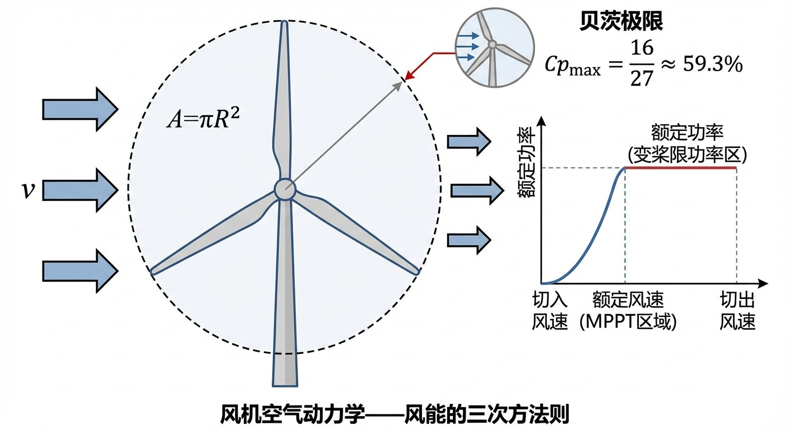
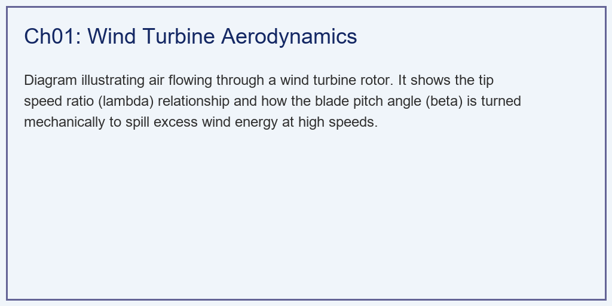
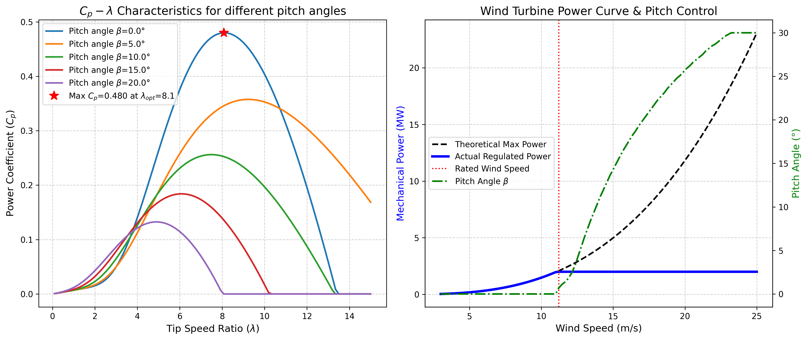

# 第 1 章：风机空气动力学与功率捕获

## 1. 学习目标

本章探讨风力发电系统的物理基础——空气动力学。我们将解析庞大的风机叶片是如何将空气的动能转化为机械能的，以及如何通过变流器和变桨系统实现从微风到狂风的全天候控制。
读者需要掌握：
1. 贝茨极限（Betz Limit）与风能利用系数 $C_p$ 的物理意义。
2. 叶尖速比（Tip Speed Ratio, $\lambda$）对空气动力学效率的决定性影响。
3. 额定风速以下的**最大功率点跟踪（MPPT）**策略。
4. 额定风速以上的**变桨距控制（Pitch Control）**与功率限制保护。

## 2. 教材理论：风的能量能被全部吸收吗？

### 2.1 风能的基本物理方程

风力发电的本质，是用一个巨大的旋转平面（叶轮扫风面积 $A$）去捕获流动的空气中的动能。
根据流体力学，单位时间内流过截面积 $A$ 的空气质量为 $\dot{m} = \rho A v$，其动能为 $E_k = \frac{1}{2}\dot{m}v^2$，因此风中蕴含的总动能功率为：
$$ P_{wind} = \frac{1}{2} \rho A v^3 $$
其中 $\rho$ 是空气密度（标准大气压下约为 $1.225\,\text{kg/m}^3$），$A = \pi R^2$ 是叶轮扫风面积，$v$ 是来流风速。注意，风能与风速的**三次方**成正比，这意味着风速翻倍，能量会增加 8 倍。

这个三次方关系在工程中具有深远影响。以叶轮半径 $R = 40\,\text{m}$ 为例，扫风面积 $A = \pi \times 40^2 \approx 5027\,\text{m}^2$。在标准大气条件下，不同风速对应的理论风功率为：$v = 5\,\text{m/s}$ 时 $P_{wind} = 0.38\,\text{MW}$；$v = 10\,\text{m/s}$ 时 $P_{wind} = 3.08\,\text{MW}$；$v = 15\,\text{m/s}$ 时 $P_{wind} = 10.38\,\text{MW}$。仅从 $10$ 到 $15\,\text{m/s}$ 的 $50\%$ 风速增长，就带来了 $237\%$ 的功率增长，这说明风资源评估中准确测量风速的重要性——测风仪的 $1\,\text{m/s}$ 误差可能导致年发电量预估偏差 $20\%$ 以上。

### 2.2 贝茨极限的推导

但风机能把 $P_{wind}$ 全部吸走吗？答案是**不能**。
如果风机把风的动能全部吸收，那么风过叶片后的速度就会变成 $0$。风停在了叶片后面，后续的风就再也进不来了。
1919年，德国物理学家 Albert Betz 基于一维动量理论证明了风能提取的理论上限。

设来流风速为 $v_1$，通过叶轮后的风速为 $v_2$，根据动量守恒和质量守恒，在叶轮截面处的风速近似为 $(v_1 + v_2)/2$。叶轮提取的功率为：

$$P_{extract} = \frac{1}{2} \rho A \frac{v_1 + v_2}{2} (v_1^2 - v_2^2)$$

定义速度比 $a = v_2 / v_1$，则功率系数为：

$$C_p = \frac{P_{extract}}{P_{wind}} = \frac{1}{2}(1+a)(1-a^2)$$

对 $a$ 求导并令其为零，可得最优速度比 $a_{opt} = 1/3$，此时：

$$C_{p,max} = \frac{16}{27} \approx 0.593$$

这就是著名的**贝茨极限**：任何风机最多只能提取风中 **$59.3\%$** 的能量。

### 2.3 风能利用系数 $C_p$ 与控制变量

在实际工程中，风机捕获的机械功率为：
$$ P_{mech} = \frac{1}{2} \rho A v^3 \cdot C_p(\lambda, \beta) $$
这里引入了核心的风能利用系数 $C_p$。它受两个变量控制：
- **$\beta$ (桨距角)**：叶片扭转的角度。角度越大，风就会顺着叶片滑走，不产生推力。在正常发电时，$\beta=0$。
- **$\lambda$ (叶尖速比)**：叶片尖端的线速度与风速的比值（$\lambda = \frac{\omega R}{v}$）。
  - 如果叶片转得太慢（$\lambda$ 小），风直接从叶片缝隙里漏走了。
  - 如果叶片转得太快（$\lambda$ 大），叶片会在空气中产生巨大的涡流阻力。
因此，存在一个**最佳叶尖速比 $\lambda_{opt}$**，使得 $C_p$ 达到最大值 $C_{p,max}$（通常在 $0.45 \sim 0.50$ 左右）。

$C_p$ 的常用工程经验公式为：

$$C_p(\lambda, \beta) = c_1 \left(\frac{c_2}{\lambda_i} - c_3 \beta - c_4\right) e^{-c_5/\lambda_i} + c_6 \lambda$$

其中 $\frac{1}{\lambda_i} = \frac{1}{\lambda + 0.08\beta} - \frac{0.035}{\beta^3 + 1}$，$c_1 \sim c_6$ 为拟合系数。该方程体现了 $C_p$ 对 $\lambda$ 和 $\beta$ 的非线性耦合特性。

### 2.4 风机的双重控制策略

1. **中低风速区（如 $5 \sim 11\,\text{m/s}$）**：此时风能很宝贵。无论风速怎么变，发电机必须自动调节转速 $\omega$，牢牢咬住那个最佳比例 $\lambda_{opt}$，让 $C_p$ 始终保持在最大值。这叫 **MPPT 控制**。MPPT控制的核心方程为：
$$\omega_{ref} = \frac{\lambda_{opt} \cdot v}{R}$$
对应的最大捕获功率为：
$$P_{max} = \frac{1}{2} \rho \pi R^2 v^3 C_{p,max}$$

2. **大风区（如 $15 \sim 25\,\text{m/s}$）**：此时风能过大。如果还保持最高效率，发电机和齿轮箱会被巨大的扭矩损坏。此时，风机必须强行扭转叶片（增大 $\beta$），故意把部分风能放走，将吸收的功率严格压制在额定功率（如 $2\,\text{MW}$）的红线上。这叫 **变桨控制**。变桨控制的目标方程为：
$$C_p(\lambda_{rated}, \beta) = \frac{2 P_{rated}}{\rho \pi R^2 v^3}$$
通过数值求解上式中的 $\beta$，即可得到当前风速下所需的桨距角。

### 2.5 风机功率曲线的四个运行区间

综合上述分析，一台典型的变速变桨风电机组在全风速范围内存在四个运行区间：

- **区间一（$v < v_{cut-in}$，切入风速以下）**：风速太小，风能不足以克服机组的摩擦和空转损耗，机组停机或空转不发电。典型的切入风速为 $3\sim4\,\text{m/s}$。

- **区间二（$v_{cut-in} \leq v < v_{rated}$，MPPT 区）**：风速可利用但未达到额定。桨距角固定为 $\beta = 0$，通过调节发电机转矩来控制转速，追踪最优叶尖速比。功率随风速的三次方增长，是风机的主要发电区间。

- **区间三（$v_{rated} \leq v < v_{cut-out}$，恒功率区）**：风能充足但需限制输出。转速和功率均锁定在额定值，通过变桨控制调节 $\beta$ 来泄掉多余的风能。桨距角随风速单调递增。

- **区间四（$v \geq v_{cut-out}$，停机保护区）**：风速超过机组承受极限（通常 $25\,\text{m/s}$），叶片完全顺桨（$\beta = 90°$），气动制动器启动，机组停机保护。

这四个区间共同构成了风机的标准功率曲线，是风电场发电量预估和控制系统设计的基础。

## 3. 案例分析：2MW风机全风速区间运行性能仿真

### 案例背景
某风电场部署了一台叶轮半径 $R=40\,\text{m}$ 的 2MW 级大型风电机组。
春天，风电场经历了从微风（$3\,\text{m/s}$）到强风（$25\,\text{m/s}$）的剧烈风速变化。
新入职的工程师看着后台的数据报表感到十分困惑："为什么风速在 $10\,\text{m/s}$ 的时候，转子转速在快速提升；而到了 $20\,\text{m/s}$ 的大风中，转子转速反而不涨了，连叶片都扭向了奇怪的角度？"
作为首席电气控制专家，你需要用 Python 建立这台风机的空气动力学孪生模型，画出标志性的"风机运行功率曲线"，向他解释风机内部的控制系统是如何在"高效捕获（MPPT）"与"安全限功率（Pitch Control）"之间切换的。

### 问题描述
- **风机物理参数**：$\rho = 1.225\,\text{kg/m}^3$, $R = 40.0\,\text{m}$。额定功率 $P_{rated} = 2.0\,\text{MW}$。
- **$C_p$ 非线性模型**：使用包含 $\lambda$ 和 $\beta$ 的指数-代数耦合超越方程。
- **全风速扫描**：模拟风速 $v$ 从 $3\,\text{m/s}$ 攀升至 $25\,\text{m/s}$。
- **控制逻辑约束**：
  - 当 $P_{avail} < 2.0\,\text{MW}$：$\beta = 0^\circ$，转速 $\omega$ 随风速线性增长以维持最佳 $\lambda$。
  - 当 $P_{avail} \ge 2.0\,\text{MW}$：强行切断 MPPT，转速锁定在额定转速，非线性求解此时所需的变桨角 $\beta$，使得功率严格恒定为 $2.0\,\text{MW}$。
- **任务**：输出风机的特征曲线，记录在各个风速节点的运行状态机（State Machine）。

**物理场景与问题概化图：**

### 解题思路
本研究构建了一个包含数值求根的前向仿真器：
1. **气动特性扫掠**：遍历 $\lambda$（$0.1 \sim 15$）和多个 $\beta$ 角度，求解非线性 $C_p$ 方程，寻找出绝对最大值 $C_{p,max}$ 及其对应的最佳叶尖速比 $\lambda_{opt}$。
2. **MPPT 阶段（高效捕获）**：风速较低时，利用公式 $\omega = \lambda_{opt} \cdot v / R$ 计算发电机转速，计算最大可用功率 $P = \frac{1}{2} \rho A v^3 C_{p,max}$。
3. **恒功率阶段（变桨限流）**：当算出的可用风功率突破 $2\,\text{MW}$ 红线时，启动防护机制。锁定当前的转速。面对当前的风速 $v$，反算出当前的真实 $\lambda_{rated}$。利用迭代法（或牛顿迭代法）不断增加桨距角 $\beta$，直到非线性的 $C_p$ 刚好衰减到目标限额为止。

### 代码执行与图表
> **学习提示**：我们在后台执行了包含内部微积分迭代的空气动力学-电气耦合控制仿真。请仔细观察下方子图中，蓝色功率线是如何在红色虚线处被"折断"压平的。

Source: `assets/ch01/ch01_aerodynamics.py`

**风速跃升下控制模式与能量转化截面矩阵：**
|   Wind Speed (m/s) |   Rotor Speed (rpm) |   Pitch Angle β (°) |   Power Output (MW) | Operating Mode   |
|-------------------:|--------------------:|--------------------:|--------------------:|:-----------------|
|                  5 |                 9.6 |                 0   |               0.185 | MPPT             |
|                  8 |                15.6 |                 0   |               0.789 | MPPT             |
|                 11 |                21.2 |                 0   |               1.967 | MPPT             |
|                 15 |                21.6 |                14.3 |               2     | Pitch Control    |
|                 20 |                21.6 |                25.5 |               2     | Pitch Control    |

**最佳功率系数寻找与风机全息功率控制曲线：**

### 实验验证与结果剖析
通过仿真数据的分析，风机控制系统的运行逻辑得到了充分验证：
- **空气动力学特性分析**：上方子图（左）展示了风机的 $C_p$-$\lambda$ 特性曲线。蓝色的线是 $\beta=0$ 时的能力曲线。通过算法精确找到了它的峰值：当叶片尖端速度约为风速的 $8.0$ 倍时（红星处），风机能吸收风中 $48\%$ 的能量（$C_p \approx 0.48$），这已经十分接近贝茨极限（$59.3\%$）。实际 $C_p$ 达不到贝茨极限的原因包括：叶尖涡流损失、翼型阻力损失、叶根损失以及尾流旋转损失等。
- **MPPT 跟踪阶段**：表格中的前三行及下方子图红线左侧部分显示，当风速从 $5\,\text{m/s}$ 涨到 $11\,\text{m/s}$ 时，为了牢牢咬住最高效的工作点，转子的转速从 $9.6\,\text{rpm}$ 快速提升到了 $21.2\,\text{rpm}$。此时桨距角 $\beta$（绿虚线）始终为 $0$。风机处于最大功率捕获状态，发出的功率随着风速呈陡峭的**三次方**增长。在该区段内，转速与风速保持线性关系 $\omega = \lambda_{opt} v / R$，这正是MPPT控制的核心特征。
- **变桨限功率阶段**：表格中的后两行及下方子图红线右侧部分显示，在额定风速（约 $11.1\,\text{m/s}$）之后，风中的可用能量（黑虚线）急剧上升，如果照单全收，风机在 $20\,\text{m/s}$ 时会被注入将近 $10\,\text{MW}$ 的能量，远超机组承载能力。
  - 此时变桨控制系统介入。绿色虚线显示，随着风速增大，液压马达将叶片扭转，在 $15\,\text{m/s}$ 时扭了 $14.3^\circ$，在大风 $20\,\text{m/s}$ 时扭到了 $25.5^\circ$。
  - 由于叶片主动"泄风"，气动效率显著下降。最终的实际输出功率线被稳定控制在 $2.0\,\text{MW}$ 的水平线上。此时的转速也被锁定在安全的 $21.6\,\text{rpm}$。
- **参数敏感性讨论**：空气密度 $\rho$ 随海拔和温度变化（高原地区可低至 $1.0\,\text{kg/m}^3$），将直接影响额定风速的大小。在高海拔风电场，额定风速会相应提高，MPPT区间扩大，年发电量可能降低 $10\%\sim15\%$。此外，叶轮半径 $R$ 的变化也显著影响功率特性。当 $R$ 从 $40\,\text{m}$ 增大到 $60\,\text{m}$ 时，扫风面积增加 $125\%$，额定风速将从约 $11\,\text{m/s}$ 降至约 $9\,\text{m/s}$，在低风速地区的适用性大为提高。
- **Weibull 风速分布与年发电量**：实际风电场的风速服从 Weibull 分布 $f(v) = \frac{k}{c}(\frac{v}{c})^{k-1} e^{-(v/c)^k}$，其中 $k$ 为形状参数（通常 $1.5\sim2.5$），$c$ 为尺度参数。年发电量（AEP）通过将功率曲线与 Weibull 分布积分获得：$\text{AEP} = 8760 \int_0^\infty P(v) f(v) dv$。在 $k = 2$（Rayleigh 分布）、$c = 8\,\text{m/s}$ 的典型风资源条件下，本案例 $2\,\text{MW}$ 机组的容量系数约为 $25\%\sim30\%$。

### 工程实践中的关键问题

在实际风电场中，从仿真到工程部署还需要解决若干关键技术问题：

**风速测量与预估**：风机控制系统依赖安装在机舱顶部的杯式或超声波风速计获取实时风速。然而，由于风速计位于叶轮后方（受尾流干扰），测量值与叶轮平面处的真实风速之间存在系统偏差。现代风机开始采用激光雷达测风（LiDAR），可以前瞻性地测量叶轮前方 $50\sim200\,\text{m}$ 处的来流风速场，为控制器提供 $2\sim5$ 秒的预见时间，使变桨动作可以提前响应，显著降低功率波动和机械载荷。

**湍流条件下的控制挑战**：实际大气中的湍流强度（Turbulence Intensity, TI）通常在 $8\%\sim20\%$ 之间，即风速存在大幅度的随机波动。在高湍流条件下，MPPT 控制和变桨控制面临的核心矛盾是：跟踪过快会导致机械疲劳加剧，跟踪过慢会导致能量捕获效率下降。工业中通常采用增益调度（Gain Scheduling）策略，在不同风速区间使用不同的控制器参数。

**风切变与风剪切效应**：在距地面 $80\sim150\,\text{m}$ 的轮毂高度，风速随高度呈指数分布（风切变剖面），叶轮上半部分的风速显著高于下半部分。对于直径超过 $150\,\text{m}$ 的大型风机，叶尖与叶根处的风速差可达 $2\sim3\,\text{m/s}$，导致叶片每转一圈都经历一次周期性的载荷变化。这种 $1P$ 频率的载荷波动需要通过独立变桨控制（Individual Pitch Control, IPC）来缓解。

### 工业部署与运行建议
1. **变桨执行机构的疲劳问题**：虽然本仿真中 $\beta$ 完美跟踪了风速，但在真实风场中，风速每秒都在剧烈波动（湍流 Turbulence）。如果让几十吨重的叶片频繁高速动作，变桨轴承的疲劳寿命将大幅缩短。因此，在工业级的 PLC 控制器中，必须在 Pitch Control 前面加上低通滤波器（Low-pass Filter）或者采用死区（Deadband）非线性控制，忽略那些微小而高频的阵风扰动。实际工程中，变桨速率一般限制在 $5\sim10\,\text{°/s}$，以平衡控制精度与机械寿命。
2. **软切割与虚拟惯量**：在超高风速下（如 $> 25\,\text{m/s}$），连变桨也无法有效抑制功率，风机会执行 Cut-out 保护直接刹车停机。但多台大功率风机同时停机会导致电网瞬间失去大量功率，引发频率稳定性问题。现代电网要求风机必须具备"软切割（Soft Cut-out）"能力，即风速过高时不要瞬间断电，而是缓慢平滑地降低功率；并在大风阵列中，利用巨大转子的机械惯量模拟传统火电厂，向电网提供数秒的"虚拟惯量（Virtual Inertia）"支撑。虚拟惯量的等效惯性时间常数 $H_{virtual}$ 通常设定在 $3\sim6\,\text{s}$，与常规火电机组的惯量水平相当。

### 与水系统控制论的类比

从控制系统的视角审视风力发电系统，可以发现其与水系统控制论（CHS）存在深刻的结构同构性。风机的变桨控制与水闸的开度控制在数学上都可以建模为执行器特性方程；风速的随机波动对应于水文来水的不确定性；MPPT 控制的目标函数优化对应于水网运行中的最优调度问题。这种跨领域的结构同构性揭示了一个重要的方法论启示：掌握了控制论的基本原理和设计范式，就可以将其迁移应用到不同的物理系统中，实现"一法通百法通"的效果。在后续章节中，读者将进一步看到风水储能联合调度如何将两个领域的控制理论融为一体。

## 4. 本章小结

1. 风能功率与风速的三次方成正比（$P_{wind} = \frac{1}{2}\rho A v^3$），风速的微小变化会引起功率的大幅波动。
2. 贝茨极限（$C_{p,max} = 16/27 \approx 59.3\%$）是所有风力发电机的理论效率上限，由一维动量理论推导得出。
3. 风能利用系数 $C_p$ 受叶尖速比 $\lambda$ 和桨距角 $\beta$ 的非线性耦合控制，存在最优工作点 $(\lambda_{opt}, \beta=0)$。
4. MPPT 控制策略在额定风速以下通过调节转速追踪最优叶尖速比，实现最大风能捕获。
5. 变桨控制策略在额定风速以上通过增大桨距角主动降低 $C_p$，将输出功率稳定在额定值。
6. 工业应用中需综合考虑变桨执行机构的疲劳寿命、软切割保护、虚拟惯量支撑等实际约束。

## 5. 思考题

1. **贝茨极限计算**：请从一维动量理论出发，推导贝茨极限 $C_{p,max} = 16/27$ 的完整过程。如果考虑尾流旋转效应（Glauert修正），最大功率系数将如何变化？
2. **MPPT参数敏感性**：某风电场位于海拔 3000m 的高原，空气密度仅为 $1.0\,\text{kg/m}^3$。与海平面相比，该风机的额定风速将如何变化？年发电量（AEP）预计下降多少？请给出定量估算。
3. **变桨控制设计**：已知某 3MW 风机的 $C_p$ 经验公式参数为 $c_1=0.5176, c_2=116, c_3=0.4, c_4=5, c_5=21, c_6=0.0068$，叶轮半径 $R=55\,\text{m}$。当风速为 $18\,\text{m/s}$ 时，请用牛顿迭代法求解所需的桨距角 $\beta$，使输出功率恰好等于额定功率。
4. **工程综合分析**：从控制系统的角度，分析变桨速率限制（如最大 $8\,\text{°/s}$）对阵风条件下功率波动的影响，并提出至少两种改善措施。

## 6. 参考文献

[1] Betz A. Das Maximum der theoretisch möglichen Ausnutzung des Windes durch Windmotoren [J]. Zeitschrift für das gesamte Turbinenwesen, 1920, 26: 307-309.

[2] Burton T, Jenkins N, Sharpe D, et al. Wind Energy Handbook [M]. 2nd ed. Chichester: John Wiley & Sons, 2011.

[3] Ackermann T. Wind Power in Power Systems [M]. 2nd ed. Chichester: John Wiley & Sons, 2012.

[4] Manwell J F, McGowan J G, Rogers A L. Wind Energy Explained: Theory, Design and Application [M]. 2nd ed. Chichester: John Wiley & Sons, 2009.

[5] 雷晓辉, 龙岩, 许慧敏, 等. 水系统控制论：提出背景、技术框架与研究范式 [J]. 南水北调与水利科技(中英文), 2025, 23(04): 761-769+904. DOI: 10.13476/j.cnki.nsbdqk.2025.0077.
