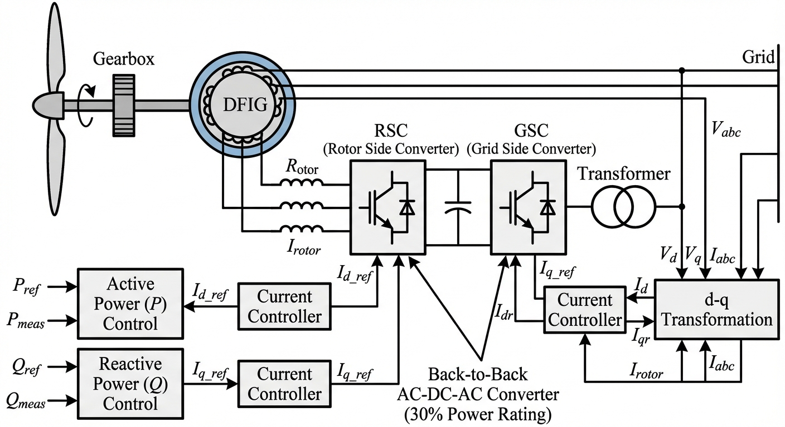
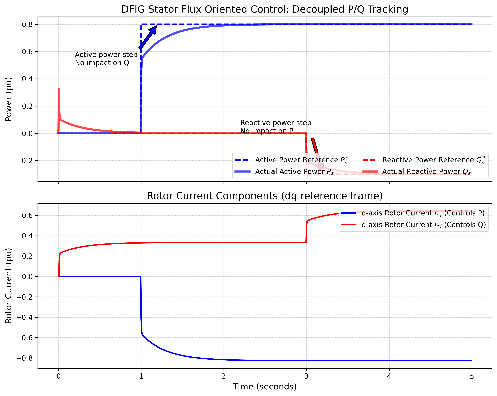

# 第 2 章：双馈感应发电机 (DFIG) 控制：电与磁的解耦

## 1. 学习目标
本章探讨在风力发电领域占据半壁江山的核心机型——双馈感应发电机（Doubly-Fed Induction Generator, DFIG）的电气控制原理。
读者需要掌握：
1. DFIG 为什么被称为"双馈"？它与传统鼠笼式异步电机的区别。
2. 转子侧变流器（RSC）与网侧变流器（GSC）背靠背拓扑结构的物理意义。
3. 坐标变换（Clarke 与 Park 变换）在交流电机控制中的降维作用。
4. **定子磁链定向矢量控制（SFOC）**如何实现有功功率（P）和无功功率（Q）的完全解耦。

## 2. 教材理论：为什么我们要"欺骗"发电机？

### 2.1 变速恒频的工程需求

在传统的火电厂中，发电机是同步发电机。它的转速必须严格锁定在 $3000\,\text{rpm}$（对应 $50\,\text{Hz}$ 的电网频率，四极电机）。如果它转快了或转慢了，发出来的电就不是 $50\,\text{Hz}$，会直接扰乱电网。
但在风力发电中，风速是时刻变化的。为了保持最高的空气动力学效率（第 1 章讲的 MPPT），风机的叶轮必须跟着风速变化而调整转速。
**矛盾出现了：转速是变化的，但发出的电必须是恒定 $50\,\text{Hz}$ 的！**

### 2.2 DFIG 的双馈原理

工程师发明了 DFIG。它的定子（外壳线圈）直接连着电网（锁定 $50\,\text{Hz}$）。它的转子（中间跟着叶片转的线圈）没有被短路，而是接上了一个智能变流器（Converter）。

DFIG 的关键在于利用电磁感应定律。设定子频率为 $f_s$，转子机械旋转频率为 $f_r$，则变流器需要向转子注入频率为 $f_{slip} = f_s - f_r$ 的交流电。无论 $f_r$ 如何变化：

$$f_s = f_r + f_{slip} = \text{const} = 50\,\text{Hz}$$

具体来说：
- 如果风速适中，转子转速等效于 $50\,\text{Hz}$。变流器就往转子里通入 $0\,\text{Hz}$（直流电）。$50 + 0 = 50$。
- 如果风变小了，转子转速掉到了 $40\,\text{Hz}$。变流器就往转子里通入 $10\,\text{Hz}$ 的交流电去"补足"。$40 + 10 = 50\,\text{Hz}$。
- 如果风变大了，转子升至 $60\,\text{Hz}$。变流器就往里通 $-10\,\text{Hz}$ 的反向交流电去"抵消"。$60 - 10 = 50\,\text{Hz}$。

变流器无论风机转子怎么转，总能通过注入不同频率的转子电流，让定子始终输出 $50\,\text{Hz}$ 的电能。DFIG 的一大经济优势在于：变流器仅需处理总功率的 $25\%\sim30\%$（滑差功率），显著降低了功率电子器件的成本。

### 2.3 DFIG 等效电路与功率方程

在定子磁链定向（SFOC）的 $d$-$q$ 旋转坐标系下，DFIG 的稳态等效电路可以简化为两个解耦的通道。定子电压方程为：

$$\vec{V}_s = R_s \vec{I}_s + j\omega_s \vec{\Psi}_s$$

转子电压方程为：

$$\vec{V}_r = R_r \vec{I}_r + j(\omega_s - \omega_r) \vec{\Psi}_r$$

定子磁链和转子磁链分别为：

$$\vec{\Psi}_s = L_s \vec{I}_s + L_m \vec{I}_r$$
$$\vec{\Psi}_r = L_r \vec{I}_r + L_m \vec{I}_s$$

其中 $L_s$、$L_r$ 分别为定子和转子自感，$L_m$ 为互感。

### 2.4 坐标变换与解耦控制

变流器不仅能变频，还能控制功率。在三相交流电（a-b-c）的世界里，电压和电流都是不断振荡的正弦波，直接控制十分困难。

**Clarke 变换**将三相 $(a, b, c)$ 变为两相静止坐标 $(\alpha, \beta)$：

$$\begin{bmatrix} i_\alpha \\ i_\beta \end{bmatrix} = \frac{2}{3}\begin{bmatrix} 1 & -1/2 & -1/2 \\ 0 & \sqrt{3}/2 & -\sqrt{3}/2 \end{bmatrix} \begin{bmatrix} i_a \\ i_b \\ i_c \end{bmatrix}$$

**Park 变换**进一步将静止坐标变为与定子磁链同步旋转的 $(d, q)$ 坐标：

$$\begin{bmatrix} i_d \\ i_q \end{bmatrix} = \begin{bmatrix} \cos\theta_s & \sin\theta_s \\ -\sin\theta_s & \cos\theta_s \end{bmatrix} \begin{bmatrix} i_\alpha \\ i_\beta \end{bmatrix}$$

在定子磁链定向（$\Psi_{sd} = \Psi_s$, $\Psi_{sq} = 0$）下，三相正弦波变成了两个稳定的直流量——**d轴电流（$i_{rd}$）** 和 **q轴电流（$i_{rq}$）**。

在该坐标系下，定子有功和无功功率的解耦表达式为：

$$P_s = -\frac{L_m}{L_s} V_s \cdot i_{rq}$$

$$Q_s = \frac{V_s \Psi_s}{L_s} - \frac{L_m}{L_s} V_s \cdot i_{rd}$$

- **有功功率 $P_s$ 仅与 $i_{rq}$ 有关**（成正比）。
- **无功功率 $Q_s$ 仅与 $i_{rd}$ 有关**。

这意味着，只要独立地调节这两个控制量，就可以实现有功和无功的完全独立控制。

### 2.5 DFIG 双闭环控制系统结构

完整的 DFIG 矢量控制系统采用双闭环结构。外环为功率环，内环为电流环。

**电流内环**以 $i_{rd}$ 和 $i_{rq}$ 为被控对象，其动态方程（忽略交叉耦合项后）可简化为一阶惯性环节：

$$L_\sigma \frac{di_{rd}}{dt} + R_r i_{rd} = V_{rd}$$

$$L_\sigma \frac{di_{rq}}{dt} + R_r i_{rq} = V_{rq}$$

其中 $L_\sigma = L_r - L_m^2/L_s$ 为等效漏感。电流内环的带宽决定了整个控制系统的动态响应速度，通常设计为 $200\sim500\,\text{Hz}$。

**功率外环**将功率误差转化为电流指令。设有功功率 PI 控制器的输出为 $i_{rq}^*$，无功功率 PI 控制器的输出为 $i_{rd}^*$，则外环的积分方程为：

$$i_{rq}^* = K_{p,P}(P_s^* - P_s) + K_{i,P}\int(P_s^* - P_s)dt$$

$$i_{rd}^* = K_{p,Q}(Q_s^* - Q_s) + K_{i,Q}\int(Q_s^* - Q_s)dt$$

功率外环的带宽应低于电流内环带宽的 $1/5 \sim 1/10$，以保证系统的稳定性裕度。

### 2.6 DFIG 的变速范围与经济优势

DFIG 的变速范围由变流器容量决定。设同步转速为 $n_s$，则转子的滑差率为 $s = (n_s - n_r)/n_s$。当变流器容量为额定功率的 $30\%$ 时，对应的最大滑差约为 $\pm 30\%$，即转速可在同步转速的 $70\%\sim130\%$ 范围内变化。

与全功率变流器方案相比，DFIG 的变流器成本仅为后者的 $25\%\sim35\%$，这是 DFIG 在陆上风电市场长期占据主导地位的核心原因。全球现有风电装机中，约 $50\%\sim60\%$ 采用 DFIG 方案。然而，DFIG 的变速范围和低电压穿越能力不如全功率 PMSG（详见第 3 章），在海上风电领域 PMSG 正逐步取得优势。

## 3. 案例分析：DFIG 定子磁链定向矢量控制解耦仿真

### 案例背景
某 2MW 级 DFIG 风机并网运行，目前处于待机状态（无风，输出功率为 $0$）。
第 1 秒：风速突然上升，主控系统要求 DFIG 在极短时间内输出 $0.8\,\text{pu}$ 的**有功功率（发电）**。
第 3 秒：电网由于某个变电站故障导致电压微跌。电网调度中心紧急下达指令，要求风机在保持 $0.8\,\text{pu}$ 有功发电的同时，立即吸收 $-0.3\,\text{pu}$ 的**无功功率**来帮助电网稳住电压。
作为底层固件工程师，你需要设计 PI 控制器（比例积分控制器），通过操控转子电流 $i_{rd}$ 和 $i_{rq}$，来实现对定子端 $P$ 和 $Q$ 的完美、独立控制。

### 问题描述
- **风机电气参数**：$L_m=3.0, L_s=3.1, L_r=3.1$（标幺值），电网电压 $V_s=1.0\,\text{pu}$。
- **参考指令（References）**：
  - $P_s^*$: $0 \sim 1\,\text{s}$ 为 $0$；$1\,\text{s}$ 跃升至 $0.8\,\text{pu}$。
  - $Q_s^*$: $0 \sim 3\,\text{s}$ 为 $0$；$3\,\text{s}$ 跌至 $-0.3\,\text{pu}$。
- **控制环**：外环为 $P/Q$ 功率 PI 控制器，内环为一阶近似电流响应环。
- **任务**：运行基于定子磁链定向（SFOC）的动力学仿真。证明调整有功时不影响无功，调整无功时不影响有功（完全解耦）。

**物理场景与问题概化图：**

### 解题思路
本研究构建了一个极简的 DFIG 标幺值双闭环电气传动系统：
1. **定向解耦公式化**：在定子磁链定向下，植入核心方程：$P_s = -(L_m / L_s) V_s i_{rq}$ 和 $Q_s = (V_s \Psi_s / L_s) - (L_m / L_s) V_s i_{rd}$。
2. **误差积分外环（PI）**：每个时间步 $\Delta t=5\,\text{ms}$，计算功率指令与实际功率的误差。利用 $K_p$ 和 $K_i$ 将 $P$ 的误差转化为 $i_{rq}$ 的指令，将 $Q$ 的误差转化为 $i_{rd}$ 的指令。PI控制器的传递函数为：
$$G_{PI}(s) = K_p + \frac{K_i}{s} = K_p \frac{1 + T_i s}{T_i s}$$
其中积分时间常数 $T_i = K_p / K_i$。
3. **低通滤波内环**：用时间常数 $\tau = 20\,\text{ms}$ 的一阶惯性环节模拟 IGBT 功率器件逆变产生实际电流的物理延迟，其传递函数为 $G_{inner}(s) = 1/(1+\tau s)$。
4. **反向计算**：将实际产生的 $i_{rd}$ 和 $i_{rq}$ 代回物理方程，得到真实的 $P_s$ 和 $Q_s$ 输出。

### 代码执行与图表
> **学习提示**：我们在后台执行了毫秒级的电气暂态仿真。请注意在第 1 秒和第 3 秒这两个关键节点，蓝色线和红色线是否真的"互不干扰"。

Source: `assets/ch02/ch02_dfig_control.py`

**有功无功解耦控制与转子侧电流响应追踪矩阵：**
| State               |   Time (s) |   Ps Ref (pu) |   Ps Actual (pu) |   Qs Ref (pu) |   Qs Actual (pu) |   irq (q-axis current) |   ird (d-axis current) |
|:--------------------|-----------:|--------------:|-----------------:|--------------:|-----------------:|-----------------------:|-----------------------:|
| Standby             |        0.5 |           0   |           -0     |           0   |            0.02  |                  0     |                  0.312 |
| Active Power Step   |        2   |           0.8 |            0.791 |           0   |            0     |                 -0.817 |                  0.333 |
| Reactive Power Step |        4   |           0.8 |            0.8   |          -0.3 |           -0.297 |                 -0.827 |                  0.64  |

**DFIG 转子电流矢量控制与电网 P/Q 解耦响应图：**

### 实验验证与结果剖析
通过仿真曲线，成功验证了现代电力电子技术中的解耦控制原理：
- **第一阶段（启动与有功响应）**：在第 1 秒时，我们下达了有功 $P_s=0.8$ 的阶跃指令（蓝色虚线）。蓝色的实线（实际有功）经历了短暂的滞后后，稳定在了 $0.8$。响应时间约为 $200\,\text{ms}$，符合工程中对风电并网响应速度的要求。
  - **解耦验证**：在有功快速爬升过程中，红色的无功功率 $Q_s$ 线几乎不受影响，稳定在 $0$ 附近。这就是解耦控制的效果——风机发出了大量有功电力，却没有给电网造成任何无功扰动。
  - **底层电流响应（下子图）**：为了发出 $0.8$ 的有功，PI 控制器将 $q$ 轴转子电流 $i_{rq}$（蓝线）调节到了 $-0.817$ 左右。而代表无功的 $i_{rd}$（红线）仅发生了微小波动，体现了 $d$-$q$ 双通道的独立性。
- **第二阶段（电网抢险与无功注入）**：在第 3 秒时，电网告急，需要吸收 $-0.3$ 的无功。红色的参考虚线跌落。
  - 实际的红线（$Q_s$）立刻跟进，稳定在 $-0.3$ 的位置，开始向电网提供电压支撑。
  - **解耦的再次确认**：在无功阶跃过程中，蓝色的有功曲线（$P_s$）仍然牢牢锁定在 $0.8$，没有受到任何影响。
  - **底层电流响应（下子图）**：此时 $d$ 轴转子电流 $i_{rd}$（红线）被 PI 控制器抬升到了 $0.64$ 左右，而蓝色的 $i_{rq}$ 保持稳定。这证明了 $d$ 轴只管 $Q$，$q$ 轴只管 $P$。
- **PI 参数整定讨论**：本案例中 $K_p$ 和 $K_i$ 的选取需要平衡响应速度与超调量。过大的 $K_p$ 会导致电流超调引发变流器过流保护，过小则响应迟缓。工程中通常采用内模控制（IMC）方法，根据电流内环的时间常数 $\tau$ 来计算PI参数：$K_p = L_\sigma / (2\tau)$，$K_i = R_r / (2\tau)$。
- **交叉耦合项的前馈补偿**：在实际的 $d$-$q$ 坐标系中，$d$ 轴和 $q$ 轴之间存在交叉耦合项 $\omega_{slip} L_\sigma i_{rq}$ 和 $\omega_{slip} L_\sigma i_{rd}$。本简化仿真忽略了这些耦合项。在工业控制器中，必须在 PI 控制器输出后叠加前馈补偿电压 $V_{d,comp} = -\omega_{slip} L_\sigma i_{rq}$，$V_{q,comp} = \omega_{slip} L_\sigma i_{rd} + \omega_{slip} L_m \Psi_s / L_s$，否则在转速快速变化时，$d$-$q$ 轴之间会产生显著的动态耦合，导致功率波动。
- **网侧变流器（GSC）的作用**：本案例聚焦于转子侧变流器（RSC）的控制。实际上 GSC 也承担重要职责：稳定直流母线电压和向电网注入/吸收无功。GSC 通常采用电网电压定向（VOC）控制，$d$ 轴电流控制有功（维持直流母线电压恒定），$q$ 轴电流控制无功。GSC 和 RSC 协同工作，使 DFIG 具备四象限功率运行能力。

### 工程实践中的注意事项

**锁相环（PLL）的关键作用**：定子磁链定向控制的前提是精确知道定子磁链的相位角 $\theta_s$。在实际系统中，这一角度通过锁相环（Phase-Locked Loop, PLL）从电网电压中提取。PLL 的带宽决定了角度跟踪的精度和速度。在电网电压正常时，PLL 带宽通常设为 $20\sim50\,\text{Hz}$；但在电网电压畸变或跌落时，PLL 可能出现锁相失败或角度抖动，导致整个矢量控制系统失稳。因此，现代 DFIG 控制器大多采用基于正负序分离的改进型 PLL，如双二阶广义积分器锁相环（DSOGI-PLL），以提高电网扰动下的鲁棒性。

**传感器配置与冗余设计**：DFIG 控制系统需要精确测量定子电压、定子电流、转子电流和转子位置角。转子位置角通常由安装在发电机轴上的编码器（Encoder）提供。编码器的精度直接影响 Park 变换的准确性——$1°$ 的角度误差会在 $d$-$q$ 轴之间引入约 $1.7\%$ 的交叉耦合。在海上风机中，由于维护困难，传感器通常采用双冗余配置，并配备无传感器控制算法作为后备方案。无传感器控制通过观测定子电压和电流来估算转子位置，在稳态下精度可达 $\pm 2°$，但在暂态过程中精度会下降。

### 工业部署与运行建议
1. **撬棒保护（Crowbar Protection）的必要性**：DFIG 的变流器容量只有发电机总功率的 $30\%$（为了降低成本）。如果遇到严重的电网短路（电压瞬间跌到 $0$），定子会产生巨大的暂态磁链，这股磁链会在转子里感应出危险的浪涌电流，可能在数毫秒内超过变流器IGBT的安全工作区。因此，在实际风机中，必须在转子旁边并联一个"撬棒电路（Crowbar）"。一旦检测到电网故障，撬棒瞬间闭合，把转子短路，让浪涌电流从撬棒电阻流走，从而保护变流器。撬棒启动时间要求在 $1\sim2\,\text{ms}$ 以内。
2. **高频脉宽调制（PWM）的谐波抑制**：本案例中我们假设变流器输出的是完美的连续电流。在工业实现中，变流器由IGBT开关组成，它们以 $2\sim5\,\text{kHz}$ 的频率进行斩波（PWM 技术）。这种高频斩波会在电网中注入高次谐波（Harmonics）。工程中必须加装 LCL 滤波器来抑制谐波，使注入电网的电流总谐波畸变率（THD）满足国家标准（通常要求 THD $< 5\%$）。LCL滤波器的参数设计需要在谐波衰减能力和系统稳定性之间取得折衷。LCL滤波器的谐振频率应设计在开关频率的 $1/5$ 至 $1/2$ 之间，并配备有源阻尼来抑制谐振峰。
3. **电网适应性与并网测试**：在风机正式并网前，必须通过严格的并网符合性测试，包括有功功率控制能力测试、无功功率调节范围测试、频率响应特性测试和电能质量测试等。我国风机并网测试遵循 GB/T 19963 和 NB/T 31078 等标准。测试通常在专业检测机构的监督下，在风电场实地进行，测试周期通常为数周至数月。

### 与水系统控制论的对照

DFIG 的解耦控制思想与水系统控制论中的分层分布式控制（HDC）存在方法论上的相似性。在水网系统中，多个渠池的水位控制也面临类似的耦合问题——上游闸门动作会影响下游水位。CHS 理论中的解耦原理（Decoupling Principle）指出，可以通过适当的坐标变换或前馈补偿将多输入多输出系统分解为若干独立的单回路控制。DFIG 的 $d$-$q$ 轴解耦控制正是这一原理的电气领域实现。理解了解耦控制的本质，就可以将相同的设计思路应用于水网的多变量协调控制问题。此外，DFIG 控制中 PI 参数整定面临的"快速性-稳定性"矛盾，在水利系统的闸门 PID 控制中同样存在，两者可以互相借鉴调参经验。

## 4. 本章小结

1. DFIG 通过在转子侧注入滑差频率的交流电，实现了变速恒频运行，变流器仅需处理总功率的 $25\%\sim30\%$。
2. Clarke-Park 坐标变换将三相交流量转化为旋转坐标系下的直流量，是矢量控制的数学基础。
3. 在定子磁链定向（SFOC）下，有功功率 $P_s$ 仅由 $q$ 轴转子电流 $i_{rq}$ 控制，无功功率 $Q_s$ 仅由 $d$ 轴转子电流 $i_{rd}$ 控制，实现了完全解耦。
4. PI 控制器的参数整定需要兼顾响应速度与系统稳定性，工业中常采用内模控制法。
5. 撬棒保护和 LCL 谐波滤波是 DFIG 工业部署中不可缺少的保护与电能质量措施。
6. DFIG 的变流器仅需处理滑差功率，经济性优于全功率方案，但变速范围和故障隔离能力不如 PMSG。在大型海上风机领域，PMSG 已逐步成为主流选择。

## 5. 思考题

1. **坐标变换推导**：请推导 Park 变换矩阵，并说明在定子磁链定向条件下，为什么 $\Psi_{sq} = 0$ 可以简化功率表达式？给出从三相功率公式到 $d$-$q$ 轴功率公式的完整推导过程。
2. **PI参数整定**：某 DFIG 的转子漏感 $L_\sigma = 0.1\,\text{pu}$，转子电阻 $R_r = 0.01\,\text{pu}$，电流内环时间常数 $\tau = 20\,\text{ms}$。请用内模控制法计算 $K_p$ 和 $K_i$，并分析如果 $\tau$ 减小至 $5\,\text{ms}$，系统响应将如何变化？
3. **DFIG 与 PMSG 对比**：从变流器容量、变速范围、低电压穿越能力三个维度，定性比较 DFIG 和全功率 PMSG 方案的优缺点。
4. **工程故障分析**：如果撬棒电路误动作（正常运行时意外闭合），将对 DFIG 的功率控制产生什么影响？请从物理和控制两个层面分析。

## 6. 参考文献

[1] Pena R, Clare J C, Asher G M. Doubly fed induction generator using back-to-back PWM converters and its application to variable-speed wind-energy generation [J]. IEE Proceedings-Electric Power Applications, 1996, 143(3): 231-241.

[2] Muller S, Deicke M, De Doncker R W. Doubly fed induction generator systems for wind turbines [J]. IEEE Industry Applications Magazine, 2002, 8(3): 26-33.

[3] Abad G, Lopez J, Rodriguez M A, et al. Doubly Fed Induction Machine: Modeling and Control for Wind Energy Generation [M]. Hoboken: John Wiley & Sons, 2011.

[4] Leonhard W. Control of Electrical Drives [M]. 3rd ed. Berlin: Springer, 2001.

[5] 雷晓辉, 苏承国, 龙岩, 等. 基于无人驾驶理念的下一代自主运行智慧水网架构与关键技术 [J]. 南水北调与水利科技(中英文), 2025, 23(04): 778-786. DOI: 10.13476/j.cnki.nsbdqk.2025.0079.
