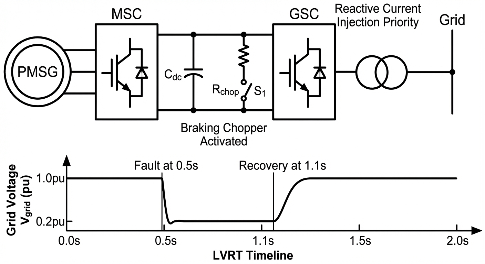
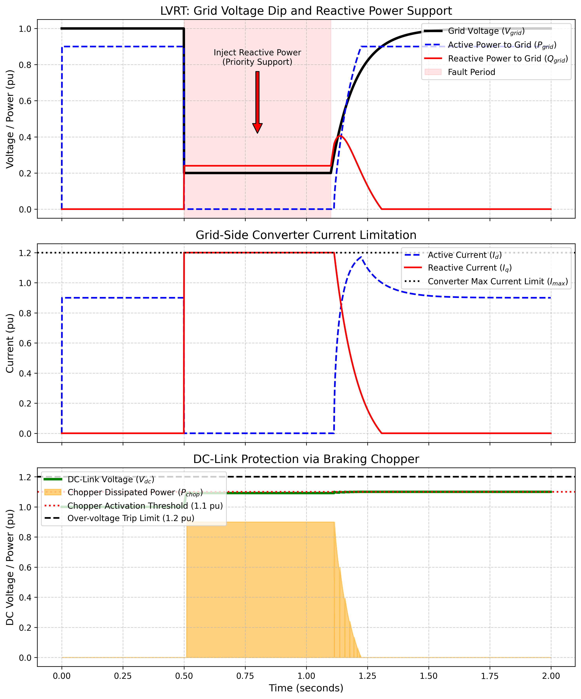

# 第 3 章：全功率变流器与低电压穿越 (LVRT)：在故障中支撑电网

## 1. 学习目标
本章探讨永磁直驱同步发电机（PMSG）的"全功率"变流器架构，以及风电并网中最严苛的生存测试——低电压穿越（Low Voltage Ride Through, LVRT）。
读者需要掌握：
1. PMSG 全功率变流器（Full-Scale Converter）与 DFIG 的本质拓扑区别。
2. 直流母线（DC-Link）作为能量水库的缓冲作用与过压危机。
3. 为什么电网发生短路故障时，风机绝对不能"脱网逃跑"？
4. 网侧变流器（GSC）的无功支撑策略与斩波电路（Chopper）的能量消耗。

## 2. 教材理论：当电网濒临崩溃，风机必须成为支撑者

### 2.1 PMSG 全功率变流器架构

在第 2 章中，DFIG 是一种经济型设计，它的变流器只处理 $30\%$ 的功率，剩下 $70\%$ 直接连在电网上。这种设计成本低，但一旦电网发生严重短路，DFIG 就容易受到冲击。

为了追求更高的可靠性，工程师开发了**直驱永磁发电机（PMSG）**。它的特点是**"全隔离"**：发电机发出的 $100\%$ 的电，全部要先经过一个"机侧变流器（MSC）"变成直流电，存入中间的**直流母线电容（DC-Link）**，然后再经过"网侧变流器（GSC）"变成 $50\,\text{Hz}$ 的交流电送入电网。

PMSG 的功率传输路径为：

$$\text{风轮} \xrightarrow{P_{mech}} \text{PMSG} \xrightarrow{P_{gen}} \text{MSC} \xrightarrow{P_{dc}} \text{DC-Link} \xrightarrow{P_{grid}} \text{GSC} \xrightarrow{} \text{电网}$$

因为中间隔了一个直流"缓冲区"，无论电网那边发生什么故障，PMSG 发电机本体都不会直接受到冲击。

### 2.2 PMSG 的电磁方程

在 $d$-$q$ 旋转坐标系下，PMSG 的电压方程为：

$$V_d = R_s i_d + L_d \frac{di_d}{dt} - \omega_e L_q i_q$$

$$V_q = R_s i_q + L_q \frac{di_q}{dt} + \omega_e (L_d i_d + \psi_f)$$

其中 $R_s$ 为定子电阻，$L_d$、$L_q$ 为 $d$-$q$ 轴电感，$\omega_e$ 为电角速度，$\psi_f$ 为永磁体磁链。

电磁转矩方程为：

$$T_e = \frac{3}{2} p [\psi_f i_q + (L_d - L_q) i_d i_q]$$

对于表贴式 PMSG（$L_d = L_q = L_s$），转矩简化为：

$$T_e = \frac{3}{2} p \psi_f i_q$$

此时转矩仅由 $q$ 轴电流决定，控制结构与 DFIG 类似。

### 2.3 直流母线的能量守恒

直流母线电容的电压动态方程为：

$$C \frac{dV_{dc}}{dt} = \frac{P_{gen} - P_{grid} - P_{chop}}{V_{dc}}$$

其中 $C$ 为直流母线电容值，$P_{gen}$ 为发电机输出功率，$P_{grid}$ 为注入电网的功率，$P_{chop}$ 为斩波器消耗的功率。正常运行时 $P_{gen} \approx P_{grid}$，$V_{dc}$ 恒定。

### 2.4 低电压穿越的物理死局与破局

在早期的风电场，如果电网短路导致电压跌落，风机会瞬间切断断路器**"脱网"**。但如果成千上万台风机同时脱网，电网会瞬间失去大量电力供应，导致频率和电压彻底崩溃，引发大面积停电。

因此，现代国家电网制定了严格的"低电压穿越（LVRT）"标准：**当电网短路电压跌落时，风机不准停机脱网，还必须向电网注入无功电流来支撑电压恢复。**

我国 GB/T 19963 标准要求：电网电压跌至 $20\%$ 时，风机应持续并网至少 $625\,\text{ms}$，且应注入的无功电流满足：

$$I_q \geq 1.5 \times (0.9 - V_{grid}), \quad 0.2 \leq V_{grid} \leq 0.9$$

**PMSG 面临的功率失衡危机**：

当电压跌落到 $0.2\,\text{pu}$ 时，GSC 变流器受制于最大电流限制（如 $1.2\,\text{pu}$），它最多只能向电网送出 $0.2 \times 1.2 = 0.24\,\text{pu}$ 的功率。
但风还在刮，发电机还在输出 $0.9\,\text{pu}$ 的功率。
进来的多（$0.9$），出去的少（$0.24$）。多余的能量（$0.66\,\text{pu}$）全部堆积在直流母线电容里，根据公式 $E = \frac{1}{2} C V_{dc}^2$，直流电压 $V_{dc}$ 会在数百毫秒内急剧上升，直到超过电容的耐压极限。

**破局战术（Chopper）**：必须在直流母线上并联一个"制动斩波器（Braking Chopper）"。当检测到 $V_{dc}$ 上升至报警阈值（如 $1.1\,\text{pu}$）时，系统立刻闭合 IGBT，把多余的能量通入一个大功率电阻里，转化为热量耗散。同时让 GSC 腾出全部电流额度给电网输送无功。GSC 的电流分配遵循无功优先原则：

$$I_{d,max} = \sqrt{I_{max}^2 - I_q^2}$$

### 2.5 PMSG 机侧变流器的控制策略

机侧变流器（MSC）的主要任务是控制 PMSG 的转矩和转速，实现 MPPT 或恒功率运行。常用的控制方法包括：

**零 $d$ 轴电流控制（$i_d = 0$ 控制）**：对于表贴式 PMSG，令 $i_d = 0$ 可使电磁转矩与 $i_q$ 成线性关系，简化控制设计。此时定子电流的幅值最小，铜耗最低。转矩控制方程简化为：

$$T_e^* = \frac{3}{2} p \psi_f i_q^*$$

**最大转矩电流比控制（MTPA）**：对于内置式 PMSG（$L_d \neq L_q$），通过同时调节 $i_d$ 和 $i_q$，利用磁阻转矩分量来产生更大的转矩，降低所需电流的幅值。MTPA 条件下的 $d$ 轴电流为：

$$i_d^* = \frac{\psi_f}{2(L_q - L_d)} - \sqrt{\frac{\psi_f^2}{4(L_q - L_d)^2} + i_q^{*2}}$$

### 2.6 全功率变流器与 DFIG 的技术对比

与 DFIG 方案相比，PMSG 全功率变流器方案具有以下特点：

| 对比维度 | DFIG | PMSG 全功率 |
|---------|------|-----------|
| 变流器容量 | 额定功率的 $25\%\sim30\%$ | 额定功率的 $100\%$ |
| 变速范围 | $\pm30\%$ 同步转速 | $0\sim100\%$ 额定转速 |
| 齿轮箱 | 需要三级齿轮箱 | 不需要（直驱） |
| 电网故障隔离 | 定子直连电网，故障敏感 | 直流母线完全隔离 |
| 维护成本 | 中等（齿轮箱维护） | 较低（无齿轮箱） |
| 初始成本 | 较低（变流器小） | 较高（变流器大+永磁体） |

在海上风电领域，由于维护困难、可靠性要求高，PMSG 直驱方案已成为主流选择。目前全球海上风机单机容量已突破 $15\,\text{MW}$，均采用 PMSG 全功率变流器架构。

## 3. 案例分析：PMSG 深压跌落与斩波救险仿真

### 案例背景
某海上风电场采用 2MW 的 PMSG 机组。正值大风天，风机满发（$P=0.9\,\text{pu}$）。
突然，在 $t=0.5\,\text{s}$ 时，主干电网遭到雷击发生三相短路故障。电网电压瞬间跌至 $0.2\,\text{pu}$（严重的深压跌落），故障持续了整整 $600\,\text{ms}$（到 $t=1.1\,\text{s}$ 才被断路器切除）。
电网调度中心严密监控这台风机，如果它在这 $600\,\text{ms}$ 内脱网，电网将面临崩溃风险。
作为变流器算法工程师，你需要用代码重现这关键的 $600\,\text{ms}$。展示网侧变流器（GSC）是如何优先分配无功电流的，以及斩波器是如何挡下致命的能量冲击的。

### 问题描述
- **电网强迫（Grid Voltage）**：$t=0.5 \sim 1.1\,\text{s}$，电压 $V_{grid} = 0.2\,\text{pu}$；之后指数恢复。
- **GSC 变流器限制**：最大允许电流 $I_{max} = 1.2\,\text{pu}$。
- **无功支撑规范（Grid Code）**：在电压跌落时，注入的无功电流 $I_q = 2.0 \times (0.9 - V_{grid})$，且受 $I_{max}$ 截断。优先保证无功，剩余电流额度才给有功。
- **DC-Link 动态**：电容 $C=0.1\,\text{pu}$。斩波器开启阈值 $V_{trip} = 1.1\,\text{pu}$。极限耐压阈值 $1.2\,\text{pu}$。
- **任务**：在一维时间域内，模拟 $P_{grid}$、$Q_{grid}$、$I_d$、$I_q$ 的突变，并监控 $V_{dc}$ 曲线以证明风机存活。

**物理场景与问题概化图：**

### 解题思路
本研究构建了一个包含离散事件逻辑与连续积分的状态机：
1. **电网电压序列器**：用阶跃和指数函数生成标准的 LVRT 测试电压曲线。
2. **GSC 电流分配优先级**：
   - 侦测到 $V_{grid} < 0.9$ 后，立即计算电网规定的 $I_{q,ref}$。
   - 利用几何约束 $I_{d,max} = \sqrt{I_{max}^2 - I_{q,ref}^2}$，强行压缩有功电流的空间，确保变流器不过流。
3. **直流母线积分器（Euler Method）**：基于功率守恒 $P_{gen} - P_{grid} - P_{chop}$，按 $1\,\text{ms}$ 的步长积分 $V_{dc}$。积分公式为：
$$V_{dc}(k+1) = \sqrt{V_{dc}^2(k) + \frac{2\Delta t}{C}(P_{gen} - P_{grid} - P_{chop})}$$
4. **斩波硬截断**：一旦积分发现 $V_{dc}$ 越过 $1.1\,\text{pu}$，立刻计算 $P_{chop} = P_{gen} - P_{grid}$ 将多余功率全部耗散。

### 代码执行与图表
> **学习提示**：我们在后台执行了毫秒级的电气防护仿真。请仔细观察最下方的子图，那块橙色的阴影就是斩波器为了保住风机而耗散掉的能量。

Source: `assets/ch03/ch03_pmsg_lvrt.py`

**电网深压跌落期间能量转移与电流重组追踪矩阵：**
| State                 |   Grid Volt (pu) |   P_grid (pu) |   Q_grid (pu) |   I_reactive (pu) |   DC Volt (pu) |   Chopper Power |
|:----------------------|-----------------:|--------------:|--------------:|------------------:|---------------:|----------------:|
| Pre-Fault             |             1    |           0.9 |          0    |               0   |           1    |             0   |
| Deep Fault (0.6s)     |             0.2  |           0   |          0.24 |               1.2 |           1.09 |             0.9 |
| Fault Clearing (1.0s) |             0.2  |           0   |          0.24 |               1.2 |           1.09 |             0.9 |
| Recovered             |             0.99 |           0.9 |          0    |               0   |           1.1  |             0   |

**PMSG 全功率变流器 LVRT 无功支撑与直流母线保卫图：**

### 实验验证与结果剖析
这 $600$ 毫秒的仿真，完整展现了工业防护逻辑的运行过程：
- **无功的绝对优先（上方与中间子图）**：在 $t=0.5\,\text{s}$ 故障发生的瞬间，电网电压跌至 $0.2\,\text{pu}$。中间子图显示，蓝色的有功电流 $I_d$ 瞬间被压缩到 $0$。而红色的无功电流 $I_q$ 瞬间上升到变流器的物理极限（$1.2\,\text{pu}$）。
  - 代价是向电网输送的有功功率（蓝虚线）瞬间归零。但一束无功功率（红实线，$0.24\,\text{pu}$）被注入了电网，这是电网在故障期间最需要的电压支撑。
  - 无功电流的计算值 $I_q = 2.0 \times (0.9 - 0.2) = 1.4\,\text{pu}$ 超过了变流器极限 $1.2\,\text{pu}$，因此被截断至 $1.2\,\text{pu}$，全部电流额度用于无功支撑。
- **直流母线的能量平衡（下方子图）**：由于送进电网的有功变成了 $0$，而发电机仍在输出 $0.9\,\text{pu}$ 的能量。下方子图显示，绿色的直流母线电压 $V_{dc}$ 在故障瞬间快速上升。
  - 在数毫秒内，$V_{dc}$ 就触及报警线（$1.1\,\text{pu}$）。
  - **Chopper 启动**：斩波器瞬间启动，将多达 $0.9\,\text{pu}$ 的电能全部通过电阻耗散为热量。
  - 最终，在整个 $600\,\text{ms}$ 故障期内，$V_{dc}$ 被稳定控制在 $1.1\,\text{pu}$ 以下。风机安全度过了电压跌落事件。
- **故障恢复**：在 $t=1.1\,\text{s}$ 故障切除后，电压恢复。系统立刻关闭斩波器，无功电流撤退，有功电流重新恢复。风机恢复正常发电。恢复过程中需注意避免功率恢复过快引起的直流母线电压跌落。功率恢复速率通常限制在 $0.1\sim0.2\,\text{pu/s}$，以避免对电网造成二次扰动。
- **LVRT 策略的时序协调**：完整的 LVRT 防护涉及多个子系统的时序协调。当检测到电压跌落后，在 $1\sim2\,\text{ms}$ 内 GSC 切换至 LVRT 模式（无功优先）；在 $5\sim10\,\text{ms}$ 内斩波器启动消耗多余能量；在 $50\sim100\,\text{ms}$ 内变桨系统开始动作降低风能输入。变桨系统的响应速度（约 $8\,\text{°/s}$）远慢于电力电子器件（微秒级），因此斩波器必须在变桨生效前承担全部的能量缓冲任务。
- **能量耗散量估算**：故障期间斩波器总耗散能量约为 $0.9\,\text{pu} \times 0.6\,\text{s} = 0.54\,\text{pu \cdot s}$，对于 $2\,\text{MW}$ 机组即 $1.08\,\text{MJ}$。制动电阻的热容量设计必须满足该能量要求。

### 工程实践中的关键考虑

**多级 LVRT 控制策略**：实际工程中的 LVRT 控制不是简单的两态切换（正常/故障），而是采用多级协调策略。第一级是快速电流限幅（微秒级），确保变流器不过流；第二级是无功电流注入（毫秒级），按电网规范计算所需无功量；第三级是斩波器启动（毫秒级），消耗多余的有功功率；第四级是变桨减载（秒级），从源头上降低机械输入功率。四级策略按时间尺度递进配合，形成完整的防护体系。

**电网规范的地区差异**：不同国家和地区的 LVRT 标准存在显著差异。我国 GB/T 19963 要求风机在电压跌至 $20\%$ 时保持并网 $625\,\text{ms}$；德国 E.ON 标准要求在 $0\%$ 电压下保持 $150\,\text{ms}$；美国 FERC Order 661-A 要求在 $15\%$ 电压下保持 $625\,\text{ms}$。变流器的硬件设计（电容容量、斩波电阻额定功率、IGBT 电流裕度）必须满足最严格的标准要求。在出口型风机设计中，通常按照最严格的标准进行硬件配置，通过软件参数切换适配不同市场。

**并网点的短路容量影响**：弱电网条件下（短路比 SCR $< 3$），LVRT 期间的无功注入可能引起电压过度恢复或振荡。弱电网中 PMSG 的控制器带宽需要适当降低，并增加有源阻尼环节，以避免变流器与电网阻抗之间的次同步谐振（Sub-Synchronous Resonance, SSR）。

### 工业部署与运行建议
1. **制动电阻的热设计**：Chopper 斩波器在物理上是一个大型电阻柜。仿真中它消耗了 $0.9\,\text{pu}$ 的功率，对于 2MW 风机来说，相当于 $1.8\,\text{MW}$ 的发热功率。如果 LVRT 持续时间超过 $1 \sim 2$ 秒，电阻柜会因过热而损坏。因此，在实际系统中，如果检测到电网故障持续时间较长，变桨系统必须立刻启动（第 1 章的 Pitch Control），把叶片扭开，从源头上减少风能的输入。制动电阻的热时间常数通常设计为 $3\sim5\,\text{s}$，并配备温度传感器进行过热保护。
2. **不对称故障与负序电流**：本案例模拟的是三相同时短路（对称故障）。在实际电网中，更常见的是"单相接地短路"（约占故障总数的 $70\%\sim80\%$）。这种不对称故障会在电网电压中产生负序分量，导致发电机出现 $100\,\text{Hz}$ 的功率脉动和转矩脉动。变流器的控制算法中必须加入双二阶广义积分器（DSOGI）锁相环实现正负序分离，并配置专门的负序电流抑制回路，以消除功率和转矩脉动对机组的机械冲击。负序电流控制的目标函数通常有三种选择：消除有功脉动、消除无功脉动、或消除负序电流。工程中需要根据具体的电网条件和机组特性选择最合适的控制目标。
3. **海上风电场群的 LVRT 协调**：大型海上风电场群通过长距离海底电缆接入陆上电网。海底电缆具有很大的对地电容，在 LVRT 期间会产生显著的充电电流，影响无功电流注入的精度。此外，多台风机同时注入无功可能导致并网点电压过恢复。因此，海上风电场需要配备集中式的 LVRT 协调控制器，根据并网点电压实时调整各台风机的无功分配比例。

### LVRT 技术的演进趋势

随着风电渗透率的持续提高，电网对风机 LVRT 能力的要求也在不断升级。早期的 LVRT 标准仅要求风机"不脱网"，即被动穿越。现代标准（如我国最新修订的 GB/T 19963.1-2021）已提出更高要求：风机不仅要穿越故障，还要在故障期间主动提供无功支撑，甚至在故障恢复后快速恢复有功输出。

下一代的电网规范可能进一步要求风机具备"构网"能力（Grid-Forming Capability），即在电网极端薄弱甚至"黑启动"场景下，风机能够独立建立电压和频率基准，而不依赖电网提供参考信号。构网型变流器采用虚拟同步机（Virtual Synchronous Generator, VSG）控制策略，模拟传统同步发电机的惯量和阻尼特性，为系统提供频率和电压支撑。这一技术方向对变流器的控制算法和硬件设计都提出了更高要求，是当前电力电子领域的研究热点之一。

构网型风机的核心控制方程为摇摆方程的数字实现：

$$J_{virtual} \frac{d\omega}{dt} = T_{mech}^* - T_e - D_{virtual}(\omega - \omega_0)$$

其中 $J_{virtual}$ 和 $D_{virtual}$ 分别为虚拟惯量和虚拟阻尼系数。

## 4. 本章小结

1. PMSG 全功率变流器通过直流母线实现了发电机与电网的完全电气隔离，抗故障能力优于 DFIG。
2. 直流母线电容的电压动态由 $P_{gen} - P_{grid} - P_{chop}$ 的功率差决定，功率失衡会导致直流电压快速偏离额定值。
3. LVRT 期间，GSC 必须遵循"无功优先"原则分配电流，全部电流额度优先满足电网无功支撑需求。
4. 制动斩波器（Chopper）通过将多余能量转化为热量来保护直流母线电容免于过压击穿。
5. 不对称故障下的负序电流抑制是工业级 LVRT 算法的关键难点。
6. 构网型变流器（Grid-Forming）是未来风电并网技术的发展方向，可在极端弱电网和黑启动场景下提供电压和频率支撑。

## 5. 思考题

1. **直流母线电压动态计算**：某 3MW PMSG 机组，直流母线电容 $C = 50\,\text{mF}$，额定直流电压 $V_{dc,rated} = 1100\,\text{V}$。当电网电压瞬间跌至 $0$ 且斩波器未启动时，假设发电机持续输出 $2.7\,\text{MW}$，请计算 $V_{dc}$ 从 $1100\,\text{V}$ 上升到 $1250\,\text{V}$（保护阈值）所需的时间。
2. **无功电流分配**：电网电压跌落至 $0.5\,\text{pu}$，变流器最大电流 $I_{max} = 1.0\,\text{pu}$，无功电流要求系数 $k = 2.0$。请计算：(a) 需注入的无功电流 $I_q$；(b) 剩余可用于有功传输的电流 $I_d$；(c) 实际可向电网输送的有功功率。
3. **制动电阻热设计**：如果 LVRT 持续时间为 $1.5\,\text{s}$，期间斩波器需消耗 $1.5\,\text{MW}$ 的功率，制动电阻的初始温度为 $25\,\text{°C}$，电阻体质量 $50\,\text{kg}$，比热容 $500\,\text{J/(kg·°C)}$，请估算制动电阻的最终温升。
4. **DFIG vs PMSG 的 LVRT 能力对比**：从变流器容量、故障电流路径、保护策略三个方面，分析为什么 PMSG 在 LVRT 场景中比 DFIG 更具优势。

## 6. 参考文献

[1] Yaramasu V, Wu B, Sen P C, et al. High-power wind energy conversion systems: State-of-the-art and emerging technologies [J]. Proceedings of the IEEE, 2015, 103(5): 740-788.

[2] Blaabjerg F, Ma K. Future on power electronics for wind turbine systems [J]. IEEE Journal of Emerging and Selected Topics in Power Electronics, 2013, 1(3): 139-152.

[3] Liserre M, Cardenas R, Molinas M, et al. Overview of multi-MW wind turbines and wind parks [J]. IEEE Transactions on Industrial Electronics, 2011, 58(4): 1081-1095.

[4] Tsili M, Papathanassiou S. A review of grid code technical requirements for wind farms [J]. IET Renewable Power Generation, 2009, 3(3): 308-332.

[5] 雷晓辉, 龙岩, 许慧敏, 等. 水系统控制论：提出背景、技术框架与研究范式 [J]. 南水北调与水利科技(中英文), 2025, 23(04): 761-769+904. DOI: 10.13476/j.cnki.nsbdqk.2025.0077.
