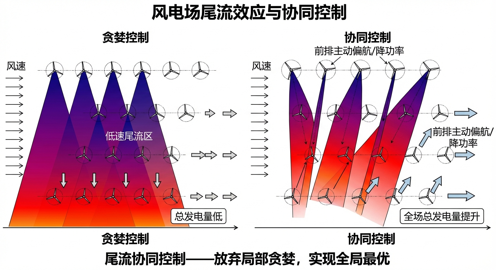
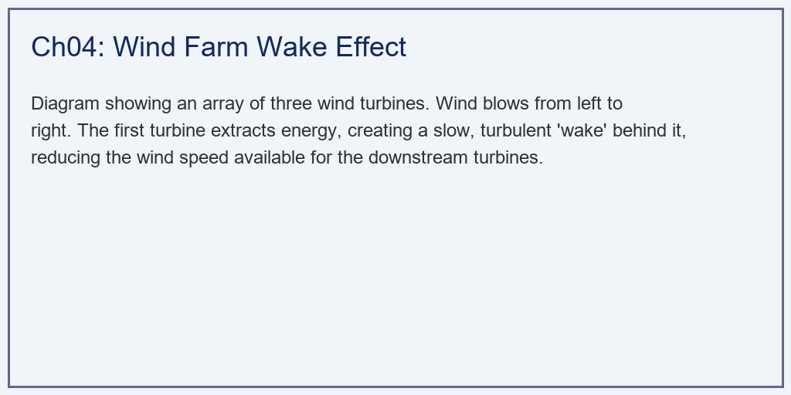
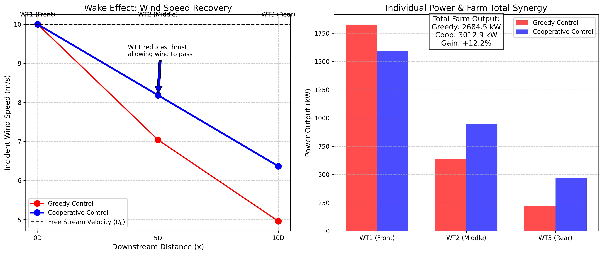

# 第 4 章：风电场尾流效应与协同控制：放弃局部贪婪，实现全局最优

## 1. 学习目标

本章将视点从"单台风机"拉高到"整个风电场"。探讨当几十台风机排兵布阵时，它们之间是如何通过空气动力学互相影响风能分配（尾流效应）的。
读者需要掌握：
1. 尾流效应（Wake Effect）的物理本质与 Jensen 解析模型。
2. 风机阵列间距（Spacing）与尾流风速恢复（Wind Speed Recovery）的关系。
3. 传统单机"贪婪控制（Greedy Control）"对全场总发电量的负面影响。
4. 基于主动尾流转向（偏航）或降功率（变桨）的**全场协同控制（Cooperative Control）**理论。

## 2. 教材理论：风被"偷"走了

### 2.1 尾流效应的物理机制

在第 1 章中，我们努力让单台风机咬住最大功率点（MPPT）。这种控制策略叫做**贪婪控制（Greedy Control）**，即风机为了自身多发电，将叶片转到最高效的角度，尽可能多地提取风中的能量。

但这在大型风电场中会引发严重的功率损失。

风机在提取能量的同时，会在其背后留下一个**尾流区（Wake）**。在尾流区里，风速显著降低，并且空气湍流强度增大。从物理上看，根据动量守恒，通过叶轮的气流由于动能被提取，在下游形成了一个膨胀的低速流管。

如果把第二台风机（WT2）建在第一台风机（WT1）的正后方：
- WT1 以贪婪模式满发，导致它背后的风速从 $10\,\text{m/s}$ 降至约 $6\,\text{m/s}$。
- WT2 只能接收 WT1 留下的低速风。由于风功率与风速是三次方关系，$6^3 / 10^3 = 0.216$。仅仅因为站在后排，WT2 的可用风能就下降了将近 $80\%$！

这就是风电场中的**尾流损失（Wake Loss）**。在大型海上风电场中，尾流损失可以占全场年发电量的 $10\% \sim 20\%$。

### 2.2 Jensen 尾流模型

Jensen（1983）提出的单一尾流模型是工程中最经典的解析模型。该模型假设尾流区呈线性膨胀的圆锥形，尾流风速的衰减公式为：

$$U_{wake} = U_0 \left[1 - \frac{1 - \sqrt{1 - C_t}}{(1 + kx/R)^2}\right]$$

其中：
- $U_0$ 为来流风速
- $C_t$ 为推力系数
- $k$ 为尾流扩散系数（陆上 $k \approx 0.04\sim0.06$，海上 $k \approx 0.03\sim0.04$）
- $x$ 为下游距离
- $R$ 为叶轮半径

尾流扩散系数 $k$ 的物理意义是大气湍流对尾流区的混合速率。$k$ 越大，大气湍流越强，尾流恢复越快。Jensen 模型的一个重要推论是：在给定 $C_t$ 和 $k$ 的条件下，尾流风速恢复到来流的 $95\%$ 所需的距离约为 $15\sim20D$（$D$ 为叶轮直径）。

对于多台串联风机，采用级联计算方法。第 $n$ 台风机的来流风速等于第 $n-1$ 台的尾流风速：

$$U_n = U_{n-1} \left[1 - \frac{1 - \sqrt{1 - C_{t,n-1}}}{(1 + kx_{n-1}/R)^2}\right]$$

当存在多个上游风机的尾流叠加时，常用的方法是均方根叠加法（RSS）：

$$\delta U_n = \sqrt{\sum_{i<n} (\delta U_{i \to n})^2}$$

### 2.3 推力系数与功率系数的关系

推力系数 $C_t$ 与功率系数 $C_p$ 之间存在物理耦合关系。根据一维动量理论，定义轴向诱导因子 $a$：

$$C_t = 4a(1-a)$$
$$C_p = 4a(1-a)^2$$

消去 $a$ 可得 $C_p$ 与 $C_t$ 的隐式关系。贪婪模式下 $C_t$ 较大（如 $0.89$），对应 $a \approx 0.33$，接近 Betz 最优点。降低 $C_t$ 意味着减小诱导因子 $a$，牺牲当前风机的功率提取，但留给下游风机更多的可用风能。

### 2.4 协同控制理论

为了挽回尾流损失，控制工程师提出了**主动降低前排风机推力**的方案。
通过变桨或偏航，强行降低 WT1 的推力系数 $C_t$，让它故意放过一部分风。

全场协同控制的优化问题可以表述为：

$$\max_{C_{t,1}, C_{t,2}, \ldots, C_{t,N}} \sum_{i=1}^{N} P_i(C_{t,i}, U_i)$$

$$\text{s.t.} \quad U_i = f(U_0, C_{t,1}, \ldots, C_{t,i-1}, x_1, \ldots, x_{i-1})$$

其中约束条件体现了尾流的级联传播关系。该优化问题是非凸的，工程中常用遗传算法（GA）、粒子群优化（PSO）或梯度下降法求解。

### 2.5 尾流效应的工程影响与经济损失

尾流效应不仅降低发电量，还会显著增加下游风机的疲劳载荷。在尾流区中，湍流强度可比自由来流增大 $50\%\sim100\%$，导致叶片、塔架和传动系统的等效疲劳载荷增大。研究表明，在典型的海上风电场中，尾流引起的疲劳载荷增加可使主要部件的设计寿命缩短 $15\%\sim25\%$。

从经济角度看，大型海上风电场的年发电量损失中，尾流效应通常占 $10\%\sim20\%$。以一个装机 $400\,\text{MW}$ 的海上风电场为例，年利用小时数约 $3500\,\text{h}$，上网电价 $0.85\,\text{元/kWh}$。如果尾流损失为 $15\%$，则年损失电量为 $400 \times 3500 \times 0.15 = 210{,}000\,\text{MWh}$，对应经济损失约 $1.79$ 亿元。因此，即使协同控制仅将尾流损失降低 $3\sim5$ 个百分点，每年也可带来数千万元的额外收入。

### 2.6 高精度尾流模型简介

除 Jensen 模型外，工程中还使用多种更高精度的尾流模型：

**Frandsen 模型**：适用于大型风电场的深度尾流叠加，考虑了无限排列风机的稳态尾流平衡。

**Bastankhah-Porte-Agel 模型（2014）**：基于高斯分布假设描述尾流截面的风速亏缺剖面，精度显著优于 Jensen 的顶帽分布假设。尾流中心的风速亏缺为：

$$\frac{\Delta U}{U_0} = \left(1 - \sqrt{1 - \frac{C_t}{8(\sigma/D)^2}}\right) \exp\left(-\frac{r^2}{2\sigma^2}\right)$$

其中 $\sigma$ 为高斯展宽参数，$r$ 为距尾流中心的径向距离。

**大涡模拟（LES）**：通过求解三维非稳态 Navier-Stokes 方程获得最高精度的尾流场，但计算代价大（单个工况需要数千 CPU 核时），主要用于研究和数据驱动模型的训练数据生成。

## 3. 案例分析：串联风机阵列的贪婪与协同博弈

### 案例背景
某陆上风电场有一排 3 台串联的 2MW 风机（WT1, WT2, WT3）。风向正好顺着这排风机吹（最不利情况）。风机间距为 5 倍叶轮直径（$5D$）。
当前来风速度为 $U_0 = 10\,\text{m/s}$。
如果采用传统的"贪婪控制"，WT1 会火力全开，导致后面的风机发电量严重下降。
风场业主要求你开发一套"协同控制"算法，通过微调前排风机的气动推力，实现全场总发电量的最大化。

### 问题描述
- **风机阵列**：3 台串联，间距 $x = 5D = 400\,\text{m}$。初始风速 $U_0 = 10\,\text{m/s}$。
- **物理方程**：使用 Jensen 单一尾流模型 $U_{out} = U_{in} [1 - \frac{1 - \sqrt{1 - C_t}}{(1 + kx/R)^2}]$，其中尾流耗散系数 $k = 0.05$。
- **场景 A（Greedy）**：所有风机追求单机极值，推力系数 $C_t = 0.89$。
- **场景 B（Cooperative）**：强制压低前排风机推力，设定策略 $C_t = [0.65, 0.75, 0.888]$。
- **任务**：计算两种场景下每台风机的风速变化、单机发电量，并核算全场总功率的净增益。

**物理场景与问题概化图：**

### 解题思路
本研究构建了一个级联空气动力学衰减引擎：
1. **气动映射建立**：在代码中建立推力系数 $C_t$ 与功率系数 $C_p$ 的非线性耦合函数。
2. **贪婪链式反应**：利用 Jensen 方程，将第一台的尾流风速作为第二台的输入，将第二台的尾流再传递给第三台。由于贪婪模式下 $C_t=0.89$，每级尾流风速都会发生大幅跌落。
3. **协同策略推演**：调整输入参数，第一台风机主动将 $C_t$ 降至 $0.65$（主动放风），第二台降至 $0.75$，第三台因后方无风机，按最大推力 $C_t=0.888$ 运行。
4. **能量核算对比**：利用柱状图可视化局部与整体的能量得失。

### 代码执行与图表
> **学习提示**：我们在后台计算了三次方的风功率级联方程。请特别注意表格中"FARM TOTAL"行的数据，这是协同控制带来的实际经济收益。

Source: `assets/ch04/ch04_wake_effect.py`

**单机贪婪与全场协同的功率收支核算矩阵：**
| Turbine      | Greedy Thrust Ct   |   Greedy Power (kW) | Coop Thrust Ct   |   Coop Power (kW) | Status           |
|:-------------|:-------------------|--------------------:|:-----------------|------------------:|:-----------------|
| WT1 (Front)  | 0.89               |              1824.4 | 0.65             |            1592.6 | Sacrificed       |
| WT2 (Middle) | 0.89               |               637.4 | 0.75             |             949.6 | Benefited        |
| WT3 (Rear)   | 0.89               |               222.7 | 0.888            |             470.7 | Highly Benefited |
| FARM TOTAL   | -                  |              2684.5 | -                |            3012.9 | Net Gain: +12.2% |

**尾流风速逐级跌落与全场协同控制增益对比图：**

### 实验验证与结果剖析
这组数据是博弈论在工业控制中的典型应用：
- **贪婪模式的代价（红线与红柱）**：
  - 左侧子图的红色实线显示，在贪婪模式下，WT1 以最大推力运行，它背后的风速瞬间从 $10\,\text{m/s}$ 降至 $7.0\,\text{m/s}$ 左右。WT2 再次以最大推力运行，传给 WT3 的风速只剩约 $5\,\text{m/s}$。
  - 右侧子图的红柱和表格数据显示，WT1 发了 $1824\,\text{kW}$，但 WT2 仅剩 $637\,\text{kW}$，WT3 更是只有 $222\,\text{kW}$。后排风机的发电量不到前排的 $12\%$。全场总功率为 $2684.5\,\text{kW}$。
- **协同控制的收益（蓝线与蓝柱）**：
  - 协同控制中，WT1 主动降低推力，放过一部分风。左子图蓝色虚线显示，WT1 后面的风速保持在 $8\,\text{m/s}$ 以上。WT1 的功率从 $1824\,\text{kW}$ 降至 $1592\,\text{kW}$，损失了 $232\,\text{kW}$。
  - 但WT2 的功率从 $637\,\text{kW}$ 上升至 $949\,\text{kW}$，增加了 $312\,\text{kW}$。WT3 的功率从 $222\,\text{kW}$ 上升至 $470\,\text{kW}$，增加了 $248\,\text{kW}$。
  - 后排增加的功率之和（$560\,\text{kW}$）远大于前排的牺牲（$232\,\text{kW}$），这正是风速三次方效应的体现。
- **全场总功率净增**：协同控制使全场总功率从 $2684.5\,\text{kW}$ 提升至 $3012.9\,\text{kW}$，净增 $328.4\,\text{kW}$，增幅达 **$+12.2\%$**。对于一个拥有数十台风机的大型风电场，这意味着每年数百万元的额外收入。
- **最优推力系数的参数敏感性**：协同控制的最优 $C_t$ 分配与风向、间距、湍流强度密切相关。当风机间距从 $5D$ 增大到 $8D$ 时，尾流恢复更充分，协同控制的增益会降低到 $5\%\sim8\%$。当大气湍流强度增大（$k$ 增大）时，尾流恢复加快，协同增益同样减小。

### 工程实践中的关键问题

**风向不确定性的影响**：本案例假设风向恒定且已知，但实际风电场中风向随时间和空间持续变化。当风向偏转超过 $\pm 10°$ 时，尾流可能不再直接覆盖下游风机，此时降低前排推力反而会造成不必要的功率损失。因此，协同控制器必须具备实时风向感知能力，并快速调整推力分配策略。工程中通常以 $5\sim10$ 分钟的滑动窗口平均风向为基准进行策略更新，避免因风向的短期波动导致控制策略的频繁切换。

**多排多列的大型风电场优化**：本案例仅涉及一排三台串联风机的简单构型。在实际的大型海上风电场中（如 $80\sim100$ 台风机，$8 \times 12$ 方阵布局），尾流的多级叠加和交叉干扰使优化问题的维度急剧增加。对于 $N$ 台风机的全局优化问题，需要同时求解 $N$ 个推力系数和 $N$ 个偏航角，总共 $2N$ 个决策变量。当 $N = 100$ 时，传统的遗传算法可能需要数小时才能收敛。近年来基于伴随法（Adjoint Method）的梯度优化和基于代理模型（Surrogate Model）的贝叶斯优化方法显著提高了大规模风电场协同控制的求解效率。

### 工业部署与运行建议
1. **主动尾流偏航（Active Wake Steering）**：除了本案例中通过变桨降低推力（轴向诱导控制，Axial Induction Control），现代海上风电场更倾向于使用"偏航控制（Yaw Control）"。即让前排风机的机舱偏转一个小角度（通常 $10\sim30°$），将尾流"推"向侧面，使其偏离后排风机。实验研究表明，偏航控制的全局增益可达 $10\%\sim15\%$，且对前排风机的功率损失比变桨控制更小。偏航角度的选取需要考虑偏航载荷对主轴承和塔架的疲劳影响。
2. **机器学习在尾流预测中的应用**：Jensen 解析模型虽然计算快速，但在面对复杂地形、大型风场深度尾流叠加时误差较大（通常 $10\%\sim20\%$）。工业前沿的做法是利用高保真流体力学仿真（CFD/LES）生成大量数据，然后训练深度神经网络（如图神经网络 GNN）。在风场运行时，AI 模型能在毫秒级时间内预测全场尾流分布，实时计算出最优的偏航角和桨距角，并下发给每台风机。与传统查表法相比，基于 GNN 的在线优化可将全场年发电量进一步提升 $2\%\sim5\%$。
3. **数字孪生在风电场优化中的应用**：现代风电场正在建立数字孪生平台，将每台风机的实时运行数据（转速、功率、桨距角、偏航角、振动等）与高精度尾流模型和结构动力学模型耦合。通过数字孪生，运维人员可以在虚拟环境中测试不同的协同控制策略，评估其对发电量和结构寿命的综合影响，然后将验证通过的最优策略部署到实际风电场。这种"先仿真后部署"的方式显著降低了控制策略更新的风险和成本。

### 从风电场协同到水网协同的方法论迁移

风电场的协同控制与水网系统的分布式优化调度在数学结构上高度相似。在风电场中，前排风机的推力系数决定了下游风机的可用风能；在水网中，上游闸门的开度决定了下游渠段的来水流量。两者都属于"串联级联系统"的全局优化问题，都面临"局部最优不等于全局最优"的挑战。

水系统控制论中的分布式模型预测控制（DMPC）框架可以自然地迁移到风电场协同控制中：每台风机作为一个智能体（Agent），基于局部信息和邻居通信来优化自身的推力系数或偏航角，同时通过迭代协商机制趋近全局最优解。这种分布式架构相比集中式优化具有更好的可扩展性和鲁棒性——当某台风机的通信链路中断时，其余风机仍可继续协同运行，而不至于导致整个控制系统失效。这一思想与水网系统中"岛式自治"的容错设计理念完全一致。

## 4. 本章小结

1. 尾流效应导致下游风机的可用风速显著降低，并增大湍流强度。由于功率与风速的三次方关系，后排风机的发电量可下降 $50\%\sim80\%$，同时机械疲劳载荷也显著增大。
2. Jensen 尾流模型以线性膨胀假设为基础，通过推力系数 $C_t$ 和扩散系数 $k$ 描述尾流风速衰减，计算简便但精度有限。
3. 贪婪控制（每台风机独立追求最大功率）在风电场场景中并非全局最优，是一种典型的"局部最优陷阱"。
4. 协同控制通过主动降低前排风机的推力系数或调整偏航角，使后排风机获得更多风能，可实现全场总发电量 $10\%\sim15\%$ 的净增益，经济效益十分显著。
5. 工业中主动偏航（Wake Steering）比变桨降推力更受青睐，但需综合考虑偏航载荷与疲劳寿命。
6. 风电场协同控制与水网分布式优化调度在数学结构上高度同构，均可纳入分布式模型预测控制的统一框架。

## 5. 思考题

1. **Jensen 模型计算**：某风电场有 2 台串联风机，间距 $7D$，来流风速 $12\,\text{m/s}$，叶轮半径 $R = 63\,\text{m}$，扩散系数 $k = 0.04$。(a) 当 WT1 的 $C_t = 0.80$ 时，WT2 处的风速是多少？(b) 如果 WT1 降低推力至 $C_t = 0.50$，WT2 处的风速提升多少？全场总功率是增加还是减少？
2. **最优推力分配**：对于本章的 3 台串联风机案例，假设间距增大到 $8D$，$k = 0.05$，来流风速 $10\,\text{m/s}$。请用枚举法（$C_t$ 在 $0.3\sim0.9$ 之间以 $0.1$ 为步长变化）寻找使全场总功率最大的 $C_t$ 组合，并与贪婪策略对比增益百分比。
3. **尾流叠加分析**：在一个 $3 \times 3$ 方阵风电场中，中心风机同时受到多个上游风机的尾流影响。请用 RSS（均方根叠加）方法，推导中心风机的等效来流风速表达式，并讨论哪种风向角会使该风机的功率最低。
4. **工程经济分析**：某 100MW 海上风电场年利用小时数为 $3000\,\text{h}$，上网电价为 $0.85\,\text{元/kWh}$。如果协同控制使尾流损失从 $15\%$ 降低到 $8\%$，每年可增加多少发电收入？

## 6. 参考文献

[1] Jensen N O. A note on wind generator interaction [R]. Roskilde: Risø National Laboratory, 1983. Risø-M-2411.

[2] Barthelmie R J, Hansen K, Frandsen S T, et al. Modelling and measuring flow and wind turbine wakes in large wind farms offshore [J]. Wind Energy, 2009, 12(5): 431-444.

[3] Gebraad P M O, Teeuwisse F W, van Wingerden J W, et al. Wind plant power optimization through yaw control using a parametric model for wake effects [J]. Journal of Solar Energy Engineering, 2016, 138(1): 011002.

[4] Annoni J, Gebraad P M O, Scholbrock A K, et al. Analysis of axial-induction-based wind plant control using an engineering and a high-order wind plant model [J]. Wind Energy, 2016, 19(6): 1135-1150.

[5] 雷晓辉, 苏承国, 龙岩, 等. 基于无人驾驶理念的下一代自主运行智慧水网架构与关键技术 [J]. 南水北调与水利科技(中英文), 2025, 23(04): 778-786. DOI: 10.13476/j.cnki.nsbdqk.2025.0079.
