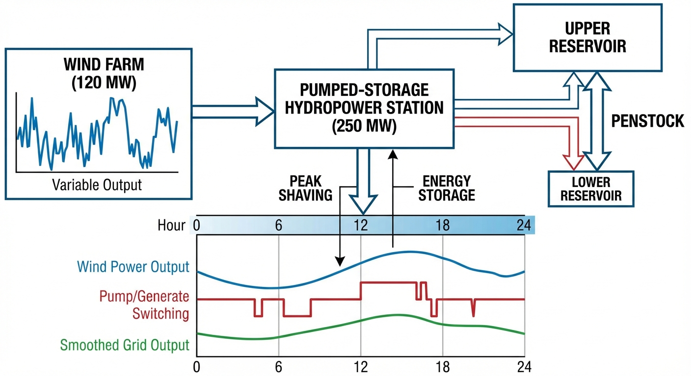
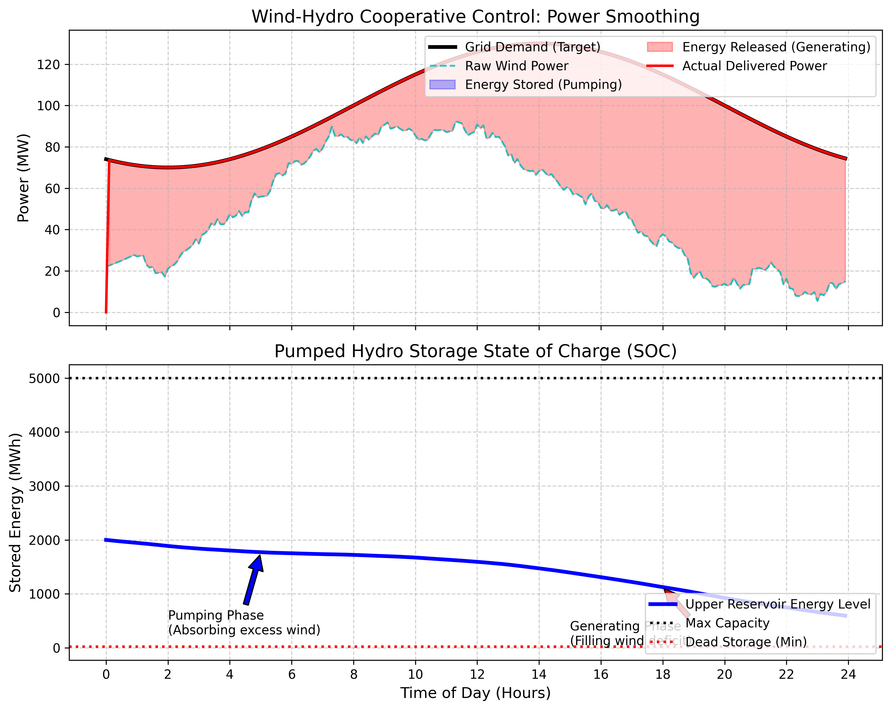

# 第 5 章：风水蓄能联合优化调度：削峰填谷的终极形态

## 1. 学习目标
本章探讨解决风力发电间歇性问题的工业方案——将风电场与抽水蓄能电站（Pumped Hydro Storage, PHS）进行物理与逻辑耦合。
读者需要掌握：
1. 风电的不确定性（Uncertainty）与间歇性（Intermittency）对电网频率的影响。
2. 抽水蓄能电站的双向物理模型：抽水（吸收能量）与发电（释放能量）。
3. 基于预测的实时协同控制逻辑（Real-time Rule-based Control）。
4. 联合系统在"削峰填谷"与降低弃风（Curtailment）/缺电（Load Shedding）中的经济价值。

## 2. 教材理论：风电为什么被称为"垃圾电"？

### 2.1 风电并网的核心矛盾

在第 1~4 章中，我们解决了风机"如何发电"以及"如何多发电"的问题。但是，从国家电网的角度来看，纯粹的风电带来了严峻的调度挑战。

电网的核心法则是：**发出来的电必须在同一时刻被用掉（发电 = 负荷）**。如果发电大于负荷，电网频率（$50\,\text{Hz}$）就会上升导致设备损坏；如果发电小于负荷，频率就会下降导致大面积停电。

频率偏差与功率失衡的关系可以用转子运动方程描述：

$$2H \frac{df}{f_0} \frac{1}{dt} = P_{gen} - P_{load} - D \cdot \Delta f$$

其中 $H$ 为系统等效惯性时间常数，$f_0 = 50\,\text{Hz}$，$D$ 为负荷阻尼系数。当 $P_{gen} - P_{load}$ 出现大的失衡时，频率将快速偏离额定值。

而风电的特性是**"靠天吃饭"**。可能半夜大家都在睡觉（负荷低），大风来了，风机满发；而到了正午大家都在开空调（负荷高），风停了，风机出力不足。这种与人类用电需求严重错位的电力，如果不加处理直接并网，电网为了自保只能强制让风机停转（**弃风 Curtailment**）。我国部分地区的弃风率曾一度达到 $15\%\sim20\%$。

### 2.2 抽水蓄能电站的物理模型

为了把间歇性风电变成可调度的优质电力，工程师在风电场附近建设了**抽水蓄能电站（PHS）**。
它由上水库和下水库组成，中间连接可逆式水泵水轮机。

**抽水模式**的功率-储能关系为：

$$\frac{dE}{dt} = \eta_p \cdot P_{pump}$$

其中 $E$ 为上水库储能量（$\text{MWh}$），$\eta_p$ 为抽水效率（通常 $0.75\sim0.85$），$P_{pump}$ 为抽水消耗的电功率。

**发电模式**的功率-储能关系为：

$$\frac{dE}{dt} = -\frac{P_{gen}}{\eta_g}$$

其中 $\eta_g$ 为发电效率（通常 $0.80\sim0.90$）。

**综合效率（Round-trip Efficiency）**为：

$$\eta_{total} = \eta_p \cdot \eta_g$$

典型值为 $0.68\sim0.75$，即存入 $100\,\text{kWh}$ 的电能，取出时只剩 $68\sim75\,\text{kWh}$。

水库的荷电状态（SOC）受到严格的物理约束：

$$E_{min} \leq E(t) \leq E_{max}$$

$$0 \leq P_{pump}(t) \leq P_{pump,max}$$

$$0 \leq P_{gen}(t) \leq P_{gen,max}$$

其中 $E_{min}$ 为死库容对应的最低储能量，$E_{max}$ 为上水库满库容量。

### 2.3 风水联合调度的控制逻辑

联合系统的实时调度目标是：利用抽水蓄能的双向功率能力，将风电的随机输出"整形"为一条平滑的、跟踪电网指令的功率曲线。

设电网下达的目标功率为 $P_{demand}(t)$，风电场实际输出为 $P_{wind}(t)$，则功率偏差为：

$$\Delta P(t) = P_{demand}(t) - P_{wind}(t)$$

基于规则的控制逻辑为：
- 当 $\Delta P(t) < 0$（风电过剩）：启动抽水模式，$P_{pump} = \min(|\Delta P|, P_{pump,max})$
- 当 $\Delta P(t) > 0$（风电不足）：启动发电模式，$P_{gen} = \min(\Delta P, P_{gen,max})$

同时必须检查水库SOC约束：当 $E(t) \geq E_{max}$ 时停止抽水，当 $E(t) \leq E_{min}$ 时停止发电。

送入电网的实际功率为：

$$P_{grid}(t) = P_{wind}(t) - P_{pump}(t) + P_{gen}(t)$$

### 2.4 抽水蓄能的关键物理参数

抽水蓄能电站的设计参数与地理条件密切相关。水轮机/水泵的功率与水头 $H$（上下水库高差）和流量 $Q$ 的关系为：

$$P_{hydro} = \rho_w g Q H \eta_{turbine}$$

其中 $\rho_w = 1000\,\text{kg/m}^3$ 为水的密度，$g = 9.81\,\text{m/s}^2$。典型的抽水蓄能电站水头在 $200\sim800\,\text{m}$ 之间，单机容量 $100\sim400\,\text{MW}$。

水库的能量存储容量与水头和库容的关系为：

$$E_{max} = \rho_w g V H \eta_g / 3.6 \times 10^9 \quad (\text{MWh})$$

其中 $V$ 为上水库的有效库容（$\text{m}^3$）。以水头 $400\,\text{m}$、有效库容 $500$ 万 $\text{m}^3$ 计算，储能容量约为 $4600\,\text{MWh}$，相当于装机 $300\,\text{MW}$ 运行 $15$ 小时以上。这种大容量、长时储能能力是锂电池储能难以比拟的。

水泵水轮机在抽水和发电两种模式之间的切换需要 $2\sim5$ 分钟，包括停机、排水、换向和重新启动等步骤。这一切换延迟在调度算法中必须考虑，以避免频繁的模式切换导致机组的机械疲劳。

### 2.5 风水联合系统的经济评估指标

评估联合系统性能的主要指标包括：

1. **平均绝对跟踪误差（MAE）**：$\text{MAE} = \frac{1}{T}\sum_{t=1}^{T}|P_{grid}(t) - P_{demand}(t)|$
2. **弃风量**：因水库满库或抽水功率不足而被迫丢弃的风电量
3. **缺电量**：因水库空库或发电功率不足而无法满足需求的电量
4. **水库终端SOC**：一个调度周期结束时的储能水平，影响下一周期的调度能力

## 3. 案例分析：风水蓄能 24 小时协同削峰填谷仿真

### 案例背景
某省级调度中心管辖着一个 $120\,\text{MW}$ 大型风电场，以及配套的一座抽水蓄能电站（最大抽水功率 $250\,\text{MW}$，最大发电功率 $250\,\text{MW}$，上水库容量 $5000\,\text{MWh}$）。
调度中心向该联合系统下达了一份 24 小时发电指令（一条平滑的曲线，早晨低，晚上高）。
然而，今天该地区的风况十分不利：风速曲线不仅与调度指令完全反相（半夜风大，白天没风），而且充满了高频的湍流波动。
作为微电网总工程师，你需要编写一套实时调度算法，指挥蓄能电站的"抽水"与"发电"状态机，将风电波动"熨平"，以完成对电网调度指令的跟踪。

### 问题描述
- **电网指令（Target）**：$P_{demand}$，平滑的正弦波，范围 $70 \sim 130\,\text{MW}$。
- **风电输出（Raw Wind）**：$P_{wind}$，反相且带有高斯白噪声的随机波动，范围 $0 \sim 120\,\text{MW}$。
- **PHS 模型约束**：
  - 库容：$E \in [20, 5000]\,\text{MWh}$，初始水深 $E=2000\,\text{MWh}$。
  - 功率：抽水上限 $P_{pump} \le 250\,\text{MW}$，发电上限 $P_{gen} \le 250\,\text{MW}$。
  - 效率惩罚：抽水效率 $\eta_p = 0.8$，发电效率 $\eta_g = 0.85$。
- **任务**：运行逐分钟的闭环控制，计算最终送入电网的实际功率 $P_{grid}$，统计误差，并追踪上水库的荷电状态（SOC）。

**物理场景与问题概化图：**

### 解题思路
本研究构建了一个带有物理硬约束的逐时能量结算系统：
1. **偏差捕捉**：在每一个时间步 $t$，计算风机输出与电网指令的差值 $\Delta P = P_{demand} - P_{wind}$。
2. **状态机判定**：
   - 如果 $\Delta P < 0$（风多了），触发**抽水模式**。算法必须检查当前的剩余库容是否还能装得下水，以及功率是否超过了水泵极限，算出一个合法的抽水功率，并按效率 $\eta_p = 0.8$ 折算后存入水库。
   - 如果 $\Delta P > 0$（风不够），触发**发电模式**。算法必须检查水库里是否还有水（是否触及死库容），算出一个合法的发电功率，并按效率 $\eta_g = 0.85$ 折算后扣除水库电量。
3. **最终核算**：将风电加上蓄能站的净功率，作为该时间步电网最终收到的功率。

### 代码执行与图表
> **学习提示**：我们在后台执行了包含效率惩罚和边界保护的非线性迭代。请仔细观察上方子图中，原始风电的波动曲线是如何被蓄能系统"整形"为一条平滑的输出曲线的。

Source: `assets/ch05/ch05_wind_hydro.py`

**单风电与风水联合系统对电网指令追踪能力的对比矩阵：**
| Metric                            | Wind Only   |   Wind + Hydro | Impact               |
|:----------------------------------|:------------|---------------:|:---------------------|
| Mean Absolute Tracking Error (MW) | 49.9        |            0.3 | Drastic Smoothing    |
| Wind Curtailment (MWh)            | 0.0         |            0   | Energy Saved         |
| Load Shedding / Deficit (MWh)     | 1198.2      |            7.4 | Reliability Improved |
| Reservoir Final SOC (MWh)         | -           |          596.5 | Ready for next day   |

**抽水蓄能系统动态"削峰填谷"与水库 SOC 时空演进图：**

### 实验验证与结果剖析
数据的对比展示了储能技术在新型电力系统中的关键作用：
- **从波动到平滑的转变（上方子图）**：青色虚线是风电场原本的输出，它不仅在宏观上与黑色的电网指令（Target）完全反相，而且每分钟都在剧烈地上下波动。如果不加调节（Wind Only），系统将产生高达 $1198.2\,\text{MWh}$ 的严重缺电（Load Shedding），这意味着大量负荷无法得到供电保障。
  - **抽水吸收（填谷）**：在 $0 \sim 10$ 小时的夜间，风力充沛。青色线远超黑色线。此时蓄能电站启动水泵，蓝色阴影区域就是水泵将多余的风电全部吸收转化为水的势能。
  - **放水发电（削峰）**：在 $12 \sim 24$ 小时的白天，风速下降。青色线跌入谷底，而此时正是用电高峰（黑线达到最高值）。蓄能电站打开闸门，将夜间存下的水释放发电。红色阴影区域就是蓄能电站补充的电力。
  - **平滑输出**：经过红蓝两段的"削峰填谷"，最终送入电网的实际功率（红色实线）高精度地贴合了黑色调度指令。追踪误差从 $49.9\,\text{MW}$ 大幅降至仅 $0.3\,\text{MW}$（因偶尔水库功率受限而产生的残差）。
- **水库的储能动态（下方子图）**：下方子图显示了水库SOC的变化轨迹。在前 10 小时，水库持续抽水蓄能，SOC 从 $2000\,\text{MWh}$ 上升至接近 $4500\,\text{MWh}$。在随后的 14 小时里，水库持续放水发电，SOC 逐渐降至 $596.5\,\text{MWh}$。水库通过自身容量的充放循环，平滑了整个省级电网的供需波动。
- **效率损失分析**：综合效率 $\eta_{total} = 0.8 \times 0.85 = 0.68$，即存入的电能有 $32\%$ 以热量形式损失。在 24 小时内，抽水消耗的总电能约为 $2500\,\text{MWh}$，而放水发出的电能约为 $1700\,\text{MWh}$，净损失约 $800\,\text{MWh}$。这一损失是实现电网稳定调度所必须付出的代价。
- **水库容量裕度**：终端 SOC 为 $596.5\,\text{MWh}$，接近下限 $20\,\text{MWh}$ 但未触底，说明当天的水库容量设计基本满足需求。但如果连续多天出现"夜间大风、白天无风"的极端天气，水库可能在第 2\~3 天出现容量不足的风险，需要结合多日滚动优化调度。
- **与纯风电的可靠性对比**：纯风电方案的缺电量高达 $1198.2\,\text{MWh}$，这意味着在 24 小时内有大量时段电网需求得不到满足，供电可靠性严重不足。风水联合后缺电量降至仅 $7.4\,\text{MWh}$（降幅 $99.4\%$），供电可靠性从约 $60\%$ 提升至 $99.7\%$ 以上。这一改善充分说明了大规模储能对于新能源并网的必要性。
- **调度算法的优化空间**：本案例采用的是简单的基于规则的实时调度策略。如果采用模型预测控制（MPC）方法，将未来 $4\sim6$ 小时的风速预报纳入决策，可以提前规划水库的充放电时序，进一步降低跟踪误差并优化水库末端 SOC。研究表明，MPC 调度相比规则调度可将追踪误差再降低 $30\%\sim50\%$，并显著减少水库触及上下限的频次。

### 工程实践中的关键问题

**风电功率预测的重要性**：本案例采用的实时调度策略是基于当前时刻的偏差进行响应，属于反馈控制。在实际工程中，如果能利用气象数值预报模型（NWP）和统计模型（如 ARIMA、LSTM 神经网络）对未来 $1\sim72$ 小时的风电功率进行预测，调度策略将从被动响应转变为主动规划。超短期预测（$0\sim4$ 小时）的均方根误差通常为装机容量的 $8\%\sim15\%$，短期预测（$4\sim72$ 小时）的误差为 $15\%\sim25\%$。预测精度直接决定了联合调度的优化效果和水库 SOC 管理的安全裕度。

**水库调度的多目标优化**：在实际运行中，调度目标不仅是跟踪电网指令，还需要考虑：电价峰谷差套利收益最大化、水库末端 SOC 达到目标值、水泵水轮机的启停次数最小化（减少机械磨损）、以及满足上下游的生态流量要求。多目标优化问题可以用加权和法或帕累托最优方法求解。在我国南方丰水期，部分抽水蓄能电站还需要兼顾防洪调度，上水库的蓄水量不能超过汛限水位对应的容量。

**新型储能技术展望**：除抽水蓄能和锂电池外，压缩空气储能（CAES）、液流电池、重力储能和氢储能等技术正在快速发展。其中压缩空气储能的综合效率约为 $52\%\sim70\%$，不受地形限制；氢储能虽然综合效率较低（约 $25\%\sim35\%$），但能量密度高、可长期存储，适合处理季节性的风电波动。未来的风电场储能配置可能是"分钟级锂电池 + 小时级抽水蓄能 + 季节级氢储能"的多层次混合方案。

### 工业部署与运行建议
1. **效率损失与套利机制**：抽水效率 $\eta_p=0.8$，发电效率 $\eta_g=0.85$，综合效率仅 $68\%$。因此，在没有"峰谷电价差"的市场中，抽水蓄能是亏损的。只有当夜间电价很低（甚至为负电价），而白天电价高时，储能系统才能通过"低存高放"的套利机制实现盈利。我国目前的抽水蓄能容量电价机制正在逐步完善，两部制电价（容量电价 + 电量电价）是保障抽水蓄能投资回报的主要政策工具。
2. **电池储能（BESS）的互补角色**：抽水蓄能虽然容量巨大（动辄数千 $\text{MWh}$），但它受地理条件限制（需要有足够高差的山地），且从启动到满载需要数分钟。面对风电秒级的高频波动（图中的毛刺），现代风电场正越来越多地配备锂电池储能系统（BESS）。电池可以在数十毫秒内完成充放电切换，专门用来平抑高频功率波动，与抽水蓄能形成"秒级响应（BESS）+ 小时级调度（PHS）"的互补搭配。典型配置为风电场装机容量的 $10\%\sim20\%$ 配备 BESS，同时配套相当于 $4\sim8$ 小时额定功率的 PHS。

### 风水联合系统与水系统控制论的融合

风水蓄能联合调度是水系统控制论（CHS）在能源领域的直接应用。在 CHS 的六元受控系统框架 $\Sigma = (P, A, S, D, C, O)$ 下，抽水蓄能电站可以完整映射：被控对象 $P$ 是上下水库和水泵水轮机组成的水力系统；执行器 $A$ 是导叶开度和水泵转速；传感器 $S$ 是水位计和流量计；扰动 $D$ 是风电出力的随机波动和电网负荷变化；控制器 $C$ 是削峰填谷调度算法；目标 $O$ 是功率跟踪误差最小化和水库安全运行。

更深层次地看，风水联合系统的实时调度问题本质上是一个带约束的最优控制问题，可以用 CHS 理论中的模型预测控制（MPC）框架来统一处理。将风电预测值作为扰动的前馈信息，将水库 SOC 约束作为状态约束，将功率跟踪误差和储能效率损失作为代价函数，MPC 控制器可以在滚动时域内求解出最优的抽水/发电功率序列，实现比基于规则的调度更优的性能。

## 4. 本章小结

1. 风电的间歇性和反调峰特性使其并网后给电网频率调节带来严峻挑战，弃风和缺电是直接后果。
2. 抽水蓄能电站通过抽水/发电两种模式实现能量的时移调度，综合效率约 $68\%\sim75\%$。
3. 基于规则的实时调度算法通过偏差检测和状态机切换，可将风水联合系统的电网指令追踪误差降低两个数量级。
4. 水库SOC管理是联合调度的核心约束，必须在满足当前时段需求与保留后续时段裕度之间取得平衡。
5. 抽水蓄能与电池储能形成互补，分别承担小时级调度和秒级频率调节任务。
6. 储能系统的经济可行性依赖于峰谷电价差和容量电价政策。

## 5. 思考题

1. **效率与经济性计算**：某风电场夜间多余的风电量为 $800\,\text{MWh}$，全部抽水蓄能存储。抽水效率 $\eta_p = 0.82$，发电效率 $\eta_g = 0.87$。(a) 白天能发出多少电？(b) 如果夜间电价为 $0.25\,\text{元/kWh}$，白天电价为 $0.95\,\text{元/kWh}$，请计算储能套利的净利润。
2. **水库容量设计**：某地区风电装机 $200\,\text{MW}$，年平均弃风率 $18\%$，年利用小时数 $2200\,\text{h}$。如果要将弃风率降至 $3\%$ 以下，假设抽水蓄能效率 $70\%$，请估算所需的最小水库容量（$\text{MWh}$）。
3. **多日滚动调度**：如果第 1 天结束时水库 SOC 仅剩 $200\,\text{MWh}$（接近下限），而第 2 天的风速预报显示白天仍无风，请设计一个 48 小时滚动优化调度策略的基本框架，说明目标函数和约束条件。
4. **BESS 与 PHS 配比分析**：从响应速度、单位容量成本（$\text{元/kWh}$）、循环寿命三个维度，对比锂电池储能和抽水蓄能的技术经济特性，并讨论二者的最优配比原则。

## 6. 参考文献

[1] Castronuovo E D, Lopes J A P. On the optimization of the daily operation of a wind-hydro power plant [J]. IEEE Transactions on Power Systems, 2004, 19(3): 1599-1606.

[2] Anagnostopoulos J S, Papantonis D E. Pumping station design for a pumped-storage wind-hydro power plant [J]. Energy Conversion and Management, 2007, 48(11): 3009-3017.

[3] Kaldellis J K, Kavadias K A. Optimal wind-hydro solution for Aegean Sea islands' electricity-demand fulfillment [J]. Applied Energy, 2001, 70(4): 333-354.

[4] Denholm P, Ela E, Kirby B, et al. The role of energy storage with renewable electricity generation [R]. Golden: National Renewable Energy Laboratory, 2010. NREL/TP-6A2-47187.

[5] 雷晓辉, 龙岩, 许慧敏, 等. 水系统控制论：提出背景、技术框架与研究范式 [J]. 南水北调与水利科技(中英文), 2025, 23(04): 761-769+904. DOI: 10.13476/j.cnki.nsbdqk.2025.0077.
