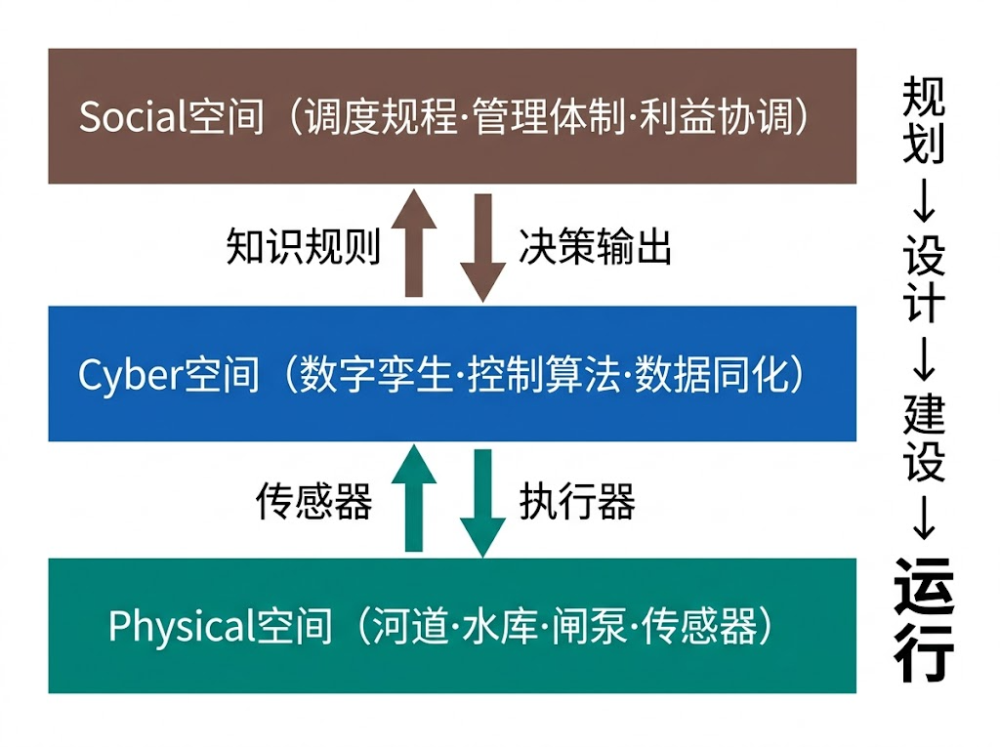
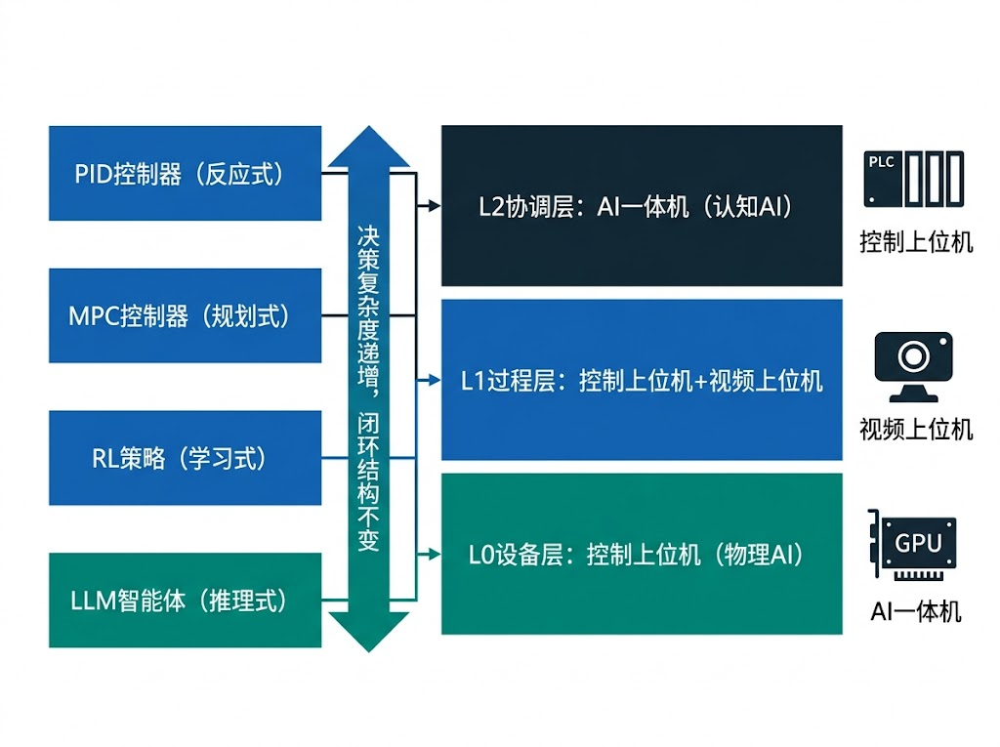
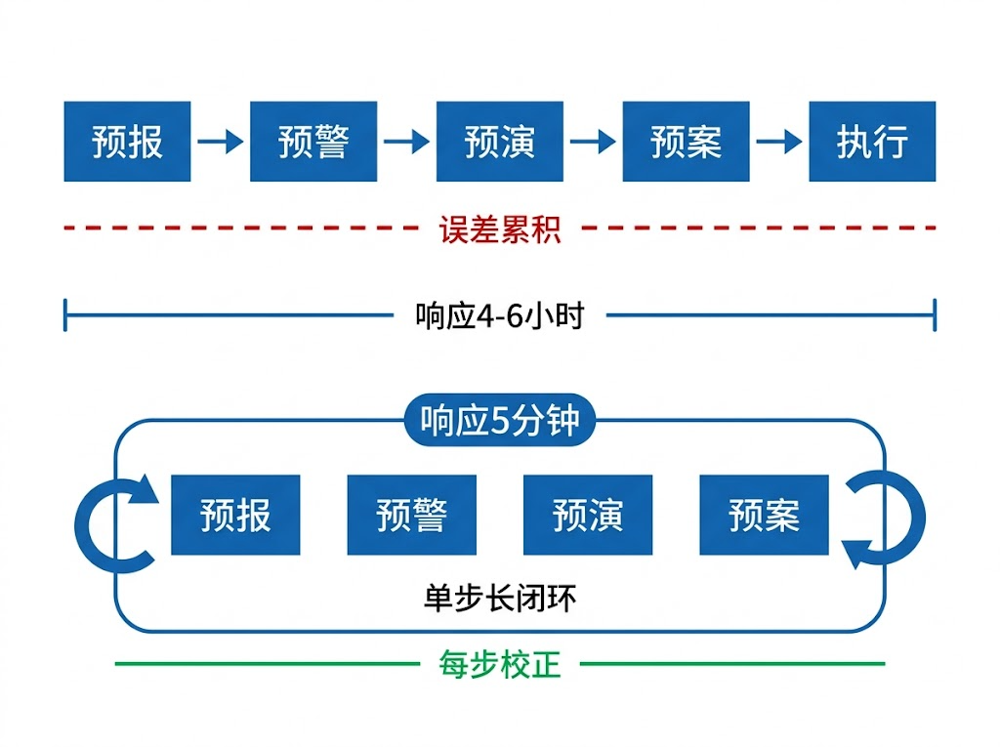
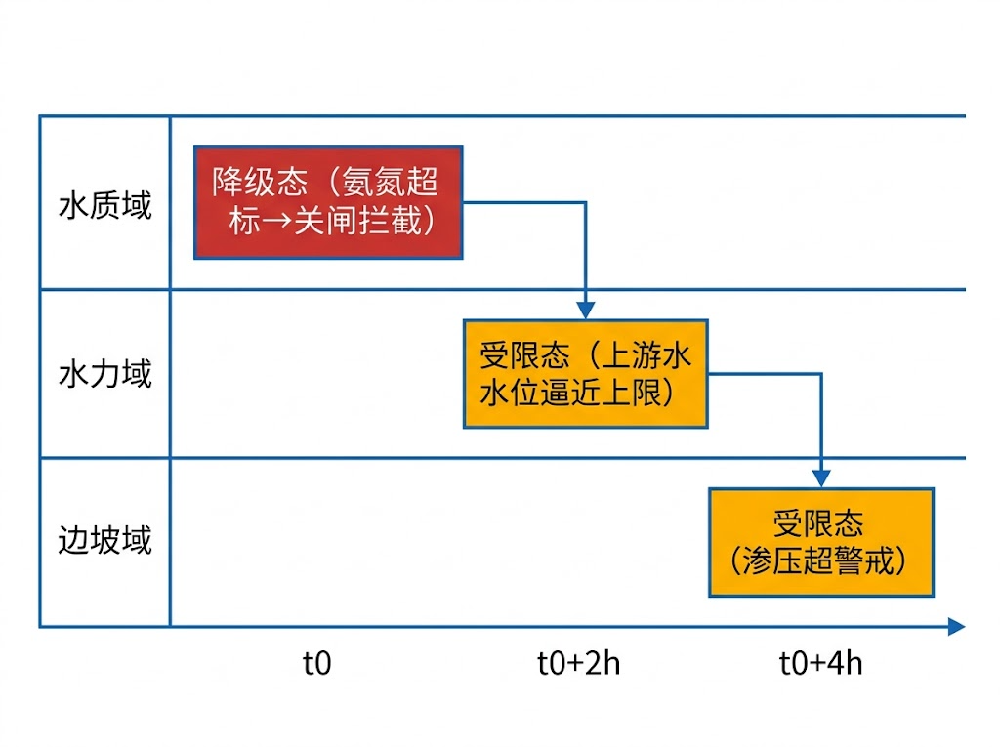

# 基于信息-物理-社会系统框架的国家水网智能运行支撑体系

**雷晓辉^1,2^，张　三^1^，李　四^2^**

（1. 中国水利水电科学研究院 水资源研究所，北京 100038；2. 水利部水资源管理中心，北京 100053）

---

## 中文摘要

国家水网运行面临"四预"开环串行、经验驱动、响应滞后的突出矛盾。本文基于水系统控制论提出的信息-物理-社会系统（CPSS）统一框架，聚焦国家水网智能运行支撑体系。首先建立智能体统一视角下的运行架构，揭示PID、MPC、RL与LLM Agent的同源性，明确三类硬件载体在分层分布式控制（HDC）中的分工；在此基础上提出闭环四预运行范式，将传统串行四预重构为步长内自动耦合的闭环过程；建立四态机多域治理框架与跨域级联传导机制；阐明数字孪生投影函数在运行闭环中的核心角色；构建xIL四层验证体系与水网自主等级（WNAL）跃迁路径。在区域级工程验证中，胶东调水（571 km）和沙坪梯级水电（4968 MW）已分别实现闭环四预的初步应用。最后讨论从区域工程到国家水网骨干工程的尺度跃迁挑战，为水网从经验驱动向数据驱动的范式转变提供理论基础和工程路径。

**关键词：** 国家水网；CPSS框架；水系统控制论；闭环四预；智能体统一架构；水网自主等级；数字孪生；在环测试

## Abstract

China's National Water Network operation faces critical challenges of open-loop sequential "four-prediction", experience-driven decision-making, and delayed response. Based on the Cyber-Physical-Social Systems (CPSS) framework proposed by Control Theory of Hydro-Systems, this paper focuses on the intelligent operation support system for the National Water Network. We establish a unified agent-perspective operation architecture revealing the homogeneity among PID, MPC, RL, and LLM agents, and clarify the division of three hardware platforms within Hierarchical Distributed Control (HDC). A closed-loop four-prediction paradigm is proposed to restructure traditional sequential prediction into automatic intra-step coupling. A four-state-machine multi-domain governance framework with cross-domain cascade propagation is established. The closed-loop role of digital twin projection functions and the x-in-the-Loop (xIL) verification system with Water Network Autonomy Level (WNAL) transition pathway are elaborated. Regional engineering verification on Jiaodong Water Diversion (571 km) and Shaping Cascade Hydropower (4968 MW) demonstrates preliminary closed-loop four-prediction application. Scale transition challenges from regional projects to national backbone infrastructure are discussed.

**Keywords:** National Water Network; CPSS framework; Control Theory of Hydro-Systems; closed-loop four-prediction; unified agent architecture; Water Network Autonomy Level; digital twin; x-in-the-Loop testing

---

## 1 引言

国家水网是以自然河湖水系为基础、引调排水工程为通道、调蓄工程为节点、智慧调控为手段的水资源配置和防洪减灾基础设施网络[1]。与交通、能源、通信等网络相比，水网具有三个显著特殊性：水流的时滞和空间耦合[2]、多目标竞争与协作[3]、多层级管理与社会协商[4]。

国家水网运行面临的核心矛盾可归结为：当前"四预"以开环串行、人工衔接为主[5]，预报→研判→预案→执行各环节之间无实时反馈，误差单向累积，响应时滞从小时到天级。这一矛盾的深层原因是水网尚未被视为信息-物理-社会耦合系统进行一体化运行——物理过程的时空耦合性、信息处理的实时性要求、社会管理的多层协商，三者缺乏统一的理论框架加以整合。

从学科脉络看，水网智能运行理论经历了三阶段积累：王浩等提出的自然-社会二元水循环理论[6]揭示了水系统的"自然-社会"耦合本质，为理解水网复杂性提供了物理基础；此后控制论方法逐步渗透到水利领域，PID/MPC/RL等方法各自独立发展但缺乏统一框架；水系统控制论[7]在二元水循环理论基础上引入CPSS框架，将"信息/计算"显式化为第三维度，统一了上述控制与智能方法。

此前我们已形成四篇系列研究：第1篇提出水系统控制论理论框架[7]，第2篇论述水资源系统分析的范式转变[8]，第3篇提出自主运行智慧水网架构（WNAL）[9]，第4篇建立在环测试验证体系[10]。本文是系列第5篇，聚焦CPSS框架对国家水网智能运行的支撑，主要贡献包括：（1）建立智能体统一视角下的运行架构，揭示从PID到LLM Agent的同源性与硬件载体分工；（2）提出闭环四预运行范式与四态机多域治理框架；（3）讨论从区域工程到国家水网骨干工程的尺度跃迁挑战与技术路径。

## 2 CPSS统一框架及其水网运行适用性

CPSS框架将水系统解构为三个相互耦合的空间[7]：**Physical空间（P）**——河道、水库、渠道中的水文水力过程及闸泵执行器的物理动作，核心特征是时空耦合性；**Cyber空间（C）**——数字孪生、控制算法、数据同化等信息处理活动，核心挑战是计算实时性与模型精度的矛盾；**Social空间（S）**——调度规程、管理体制、利益博弈和社会需求，核心洞察是运行目标属于S空间，是多方协商的产物而非技术计算的输出[7]。

水网复杂性的真正来源是三空间之间的耦合反馈。本文定义三重嵌套反馈回路[7]：**回路1**（秒至分钟级，P↔C）为闸泵实时调节的经典反馈控制回路；**回路2**（小时至天级，C↔S）为调度方案经人工审批的决策回路，WNAL的L2→L3跃迁本质上是压缩此回路延迟；**回路3**（月至年级，S↔P）为社会需求变化对物理设施的长期塑造。三重回路与国家水网"纲、目、结"三级体系存在结构对应：节点工程以回路1为核心，区域水网以回路2为核心，骨干工程以回路3为核心。

CPSS三空间框架与国家水网运行支撑映射关系如图1所示。

**图1　CPSS三空间框架与国家水网运行支撑映射**

**Fig.1　Mapping of CPSS tri-space framework to national water network operation support**

## 3 规划、设计与建设阶段概述

CPSS框架要求在规划阶段即嵌入运行能力验证，核心理念是"在设计阶段就运行一遍"[7]。规划阶段的关键工作是从运行需求出发优化水网工程布局：闸站位置和监测断面的设置不仅要满足输水能力和防洪安全等传统水力要求，还应确保关键渠段和节点的水位、流量等运行状态能够被有效感知和调控，避免出现"建成后才发现闸站调节能力不足或监测盲区"的被动局面；在此基础上，基于水网自主等级（WNAL）分级体系[9]，根据各区段的功能定位和风险等级差异化设定智能化目标。设计阶段采用基于模型的设计（MBD）方法论，将水力计算、控制架构、数字孪生和测控布设作为一个整体同步设计[7,8]。建设阶段通过在环测试（xIL）分层验证体系为调度系统上线提供分级质量保证[10]。上述各阶段的技术方法已在本系列前序论文中系统阐述[7-10]，本文聚焦运行阶段。

## 4 CPSS框架下的水网智能运行体系

运行阶段是水网全生命周期中持续时间最长、实时性要求最高、多空间耦合最密集的阶段。本节系统阐述CPSS框架对运行的支撑体系，是本文论述的核心。

### 4.1 智能体统一视角下的运行架构

水网运行涉及多种控制与智能方法——从经典PID到模型预测控制（MPC），从强化学习（RL）到大语言模型Agent（LLM Agent）——表面上差异巨大，但从智能体（Agent）视角审视，它们共享同一闭环结构：

$$\text{Agent} = (\text{感知},\ \text{决策},\ \text{执行},\ \text{目标},\ \text{环境}) \tag{1}$$

PID控制器是最简单的Agent实例：感知为水位传感器读数，决策为比例-积分-微分运算，执行为闸门开度调节，目标为设定水位，环境为单渠池水力系统。MPC将决策升级为滚动优化，感知扩展到多点状态估计，环境模型从单池扩展到多渠段耦合[11]。RL进一步将决策从基于模型的优化拓展为基于数据的策略学习，适应难以精确建模的复杂工况[12]。LLM Agent则将感知扩展到非结构化信息（调度规程文本、历史案例），决策融合语义推理与数值计算，具备跨域知识整合能力[7]。

这一同源性的核心洞察是：**反馈是元原理，决策复杂度不同但闭环结构不变**。不同Agent的差异仅在于感知范围、决策方法、时间尺度和适用场景，而非本质架构。

上述各类Agent需要三类硬件载体承载其计算任务，形成**物理AI**与**认知AI**的协同架构——这一分工类似于自动驾驶领域中Tesla Robotaxi的"物理世界控制"与"认知决策"双引擎模式：

**控制上位机（物理AI载体）**承载PID联锁和MPC优化的实时确定性计算，直接驱动闸门、泵站等物理执行器，要求毫秒至分钟级响应，是水网运行的"肌肉与反射神经"。**视频上位机（认知AI感知端）**承载计算机视觉（CV）感知任务——水位视觉校核、漂浮物检测、渠道巡检、边坡位移监测等，为运行系统提供非接触式多模态环境观测，是水网的"眼睛"。**AI一体机（认知AI决策端）**承载RL策略推理和LLM语义决策，提供GPU算力支撑，是水网的"大脑"。AI一体机的核心价值在于：它不仅在L2协调层执行全局优化，还在现地层面融合控制上位机的实时工况数据、视频上位机的多模态感知信息、政策法规与调度规程等非结构化知识，以及调度员通过自然语言交互传达的运行意图和上层控制目标，进行综合自主决策。三类载体并非互相替代，而是在HDC分层体系中协同分工：

- **L0层**（设备级，毫秒级）：PID联锁保护运行于控制上位机PLC，执行红/黄/绿三区间安全联锁，是系统的"硬底线"。该层Agent结构最简，但确定性要求最高——联锁逻辑须预烧录，不依赖网络通信。这是纯物理AI层。

- **L1层**（过程级，分钟级）：MPC滚动优化运行于控制上位机工控服务器，消费IDZ降阶模型进行多步前瞻预测[11]。视频上位机提供CV辅助感知（水位视觉校核、漂浮物检测）。当模型不确定性较大时，AI一体机提供RL策略作为MPC的补充决策源。L1层是物理AI与认知AI的第一个交汇点。

- **L2层**（协调级，小时级）：全局调度优化涉及跨管理边界的多目标协调。AI一体机在此层融合多源信息进行自主决策：接收控制上位机上报的全网实时工况，整合视频上位机的异常检测结果，检索调度规程和历史案例知识库，理解调度员的自然语言指令（如"明天上午优先保障城市供水"），在满足安全约束的前提下生成全局调度方案。云端算力在离线训练和大规模方案比选中提供支撑。该层Agent的决策结果需经调度员审批（L2等级）或自主执行（L3等级）。这是认知AI的主阵地。

智能体统一架构与HDC三层硬件载体分工如图2所示。

**图2　智能体统一架构与HDC三层硬件载体分工**

**Fig.2　Unified agent architecture and HDC three-layer hardware platform assignment**

### 4.2 闭环四预运行范式

当前"四预"以开环串行为主[5]：水文预报→人工研判→翻阅预案→执行调度，模型间无实时反馈，误差单向累积。CPSS框架下的闭环四预在每个控制步长内将预测与优化耦合迭代[7]：预测模型给出状态轨迹（预报），ODD约束检查评估边界（预警），可行性评估在模型内完成（预演），输出最优控制序列首元（预案）。

在每个控制步长$\Delta t$内完成：

$$\text{Sensing} \xrightarrow{\Delta t_1} \text{预报} \xrightarrow{\Delta t_2} \text{预警} \xrightarrow{\Delta t_3} \text{预演} \xrightarrow{\Delta t_4} \text{预案} \tag{2}$$

**闭环与开环的核心区别**在于：开环四预的四个环节是人工串行衔接，每个环节的输出单向传递给下一环节，预报误差无法被后续环节校正，且端到端延迟从小时到天级；闭环四预则在每个$\Delta t$内自动完成四环节耦合，预报误差在每步通过实测数据同化校正，端到端延迟压缩至分钟级。本质上，闭环四预是将"四预"从管理流程升级为控制回路。

**表1 开环四预与闭环四预的运行范式对比**

| 维度 | 开环四预（传统） | 闭环四预（CPSS） |
|:-----|:---------------|:---------------|
| 执行方式 | 串行、人工衔接 | 步长内自动耦合 |
| 预报更新 | 离线批处理，$\geq$ 1 h | 在线滚动，$= \Delta t$ |
| 预警机制 | 人工研判 | ODD状态实时评估 |
| 预案形态 | 静态文档 | 动态决策$\mathbf{u}^*(t)$ |
| 端到端延迟 | 小时~天级 | 分钟~亚分钟 |
| 误差特性 | 单向累积 | 每步校正 |

**时间步内四预耦合机制。** 闭环四预的关键技术约束是计算预算比$\eta = \Delta t_{\text{compute}}/\Delta t \leq \eta_{\max}$，即四环节的总计算时间必须严格小于控制步长。各HDC层级的设计参数差异显著：L0本地保护步长100 ms（$\eta_{\max}$=0.3），L1站级控制步长30 s（$\eta_{\max}$=0.5），L2区间控制步长5 min（$\eta_{\max}$=0.7）。步长约束直接决定了各层可采用的Agent类型——L0层只能容纳PID级运算，L1层可运行IDZ+MPC，L2层才有预算运行RL/LLM推理。

**宏观四预与实时四预的双层架构。** 工程实践采用"离线开环做方案，在线闭环做控制"的双模式协同：宏观四预（天至周尺度）采用开环+滚动修正，Social空间主导，允许人工介入审批；实时四预（分钟至小时尺度）采用严格闭环，Physical约束主导，ODD内禁止人工打断。两层通过边界条件传递实现嵌套——宏观四预的调度方案作为实时四预的目标约束下达，实时四预的执行反馈作为宏观四预的滚动修正输入上传。

闭环四预在CPSS三空间中的步长内耦合循环如图3所示。

**图3　闭环四预与开环四预运行范式对比**

**Fig.3　Comparison of closed-loop and open-loop "four-prediction" operation paradigms**

### 4.3 四态机与运行治理

四态机为多域运行状态提供统一治理框架[7,13]：Normal→Restricted→Degraded→Managed逐级升严。Normal为全功能运行，所有Agent正常工作；Restricted为部分功能受限（如CV感知降级但MPC仍可运行）；Degraded为核心功能降级（如MPC退出，仅保留PID联锁）；Managed为人工全面接管，系统进入最小风险状态（MRC）。

当某域状态跳转时，关联域通过级联传导矩阵$\{\Gamma_{ij}\}$自动切换行为规范：

$$s_j(t + \tau_{ij}) = \max\bigl(s_j(t),\ \Gamma_{ij}(s_i(t))\bigr) \tag{3}$$

其中$\tau_{ij}$为传导延时，$\max(\cdot)$按严重度排序取较严状态。典型级联场景：水质域氨氮超标→关闭取水口→上游水位持续上涨（$\tau \approx 2$ h）→水力域逼近ODD上限→边坡渗压超警。水网安全涉及水力、水质、边坡、冰期、机电、通信等多域[13]，跨域级联是运行中最具挑战的治理问题。

跨域安全包络级联传导示意如图4所示。

**图4　跨域安全包络级联传导示意**

**Fig.4　Schematic of cross-domain safety envelope cascade propagation**

**多域行为矩阵**将四态机在每个安全域上实例化：每个域独立维护自身状态，全局状态取各域最严状态。行为矩阵规定了每种状态组合下各类Agent的允许动作——例如水力域Restricted+通信域Normal时，L1 MPC降低预测时域但仍维持闭环；水力域Degraded+通信域Degraded时，系统退化为L0联锁的断网自治模式。

通信中断时边缘控制器自动切换断网自治模式[14]。MRC设计须满足两条红线：不可依赖已失效资源（MRC逻辑须预烧录于本地边缘控制器）；MRC轨迹必须保证全局不漫溢不抽空（需水力学仿真验证）。

### 4.4 数字孪生的运行闭环角色

CPSS框架将数字孪生定位为Physical空间到Cyber空间的投影函数[15]：

$$\Pi_{P \to C}: \mathcal{X}_{\text{phys}}(t) \mapsto \hat{\mathcal{X}}_{\text{cyber}}(t),\quad \hat{\mathcal{X}}_{\text{cyber}}(t) \approx \mathcal{X}_{\text{phys}}(t) + \boldsymbol{\epsilon}(t) \tag{4}$$

数字孪生的全部技术努力归结为使$\|\boldsymbol{\epsilon}(t)\|$持续可控。该视角区分两种运行模式：**活孪生**在每个控制周期$\Delta t$内执行"感知→同化→预测"闭环，技术链条为：

$$\underbrace{\text{EnKF同化}}_{\text{参数实时更新}} \;\to\; \underbrace{\text{IDZ降阶推演}}_{\text{ms级前向预测}} \;\to\; \underbrace{\text{MPC消费}}_{\text{闭环决策}} \tag{5}$$

**冻结孪生**使用固定参数离线推演，适用于方案比选和人员培训。两者本质区别在于投影函数是否与Physical空间保持闭环耦合。

活孪生是闭环四预的基础设施：§4.2中四预闭环的"预报"环节依赖活孪生提供毫秒级前向预测，"预演"环节在活孪生中进行多方案仿真评估。投影误差$\|\boldsymbol{\epsilon}(t)\|$的在线监控本身也是四态机治理（§4.3）的重要输入——当误差超出阈值时，系统应从Normal降级为Restricted，触发模型参数重标定或人工介入。**模型置信度与控制策略的联动**是运行闭环中的关键机制：高置信度（$\|\boldsymbol{\epsilon}\|$小）时MPC可采用长预测时域和激进优化策略；低置信度时自动缩短预测时域、加大安全裕度，直至退化为保守的PID控制。

### 4.5 xIL验证与WNAL等级跃迁

控制算法从开发到上线运行，需要经过系统化的分级验证。本文借鉴航空DO-178C和自动驾驶ISO 26262标准[16]，建立四层在环测试（xIL）体系[10]：MIL（模型在环）验证控制逻辑正确性；SIL（软件在环）验证定点精度和实时调度；HIL（硬件在环）验证物理效应和通信延迟；OIL（运行在环）在真实工程中积累性能数据和运维信任。核心原则是"虚拟环境暴露问题的成本远低于真实工程"[10]。

水网自主等级（WNAL）借鉴SAE J3016分级思想[9,17]，将水网自主化程度分为L0~L5六级，本质是Social空间向Cyber空间的决策权渐进让渡。**L2→L3是质变点**：L2系统在ODD内自主执行常规控制但异常处置需人工审批；L3系统在ODD内可完全自主处置包括异常在内的全部工况，仅在超出ODD时请求人工接管。这一跃迁要求：（1）确定性工作流——CPSS三空间中越靠近Physical空间的流程越确定（联锁逻辑固化于PLC），越靠近Social空间越灵活（调度审批支持动态路由）；（2）xIL全覆盖认证——控制算法须通过MIL→SIL→HIL→OIL全链条验证，每级设定明确的通过准则。

当前工程的WNAL定位：胶东调水工程综合评级L2+（感知L3局部L4、决策L2+、安全保障L2），沙坪梯级水电综合评级L2。两者的共同短板是安全保障维度——标准化xIL验证体系尚未完全建立，跨域级联传导矩阵缺乏定量标定。按"木桶效应"，安全保障成为制约整体向L3跃迁的关键瓶颈。

## 5 讨论：从区域工程到国家水网的尺度跃迁

在区域级工程验证中，胶东调水（571 km，13级泵站串联）和沙坪梯级水电（4968 MW）已分别实现闭环四预的初步应用[18]。胶东调水2024年3月水源切换实测表明，闭环控制将工况切换耗时从24 h缩短至6 h，水位控制精度达3 cm以内。但这些成果均属区域级工程（WNAL L2+），与国家水网骨干工程（南水北调级别，需L3+）之间存在显著的尺度鸿沟。

**尺度跃迁面临三类核心挑战：**

（1）**时空耦合加剧。** 区域工程的水力传播延时在数十分钟至数小时量级，骨干工程（如南水北调中线全长1432 km）的全线传播延时可达数天。时空耦合的急剧增强使得L1层MPC的预测时域需从小时级扩展到天级，IDZ降阶模型的维度和计算量大幅增加，活孪生的投影误差$\|\boldsymbol{\epsilon}(t)\|$控制难度显著上升。

（2）**管理边界增多。** 区域工程通常在单一管理主体下运行，骨干工程跨越多省份、多流域、多管理层级。Social空间的复杂性呈指数增长——L2层跨管理边界协调需要分布式优化算法（如ADMM）支撑，但更深层的挑战在于多方利益博弈的实时协商机制。四态机的跨域级联传导矩阵$\{\Gamma_{ij}\}$在管理边界处存在信息不对称和响应延迟，需要建立跨域信息共享协议。

（3）**通信延迟增大。** 骨干工程的通信链路跨度从百公里级扩展到千公里级，光纤+4G双冗余链路的端到端延迟从毫秒级增至百毫秒级。这对L0层联锁保护的确定性时序和L1层MPC的实时性构成直接约束。边缘计算与断网自治能力的部署密度需大幅提升，MRC设计的覆盖工况也需从区域级扩展到全网级。

从L2+到L3+的跃迁路径建议分三阶段推进：近期（1~2年）在骨干工程关键区段建立标准化MIL/SIL验证平台，标定全线可控可观性参数；中期（2~3年）部署HIL环境，标定跨域级联传导矩阵，完成全工况MRC设计验证；远期（3~5年）在低风险ODD内渐进放开自主权限，建立全网级活孪生和在线监控体系。

## 6 结论与展望

本文基于水系统控制论的CPSS框架，聚焦国家水网智能运行支撑体系，主要结论如下：

（1）建立了智能体统一视角下的运行架构，揭示PID/MPC/RL/LLM Agent的同源性——反馈是元原理，决策复杂度不同但闭环结构不变。三类硬件载体（控制上位机、视频上位机、AI一体机）在HDC分层体系中的协同分工为工程落地提供了明确的技术路径。

（2）提出闭环四预运行范式，将传统开环串行四预重构为步长内自动耦合的闭环过程；四态机多域治理框架通过级联传导矩阵实现跨域安全统一治理；数字孪生投影函数在运行闭环中承担实时预测与模型置信度联动的核心角色。

（3）从区域工程（胶东L2+、沙坪L2）到国家水网骨干工程（L3+）的尺度跃迁面临时空耦合加剧、管理边界增多、通信延迟增大三类核心挑战，需要分阶段渐进推进。

未来工作需重点突破：标准化xIL验证规范的行业共识建立（参考ISO 26262/ISO 21448[16]），骨干工程全线活孪生的维度灾难问题（分区分解与降阶近似），以及Social空间多主体利益协调的量化建模。

---

## 参考文献

[1] 中共中央, 国务院. 国家水网建设规划纲要[R]. 北京, 2023.

[2] Litrico X, Fromion V. Modeling and Control of Hydrosystems[M]. London: Springer, 2009.

[3] 邓铭江, 王浩, 杨鹏年, 等. 跨流域调水优化调度研究进展[J]. 水利学报, 2019, 50(11): 1345-1357. DOI: 10.13243/j.cnki.slxb.20190543.

[4] 王浩, 雷晓辉, 蒋云钟. 水利智能化技术发展方向与关键问题[J]. 水利学报, 2022, 53(10): 1153-1164.

[5] 程晓陶, 李帅杰, 汪细清, 等. 新时期流域防洪"四预"体系的思路与框架[J]. 水利学报, 2022, 53(1): 1-12. DOI: 10.13243/j.cnki.slxb.20210960.

[6] 王浩, 王建华, 秦大庸, 等. 基于二元水循环模式的水资源评价理论方法[J]. 水利学报, 2006, 37(12): 1496-1502.

[7] 雷晓辉, 龙岩, 许慧敏, 等. 水系统控制论：提出背景、技术框架与研究范式[J]. 南水北调与水利科技(中英文), 2025, 23(04): 761-769+904. DOI: 10.13476/j.cnki.nsbdqk.2025.0077.

[8] 雷晓辉, 许慧敏, 何中政, 等. 水资源系统分析学科展望：从静态平衡到动态控制[J]. 南水北调与水利科技(中英文), 2025, 23(04): 770-777. DOI: 10.13476/j.cnki.nsbdqk.2025.0078.

[9] 雷晓辉, 苏承国, 龙岩, 等. 基于无人驾驶理念的下一代自主运行智慧水网架构与关键技术[J]. 南水北调与水利科技(中英文), 2025, 23(04): 778-786. DOI: 10.13476/j.cnki.nsbdqk.2025.0079.

[10] 雷晓辉, 张峥, 苏承国, 等. 自主运行智能水网的在环测试体系[J]. 南水北调与水利科技(中英文), 2025, 23(04): 787-793. DOI: 10.13476/j.cnki.nsbdqk.2025.0080.

[11] Schuurmans J, Clemmens A J, Dijkstra S, et al. Modeling of irrigation and drainage canals for controller design[J]. Journal of Irrigation and Drainage Engineering, 1999, 125(6): 338-344.

[12] Mnih V, Kavukcuoglu K, Silver D, et al. Human-level control through deep reinforcement learning[J]. Nature, 2015, 518(7540): 529-533.

[13] Wahlin B T. Performance of model predictive control on ASCE test canal 1[J]. Journal of Irrigation and Drainage Engineering, 2004, 130(3): 227-238.

[14] Negenborn R R, van Overloop P J, Keviczky T, et al. Distributed model predictive control of irrigation canals[J]. Networks and Heterogeneous Media, 2009, 4(2): 359-380.

[15] Tao F, Zhang H, Liu A, et al. Digital twin in industry: state-of-the-art[J]. IEEE Transactions on Industrial Informatics, 2019, 15(4): 2405-2415.

[16] ISO 21448: 2022. Road vehicles — Safety of the intended functionality (SOTIF)[S]. Geneva: ISO, 2022.

[17] SAE International. J3016: Taxonomy and Definitions for Terms Related to Driving Automation Systems for On-Road Motor Vehicles[S]. Warrendale: SAE, 2021.

[18] Kong L, Lei X, Wang H, et al. A model predictive water-level difference control method for automatic control of irrigation canals[J]. Water, 2019, 11(4): 762. DOI: 10.3390/w11040762.

[19] Liu B, Recalde-Camacho L, Thomas I M, et al. Observability and controllability analysis of water distribution systems[J]. Journal of Water Resources Planning and Management, 2022, 148(2): 04021095.

[20] Moore B C. Principal component analysis in linear systems: controllability, observability, and model reduction[J]. IEEE Transactions on Automatic Control, 1981, 26(1): 17-32.

[21] Malaterre P O, Rogers D C, Schuurmans J. Classification of canal control algorithms[J]. Journal of Irrigation and Drainage Engineering, 1998, 124(1): 3-10.

[22] 张建云, 王银堂, 贺瑞敏, 等. 中国水旱灾害防御面临的形势和主要任务[J]. 水利学报, 2023, 54(8): 865-876.
