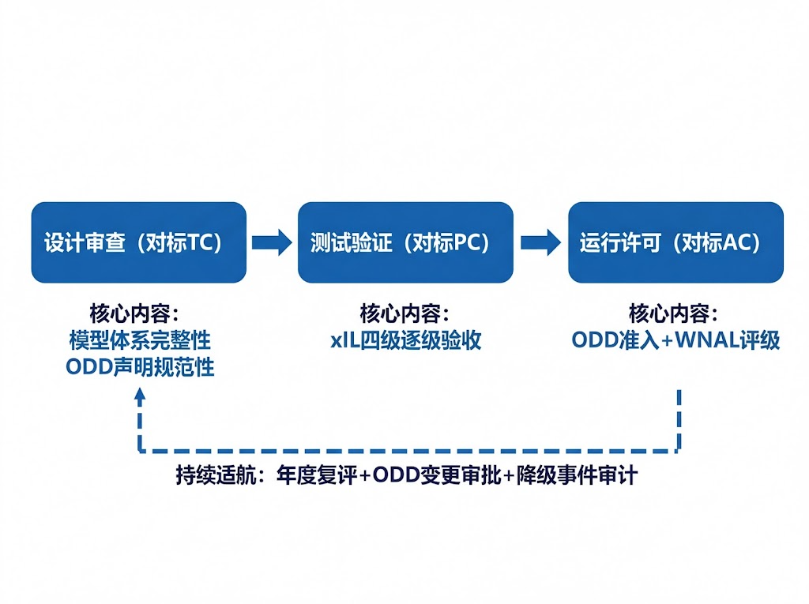
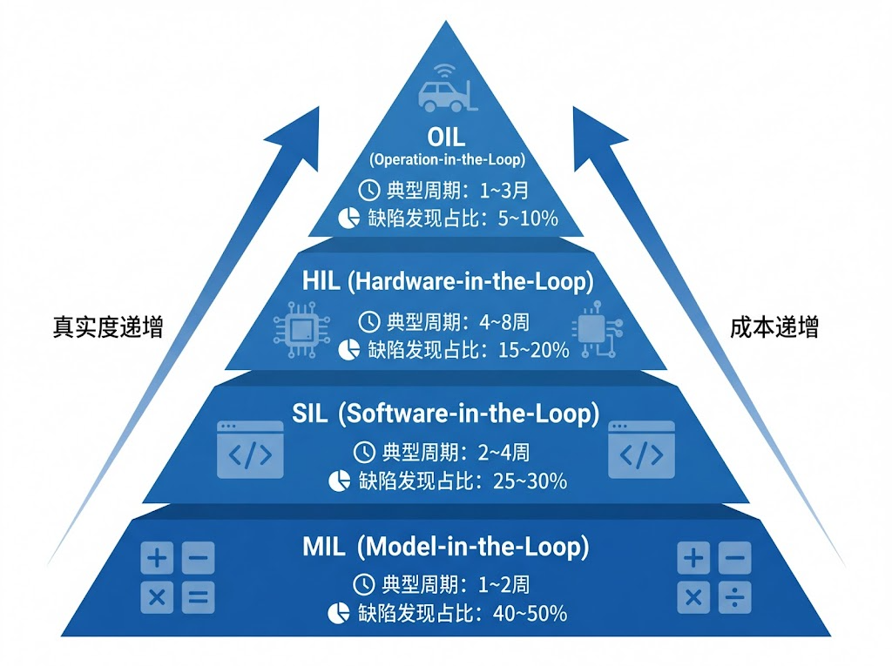
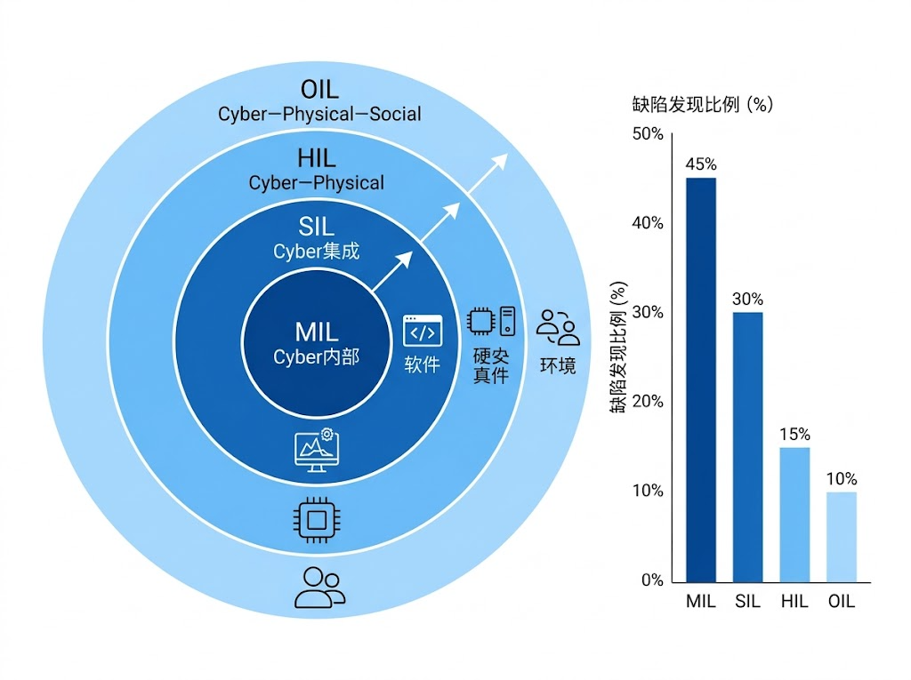
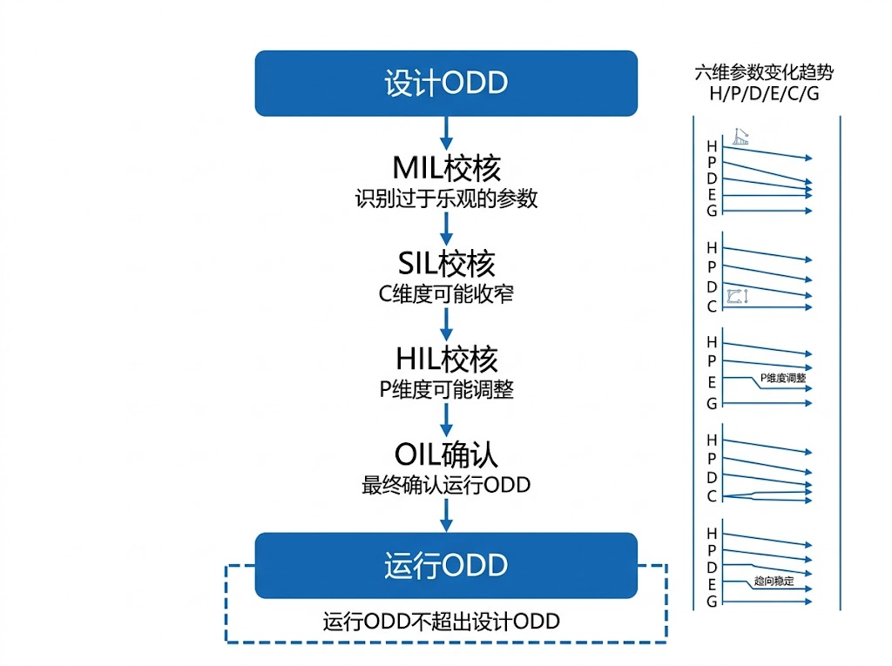
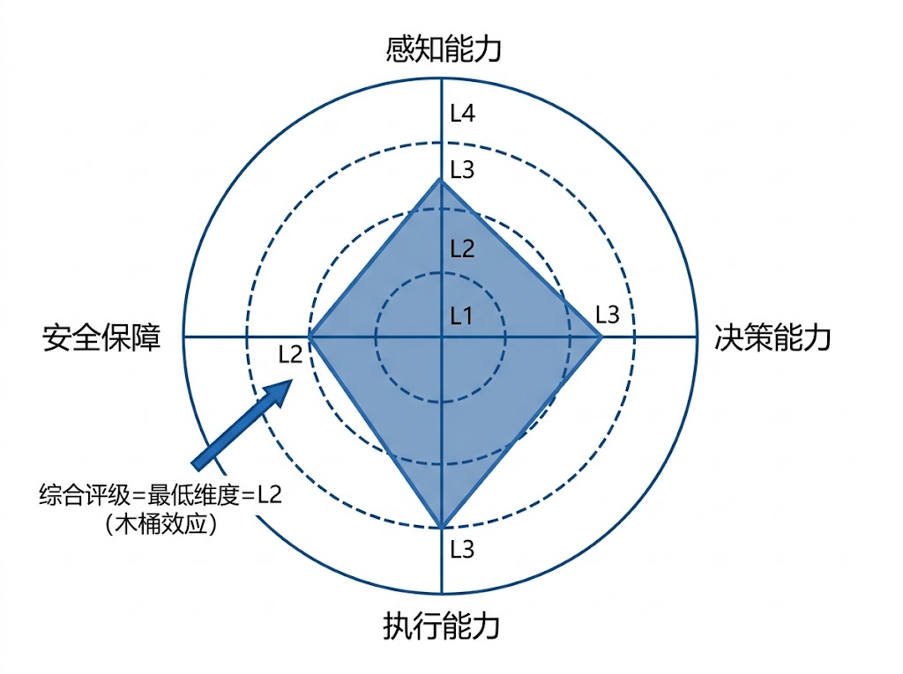
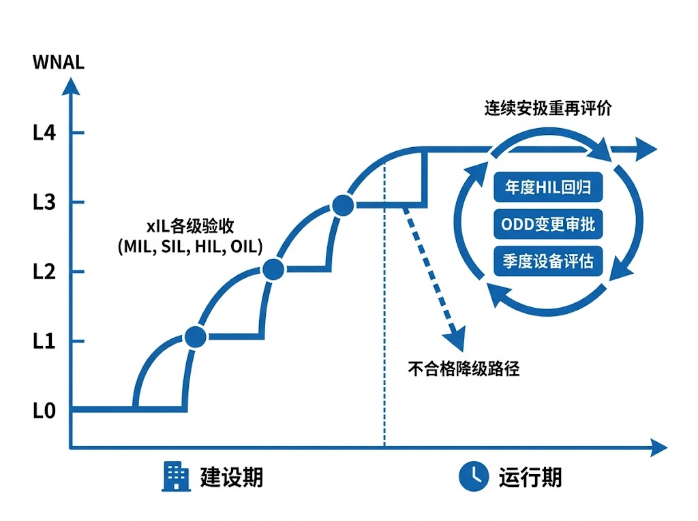

# 面向水网工程智能运行的准入认证与评级标准体系

**雷晓辉，等**

---

## 摘要

水网工程从"建成"到"可智能运行"之间存在关键鸿沟——传统验收仅检查物理结构安全，不检验智能运行能力。本文借鉴航空适航认证TC—PC—AC三证体系，提出"设计审查—测试验证—运行许可"全链条准入认证与评级标准体系，明确五类主体的标准化责任。建立MIL—SIL—HIL—OIL四级渐进式在环验收体系，提出运行设计域（ODD）六维参数的工程标定方法与准入认证流程，建立水网自主等级（WNAL）L0—L5的工程验收基线与木桶效应综合评级方法。研究表明，系统化的准入认证与评级标准可有效消除设计与运行之间的断裂，为水网工程从条件自动化向条件自主运行的跃迁提供工程路径与制度保障。

**关键词**：水网工程；准入认证；在环测试；运行设计域；智能化评级；标准体系

## Abstract

A critical gap exists between the physical completion and intelligent operability of water network projects — conventional acceptance inspections verify only structural safety, not intelligent operation capability. Drawing on the aviation airworthiness certification system of Type Certificate (TC), Production Certificate (PC) and Airworthiness Certificate (AC), this paper proposes a full-chain admission certification and rating standard system for intelligent water network operation. A progressive MIL–SIL–HIL–OIL four-level in-the-loop acceptance system is constructed. An engineering calibration method for the six-dimensional Operational Design Domain (ODD) parameters and the Water Network Autonomy Level (WNAL) L0–L5 bucket-effect comprehensive rating methodology are developed. Results indicate that systematic admission certification and rating standards can effectively bridge the design-operation gap, providing both engineering pathways and institutional safeguards for water network advancement from conditional automation to conditional autonomy.

**Keywords**: water network engineering; admission certification; in-the-loop testing; operational design domain; intelligence rating; standard system

---

## 1 引言

国家水网工程建设正处于从规划设计向大规模实施的关键转型期。MBD方法论已被证明是应对水网工程复杂特性的有效技术路径[1-2]。前序研究从两个维度构建了MBD方法论：上篇[1]定义了四类核心模型及其接口协同机制；下篇[2]建立了"四层一闭环"架构与ODD-HDC映射关系。运行阶段的闭环控制方法亦已在相关研究中阐述[3-6]。

然而，**设计完成并不等于系统可运行。** 建设阶段面临根本性的制度缺口：传统水利工程验收体系（SL 223）关注的是物理结构安全和完整性，而对智能调度系统能否安全上线运行缺乏系统化检验手段。这一缺口在航空和汽车领域早已被识别并解决——DO-178C[7]定义了五级软件保证等级，ISO 26262[8]建立了ASIL四级安全完整性等级，ISO 21448（SOTIF）[9]关注系统在设计意图范围内因功能不足导致的风险，与水网智能调度系统在ODD边界附近的行为验证高度相关。

本文的创新贡献在于：（1）借鉴航空TC—PC—AC三证体系，提出面向水网工程的全链条准入认证框架；（2）构建MIL—SIL—HIL—OIL四级在环验收工程实施规范；（3）提出ODD六维参数的工程标定方法与准入认证流程；（4）建立WNAL L0—L5的工程验收基线与木桶效应综合评级方法。

---

## 2 准入认证的必要性与框架

### 2.1 传统验收与智能运行验收的差距

传统验收聚焦土建结构和机电设备的现场查验与静态测试，判据为结构安全系数和设备出力；而智能运行准入验收须检验控制算法、软件系统和人机接口，采用分层在环测试（xIL），判据扩展为控制精度、响应时间和故障降级能力，覆盖范围从单体设备扩展至系统级跨域联调，场景考核从设计工况扩展为常态—扰动—故障—极端四类工况矩阵，安全保障从物理联锁扩展为物理联锁＋软件安全包络＋ODD边界监测。

### 2.2 认证框架设计

借鉴航空适航认证三证体系，提出水网智能运行的三阶段认证框架（图2a）。本文方案与航空DO-178C[7]（DAL A—E分级、飞行包线、自动驾驶仪脱开降级）和汽车ISO 26262[8]（ASIL A—D、ODD概念、安全状态转移）形成跨行业对标，水利领域对应采用WNAL L0—L5分级、六维ODD参数矩阵和四态机MRC降级机制。

**第一阶段：设计审查（对标TC）。** 审查MBD设计方案的合规性，包括模型体系完整性、ODD声明规范性、四态机降级逻辑完备性。**第二阶段：测试验证（对标PC）。** 按xIL四级流程逐级验收，全部通过后获得测试合格证明。**第三阶段：运行许可（对标AC）。** 基于ODD准入认证和WNAL等级评定颁发运行许可，明确系统的合法运行边界和自主程度。**持续适航：** 系统须定期接受复评——年度HIL回归测试、ODD变更审批、降级事件审计，任一不合格将触发运行许可降级或暂停。

**图2a　水网智能运行三阶段认证框架（对标航空TC—PC—AC三证）**

**Fig.2a　Three-stage certification framework benchmarking aviation TC-PC-AC**

### 2.3 产业链各方的标准化责任

**表1 产业链各方标准化责任矩阵**
Table 1 Standardized responsibility matrix for stakeholders

| 主体 | 设计审查阶段 | 测试验证阶段 | 运行许可阶段 | 持续适航阶段 |
|------|------------|------------|------------|------------|
| **业主** | 招标中明确WNAL目标等级和xIL验收条款 | 组织验收委员会，监督xIL测试 | 申请运行许可，承担运营主体责任 | 组织年度复评，报告降级事件 |
| **设计方** | 按MBD方法论完成设计，交付ODD声明 | 提供模型供MIL/SIL验证 | 确认设计ODD与运行ODD衔接 | 参与重大变更评估 |
| **集成方** | 提交集成方案、接口协议 | 按xIL四级流程交付验证报告 | 提供ODD准入认证技术文档 | 软件升级后重新提交xIL回归报告 |
| **设备方** | 提供设备接口标准和性能规格 | 配合HIL测试，提供设备仿真模型 | 满足对应WNAL层级的实时性要求 | 设备维护保障，健康度数据上报 |
| **监管方** | 审查MBD设计合规性 | 委托或认可第三方测试机构 | 颁发运行许可，ODD备案审查 | 监督定期复评，审计降级事件 |

设备方须满足对应层级的量化要求：控制上位机端到端时延$\leq 0.5$ s（L3级）；AI一体机MPC求解时间$<$控制周期的80%，与CESA团标[23]的设备评价规范形成衔接。

### 2.4 CPSS框架下准入的三维度

在CPSS框架[3]下，准入验收须覆盖三个维度：**Physical安全**——传感器覆盖完整性、执行器可靠性、通信冗余度，在传统验收基础上增加与Cyber空间的接口验证；**Cyber可靠**——控制算法正确性、软件集成稳定性、数字孪生模型精度、ODD边界监测器有效性，这是传统验收完全缺失的部分，本文xIL分层验收体系即针对此维度；**Social合规**——运维团队资质、人机交互可用性、应急预案完备性，OIL阶段的影子运行和分级放权即服务于此维度。

---

## 3 xIL分层验收体系

xIL分层验收是建设阶段最核心的技术活动。MIL—SIL—HIL—OIL四级验收真实度递增、成本递增、但缺陷发现代价递减（图1）。在CPSS"四预"闭环体系[3]中，xIL验收对应"预演"环节的工程实现。

**图1　xIL四级验收金字塔——真实度与成本递增结构**

**Fig.1　xIL four-level acceptance pyramid with increasing fidelity and cost**

### 3.1 MIL验收：模型在环

控制算法和被控对象均以数学模型形式存在，在纯仿真环境中验证算法有效性和参数敏感性。测试环境基于仿真软件构建被控对象模型（Saint-Venant全维模型或IDZ降阶模型[10]）与控制算法闭环。场景矩阵按"常态—扰动—故障—极端"四类工况构建，采用$4^4=256$个全组合通过正交试验法缩减至可管理规模。

通过标准：P0关键用例100%通过；P1重要用例通过率$\geq 95\%$；场景覆盖率$\geq 95\%$。

### 3.2 SIL验收：软件在环

将控制算法部署到实际软件栈（含通信中间件、调度引擎），与被控对象模型构成闭环。与MIL的关键区别在于控制算法必须通过软件接口交互，面临接口转换、时序同步和异常处理等真实环境约束。关键测试包括接口契约验证、时序一致性验证（抖动$<10\%$）、异常注入测试和长时间运行稳定性（连续7~30天）。通过标准：MIL全部用例在SIL中重新通过；控制周期抖动$<10\%$；连续运行7天无崩溃、无内存泄漏。

### 3.3 HIL验收：硬件在环

将控制软件部署到实际硬件（PLC、工控机、通信网关），通过硬件接口与实时仿真器构成闭环。关键测试包括：MPC求解器计算时间（须$<$控制周期的80%）、通信鲁棒性、执行器限制、联锁功能验证和四态机降级切换的无扰动转移验证。降级切换时备用控制器须在后台持续跟踪，切换瞬间偏差不超过$\epsilon_{\text{bump}}$，必要时通过线性插值完成过渡：

$$\mathbf{u}(t_s + k\Delta t) = \alpha_k \,\mathbf{u}_{\text{primary}}(t_s^-) + (1 - \alpha_k)\,\mathbf{u}_{\text{backup}}(t_s + k\Delta t), \quad \alpha_k = 1 - \frac{k}{N_{\text{trans}}}$$

通过标准：控制算法硬件计算时间$<$控制周期80%；通信丢包率5%条件下性能衰减$<10\%$；联锁功能在所有场景中正确触发；MRC触发延迟$<1$ s。联锁未触发属S0级致命缺陷，立即阻断发布。

### 3.4 OIL验收：运行在环

控制系统与真实物理水系统及人类操作员构成闭环的最终验收阶段——水系统不能"停下来测试"[6]。**影子运行：** 系统在线计算调度建议但不实际执行，持续1~3个月，评估建议采纳率和安全约束满足率。**分级放权：** 影子运行通过后，按风险等级逐步将控制权从人转移至系统。通过标准：影子运行30天内建议与实际操作一致率$>85\%$；安全约束零违反；ODD边界事件正确响应率$>95\%$。

### 3.5 覆盖度评估

**表2 xIL四级验收综合对比**
Table 2 Comprehensive comparison of xIL four-level acceptance

| 维度 | MIL | SIL | HIL | OIL |
|------|-----|-----|-----|-----|
| 典型周期 | 1~2周 | 2~4周 | 4~8周 | 1~3月 |
| 相对成本 | 1× | 3~5× | 10~20× | 50~100× |
| 典型缺陷占比 | 40~50% | 25~30% | 15~20% | 5~10% |
| CPSS空间验证 | Cyber内部 | Cyber集成 | Cyber—Physical | Cyber—Physical—Social |

验收充分性用三个覆盖度指标量化：**场景覆盖率**（SC）为已测试与应测试场景之比；**风险覆盖率**（RC）确保高风险场景优先覆盖：$RC = \sum_{i \in \text{已测}} R_i / \sum_{j \in \text{全部}} R_j$；**回退覆盖率**（FC）确保四态机所有降级链路经过测试。各指标按WNAL等级递进设定门禁值：L1仅需MIL且SC$\geq 80\%$；L2需MIL+SIL且SC$\geq 90\%$、RC$\geq 70\%$；L3需MIL+SIL+HIL且SC$\geq 95\%$、RC$\geq 90\%$、FC$\geq 95\%$；L4需完整xIL+对抗测试且SC$\geq 98\%$、RC$\geq 98\%$、FC$\geq 99\%$。

**图2　xIL四级验收的CPSS空间递进覆盖与缺陷发现分布**

**Fig.2　Progressive CPSS spatial coverage and defect distribution across xIL four levels**

---

## 4 ODD准入认证

### 4.1 ODD六维参数的工程标定

水网ODD须反映流体动力学、广域分布性及多层级控制的复杂特征，采用六维参数体系[5]：H（水文，如渠首来水流量3~28 m³/s）、P（工程物理，如糙率系数0.012~0.016）、D（数据质量，如传感器更新延时$\leq 5$ s）、E（环境气象，如水温$> 3°C$否则冰期降级）、C（网络算力，如云端心跳丢失$\leq 100$ ms）、G（治理规则，如生态基流$Q \geq Q_{eco}$）。设计院须以不等式或逻辑表达式组的形式标定各维度边界，超界触发降级或人工介入。完整ODD空间为六维子空间的交集：$X_{ODD} = H_{sub} \cap P_{sub} \cap D_{sub} \cap E_{sub} \cap C_{sub} \cap G_{sub}$

### 4.2 ODD边界的xIL验证流程

ODD声明须通过三类xIL测试确认工程有效性：**渐近测试**——从ODD中心逐步推向边界，验证预警触发行为；**跨越测试**——推至ODD之外，验证MRC降级触发（延迟须$\leq 100$ ms）；**恢复测试**——从ODD外恢复至ODD内，须经影子运行并通过偏差合规检查。ODD边界监测器须与控制算法硬件解耦，确保AI算法崩溃时安全降级仍能独立运行——AI优化调度运行于云端（10 s~1 min周期），ODD参数实时计算下沉至边缘网关（100 ms周期），MRC降级指令由现场冗余PLC执行（1 ms周期），不依赖任何上层通信。

### 4.3 ODD动态扩展与缩减

**ODD扩展**须遵循"影子模式积累数据→第三方审查→分阶段切换"流程：新控制律在影子模式下运行不少于60天，积累至少20次独立工况样本且无算法发散。**ODD缩减**的量化触发条件包括：传感器在线率$< 80\%$（L3→L2）、执行器可用率$< 70\%$（L2→L1）、糙率漂移超出标定阈值（对应渠段降至L1）、年度HIL测试任一P0失败（暂停WNAL认证降至L2）。

### 4.4 从设计ODD到运行ODD的衔接

建设阶段通过逐级xIL验证将设计ODD校核为运行ODD（图3）。MIL识别过于乐观的参数；SIL引入软件环境约束可能导致C维度收窄；HIL引入硬件约束可能导致P维度调整；OIL最终确认运行ODD。运行ODD须不超出设计ODD范围，若验证发现过于宽泛须缩减后重新申报。

**图3　从设计ODD到运行ODD的衔接——xIL逐级校核流程**

**Fig.3　Bridging from design ODD to operational ODD through progressive xIL verification**

---

## 5 WNAL智能化等级评级

### 5.1 评级维度与综合评级方法

WNAL采用感知、决策、执行、安全四维度评估，综合评级遵循木桶效应原则：$\text{WNAL}_{\text{综合}} = \min_{d \in \{\text{感知, 决策, 执行, 安全}\}} \text{WNAL}_d$。四维度从L0到L4递进：感知从人工巡查升至全域传感器+在线辨识，决策从人工全权升至扩展ODD+在线自适应，执行从手动操作升至多域协同+故障重构，安全从无保障升至四态机+对抗性验证。

L2与L3之间存在"非连续性跃迁"[5]——分水岭在于控制权转移机制的根本变化：L3系统必须具备不依赖人工干预而自主降级至最小风险状态的能力。

**图4　WNAL木桶效应综合评级——各维度雷达图与综合等级确定**

**Fig.4　WNAL bucket-effect comprehensive rating — radar chart and overall level determination**

### 5.2 各等级的工程验收基线

各等级门槛指标呈递进关系：开度响应准确率从L1的$>98\%$提升至L4的$>99.5\%$；模型预测误差从L2的$<10\%$降至L4的$<3\%$；L3级须满足MRC触发时延$\leq 100$ ms、HIL场景覆盖率$\geq 95\%$、断网自治$\geq 72$ h，L4级进一步收严至$\leq 50$ ms、$\geq 98\%$和$\geq 168$ h。

### 5.3 差异化运维策略

评级结果直接决定运维策略的差异化配置：L1/L2级须全时值班且人工审批调度，L3级可转为日常巡检+ODD内全自主调度，L4级实现远程监督+扩展ODD内自主；年度复核从L1级设备维护检查逐级升至L4级全xIL回归+ODD扩域审计。

### 5.4 持续适航

参照航空持续适航要求，建立运行期复评机制，包含四类复评：年度HIL回归（P0全量回归+关键P1抽测，不合格则暂停运行许可降至L2）、事件触发的ODD变更审批（影子运行60天+第三方审查）、降级事件审计（事件日志审查+根因分析）和季度设备健康度评估（传感器在线率、执行器可用率不达标则触发ODD强制缩减）。

**图5　WNAL各等级在工程生命周期中的升级路径与持续适航复评**

**Fig.5　WNAL upgrade pathways and continued airworthiness review across engineering lifecycle**

---

## 6 讨论

当前国内主要调水工程的智能化水平大致处于L1至L2+区间。部分先行工程已具备L2+级能力——感知局部达L3—L4水平，决策与执行达L2+（MPC自主运行），但安全保障仍处L2（xIL体系待完善）[11]。按木桶效应评级方法，综合评级为L2。L2→L3跃迁的关键不是算法换代，而是从"人工安全兜底"到"系统安全兜底"的责任机制重构——ODD的显式化声明和MRC四态机的边缘端固化是两个缺一不可的技术支柱。

认证体系落地面临三方面挑战：**制度层面**，需在验收规程修订中增补智能化系统验收章节，明确ODD声明在事故责任认定中的法律地位；**能力层面**，业主须学会在招标中使用WNAL等级条款，集成方须建立xIL测试和ODD标定能力，第三方认证机构的培育需行业组织牵头；**经济层面**，需建立合理的成本分摊机制（L3级HIL成本约为MIL的10~20倍）。建议分三阶段推进：近期（1~2年）建立分级共识并在重点工程试点L3准入认证；中期（3~5年）形成行业标准草案，将ODD声明纳入设计文件强制交付物；远期（5~10年）建立完整认证体系，实现与国际标准的对标衔接。

---

## 7 结论

本文针对水网工程建设阶段智能运行准入的制度缺口，提出了准入认证、分层验收和智能化评级三位一体的标准体系：

（1）借鉴航空TC—PC—AC三证体系，建立了"设计审查—测试验证—运行许可"三阶段认证框架和持续适航复评机制，明确五类主体的标准化责任，将Physical安全、Cyber可靠和Social合规纳入统一验收体系。

（2）构建了MIL—SIL—HIL—OIL四级渐进式在环验收体系。约70%~80%的缺陷可在MIL和SIL阶段发现，成本仅为HIL/OIL的1/10，充分的前期验证是控制总成本的关键。

（3）提出了ODD六维参数的工程标定方法和准入认证流程。ODD边界监测器须与控制算法硬件解耦，ODD动态扩展须经影子运行验证和第三方审查，物理退化须触发强制缩减。

（4）建立了WNAL L0—L5的四维度工程验收基线与木桶效应综合评级方法，评级结果直接映射为差异化运维策略和持续适航复评要求。

---

## 参考文献

[1] 雷晓辉，等. 面向水网工程的模型驱动设计方法论：内涵与模型体系[J]. 水利学报，2025.

[2] 雷晓辉，等. 面向水网工程的模型驱动设计方法论：总体框架与工程验证[J]. 水利学报，2025.

[3] 雷晓辉,龙岩,许慧敏,等.水系统控制论——从传统水系统分析到自主运行智能水网[J].南水北调与水利科技(中英文),2025,23(04):761-769+904.

[4] 雷晓辉,许慧敏,何中政,等.水资源系统分析的发展——从静态平衡到动态控制[J].南水北调与水利科技(中英文),2025,23(04):770-777.

[5] 雷晓辉,苏承国,龙岩,等.基于无人驾驶理念的下一代自主运行智慧水网架构与关键技术[J].南水北调与水利科技(中英文),2025,23(04):778-786.

[6] 雷晓辉,张峥,苏承国,等.自主运行智能水网的在环测试体系[J].南水北调与水利科技(中英文),2025,23(04):787-793.

[7] RTCA. DO-178C: Software Considerations in Airborne Systems and Equipment Certification[S]. 2011.

[8] ISO 26262. Road Vehicles — Functional Safety[S]. 2018.

[9] ISO 21448. Road Vehicles — Safety of the Intended Functionality (SOTIF)[S]. 2022.

[10] Litrico X, Fromion V. Modeling and Control of Hydrosystems[M]. London: Springer, 2009.

[11] 雷晓辉，等. 融合水网大模型与多智能体的智慧调水系统[J]. 科技导报，2026.

[12] SAE J3016. Taxonomy and Definitions for Terms Related to Driving Automation Systems[S]. 2021.

[13] Leveson N G. Engineering a Safer World: Systems Thinking Applied to Safety[M]. Cambridge: MIT Press, 2011.

[14] Isermann R, Schwarz R, Stölzl S. Fault-tolerant drive-by-wire systems[J]. IEEE Control Systems Magazine, 2002, 22(5): 64-81.

[15] Boehm B, Basili V R. Software defect reduction top 10 list[J]. Computer, 2001, 34(1): 135-137.

[16] Van Overloop P J. Model Predictive Control on Open Water Systems[D]. Delft: Delft University of Technology, 2006.

[17] Clemmens A J, Kacerek T F, Grawitz B, et al. Test cases for canal control algorithms[J]. Journal of Irrigation and Drainage Engineering, 2005, 131(6): 498-506.

[18] ASCE. Standard Guidelines for the Operation of Managed-Flow Irrigation Systems: ASCE MOP 131[S]. Reston: ASCE, 2014.

[19] Kopetz H. Real-Time Systems: Design Principles for Distributed Embedded Applications[M]. 2nd ed. New York: Springer, 2011.

[20] Modelica Association. Functional Mock-up Interface (FMI) Standard, Version 2.0[S]. 2014.

[21] Oberkampf W L, Roy C J. Verification and Validation in Scientific Computing[M]. Cambridge: Cambridge University Press, 2010.

[22] Cantoni M, Weyer E, Li Y, et al. Control of large-scale irrigation networks[J]. Proceedings of the IEEE, 2007, 95(1): 75-91.

[23] T/CESA 1469~1483-2025. 智慧调水系列团体标准[S]. 中国电子工业标准化技术协会，2025.
